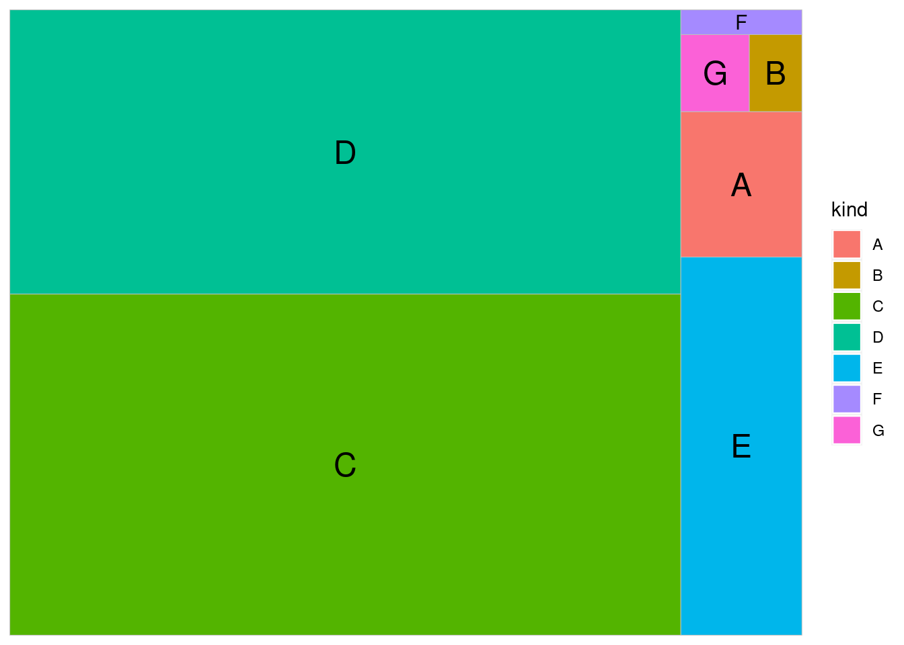
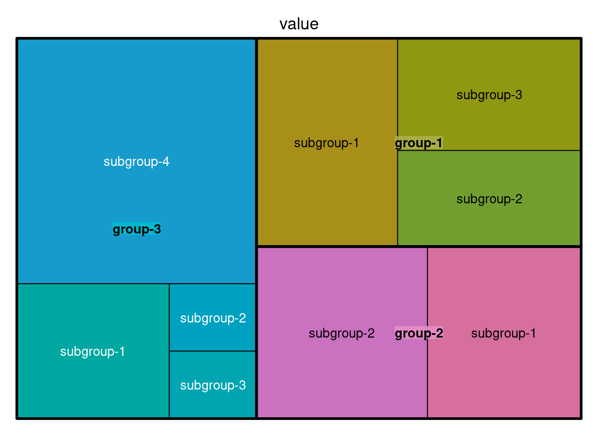
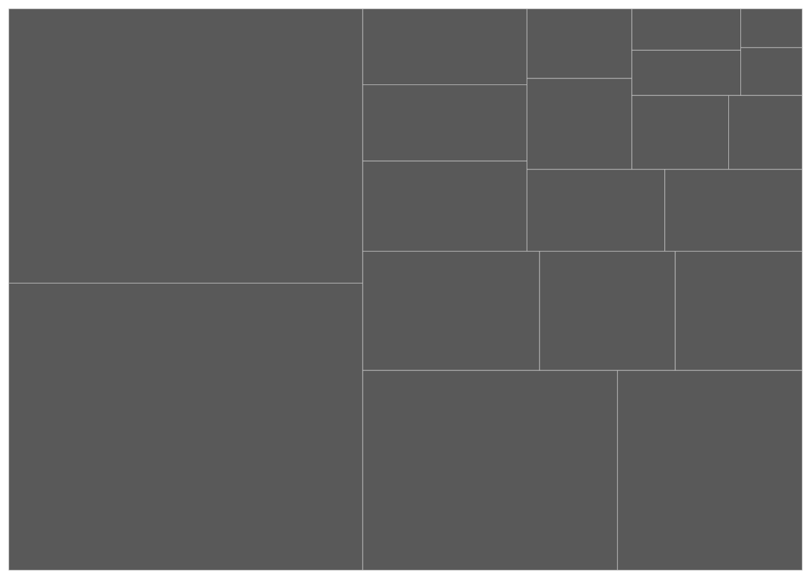
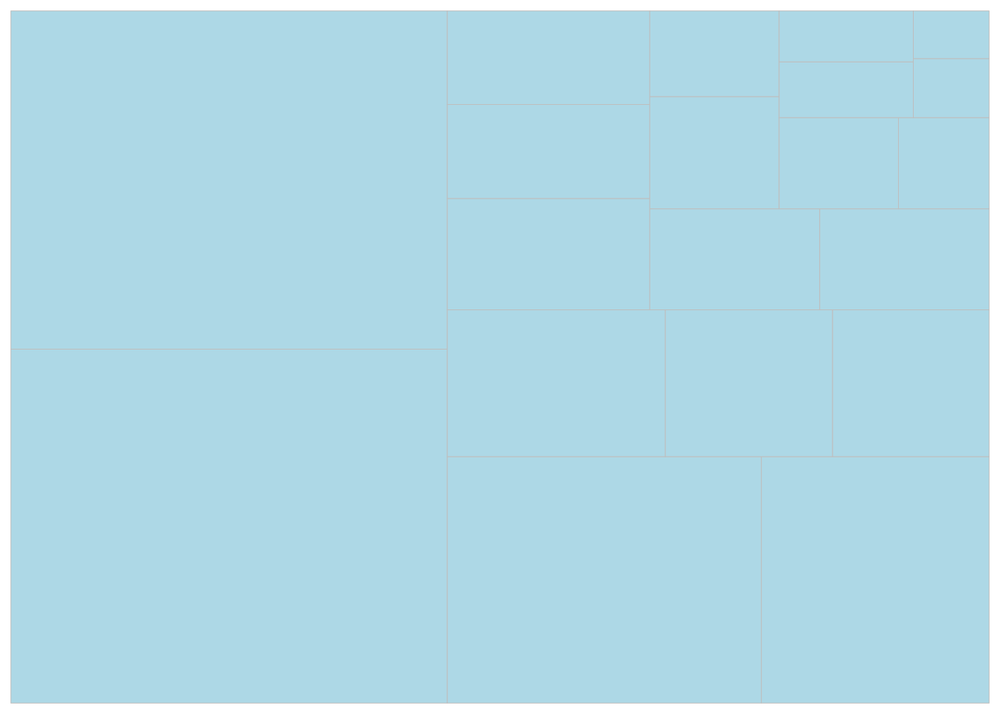
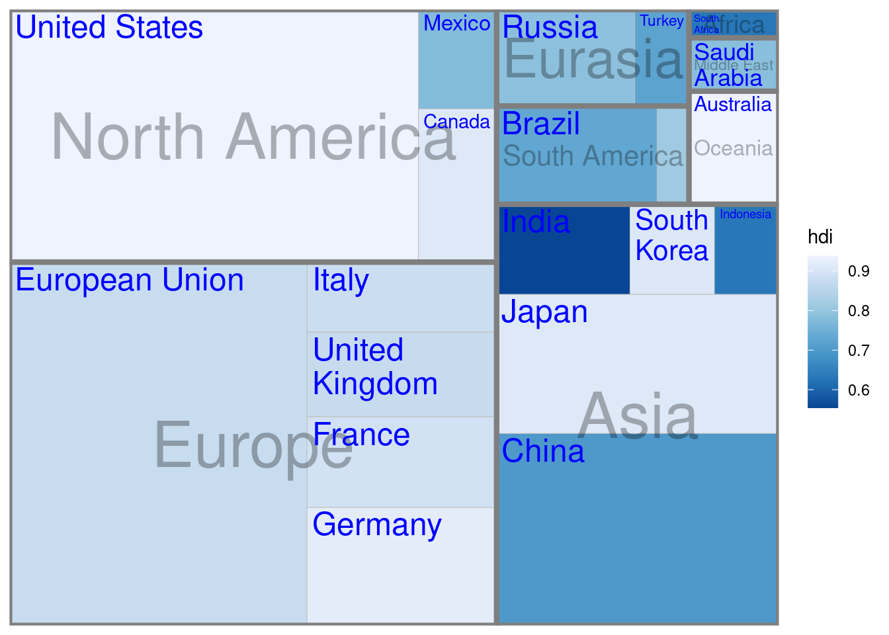
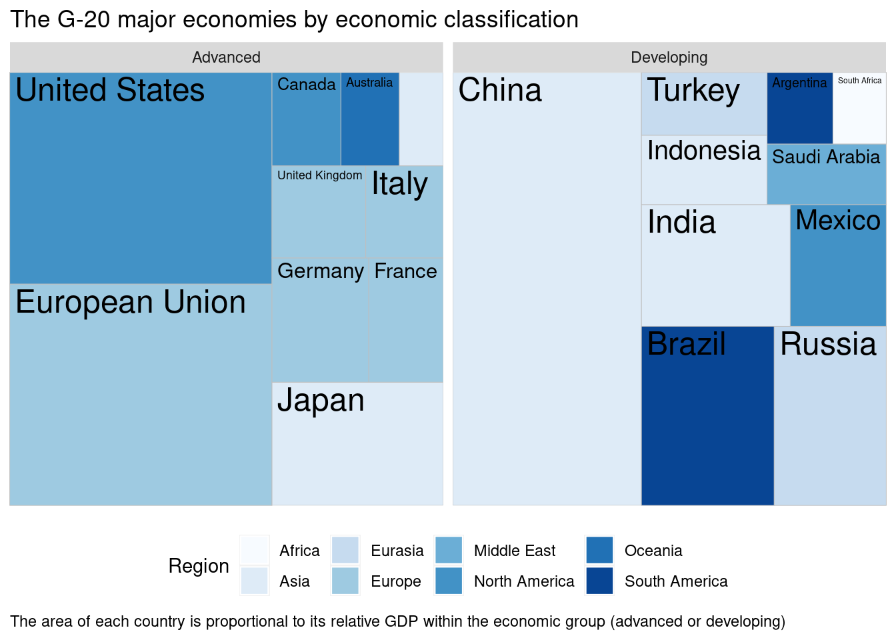

# ggplot2_treemapify


## Download treemapify

In August 2017, R language has added new geometric objects supporting ggplot2 dendrograms. From then, there is no need to resort to the assistance of third-party packages. And it can be downloaded either using "install.package("treemapify")" or "devtools::install_github("wilkox/treemapify")".

After downloading this package, we will have an additional functon in our ggplot2 which is named "geom_treemap()". 


```r
## Load packages needed for this instruction
library("ggplot2")
library("treemapify")
library("RColorBrewer")
```

## Basic Visualization of Treemap
Before we give example using treemapify package to draw treemap figure, we can first get to know this kind of figures:

In the tree diagram, the numerical variables are converted into rectangular area sizes, and the types of variables are distinguished by labels.

```r
example <- data.frame(value<-c(100, 23, 1300, 1083, 260, 17, 30),
                      kind<-c('A','B','C','D','E','F','G'))
example$kind <- as.factor(example$kind)
ggplot(example, aes(area=value,fill=kind,label=kind)) +
  geom_treemap()+
  geom_treemap_text(place='center')
```


We can also use the treemap() function in the treemap() package.

```r
library(treemap)
group=c(rep("group-1", 3), rep("group-2",2), rep("group-3",4))
subgroup=paste("subgroup" , c(1,2,3,1,2,1,2,3,4), sep="-")
value=c(10, 6, 7, 9, 10, 7, 2, 2,20)
data=data.frame(group,subgroup,value)

# treemap
treemap(data,
        index=c("group","subgroup"),   #sub plots two groups
        vSize="value",  # Sizes are allocated according to the numeric variable
        type="index")  # Color according to the classification
```


In this function, we can set color palette from the RColorBrewer presets or make our own

```r
treemap(data, index=c("group","subgroup"), vSize="value", 
   type="index",              
   palette = "Set3",
  title="TreemapExample") 
```


## Visualization using treemapify package

We will have an example using the data set G20 included in treemapfiy package. We can first have a preview of this data set:

```r
str(G20)
```

```
## 'data.frame':	20 obs. of  6 variables:
##  $ region             : Factor w/ 8 levels "Africa","Asia",..: 1 6 6 6 8 8 2 2 2 2 ...
##  $ country            : Factor w/ 20 levels "Argentina","Australia",..: 16 20 4 13 3 1 5 12 17 9 ...
##  $ gdp_mil_usd        : int  384315 15684750 1819081 1177116 2395968 474954 8227037 5963969 1155872 1824832 ...
##  $ hdi                : num  0.629 0.937 0.911 0.775 0.73 0.811 0.699 0.912 0.909 0.554 ...
##  $ econ_classification: Factor w/ 2 levels "Advanced","Developing": 2 1 1 2 2 2 2 1 1 2 ...
##  $ hemisphere         : Factor w/ 2 levels "Northern","Southern": 2 1 1 1 2 2 1 1 1 1 ...
```

```r
head(G20)
```

```
##          region       country gdp_mil_usd   hdi econ_classification hemisphere
## 1        Africa  South Africa      384315 0.629          Developing   Southern
## 2 North America United States    15684750 0.937            Advanced   Northern
## 3 North America        Canada     1819081 0.911            Advanced   Northern
## 4 North America        Mexico     1177116 0.775          Developing   Northern
## 5 South America        Brazil     2395968 0.730          Developing   Southern
## 6 South America     Argentina      474954 0.811          Developing   Southern
```
This data set describes the economic indicators of the 20 countries participating in the summit. It contains five fields, namely the global region (region), country name (country), and GDP indicator (gdp_mil_usd) (should be some kind of secondary calculation Indicator), human development index (hdi), already economic development level (econ_classification).

The tree diagram is a special type of graph without an explicit coordinate system. Relying on the square algorithm, the sample population square is divided into a single rectangular box according to the actual observation value accounted for in the population. Therefore, it needs at least one numeric variable as an input parameter.

### Plot a simple Treemap figure

```r
ggplot(G20, aes(area = gdp_mil_usd)) + 
 geom_treemap()
```



Because area only defines the square size of a numeric variable, the fill color can be defined separately. But color can often be used alone as a way of expressing a numerical metric.

```r
## Draw the plot with simple blue color
ggplot(G20, aes(area = gdp_mil_usd)) + 
 geom_treemap(fill="light blue")
```



```r
## Draw the plot using scale_fill_distiller with palette
ggplot(G20, aes(area = gdp_mil_usd, fill = hdi)) + 
 geom_treemap()+
 scale_fill_distiller(palette="Blues")
```


### Add labels onto the treemap
The author of the package wrote an optimized text label function geom_treemap_text for the ggplot treemap (Because treemap exceeds the category of the three traditional coordinate systems. There is no explicit coordinate system. The algorithm is relatively special and one cannot use Geom_text() to add tags).

The **place** parameter controls the position of the label in each box relative to the surroundings, and grow (which is set default to be True) controls whether the label is adaptive to the box size (largely scaled up and down) 

```r
  ggplot(G20, aes(area = gdp_mil_usd, fill = hdi, label = country)) +
  geom_treemap() +
  geom_treemap_text(colour = "Blue", 
                    grow = TRUE, # default value
                    place = "center") +
  scale_fill_distiller(palette="Blues")
```


### Subgroups
This package supports sub-groups, which is extensively applied in practical application scenarios. For example, while observing the size of national indicators, we also want to obtain the overall indicators of the region to which the country belongs. By adding sub-groups, We can obtain information in two dimensions. By setting the subgroup parameter (a categorical variable) in the aesthetic mapping, the function can automatically complete the variable aggregation calculation of the subgroup within the function, and use a frame to show the size of the subcategory in the graph formation.

The **reflow** parameter is used to control whether the label adapts to the size of the rectangular block. If the original size exceeds the rectangular block, it will be automatically displayed in a new line.

```r
  ggplot(G20, aes(area = gdp_mil_usd, 
                   fill = hdi, 
                   label = country,
                   subgroup = region)) +
  geom_treemap() +
  geom_treemap_subgroup_border() +
  geom_treemap_subgroup_text(place = "center", 
                             alpha = 0.3, 
                             colour ="black", 
                             min.size = 0) +
  geom_treemap_text(colour = "Blue", 
                    place = "topleft", 
                    reflow = TRUE)+
  scale_fill_distiller(palette="Blues")
```



When you feel that using sub-group cannot achieve a good visualization, geom_treemap also supports the facet_grid function in ggplot2. This is the benefit of all ggplot2 extension functions and can inherit the advanced graphics properties derived from ggplot2.

```r
  ggplot(G20, aes(area = gdp_mil_usd, 
                   fill = region, 
                   label = country)) +
  geom_treemap() +
  geom_treemap_text(colour = "black") +
  facet_wrap( ~ econ_classification) +
  scale_fill_brewer(palette="Blues")+
  labs(title = "The G-20 major economies by economic classification",
       caption = "The area of each country is proportional to its relative GDP within the economic group (advanced or developing)",
       fill = "Region" ) +
  theme(legend.position = "bottom",
        plot.caption=element_text(hjust=0)) 
```



## Source
1. https://cran.r-project.org/web/packages/treemapify/vignettes/introduction-to-treemapify.html\
2. https://github.com/wilkox/treemapify
