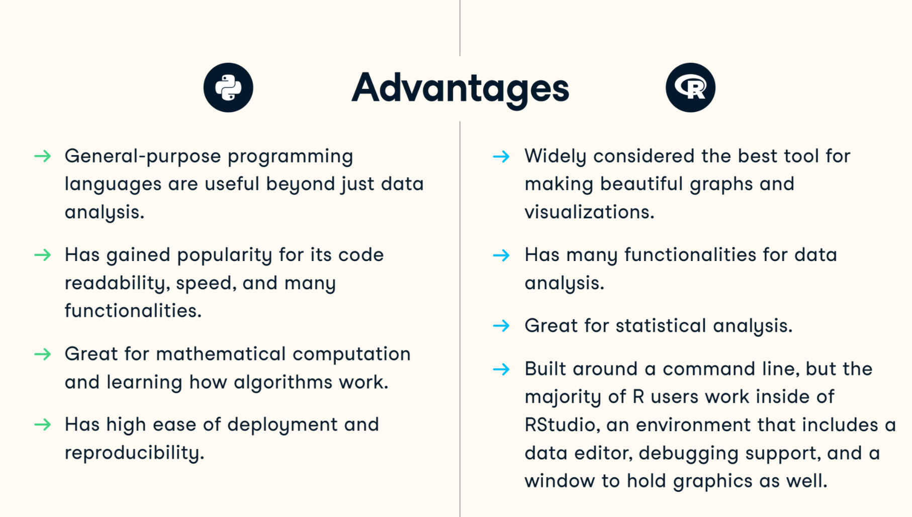
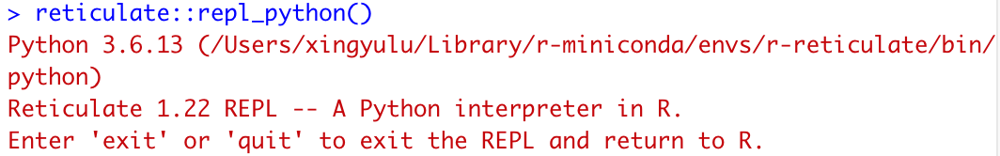
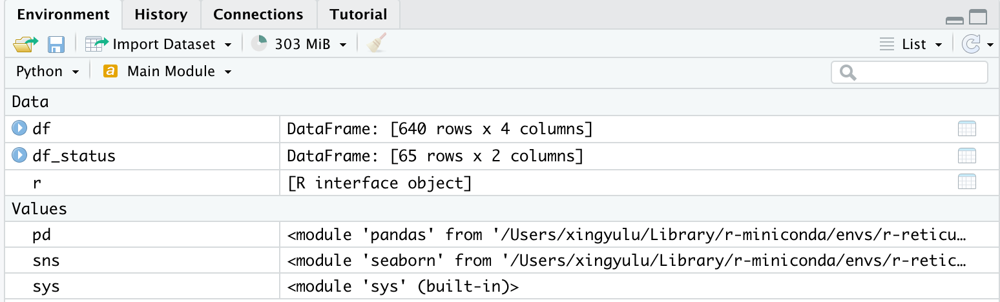
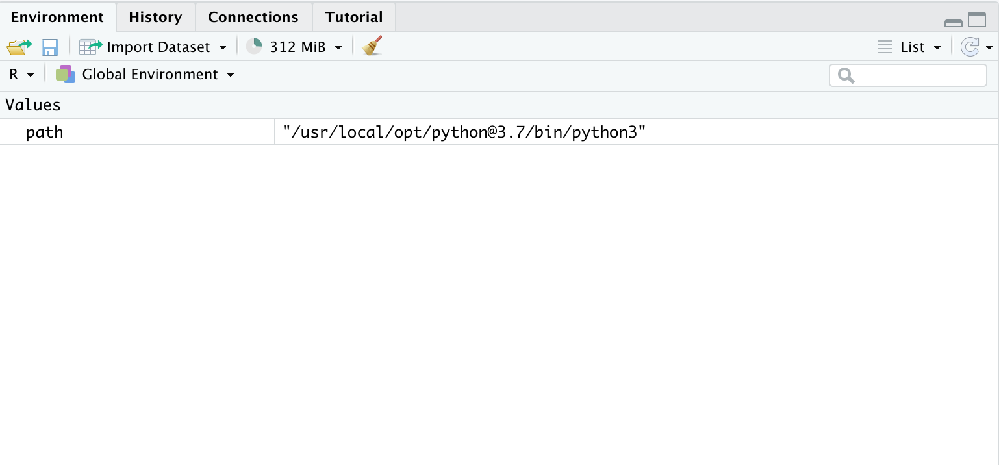

# Using Python in R

Xingyu Lu

```{r, include=FALSE}
# this prevents package loading message from appearing in the rendered version of your problem set
knitr::opts_chunk$set(warning = FALSE, message = FALSE)
```

**1. Background**  
R and python are two of the most popular programming languages for data scientists. Sometimes it might be hard to decide which one to use, especially for beginners. 

However, it's easy for us to compare these languages. One languages isn't better than another for all cases. For example, R is almost the best language to do exploratory data analysis and python is more readable and can be integrated to any part of your workflow easily. **The following figure is a comparison screenshot from resource 1**




As a beginner in R, I enjoyed the beautiful plots R can make, and also suffered from the obscure data processing functions and limited online resources and documentations. 

And then, *reticulate* package that can allow using python in R becomes a life saver for R beginners that is already familiar with python.

**2. *reticulate* package**  
*reticulate* package allows users to use python modules, classes and functions in R. Although it CANNOT guarantee all the benefits of python, it can at least give you some convenience.

*(a) Setup*  
Surprisingly, it's quite easy to set up python in R Markdown. The only thing you need is to include the following block:

```{r}
path <- '/usr/local/opt/python@3.7/bin/python3'
library(reticulate)
use_python(path)
```

The `path` variable is the path pointing to the python you are using. To find the path, you can do the following:  

* Windows: use the following code in cmd  
```
python -c "import os, sys; print(os.path.dirname(sys.executable))"
```
* MacOS: use the follwing code in terminal  
```
which python
```

*(b) Usage*  

After the setup, you can use the python block normally just as r blocks in R Markdown files: wrap your python code with \`\`\`\{python\} \`\`\` just like what you will do for your R code.  
For example, if you want to load the wait list data in HW3 Q3, you could  

```{python}
import pandas as pd
df = pd.read_csv('stats_wl.csv')
df.head()
```

You can manipulate the data in Python, which is easier than R.  

**Note: a useful function: py_install(some python package)**

*(c) Plot using Python packages*  

It's also possible to make plots using python packages like *matplotlib* and *seaborn*.  
For example, I want to see the distribution of final status of all the students.  

```{python figure.width=15, figure.height=15}
import seaborn as sns
# extract status for all students, one row per student
df_status = df[['Name', 'Status']].drop_duplicates()
print(df_status.shape)
sns.set(font_scale=0.5)
sns.countplot(y='Status', data=df_status).set_title('Countplot for Final Status of all Students')
```

*(d) Integrate into R*    

Upto now, we are only using Python functions. It's like we are just treating RStudio as another editor for Python. And how can we integrate python into R, to enjoy the coding experience in Python and the nice plots of R at the same time?  

Well, it's quite simple.  

*(d-1) What's happening to the Python block in R Markdown?*  
After running the above blocks in RStudio, you should observe the following messages in your Console: 



This means your console is currently in python mode, and you could run python code in the console just like all other IDEs. Off course, you can't use R codes here unless you exit the REPL and return to R, just as the message states.  
Also, in the Environment, you should also observe the following data and variables:  



Notice that you would no longer observe those variables in the Environment window once you exit the REPL mode in the console.   



*(d-2) Load variable in REPL mode to R mode*  

Then how to pass the preprocessed variable, `df_status` back to your R mode? Actually there will be a variable called `py` in your R environment, which can access all the variables in the REPL mode via `$` operator. So   

```{r}
data <- py$df_status
head(data)
```

which loads the preprocessed data to R mode.  

*(d-3) Specific example*  

Recall Q3 in HW3. To make the plot, I suffered a lot in preprocessing data in R, and the code I used in my homework is as follows: 

```{r fig.height=15,fig.width=15}
# Pure R
library(ggalluvial)
library(data.table)
library(dplyr)
library(tidyr)
df <- read.csv('resources/use_python_in_r/stats_wl.csv')

df_W <- 
df %>%
  pivot_wider(names_from = Date, values_from = Priority)
head <- colnames(df_W)
df_W <- data.frame(lapply(df_W, as.character), stringsAsFactors=FALSE)
names(df_W) <- head
for (r in 1:nrow(df_W)){
  present <- FALSE
  for (c in 3:ncol(df_W)) {
    if (!present && !is.na(df_W[r,c])){
      present <- TRUE
    }
    if (present){
      if (is.na(df_W[r,c])){
        status <- df_W[r, 2]
        df_W[r,c] <- ifelse(status=='Registered', 'R', ifelse(status=='Dropped Class', 'D', 'L'))
      }
      if (!(df_W[r, c] %in% c('R', 'D', 'L')) && nchar(df_W[r,c])==1) {
        df_W[r, c] <- paste('0', df_W[r, c], sep='')
      }
    }
  }
}

df_W %>% 
  to_lodes_form(axis = 2:15) %>%
  drop_na() %>%
  subset(x != 'Status') %>%
  mutate(status=ifelse(stratum=='R', 'Registered', ifelse(stratum=='L', 'Left List', ifelse(stratum=='D', 'Dropped Class', 'Joined')))) %>%
  ggplot(aes(alluvium = alluvium, x = x, stratum = stratum, y = 1, fill=status)) +
    geom_alluvium(color = "black") +
    geom_stratum() +
    geom_text(stat = "stratum", aes(label = paste(after_stat(stratum)))) +
    labs(x='Data', y='Student')
```

So the data used to plot the figure is actually the `df_W`. There are a lot of preprocessing steps like handling the data type, filling the missing value etc. There must be some fancy and powerful functions in R that allows me to accomplish the task easily. However, it would largely increase my productivity if I could take advantage of my experience in Python. So, I if I could use Python to redo the process, it would be 

```{python}
# First preprocess with Python
df = pd.read_csv('resources/use_python_in_r/stats_wl.csv')
students = set(df['Name'])
dates = list(set(df['Date']))
dates.sort()
name_priority_map = {}
for e in df.values:
  name, date, priority = e[0], e[1], e[2]
  if name not in name_priority_map:
    name_priority_map[name] = {}
  name_priority_map[name][date] = str(priority).zfill(2)
name_status_map = {e[0]: e[1][0] for e in df_status.values}
processed = []
for s, m in name_priority_map.items():
  entry = []
  appear = False
  for d in dates:
    if d in m:
      appear = True
    if not appear:
      entry.append('Unseen')
    elif d in m:
      entry.append(m[d])
    else:
      entry.append(name_status_map[s])
  processed.append([s] + entry)
df_processed = pd.DataFrame(processed, columns=['Name'] + dates)
```

which finishes the preprocessing and then  

```{r fig.height=15,fig.width=15}
# Then plot using R
library(naniar)
df_p <- as.data.frame(py$df_processed)
df_p %>% 
  replace_with_na_all(condition = ~. == 'Unseen') %>%
  to_lodes_form(axis = 2:14) %>%
  drop_na() %>%
  mutate(status=ifelse(stratum=='R', 'Registered', ifelse(stratum=='L', 'Left List', ifelse(stratum=='D', 'Dropped Class', 'Joined')))) %>%
  ggplot(aes(alluvium = alluvium, x = x, stratum = stratum, y = 1, fill=status)) +
    geom_alluvium(color = "black") +
    geom_stratum() +
    geom_text(stat = "stratum", aes(label = paste(after_stat(stratum)))) +
    labs(x='Data', y='Student')
```

Which yields the same plot. The code simplicity didn't change a lot. However, the productivity increased: it takes me around 5 hours to preprocess the data in R while only 20 minutes in Python. 

**3. Conclusion**  
Although it might be unnecessary for an R expert to use Python in R Markdown, it is really useful for R beginners to do a little bit of set up and take the advantage of using Python in R. 


**4. Resources**   
1. https://www.datacamp.com/community/tutorials/r-or-python-for-data-analysis?utm_source=adwords_ppc&utm_campaignid=12492439679&utm_adgroupid=122563407961&utm_device=c&utm_keyword=python%20r&utm_matchtype=b&utm_network=g&utm_adpostion=&utm_creative=504158803093&utm_targetid=dsa-296652664266&utm_loc_interest_ms=&utm_loc_physical_ms=9073479&gclid=CjwKCAjwq9mLBhB2EiwAuYdMtVLKk_tdQSa2uN-sVjFzkaIiqZYLKwE7Qcd2iYZHHmpqd0EaXKOksBoCTLIQAvD_BwE  
2. https://cran.r-project.org/web/packages/reticulate/vignettes/calling_python.html  
3. https://stackoverflow.com/questions/647515/how-can-i-find-where-python-is-installed-on-windows  
4. https://cran.r-project.org/web/packages/reticulate/vignettes/r_markdown.html