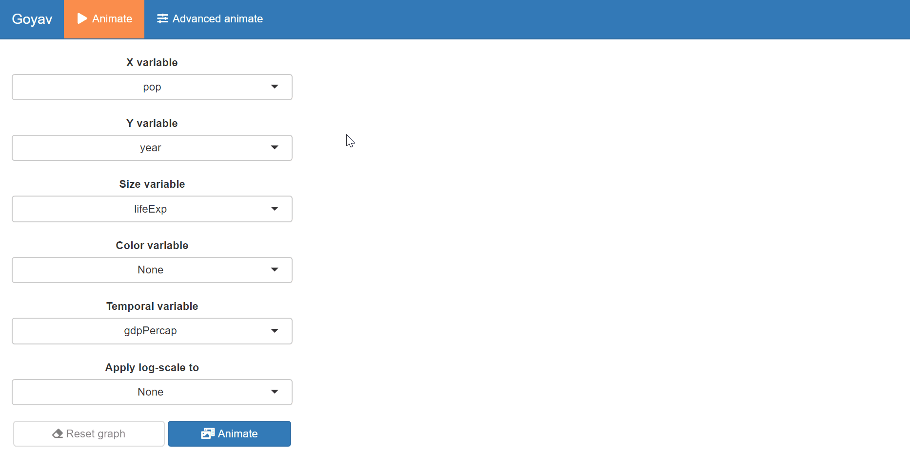
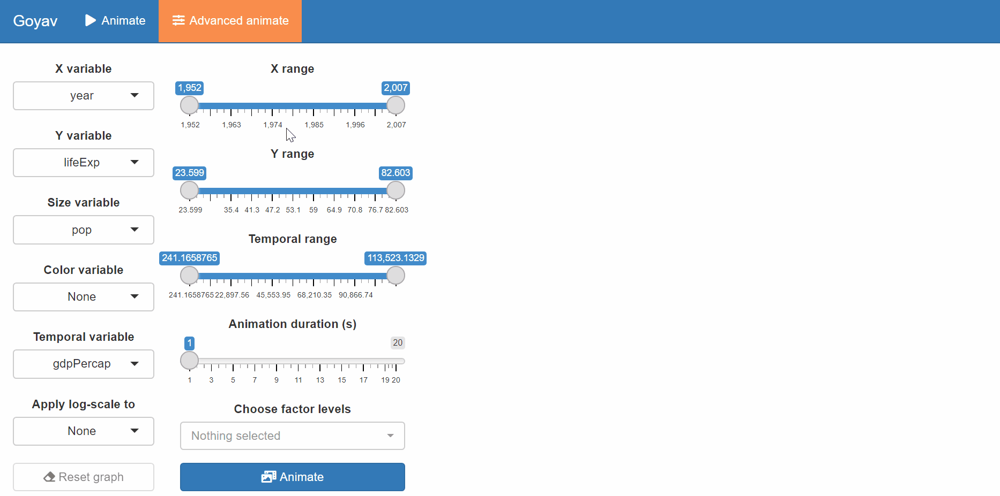

# Animate Time Series : the `goyav` package

Antonin Vidon


```r
# install.packages("devtools")
# library(devtools)
# install_github("AntoninVidon/goyav")
library(goyav) # must be installed from source

# install.packages("gapminder")
library(gapminder)
```

## Motivation

One of the main drawbacks of the IDE RStudio is the lack of real interaction between the user and the plots generated from raw data. Even for simple plots, the user often has to go through a lot of documentation and/or look at heavy web located tutorials.

We build a shiny-app based interface on which the user tunes dynamically the plot he wants to build by offering choices among true candidates for each parameter (no error possible). We choose to focus on “animated” plots. These are dynamic plots generated from temporal data. This type of plot is especially tedious to build in a “hard-code” way with the `gganimate` package. We add some interesting features such as *filter on a factor*, *choose x,y and temporal range*, *change any/both of the scales to log-scales*, *modify the duration of the animation*, … These are common operations that a meticulous user might want to perform in order to draw impactful plots.

## Features

`goyav` is a shiny App meant to generate GIF animations from tabular temporal data. All customization of the animated plots is done in an interactive window.

The dashboard of the application looks like this :


The user is able to navigate into two tabs : "Animate" and "Advanced animate", the latter offering a wider range of customization.

From the *Animate* tab, you may choose the following :

- X variable (numeric);
- Y variable (numeric);
- size variable (numeric);
- color variable (optional, factor);
- temporal variable (numeric);
- choose if you want to apply a log-scale to either X, Y or X and Y (optional).

From the *Advanced animated* tab, you may choose the following :

- X variable (numeric);
- Y variable (numeric);
- size variable (numeric);
- color variable (optional, factor);
- temporal variable (numeric);
- choose if you want to apply a log-scale to either X, Y or X and Y (optional);
- X range;
- Y range;
- temporal range;
- Animation duration (s);
- Factor levels to include (optional, among color variable levels).


## Demonstration

In order to better show the use of the package, we will use the `gapminder` dataset from the `gapminder` package.


```r
# display first rows of dataset
knitr::kable(head(gapminder))
```


|country     |continent | year| lifeExp|      pop| gdpPercap|
|:-----------|:---------|----:|-------:|--------:|---------:|
|Afghanistan |Asia      | 1952|  28.801|  8425333|  779.4453|
|Afghanistan |Asia      | 1957|  30.332|  9240934|  820.8530|
|Afghanistan |Asia      | 1962|  31.997| 10267083|  853.1007|
|Afghanistan |Asia      | 1967|  34.020| 11537966|  836.1971|
|Afghanistan |Asia      | 1972|  36.088| 13079460|  739.9811|
|Afghanistan |Asia      | 1977|  38.438| 14880372|  786.1134|

In order to be able to create any GIF, your dataframe should have candidate columns for the following variables: X, Y, size and temporal. Therefore, *calling the `goyav` function on a dataframe with less than 4 numeric variables will return an error*.


```r
# try to call the `goyav` function on the first 3 columns of the `gapminder` dataset
goyav(gapminder[,1:3])
```

```
## Error in goyav(gapminder[, 1:3]): Your dataframe should have at least 4 numeric variables.
```

Let's now call `goyav` on the whole dataset :


```r
# call `goyav` on `gapminder`
goyav(gapminder)
```

### View from the *Animate* tab



### View from the *Advanced animate* tab


