# Tutorial for pull request mergers

## General

The following is a checklist of steps to perform before merging the pull request. At any point, if you're not sure what to do, request a review from one of the PR leaders.

## Check branch

PR should be submitted from a **non-main** branch.

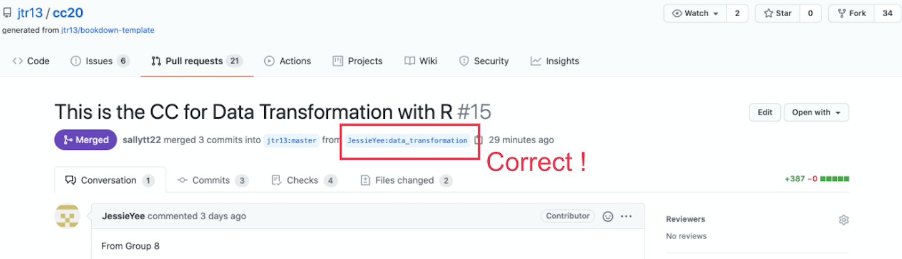
 

If PR was submitted from the **main** branch, provide these instructions on how to fix the problem:

1. Close this PR.

2. Follow the instructions here for forgetting to branch if you committed and pushed to GitHub: https://edav.info/github#fixing-mistakes

3. If you have trouble with 2., then delete the local folder of the project, delete your fork on GitHub, and *start over.*

4. Open a new PR.

 
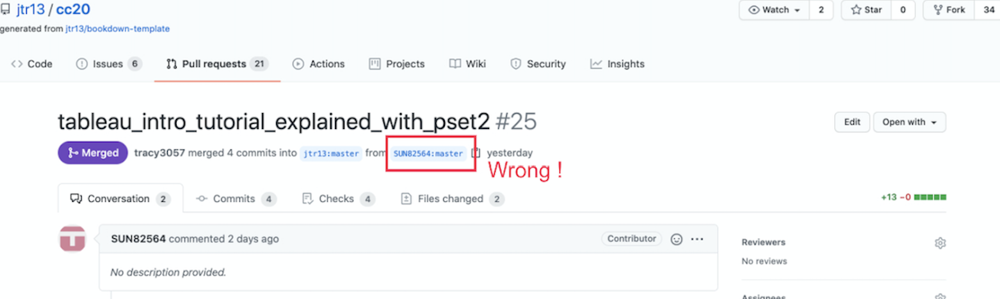

 

##  Examine files that were added or modified
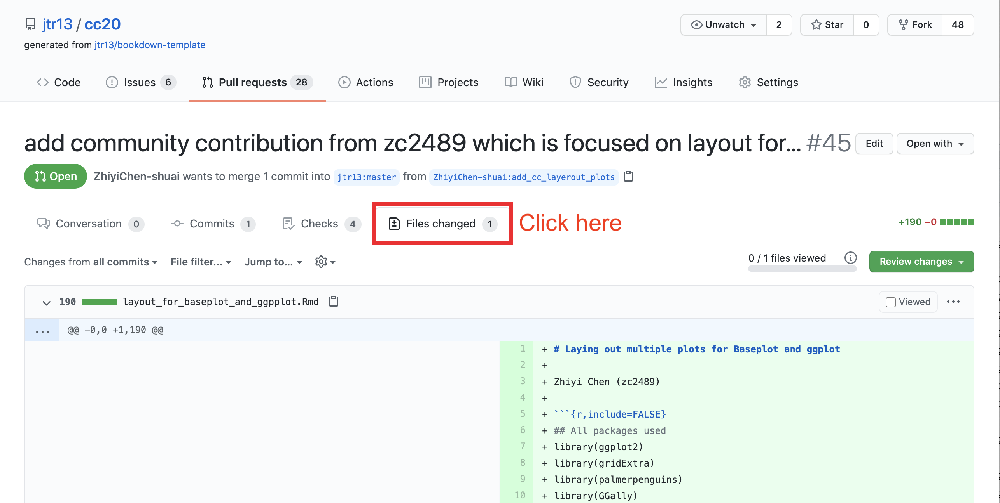
  

- There should be only ONE `.Rmd` file. 

- All of the additional resources should be in the `resources/<project_name>/` folder.

- There should be no other files in the root directory besides the `.Rmd` file.

## Check `.Rmd` filename

- The `.Rmd` filename should be words only and joined with underscores, no white space. (Update: It does not need to be the same as the branch name.)
- The `.Rmd` filename can only contain **lowercase letters**. (Otherwise the filenames do not sort nicely on the repo home page.)

## Check `.Rmd` file contents

- The file should **not** contain a YAML header nor a `---` line.
- The first line should start with a **single hashtag `#`**, followed by a **single whitespace**, and then the title.
- The second line should be blank, followed by the author name(s).
- There should be no additional single hashtag headers in the chapter. (If there are, new chapters will be created.)
- Other hashtag headers should **not** be followed by numbers since the hashtags will create numbered subheadings. Correct: `## Subheading`. Incorrect: `## 3. Subheading`.
- If the file contains a setup chunk in `.Rmd` file, it should **not** contain a `setup` label. (The bookdown render will fail if there are duplicate chunk labels.)
 i.e. use `{r, include=FALSE}` instead of `{r setup, include=FALSE}`.
 [See sample `.Rmd`](https://github.com/jtr13/cc21/blob/main/sample_project.Rmd)
- Links to internal files must contain `resources/<project_name>/` in the path, such as: ``
- The file should not contain any `install.packages()`, `write` functions, `setwd()`, or `getwd()`. 
- If there's anything else that looks odd but you're not sure, assign `jtr13` to review and explain the issue.

## Request changes 

If there are problems with any of the checks listed above, explain why the pull request cannot be merged and request changes by following these steps:

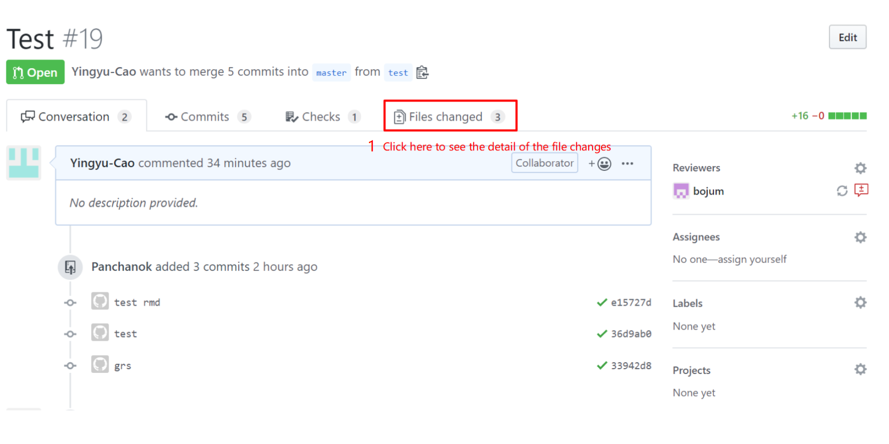
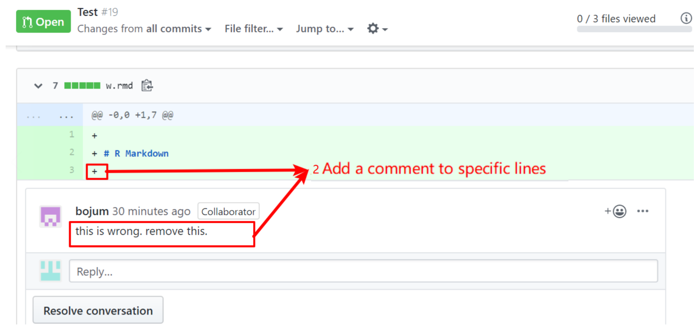
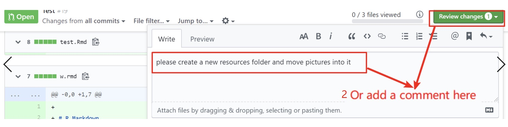
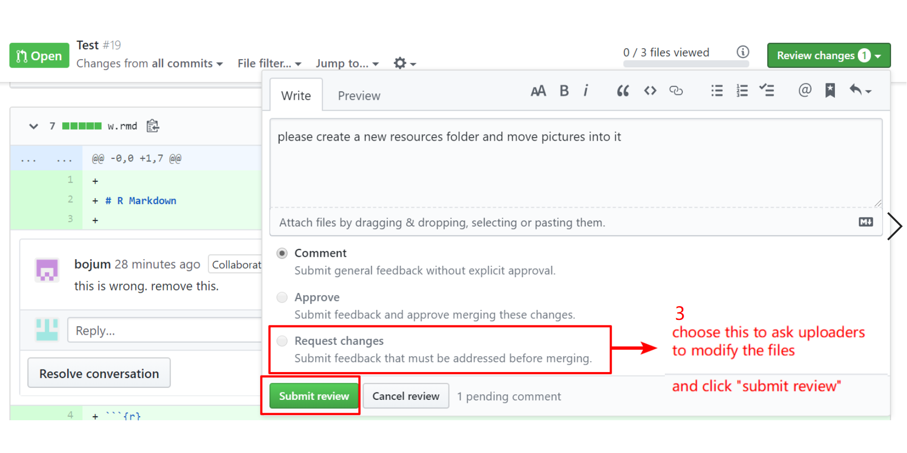

Then, add a `changes requested` label to this pull request.

Your job for this pull request is done for now. Once contributors fix their requests, review again and either move forward with the merge or explain what changes still need to be made.

  

## Merge the pull request

If all is good to go, it's time to merge the pull request. There are several steps. 

### Add chapter filename to `_bookdown.yml` in PR's `branch`

- To access the PR branch:

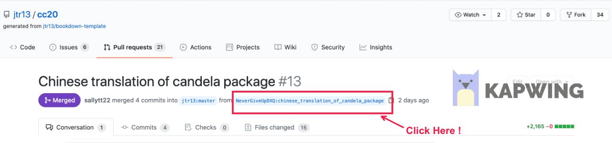

- Make sure you are on the PR branch by checking that the PR branch name is shown (not `main`):

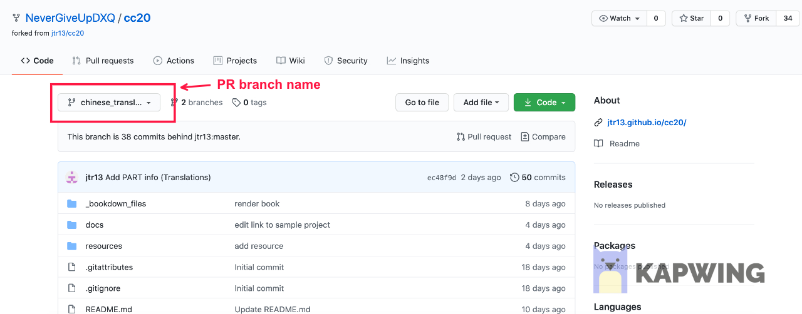

- Open the `_bookdown.yml` file.

- **delete everything in the file beginning with `rmd_files: [` and then add the name of the new file in single quotes followed by a comma:**

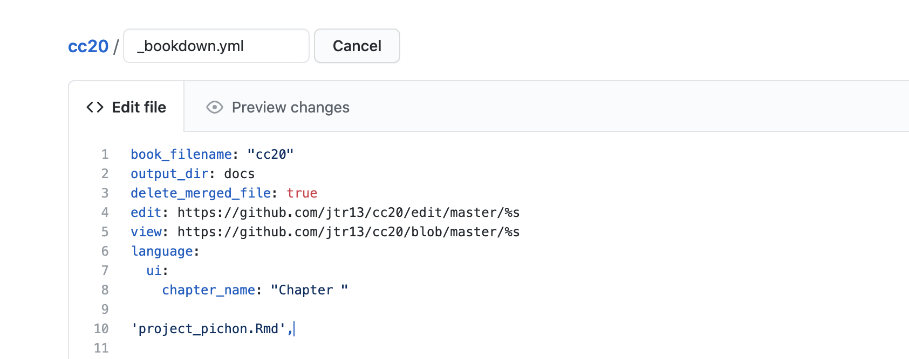

Why? Because it will be easier to fix the merge conflicts this way. (A better way to do this is to merge main into the PR branch *before* adding the new file but this can't be done on GitHub. If there's interest I will explain how to do this locally.)

- Save the edited version.

- Click the resolve conflicts button:

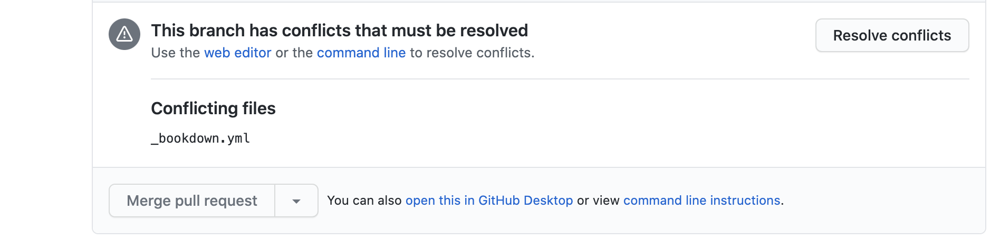

- Cut the new filename and paste it into the proper location. Then delete the lines with `<<<<<<< xxxx`, `=======` and `>>>>>>>> main`. In short, the file should look correct when you're done. Click the "Marked as resolved" button and then the green "Commit merge" button.

### PR Leaders only: Add part names to `.Rmd` for every first article in part

Only do this if you are adding the first chapter in a PART.

For every first article of each part, add the chapter name on the top of the `.Rmd` file, then propose changes. The example is like this.

  

### Merge PR and leave a comment

Now comes the final step.

**If you're not sure that you did things correctly, assign one of the PR merge leaders or @jtr13 to review before you merge the PR.**

Go back to the conversation tab of the pull requests page, for example: 

https://github.com/jtr13/cc20/pull/23#issuecomment-728506101

Leave comments for congratulations 🎉 (type `:tada:`) and then click on the green button for merge.
  

### Check updated version

A successful merge means that the addition file or files were added to the project with no merge conflicts. It does not mean that the book will render and deploy to GitHub pages without issues. After the merge, it will take about 5-10 minutes for GitHub Actions to render the book and deploy the updated version. If there's a problem I will be notified by email and will address it. In other words, your job is done. However if you're interested, you can check the progress by clicking Actions at the top of the repo.
