# Brief Introduction of ggpubr

Hanlin Yan

### Introduction
ggplot2, by Hadley Wickham, is an excellent and flexible package for elegant data visualization in R. However the default generated plots requires some formatting before we can send them for publication. Furthermore, to customize a ggplot, the syntax is opaque and this raises the level of difficulty for researchers with no advanced R programming skills.

The ‘ggpubr’ package provides some easy-to-use functions for creating and customizing ‘ggplot2’- based publication ready plots. It have features as follows:
  Wrapper around the ggplot2 package with a less opaque syntax for beginners in R programming.
  Helps researchers, with non-advanced R programming skills, to create easily publication-ready plots.
  Makes it possible to automatically add p-values and significance levels to box plots, bar plots, line plots, and more.
  Makes it easy to arrange and annotate multiple plots on the same page.
  Makes it easy to change grahical parameters such as colors and labels.

### Installation
From CRAN:

```r
#install.packages("ggpubr")
```
From Github:

```r
#if(!require(devtools)) install.packages("devtools")
#devtools::install_github("kassambara/ggpubr")
```
Loading environment:

```r
library(ggplot2)
library(ggpubr)
```


### Histogram
Create a dataset with attributes sex and height where there are 500 people for each sex and values of height are in inches.

```r
set.seed(2000)
heightdata <- data.frame(
          sex = factor(rep(c("Female", "Male"), each=500)),
   height = c(rnorm(500, 65), rnorm(500, 70)))
```

Now we use heightdata to plot the corresponding histogram. Here we use the function gghistogram where we add mean lines showing mean values for each sex and marginal rug showing one-dimensional density plot on the axis.

```r
gghistogram(heightdata, x = "height",
   add = "mean", rug = TRUE,
   color = "sex", fill = 'sex', bins= 15)
```

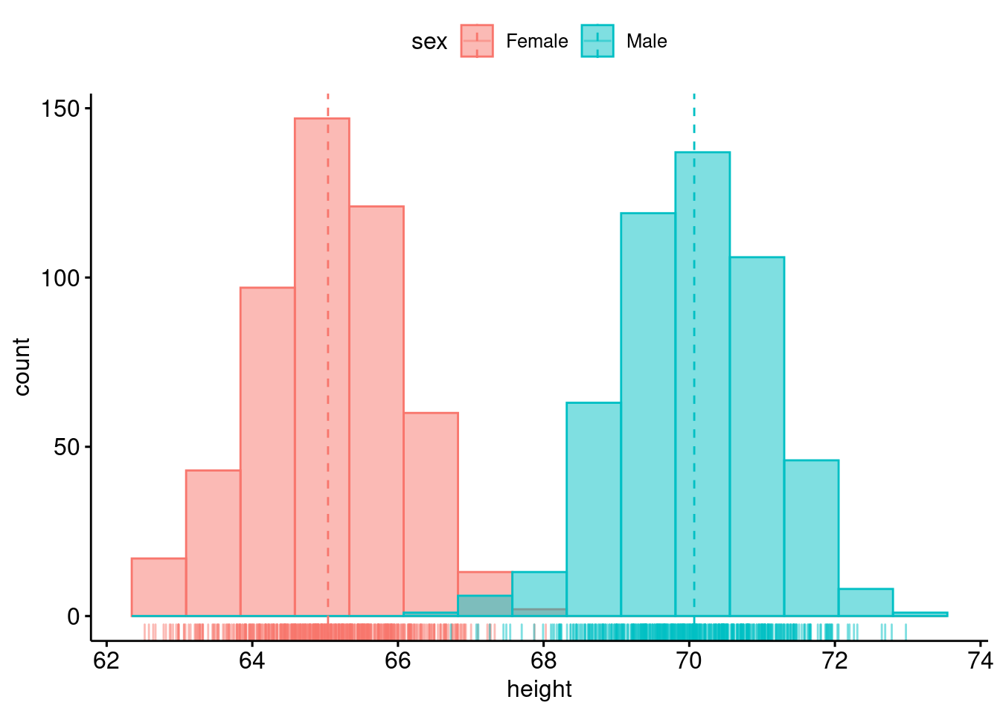

### Density plot
We still use the above data to plot the corresponding two-dimensional density plot. Here we add the mean lines and marginal rug.

```r
ggdensity(heightdata, x = "height",
   add = "mean", rug = TRUE,
   color = "sex", fill = "sex")
```

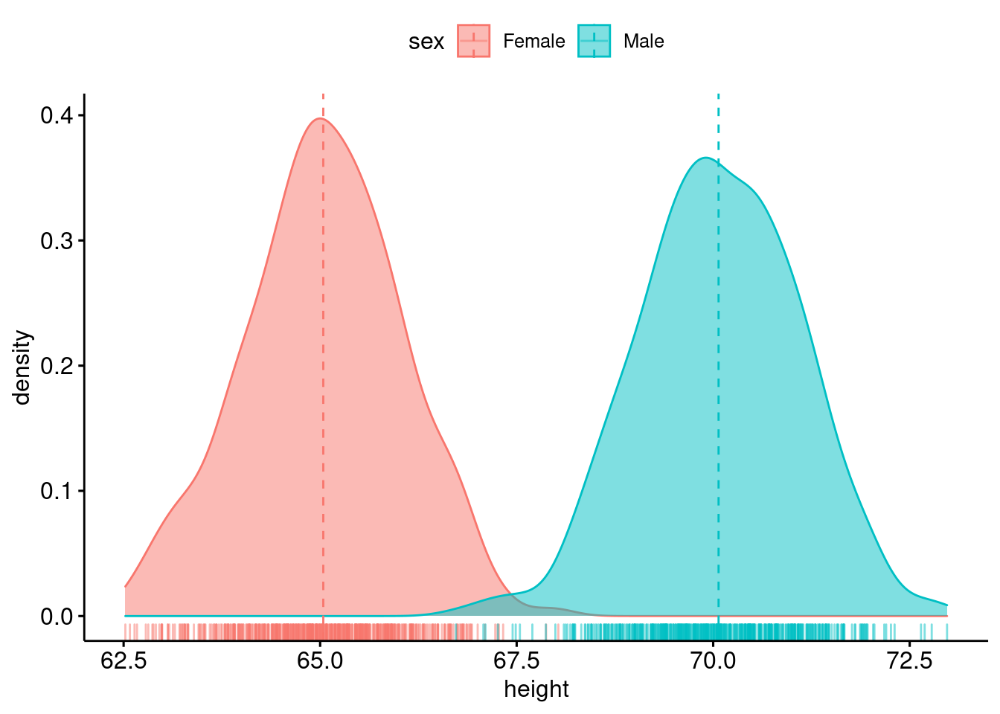

Now We combine density plots with histogram.

```r
gghistogram(heightdata, x = "height",
   add = "mean", rug = TRUE,
   color = "sex", fill = 'sex', bins= 15,
   add_density = TRUE)
```

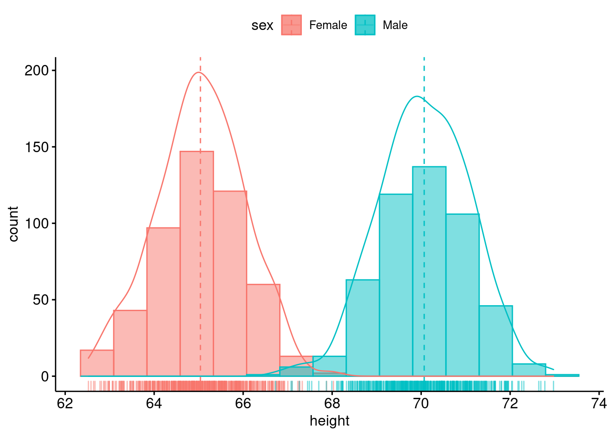


### Qq plot
Here is the qqplot example.

```r
set.seed(1234)
wdata = data.frame(
   sex = factor(rep(c("F", "M"), each=200)),
   weight = c(rnorm(200, 55), rnorm(200, 58)))

ggqqplot(wdata, x = "weight")
```

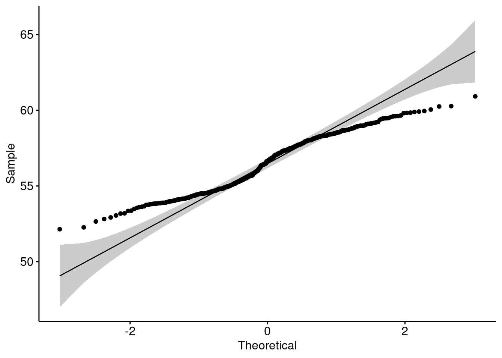

### Line plot
Use ggline to create a line plot.

```r
df2 <- data.frame(supp=rep(c("VC", "OJ"), each=3),
   dose=rep(c("D0.5", "D1", "D2"),2),
   len=c(6.8, 15, 33, 4.2, 10, 29.5))

ggline(df2, "dose", "len",
  linetype = "supp", shape = "supp", color =  "supp")
```

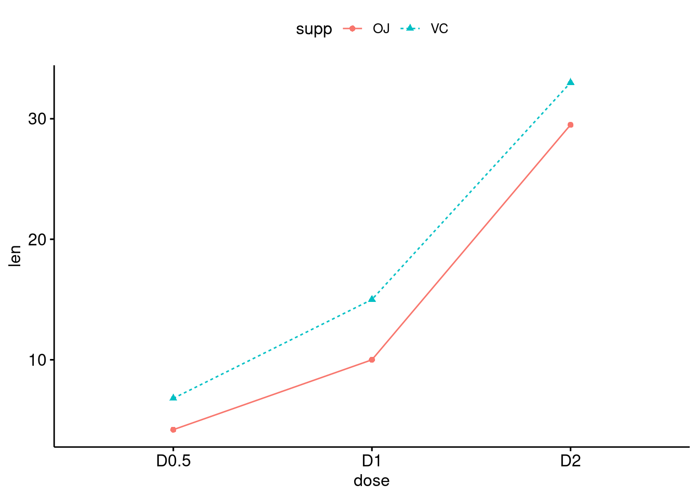

### Pie chart
ggpie is the tool to make a pie plot. 

```r
df <- data.frame(
 group = c("Male", "Female", "Child"),
  value = c(25, 25, 50))
labs <- paste0(df$group, " (", df$value, "%)")

ggpie(df, "value", label = labs,
   fill = "group", color = "white",
   palette = c("#00AFBB", "#E7B800", "#FC4E07"))
```

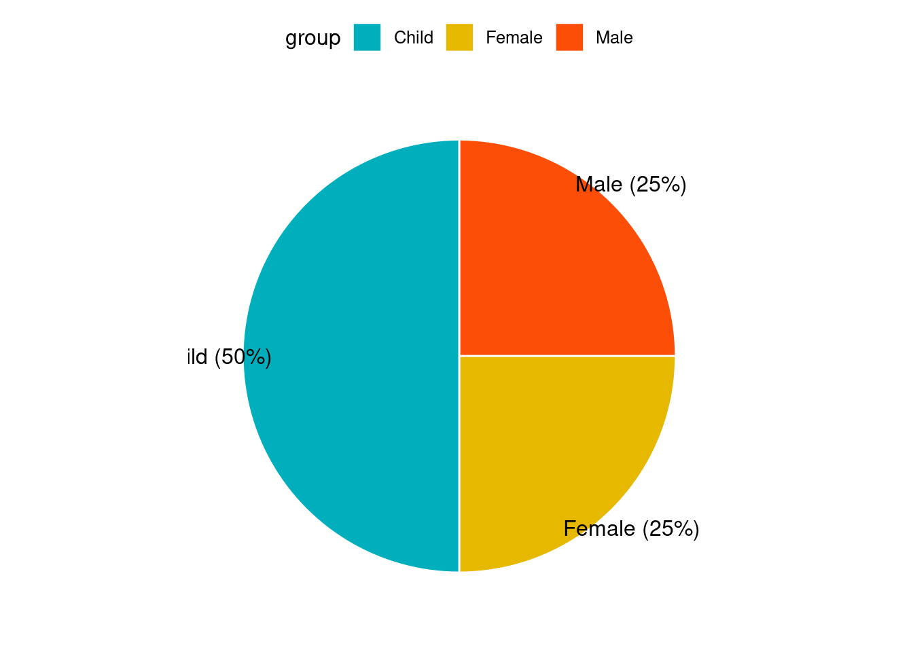


### Box plot
We use the ToothGrowth dataset to show the example of Box Plot.

```r
data("ToothGrowth")
df <- ToothGrowth
head(df, 10)
```

```
##     len supp dose
## 1   4.2   VC  0.5
## 2  11.5   VC  0.5
## 3   7.3   VC  0.5
## 4   5.8   VC  0.5
## 5   6.4   VC  0.5
## 6  10.0   VC  0.5
## 7  11.2   VC  0.5
## 8  11.2   VC  0.5
## 9   5.2   VC  0.5
## 10  7.0   VC  0.5
```

```r
pbox <- ggboxplot(df, x = "dose", y = "len",
                color = "dose", palette =c("#00AFBB", "#E7B800", "#FC4E07"),
                add = "jitter", shape = "dose")
pbox
```

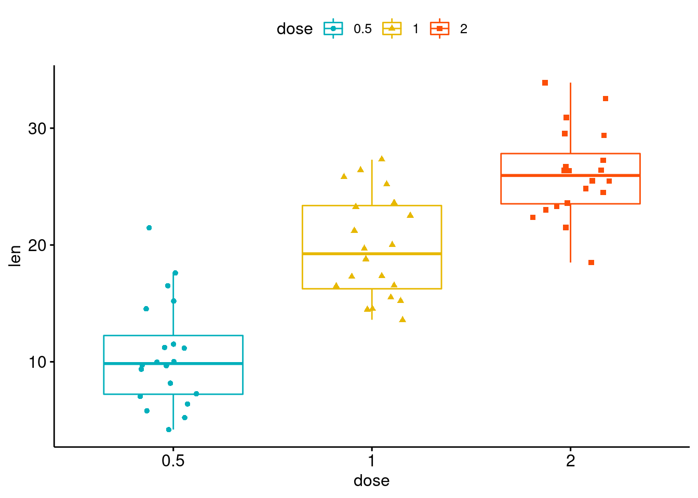

This boxplot is different from what we have seen in geom_boxplot(). In this boxplot, we can see the distribution of all points within different groups of Sports. Also, we can change the color and shape very easily.
We can set up customized comparison of mean between groups. And the result p-value of ANOVA can be added to the graph as well. The p-value of Kruskal-Wallis test can also be shown on the graph.

```r
my_comparisons <- list( c("0.5", "1"), c("1", "2"), c("0.5", "2") )
pbox + stat_compare_means(comparisons = my_comparisons)+ # Add pairwise comparisons p-value
  stat_compare_means(label.y = 50)                   # Add global p-value
```

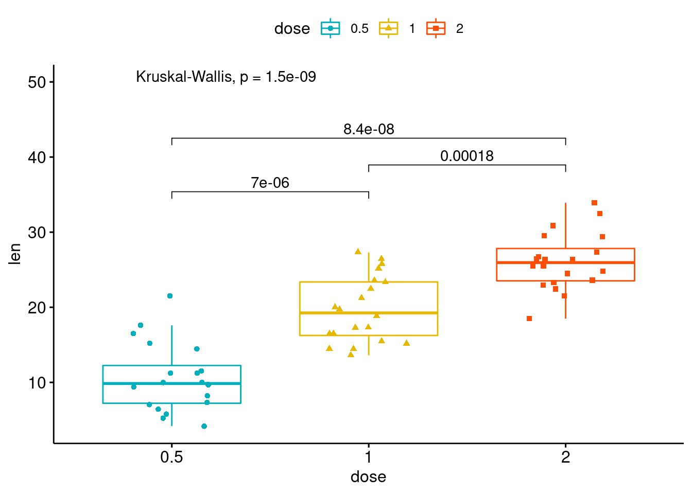


### Violin plot
We still use the first 100 rows of fastfood dataset. This time, we draw a violin plot regarding calories variable with boxplots inside. And we can also compare means with this plot. Just like the boxplot we have above, we can have the p-value of ANOVA on the violin plot as well.

```r
ggviolin(df, x = "dose", y = "len", fill = "dose",
         add = "boxplot", add.params = list(fill = "white"))+
   stat_compare_means(comparisons = my_comparisons)+
   stat_compare_means(label.y = 50)
```

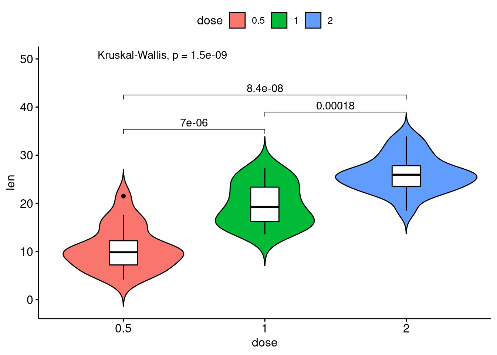

### Bar plot
We use the mtcars dataset and convert the gear variable to a factor. And we add the name columns.

```r
data(mtcars)
cars <- mtcars
cars$gear <- factor(cars$gear)
cars$name <- rownames(cars)
head(cars[,c("name", "wt", "hp","gear")])
```

```
##                                name    wt  hp gear
## Mazda RX4                 Mazda RX4 2.620 110    4
## Mazda RX4 Wag         Mazda RX4 Wag 2.875 110    4
## Datsun 710               Datsun 710 2.320  93    4
## Hornet 4 Drive       Hornet 4 Drive 3.215 110    3
## Hornet Sportabout Hornet Sportabout 3.440 175    3
## Valiant                     Valiant 3.460 105    3
```

Now we draw a bar plot of hp variable and we change the fill color by grouping variable gear. Sorting will be done globally.

```r
ggbarplot(cars, x = "name", y = "hp",
          fill = "gear",               
          color = "white",
          palette = "jco",
          sort.val = "desc",  
          sort.by.groups = FALSE,
          x.text.angle = 60,
          ylab = "Horse Power",
          xlab = FALSE,
          legend.title="Gear"
          )
```

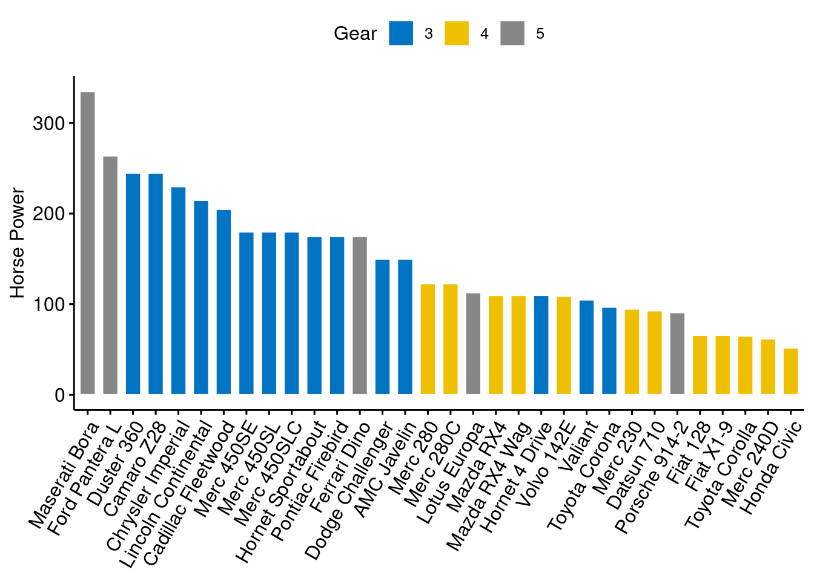

Then we sort bars inside each group.

```r
ggbarplot(cars, x = "name", y = "hp",
          fill = "gear",               
          color = "white",  
          palette = "jco",
          sort.val = "asc",  
          sort.by.groups = TRUE,
          x.text.angle = 60,
          ylab = "Horsepower",
          xlab = FALSE,
          legend.title="Gear"
          )
```

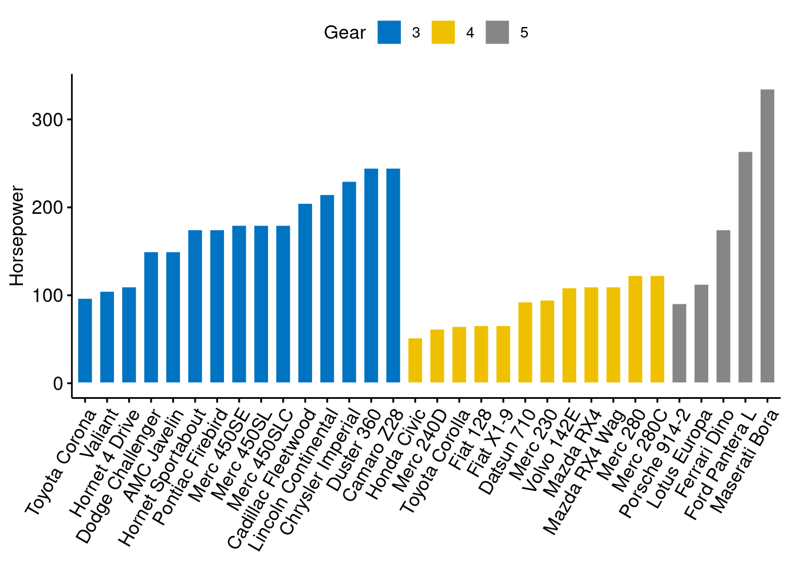

We can standarize the hp and compare each model with the mean.

```r
cars$hp_z <- (cars$hp-mean(cars$hp))/sd(cars$hp)
cars$hp_grp <- factor(ifelse(cars$hp_z<0, "low","high"), levels=c("low", "high"))
head(cars[,c("name", "wt", "hp", "hp_grp", "gear")])
```

```
##                                name    wt  hp hp_grp gear
## Mazda RX4                 Mazda RX4 2.620 110    low    4
## Mazda RX4 Wag         Mazda RX4 Wag 2.875 110    low    4
## Datsun 710               Datsun 710 2.320  93    low    4
## Hornet 4 Drive       Hornet 4 Drive 3.215 110    low    3
## Hornet Sportabout Hornet Sportabout 3.440 175   high    3
## Valiant                     Valiant 3.460 105    low    3
```

```r
ggbarplot(cars, x="name", y="hp_z",
          fill = "hp_grp",
          color = "white",
          palette = "jco",
          sort.val = "asc",
          sort.by.groups = FALSE,
          x.text.angle=60,
          ylab = "Horsepower z-scores",
          xlab = FALSE, 
          legend.title="Horsepower Group")
```

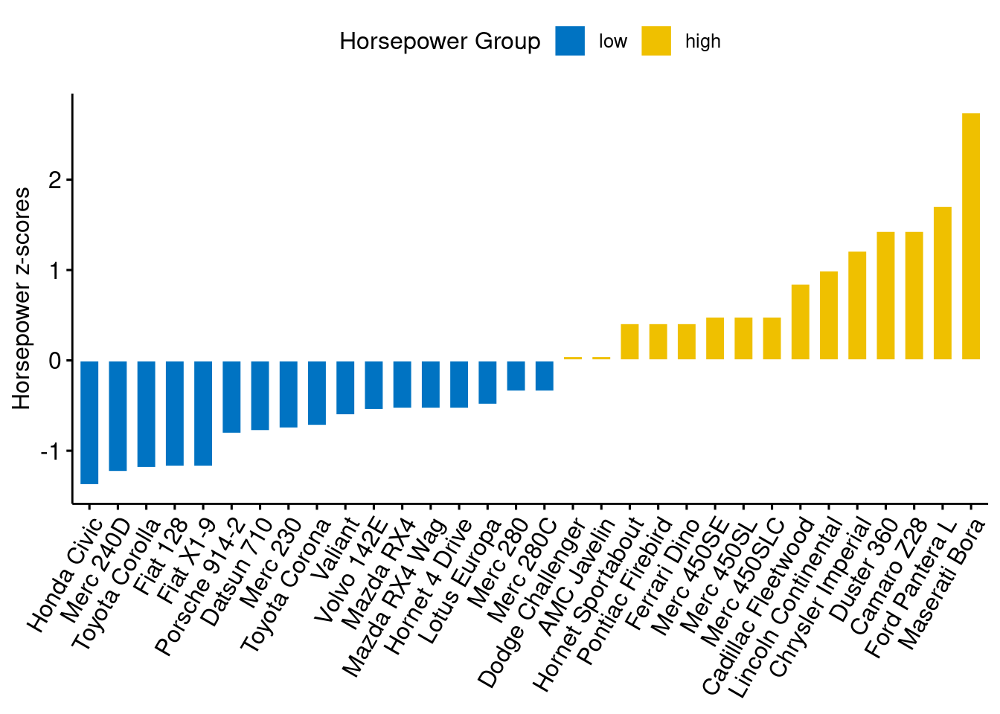

Then rotate it with adding just one line of code:

```r
rotate=TRUE
ggbarplot(cars, x="name", y="hp_z",
          fill = "hp_grp",
          color = "white",
          palette = "jco",
          sort.val = "asc",
          sort.by.groups = FALSE,
          x.text.angle=90,
          ylab = "Horsepower z-scores",
          xlab = FALSE, 
          legend.title="Horsepower Group",
          rotate=TRUE,
          ggtheme = theme_minimal())
```

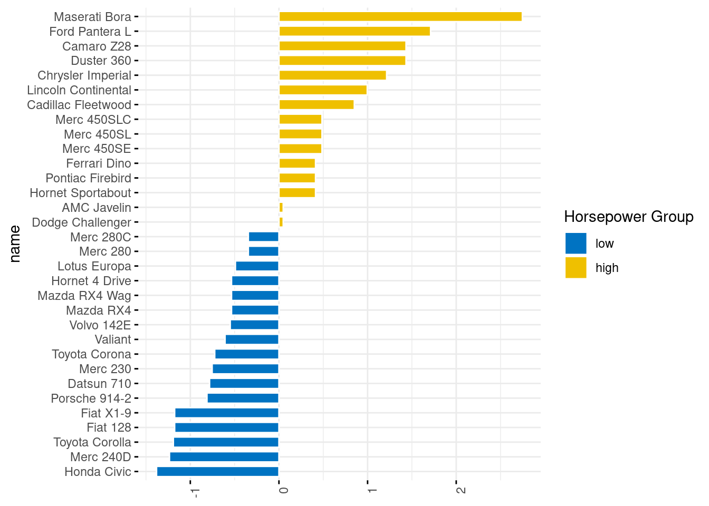

### Cleveland dot plot
We still use mtcars dataset to draw a Cleveland dot plot.

```r
ggdotchart(cars, x = "name", y = "hp",
           color = "gear", 
           palette = "jco",
           sorting = "descending",                 
           rotate = TRUE,                          
           dot.size = 2,
           ggtheme = theme_pubr(),
           legend.title = "Gear")+
  theme_cleveland()                                
```

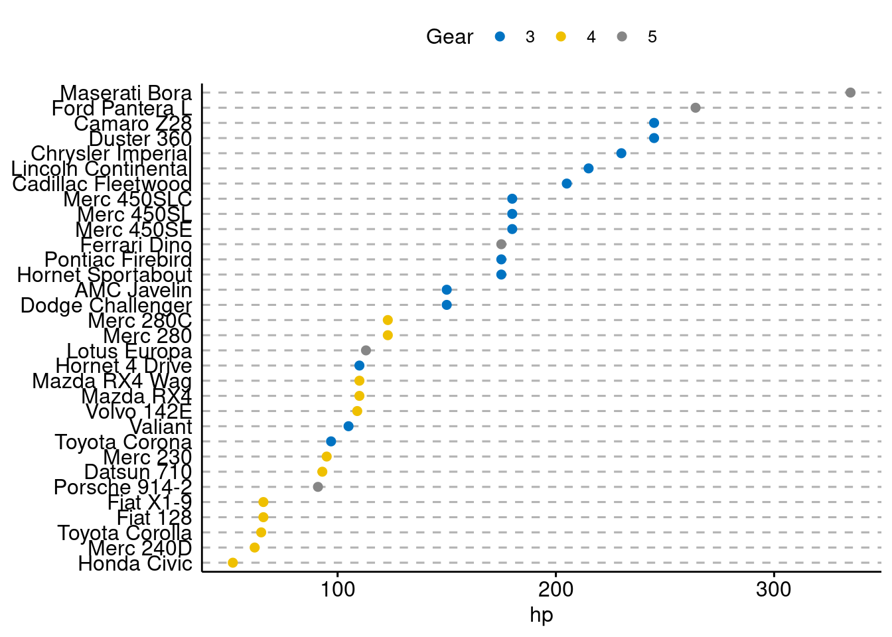

It is more interesting to color y text by groups. All we need to add is:

```r
y.text.col=TRUE
```

```r
ggdotchart(cars, x = "name", y = "hp",
           color = "gear", 
           palette = "jco",
           sorting = "descending",                 
           rotate = TRUE,                          
           dot.size = 2,                           
           ggtheme = theme_pubr(),
           y.text.col=TRUE,
           legend.title = "Gear")+
  theme_cleveland()      
```

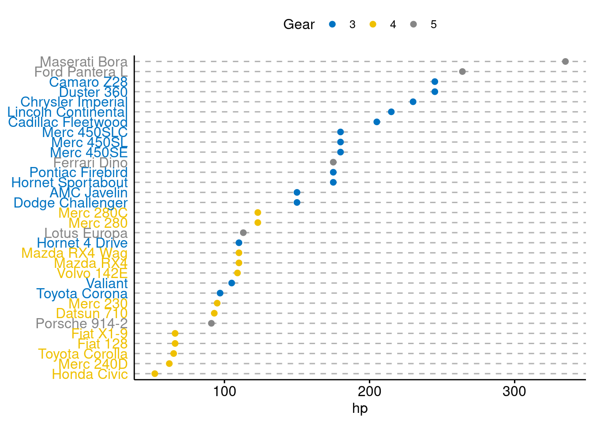

### Mix Multiple Graphs
To arrange multiple graphs on one single page, we’ll use the function ggarrange()[in ggpubr]. Compared to the standard function plot_grid(), ggarange() can arrange multiple ggplots over multiple pages.
Create a box plot and a dot plot:

```r
# Box plot (bp)
bxp <- ggboxplot(ToothGrowth, x = "dose", y = "len",
                 color = "dose", palette = "jco")
bxp
```

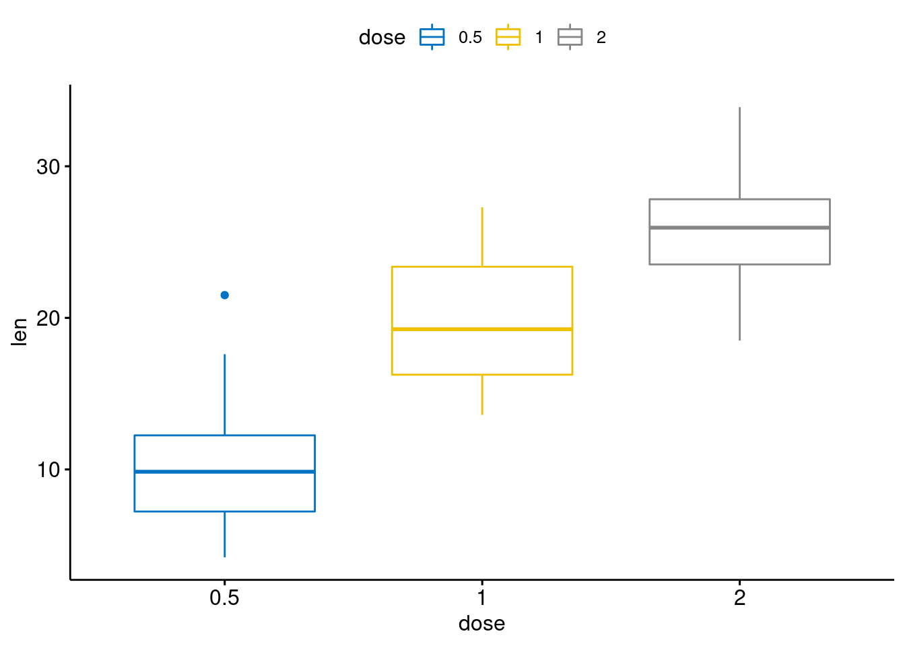

```r
# Dot plot (dp)
dp <- ggdotplot(ToothGrowth, x = "dose", y = "len",
                 color = "dose", palette = "jco", binwidth = 1)
dp
```

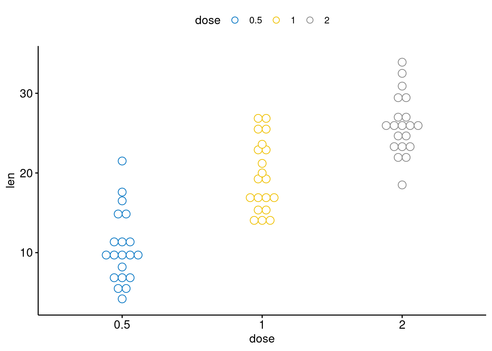

```r
# scatter plot (sp)
x <- c(841.564927857936, 841.564927857936, 841.424690409534, 841.284499691372, 
420.782463928968, 420.88768585043, 420.432103842432, 420.572177840048, 
420.712345204767, 420.782463928968, 420.747401645497)
y <- c(43692.05, 51561, 34637.8270288285, 36198.5838053982, 36909.925, 
30733.6584146036, 32350.3164029975, 31906.371814093, 30367.0638226962, 
32410.975, 31970.2108157654)
df <- data.frame(x,y)
sp <- ggscatter(df, x = 'x', y = 'y', add = "reg.line") +
  stat_cor(label.x = 3, label.y = 3000) +
  stat_regline_equation(label.x = 3, label.y = 5000)
sp
```

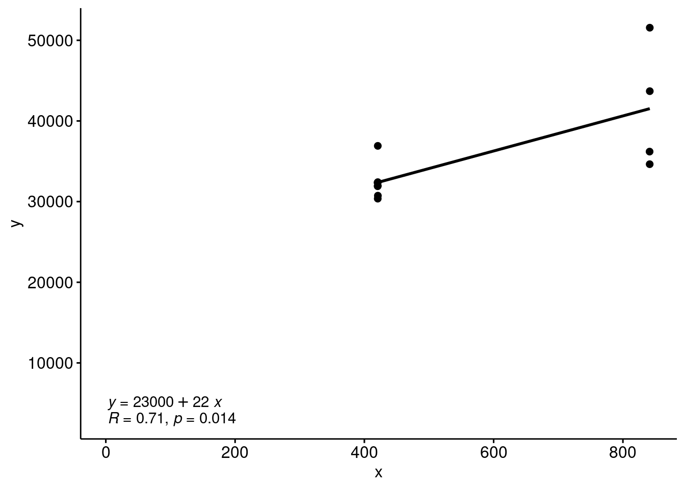

```r
ggarrange(bxp, dp, sp,
          labels = c("A", "B", "C"),
          ncol = 2, nrow = 2)
```

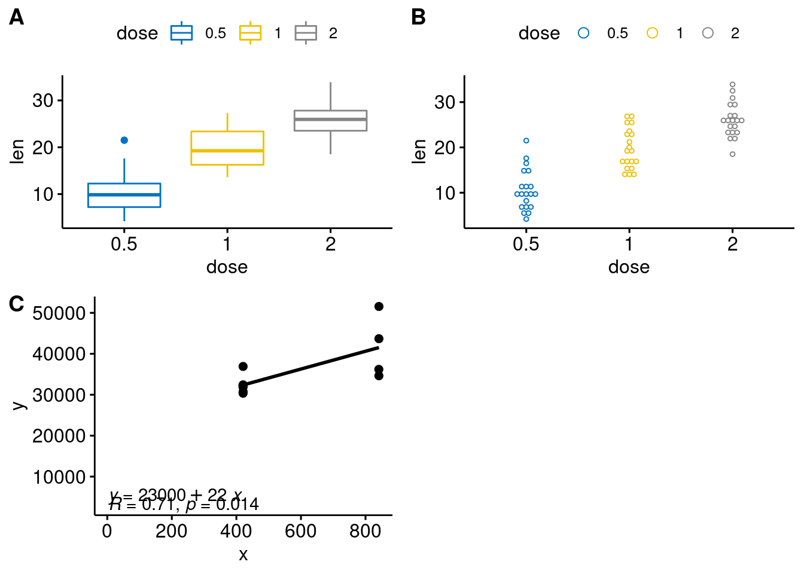

### Conclusion
As we can see, it’s much easier to plot required graphs using ggpubr without learning much about layers of ggplot2, which makes graphing less difficult for people who are not familiar with R programming.

source:
https://cran.r-project.org/web/packages/ggpubr/index.html
https://github.com/kassambara/ggpubr

