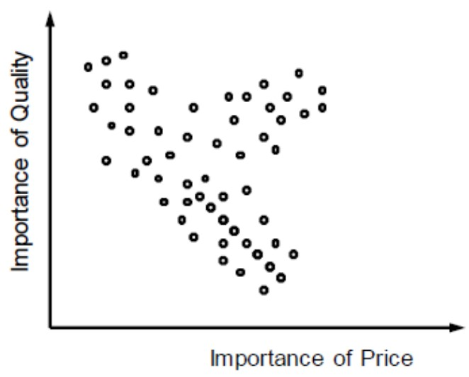
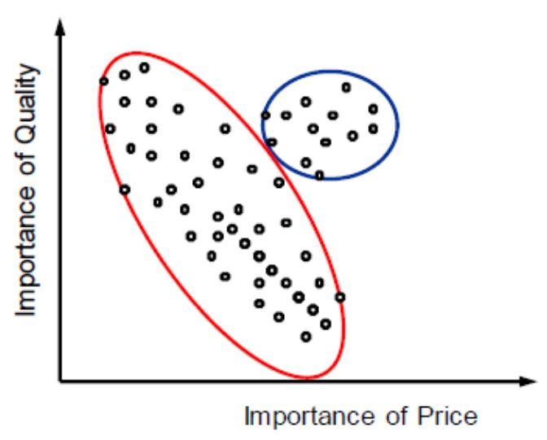

# Tutorial on Cluster Analysis

Jannik Wiedenhaupt


## What is Clustering Analysis?
Clustering Analysis is a data exploration method and one of the most popular classification techniques. Clustering works by segregating data points into different groups based on the similarity and dissimiliarity of attributes. That means data is clustered such that the homogeneity inside the clusters is maximized and the heterogeneity between the clusters maximized. For any concept that is novel to human understanding, clustering or grouping elements based on their likeness is important.  

Likewise in data science and machine learning, clustering algorithms carry out the task of labeling unlabelled data inputs which further helps in data interpretation and establishing patterns for predictive purposes.

To understand the idea of clustering, let's look at the following picures where the points are customer who rated their personal importance of price and quality.


<div align="center">
<p align="center"><strong>Can we identify any groups of data points in this graph?</strong></p>
<p align="center">
<p align="center"><strong>Should we cluster the data like this?</strong></p>
<p align="center"></p>
<p align="center"><strong>Or like this?</strong></p>
<p align="center"></p>
</div>

From the visual representation (which are also only two-dimensional), we can already not clearly decide how to cluster the data points. To cluster data points properly, we need clustering algorithms.

## What Types of Clustering Analysis Exist?
There are many different types of clustering algorithms that are particularly useful for different situations.

The four most common types are:

### Centroid-based Algorithms
Centroid-based algorithm separate data points based on multiple so-called centroids in the data. Each data point is assigned to a cluster based on its squared distance from the centroid. This is the most commonly used type of clustering.

### Hierarchical Algorithms
Hierarchical algorithms differ from centroid-based algorithms in that they constract a hierarchy among all data points. From this hierarchy, one can choose different sized clusters based on the granularity required for the task at hand. This is normally used on hierarchical data structures like company databases or a taxonomy of animal species.
There are two main types of hierarchical algorithms:

1. Agglomerative clustering - all observations are considered invdividually and then merged into everbigger clusters
2. Divisive cluster - all observations are considered together and then split up int eversmaller clusters

### Distribution-based Algorithms
Distribution-based clustering assumes data is composed of distributions. Therefore, all data points are considered parts of a cluster based on the probability that they belong to a given cluster. As distance from the center of a cluster increases, the probability that the data point belongs to that cluster decreases. This algorithm is only recommended when you know the distribution of your data.

### Density-based Algorithms
Density-based clustering works by detecting regions in which factors are focused and in which they're separated via means of regions that might be empty or sparse. Points that are not a part of a cluster are categorized as noise. Outliers are not assigned to clusters and therefore ignored in these algorithms.

## How Does Cluster Analysis Work on Paper?
The following process should be followed when approaching a cluster analysis.

1. **Variable selection:** Select the variables, called *bases*, that will be used to cluster the observations. If you want to make any decisions based on the classification, for example in targeting different groups of customers, you most likely also want to have additional variables, called *descriptors*, that help you understand the found clusters.
2. **Similarity/Dissimilarity calculation:** Choose a suitable measures of proximity between the different observations. Based on the type of the bases, you need to choose a *distance function* or a *similarity function*. The variables are compared individually first. Then, they are summed up to calculate the total similarity/distance between two observations. Comparing all observations with each other yields a *proximity or distance matrix*.
3. **Cluster creation:** Choose a suitable clustering method from the ones mentioned above and if needed also an objective functions to decide when clusters are merged or split up.

**Additional steps (not always required):**
1. Determine the number of clusters. This can be either done based on a thorough understanding of the problem's domain, the planned interpretation, or a statistical procedure. This is for example required for centroid-based algorithms.
2. Interpretation of the clusters.
3. Test the strength of the clustering results. Test the internal homogeneity and external homogeneity of the clusters.


## How Does Cluster Analysis Work in R?

### Data Preparation
First, we load in the dataset. In this tutorial, we use the *states* dataset to cluster US states. 

```r
df <- datasets::state.x77%>%data.frame()
```

Second, we will also use the *factoextra* package and particularly the *eclust* function to simplify the analysis and visualization.

Third, we check that the data has the following form:

1. Rows are observations and columns are variables
2. Missing values are removed or estimated
3. Data must be standardized
4. Avoid double-weighting of underlying constructs by avoiding multicollinearity


```r
head(df, 3)
```

```
##         Population Income Illiteracy Life.Exp Murder HS.Grad Frost   Area
## Alabama       3615   3624        2.1    69.05   15.1    41.3    20  50708
## Alaska         365   6315        1.5    69.31   11.3    66.7   152 566432
## Arizona       2212   4530        1.8    70.55    7.8    58.1    15 113417
```


```r
# Delete NA values
df <- na.omit(df)

# Save non-scaled version for later
df_original <- df

# Standardize variables
df <- df %>% mutate_all(~(scale(.) %>% as.vector))

cor_matrix <- cor(df)
corrplot(cor_matrix, method = "number", type = "lower", tl.pos = 'd')
```


```r
# Because murder and life expectancy are strongly correlated, we remove murder
df <- subset(df, select = -c(Murder))
```

### Centroid-based Algorithms
The classic centroid-based algorithm is called "k-means" and will be used here. K-means takes data points as input and groups them into *k*  clusters through the following process.

1. Select inputs
2. Select *k* cluster centers
3. Assign cases to closest center
4. Update cluster centers
5. Reassign cases
6. Repeat steps 4 and 5 until convergence

Going through this process in R is very simple as it only requires one function.
The parameters are the following

* **FUNcluster:** Clustering function. Here, k-means.
* **hc_metric:** Metric to be used for calculating dissimilarities between observations. Here, euclidean distance.
* **k:** Number of clusters. Here 5 is guessed because of the lack of further exploration of the dataset. 


```r
res.km <- eclust(df, FUNcluster = "kmeans", k = 5, hc_metric = "euclidean")
```


#### Choosing the Number of Clusters
Alternatively to setting the number of clusters *k* ourselves, we can also resort to different statistics:

**1. Gap Statistic**

```r
res.km <- eclust(df, FUNcluster = "kmeans", hc_metric = "euclidean", graph = FALSE)
fviz_gap_stat(res.km$gap_stat)
```


**2. Silhouette Plot**

```r
fviz_silhouette(res.km)
```

```
##   cluster size ave.sil.width
## 1       1   15          0.08
## 2       2   23          0.36
## 3       3   11          0.52
## 4       4    1          0.00
```


**3. Elbow Method**
The elbow method is a visual method, where we determine the cluster based on spotting an elbow in the graph.

```r
fviz_nbclust(df, FUNcluster = kmeans, method = "wss") + labs(subtitle = "Elbow method") 
```


There are weak (not very pronounced) elbows at 2 and 6.


**4. Other Indices**
Use the package *NbClust* to experiment with different clustering methods, distances, and indices. 

```r
cat("C-Index:\n", NbClust(data=df, method = "kmeans", distance = "euclidean", index="cindex")$Best.nc)
```

```
## C-Index:
##  3 0.2594
```

```r
cat("Dunn-Index:\n", NbClust(data=df, method = "kmeans", distance = "euclidean", index="dunn")$Best.nc)
```

```
## Dunn-Index:
##  15 0.3403
```

```r
cat("McClain-Index:\n", NbClust(data=df, method = "kmeans", distance = "euclidean", index="mcclain")$Best.nc)
```

```
## McClain-Index:
##  2 0.3932
```

### Hierarchial Algorithms
There are two fundamental methods of hierarchical clustering - agglomerative and divisive clustering. We will explain both.
In hierarchical clustering you do not need to define or calculate the number of clusters before running the algorithm. Moreover, hierarchical clustering results in a comprehensible tree-like structure called a *Dendrogram* that allows us to find the number of clusters that is most interpretable.

#### Divisive Hierarchical Clustering
1. All objects or points in the dataset belong to one single cluster
2. Partition the single cluster into the two least similar clusters
3. Repeat step 2 until each observation is a single cluster

The parameters are the following

* **FUNcluster:** "hclust" for divisive clustering.
* **hc_metric:** "euclidean" for euclidean distance.


```r
res.hclust <- eclust(df, FUNcluster = "hclust", hc_metric = "euclidean")
fviz_dend(res.hclust, rect = TRUE)
```


```r
fviz_cluster(res.hclust, labelsize = 10)
```


Here, we see a discrepancy to k-means clustering. While the gap-statistic yielded 4 optimal clusters, the hierarchical clustering identifies 2 major cluster.

#### Agglomerative Hierarchical Clustering

1. Each observation is a single cluster
2. Every two observations that are closest to each other according to the distance measure, are clustered
3. Repeat step 2 until all observations are one cluster

It is important to notice that agglomerative clustering requires a agglomeration method to be specified. There are different agglomeration methods on which you can read up here: https://en.wikipedia.org/wiki/Hierarchical_clustering#Linkage_criteria.
We choose the commonly used ward.D2 measure that minimized total within-cluster variance.

The parameters are the following

* **FUNcluster:** "agnes" for agglomerative nesting.
* **hc_method:** Agglomeration method. Here, ward.D2.
* **hc_metric:** "euclidean" for euclidean distance.

```r
res.aclust <- eclust(df, FUNcluster = "hclust", hc_metric = "euclidean", hc_method = "ward.D2")
fviz_dend(res.aclust, rect = TRUE)
```


```r
fviz_cluster(res.aclust, labelsize = 10)
```


While it is possible to see differences between agglomerative and diviseve clustering, the two methods come to the same result in this example.

### Distribution-based Algorithms
For an explanation and very good R-tutorial on distribution-based algorithms, please visit (Note: Distribution-based algorithms are called model-based algorithms here): https://www.datanovia.com/en/lessons/model-based-clustering-essentials/

### Density-based Algorithms
For an explanation and very good R-tutorial on density-based algorithms, please visit: https://www.datanovia.com/en/lessons/dbscan-density-based-clustering-essentials/

## Using Clustering for Further Analysis
After clustering your observations, we want to understand what the clusters mean. To do this, we will visualize the average strenght of each variable in each cluster.

First, assign the clusters to the dataframe.

```r
df_clusters <- res.km$centers
```

(Output of res.km is the following)

```r
res.km
```

```
## K-means clustering with 4 clusters of sizes 15, 23, 11, 1
## 
## Cluster means:
##   Population      Income  Illiteracy    Life.Exp    HS.Grad      Frost
## 1  1.0136832  0.61841919  0.09296733  0.07901309  0.1822459 -0.5975278
## 2 -0.5147347  0.08615414 -0.74968285  0.56233752  0.4850920  0.6945869
## 3 -0.2269956 -1.30146170  1.39152706 -1.17731360 -1.4157826 -0.7206500
## 4 -0.8693980  3.05824562  0.54139799 -1.16850978  1.6828035  0.9145676
##          Area
## 1 -0.07085360
## 2 -0.09444464
## 3 -0.23402899
## 4  5.80934967
## 
## Clustering vector:
##        Alabama         Alaska        Arizona       Arkansas     California 
##              3              4              1              3              1 
##       Colorado    Connecticut       Delaware        Florida        Georgia 
##              2              2              2              1              3 
##         Hawaii          Idaho       Illinois        Indiana           Iowa 
##              1              2              1              2              2 
##         Kansas       Kentucky      Louisiana          Maine       Maryland 
##              2              3              3              2              1 
##  Massachusetts       Michigan      Minnesota    Mississippi       Missouri 
##              1              1              2              3              2 
##        Montana       Nebraska         Nevada  New Hampshire     New Jersey 
##              2              2              2              2              1 
##     New Mexico       New York North Carolina   North Dakota           Ohio 
##              3              1              3              2              1 
##       Oklahoma         Oregon   Pennsylvania   Rhode Island South Carolina 
##              2              2              1              2              3 
##   South Dakota      Tennessee          Texas           Utah        Vermont 
##              2              3              1              2              2 
##       Virginia     Washington  West Virginia      Wisconsin        Wyoming 
##              1              1              3              2              2 
## 
## Within cluster sum of squares by cluster:
## [1] 66.96776 52.45135 19.80725  0.00000
##  (between_SS / total_SS =  59.4 %)
## 
## Available components:
## 
##  [1] "cluster"      "centers"      "totss"        "withinss"     "tot.withinss"
##  [6] "betweenss"    "size"         "iter"         "ifault"       "silinfo"     
## [11] "nbclust"      "data"         "gap_stat"
```

Second, visualize the strength of the variables using a heatmap to describe the different clusters.

```r
melt_df <- melt(df_clusters)

heatmap <- ggplot(melt_df, aes(Var2, Var1)) +
  scale_fill_continuous(type = "viridis", direction = -1) +
  geom_tile(aes(fill = value)) +
  geom_text(aes(label = round(value, 1))) +
  theme_bw() +
  ggtitle("Strength of Each of the Variables in the Clusters") +
  theme(plot.title = element_text(hjust = 0.5)) +
  labs(x="Variable", y="Cluster")
heatmap
```


The clustering of the variables shows that cluster 4 has the largest area and above average income. However, it comprises only one observation and is thus less interpretable. Cluster 3 has below average income, life expectancy and highschool graduation, but above average illiteracy. This cluster can be seen as one of worse performing states in these developmental areas. Cluster 2 and 1 are relatively similar with mostly average characteristics. The most meaningful difference is the population. Therefore, we could call cluster 2 "Low-populated average states" and cluster 2 "High-populated average states". 

Here we see the final classification results again:

```r
df_original["Cluster"] <- res.km$cluster
df_out <- df_original[order(-df_original$Cluster), ]
knitr::kable(df_out)
```


|               | Population| Income| Illiteracy| Life.Exp| Murder| HS.Grad| Frost|   Area| Cluster|
|:--------------|----------:|------:|----------:|--------:|------:|-------:|-----:|------:|-------:|
|Alaska         |        365|   6315|        1.5|    69.31|   11.3|    66.7|   152| 566432|       4|
|Alabama        |       3615|   3624|        2.1|    69.05|   15.1|    41.3|    20|  50708|       3|
|Arkansas       |       2110|   3378|        1.9|    70.66|   10.1|    39.9|    65|  51945|       3|
|Georgia        |       4931|   4091|        2.0|    68.54|   13.9|    40.6|    60|  58073|       3|
|Kentucky       |       3387|   3712|        1.6|    70.10|   10.6|    38.5|    95|  39650|       3|
|Louisiana      |       3806|   3545|        2.8|    68.76|   13.2|    42.2|    12|  44930|       3|
|Mississippi    |       2341|   3098|        2.4|    68.09|   12.5|    41.0|    50|  47296|       3|
|New Mexico     |       1144|   3601|        2.2|    70.32|    9.7|    55.2|   120| 121412|       3|
|North Carolina |       5441|   3875|        1.8|    69.21|   11.1|    38.5|    80|  48798|       3|
|South Carolina |       2816|   3635|        2.3|    67.96|   11.6|    37.8|    65|  30225|       3|
|Tennessee      |       4173|   3821|        1.7|    70.11|   11.0|    41.8|    70|  41328|       3|
|West Virginia  |       1799|   3617|        1.4|    69.48|    6.7|    41.6|   100|  24070|       3|
|Colorado       |       2541|   4884|        0.7|    72.06|    6.8|    63.9|   166| 103766|       2|
|Connecticut    |       3100|   5348|        1.1|    72.48|    3.1|    56.0|   139|   4862|       2|
|Delaware       |        579|   4809|        0.9|    70.06|    6.2|    54.6|   103|   1982|       2|
|Idaho          |        813|   4119|        0.6|    71.87|    5.3|    59.5|   126|  82677|       2|
|Indiana        |       5313|   4458|        0.7|    70.88|    7.1|    52.9|   122|  36097|       2|
|Iowa           |       2861|   4628|        0.5|    72.56|    2.3|    59.0|   140|  55941|       2|
|Kansas         |       2280|   4669|        0.6|    72.58|    4.5|    59.9|   114|  81787|       2|
|Maine          |       1058|   3694|        0.7|    70.39|    2.7|    54.7|   161|  30920|       2|
|Minnesota      |       3921|   4675|        0.6|    72.96|    2.3|    57.6|   160|  79289|       2|
|Missouri       |       4767|   4254|        0.8|    70.69|    9.3|    48.8|   108|  68995|       2|
|Montana        |        746|   4347|        0.6|    70.56|    5.0|    59.2|   155| 145587|       2|
|Nebraska       |       1544|   4508|        0.6|    72.60|    2.9|    59.3|   139|  76483|       2|
|Nevada         |        590|   5149|        0.5|    69.03|   11.5|    65.2|   188| 109889|       2|
|New Hampshire  |        812|   4281|        0.7|    71.23|    3.3|    57.6|   174|   9027|       2|
|North Dakota   |        637|   5087|        0.8|    72.78|    1.4|    50.3|   186|  69273|       2|
|Oklahoma       |       2715|   3983|        1.1|    71.42|    6.4|    51.6|    82|  68782|       2|
|Oregon         |       2284|   4660|        0.6|    72.13|    4.2|    60.0|    44|  96184|       2|
|Rhode Island   |        931|   4558|        1.3|    71.90|    2.4|    46.4|   127|   1049|       2|
|South Dakota   |        681|   4167|        0.5|    72.08|    1.7|    53.3|   172|  75955|       2|
|Utah           |       1203|   4022|        0.6|    72.90|    4.5|    67.3|   137|  82096|       2|
|Vermont        |        472|   3907|        0.6|    71.64|    5.5|    57.1|   168|   9267|       2|
|Wisconsin      |       4589|   4468|        0.7|    72.48|    3.0|    54.5|   149|  54464|       2|
|Wyoming        |        376|   4566|        0.6|    70.29|    6.9|    62.9|   173|  97203|       2|
|Arizona        |       2212|   4530|        1.8|    70.55|    7.8|    58.1|    15| 113417|       1|
|California     |      21198|   5114|        1.1|    71.71|   10.3|    62.6|    20| 156361|       1|
|Florida        |       8277|   4815|        1.3|    70.66|   10.7|    52.6|    11|  54090|       1|
|Hawaii         |        868|   4963|        1.9|    73.60|    6.2|    61.9|     0|   6425|       1|
|Illinois       |      11197|   5107|        0.9|    70.14|   10.3|    52.6|   127|  55748|       1|
|Maryland       |       4122|   5299|        0.9|    70.22|    8.5|    52.3|   101|   9891|       1|
|Massachusetts  |       5814|   4755|        1.1|    71.83|    3.3|    58.5|   103|   7826|       1|
|Michigan       |       9111|   4751|        0.9|    70.63|   11.1|    52.8|   125|  56817|       1|
|New Jersey     |       7333|   5237|        1.1|    70.93|    5.2|    52.5|   115|   7521|       1|
|New York       |      18076|   4903|        1.4|    70.55|   10.9|    52.7|    82|  47831|       1|
|Ohio           |      10735|   4561|        0.8|    70.82|    7.4|    53.2|   124|  40975|       1|
|Pennsylvania   |      11860|   4449|        1.0|    70.43|    6.1|    50.2|   126|  44966|       1|
|Texas          |      12237|   4188|        2.2|    70.90|   12.2|    47.4|    35| 262134|       1|
|Virginia       |       4981|   4701|        1.4|    70.08|    9.5|    47.8|    85|  39780|       1|
|Washington     |       3559|   4864|        0.6|    71.72|    4.3|    63.5|    32|  66570|       1|

**I hope that this tutorial was helpful to you! Good luck with your next clustering analysis!**

## Sources
Giordani, P., Ferraro, M. B., & Martella, F. (2020). Introduction to Clustering. https://doi.org/10.1007/978-981-13-0553-5_1

Sultana, S. (2020, December 21). How the Hierarchical Clustering Algorithm Works. Retrieved October 24, 2021, from https://dataaspirant.com/hierarchical-clustering-algorithm/#t-1608531820434

Rawat, S. (2021, June 25). 6 Types of Clustering Algorithms in Machine Learning | Analytics Steps. Retrieved October 23, 2021, from https://www.analyticssteps.com/blogs/6-types-clustering-algorithms-machine-learning

Datanovia. (n.d.). Agglomerative Hierarchical Clustering - Datanovia. Retrieved October 24, 2021, from https://www.datanovia.com/en/lessons/agglomerative-hierarchical-clustering/

TechVidvan. (n.d.). Cluster Analysis in R - Complete Guide on Clustering in R - TechVidvan. Retrieved October 24, 2021, from https://techvidvan.com/tutorials/cluster-analysis-in-r/

R Bloggers. (2019, July). Customer Segmentation using RFM Analysis - Rsquared Academy Blog - Explore Discover Learn. Retrieved October 24, 2021, from https://blog.rsquaredacademy.com/customer-segmentation-using-rfm-analysis/


