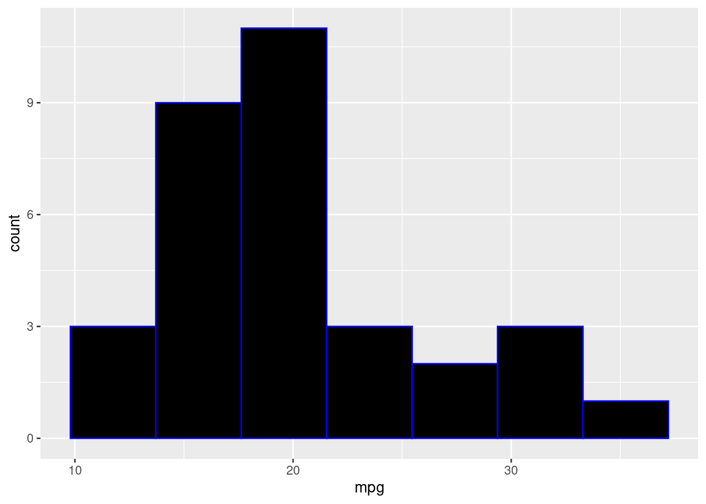

# Color selection for ggplot graphs

Raphaël Adda and Deepesh Theruvath

```r
library(ggplot2)
library(RColorBrewer)
```


**How to chose colors in R**

When we are a plotting something, the choice of the colors is very important. R offers a huge number of ways to determine the colors that we will use. However, a lot of R users do not really know how to choose them. 

This is the motivation behind this cheat sheet which presents the different methods of choosing colors in R.


We will use this histogram to illustrate how to chose colors

```r
ggplot(mtcars,aes(x=mpg))+
  geom_histogram(bins=7)
```


**Classic naming of colors**
The simplest way to determine colors in a plot is to call the color by its name:

Example

```r
ggplot(mtcars,aes(x=mpg))+
  geom_histogram(bins=7,fill = "grey",col ="white")
```


OR:


```r
ggplot(mtcars,aes(x=mpg))+
  geom_histogram(bins=7,fill = "black",col ="blue")
```



**Colors with number**
In this method we are selecting colors based on the numbers defined in R

```r
ggplot(mtcars,aes(x=mpg))+
  geom_histogram(bins=7,fill = 3,col = 1)
```


Each number greater than 0 is related to a color:
Here is a graph showing the link between some numbers and some colors:


```r
x = seq(1,16)
y = rep(0,16)
plot(x, y, col = x, pch = 19)
axis(1, at = 1:20)
```


So, each number between 1 and 8 corresponds to a color. When a number is greater than 8, its color is just the color of the rest of the euclidiean division per 8 (if the number is divisible by 8, the color corresponds to the color of 8 (grey)

**Using primary colours**

The method presented above is relatively easy but too restrictive. We can use 8 colors for our plots, and more sophisticated figures may require more colors.
All colors are composed of a mix of three primary colors: red, green, and blue. In all screens, each pixel is characterized by a superposition of these three colors: each one corresponds to a vector of size three, where each vector input is the intensity of the Red, Green, and Blue colors  (RGB).
For instance, the White color is a superposition of Red, Green, and Blue, so, thanks to the R function RGB, applied to the vector (1,1,1), we will obtain the white color.
Then for the vector (1/2,0,1/2), we will obtain a mix of the red and blue colors but not at their maximum intensity: we will thus get a kind of Purple.


```r
ggplot(mtcars,aes(x=mpg))+
  geom_histogram(bins=7,fill = rgb(1,1,1),col = rgb(0.5,0,0.5))
```


Thus, thanks to the RGB function, we can reproduce any color we want.

**Mixing colours**
The previous section is handy because we can obtain every color. However, some people prefer doing their own mix of color.
The function we will present allows us to mix two different colors:
colorRamp takes into an argument a vector of two colors and returns a function: this function takes a float argument p between 0 and 1 and returns and return a mix of the two colors (proportion (1-p) of color 1 and p of color 2), coded using RGB colour model. However, each color is coded between 0 and 255 so we need to divide by 255 to obtain the RGB vector with number between 0 and 1 to obtain a vector usable with the rgb function presented above.
Here is an example: we want a 90% pink and 10% green mix to fill in the histogram.

```r
pal <- colorRamp(c("pink", "green"))
mixed_col = pal(0.1)
mixed_col
```

```
##       [,1]  [,2]  [,3]
## [1,] 229.5 198.3 182.7
```

```r
ggplot(mtcars,aes(x=mpg))+
  geom_histogram(bins=7,fill = rgb(mixed_col/255),col = "white")
```


**Creating differents shades of a colors**

All previous methods help express colors in R. However; they require some knowledge about colors. For people who don't know how to reproduce colors using the RGB color model or by mixing two colors, a simpler way exists to determine colors.
The RColorBrewer allows the creation of different shades of color and visualization of them.
The brewer. pal function takes two arguments: an integer n and a set of colors, and it returns a vector of n shades of this set.
Here is an example: if we want to use purple in a plot, we just need to display different shades of the set "Purples" and choose which one interests us the most. 

```r
display.brewer.pal(9,"Purples")
```


Here, assume that the 5th shades of purple is the one that we want to use. Thus, it correspond to "brewer.pal(10,"Purples")[5]".


```r
fill_color = brewer.pal(9,"Purples")[5]
ggplot(mtcars,aes(x=mpg))+
  geom_histogram(bins=7,fill = fill_color,col = "white")
```


In order to know which set of colors we can use, there is the function "display.brewer.all()" which displays all the set of colors and the different colors we can use.

```r
display.brewer.all()
```


