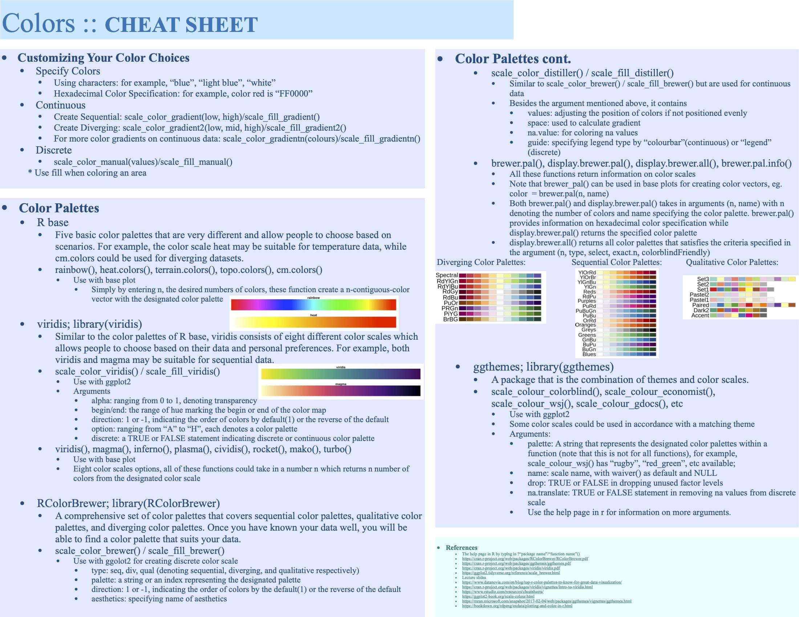

# Colors

Ziheng Ru

This is a cheat sheet that introduces color palettes. By browsing this cheatsheet, users could find information that explains coloring functions in creating their desired graphs.

