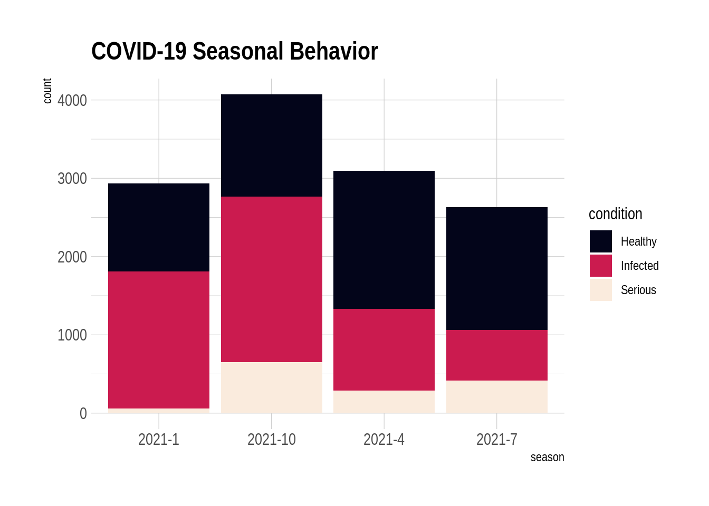
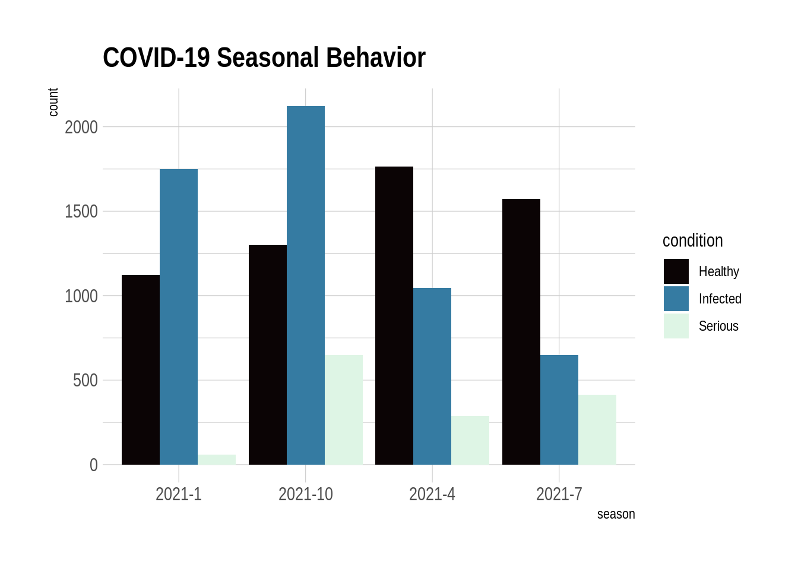
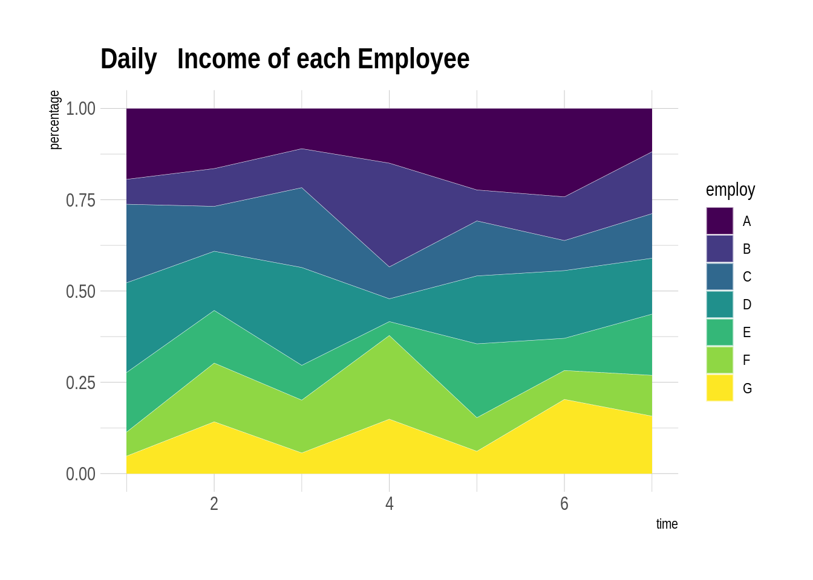

# Data_Composition_Plot

Xinfu Su and Yihan Wang


```r
library(viridis)
library(hrbrthemes)
library(waterfalls)
library(tidyverse)
```


```r
# create a dataset
season <- c(rep("2021-1" , 3) , rep("2021-4" , 3) , rep("2021-7" , 3) , rep("2021-10" , 3) )
condition <- rep(c("Healthy" , "Infected" , "Serious") , 4)
count <- abs(rnorm(12, 100, 1000))
data <- data.frame(season,condition,count)
ggplot(data, aes(fill=condition, y=count, x=season)) + 
    geom_bar(position="stack", stat="identity")+
    scale_fill_viridis(discrete = T, option = "F") +
    ggtitle("COVID-19 Seasonal Behavior") +
    theme_ipsum()
```




```r
ggplot(data, aes(fill=condition, y=count, x=season)) + 
    geom_bar(position="fill", stat="identity")+
    scale_fill_viridis(discrete = T, option = "F") +
    ggtitle("COVID-19 Seasonal Behavior") +
    theme_ipsum()
```


```r
ggplot(data, aes(fill=condition, y=count, x=condition)) + 
    geom_bar(position="dodge", stat="identity")+facet_wrap(~season)+
    scale_fill_viridis(discrete = T, option = "G")+
    theme(legend.position="none") +
    ggtitle("COVID-19 Seasonal Behavior")
```


```r
ggplot(data, aes(fill=condition, y=count, x=season)) + 
    geom_bar(position="dodge", stat="identity")+
    scale_fill_viridis(discrete = T, option = "G") +
    ggtitle("COVID-19 Seasonal Behavior") +
    theme_ipsum()
```




```r
time <- as.numeric(rep(seq(1,7),each=7))
value <- runif(49, 10, 100)             
employ <- rep(LETTERS[1:7],times=7)  
data <- data.frame(time, value, employ)

ggplot(data, aes(x=time, y=value, fill=employ))+geom_area()+ 
    geom_area(alpha=0.5, size=0.1, colour="black") +
    scale_fill_viridis(discrete = T)+theme_ipsum()+
    ggtitle("Daily Income of each Employee")
```


```r
data <- data  %>%
  group_by(time, employ) %>%
  summarise(n = sum(value)) %>%
  mutate(percentage = n / sum(n))

ggplot(data, aes(x=time, y=percentage, fill=employ)) + 
    geom_area()+ 
    geom_area(alpha=0.5, size=0.1, colour="white") +
    scale_fill_viridis(discrete = T)+theme_ipsum()+
    ggtitle("Daily   Income of each Employee")
```




```r
slices <- c(10,5,2,16,17)
bands <- c('Velvet Underground', 'Beatles', 'Nirvana', 'Pink Floyd', 'Dirty Fingers')
pie(slices, labels = bands, col=rainbow(length(bands)), main='Pie Chart of Bands')
```


```r
slices <- c(10,5,2,16,17)
bands <- c('Velvet Underground', 'Beatles', 'Nirvana', 'Pink Floyd', 'Dirty Fingers')
pct <- round(slices/sum(slices)*100)
bands <- paste(bands, pct)
bands <- paste(bands,"%",sep="")
pie(slices, labels=bands,col=rainbow(length(bands)), clockwise = TRUE, main='Pie Chart of Bands With Percentage')
```


```r
value <- c(1000, 3000, -2000, 600, -2500)
bands <- c('Velvet Underground', 'Beatles', 'Nirvana', 'Pink Floyd', 'Dirty Fingers')
df <- data.frame(x = bands,y = value)
waterfall(df, calc_total = TRUE, rect_width = 0.3, linetype = 1)
```


```r
waterfall(df, fill_by_sign = FALSE, fill_colours = 2:7)
```


