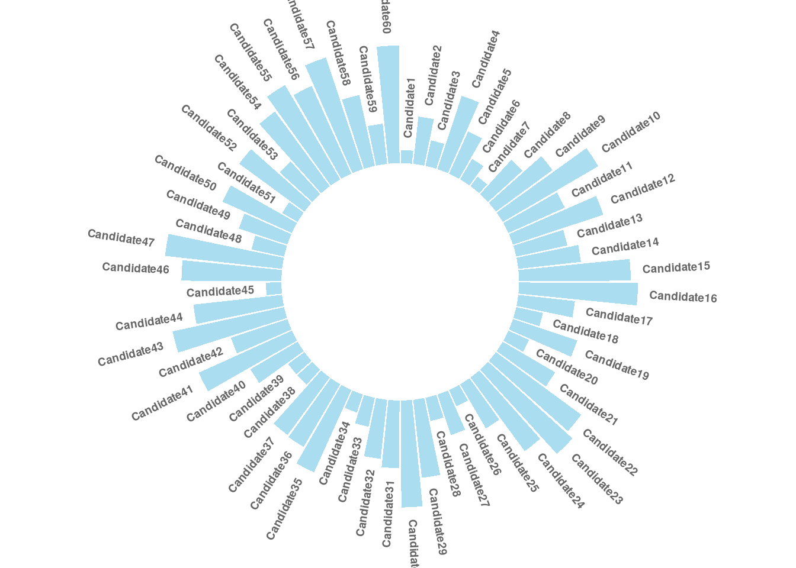
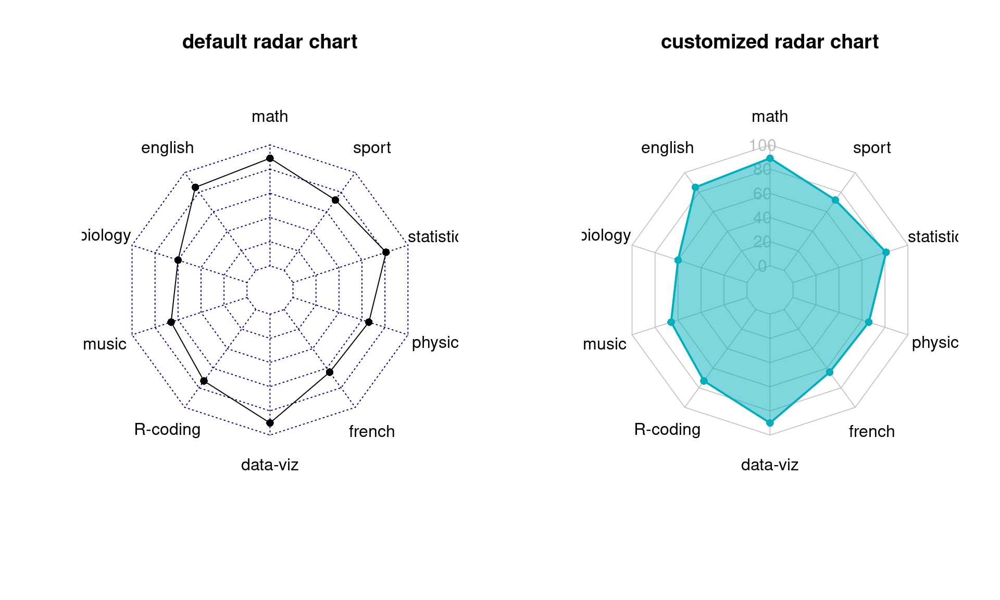
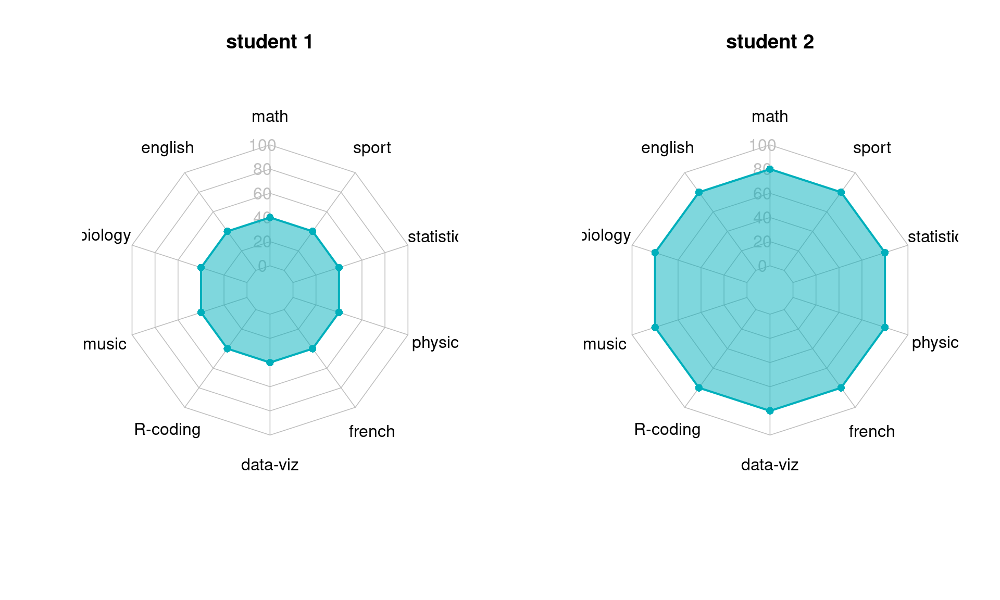
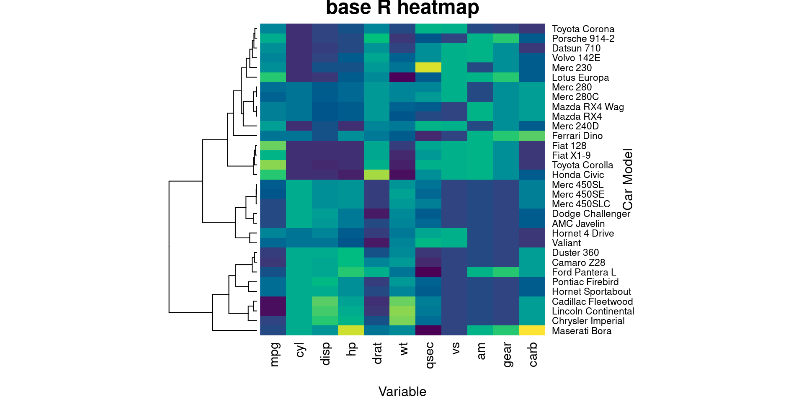

#Data visualization for ranking in R

Jingyuan Chen and Ling Sun


This tutorial is aimed to help people get a good start with ranking analysis by making use of data visualization tools. By making this tutorial, we hope beginner students can learn how to use some interesting and visually appealing plots other than the conventional bar chart when showing ranking data. We reorganize and simplify existing reference materials, and we add our tips and discussions with the hope of providing a specialized tutorial on ranking visualization. We choose to introduce lollipop charts, circular bar charts, word clouds, radar charts, and heat maps in this discussion.


```r
library(tidyverse)
library(ggplot2)
library(wordcloud2)
library(fmsb)
library(heatmaply)
```

### **Lollipop Charts**

The lollipop chart is a hybrid form chart between a bar chart and a Cleveland dot plot. A lollipop chart typically contains categorical variables on the y-axis measured against a second (continuous) variable on the x-axis. Similar to the Cleveland dot plot, the emphasis is on the dot to draw the readers attention to the specific x-axis value achieved by each category. The line is meant to be a minimalistic approach to easily tie each category to its relative point without drawing too much attention to the line itself. A lollipop chart is great for comparing multiple categories as it aids the reader in aligning categories to points but minimizes the amount of ink on the graphic.

#### **Tutorial - ggplot2**

**Input data:**

A data frame which contains a categorical variable and a continuous variable.

**Library:**

This tutorial focuses on build lollipop chart with the `ggolot2` library, which can be easily used as a substitute of the conventional bar chart.


```r
#Create a data frame as an example
name = letters[1:10]
score = c(40,90,37,39,35,22,28,29,34,21)
df = data.frame(name, score)

ggplot(data=df, aes(x = name, y = score, color=name))+
  geom_point(size=5)+
  theme_bw()+
  labs(title = "Lollipop Chart", x = "Name", y = "score")+
  geom_segment(aes(x=name,xend=name,y=0,yend=score), size = 2)
```


### **Circular Bar plots**

Circular barplot is a variation of the conventional bar chart. As the name suggests, Circular barplot is visually appealing, but it must also be used with extra care because circular barplot uses polar rather than Cartesian coordinates, which means each category does not share the same Y-axis. Circular bar charts are great choice for ranking periodic data.

#### **Tutorial - ggplot2**

**Input data:**

A data frame which contains a categorical variable and a continuous variable.


**Library:**

This tutorial focuses on build a circular barplot with the `ggolot2` and 'tidyverse' library, which can be easily used as a substitute of the conventional bar chart.


```r
# Create a data frame as an example
data = data.frame(id=seq(1,60), 
                  individual=paste( "Candidate", seq(1,60), sep=""),
                  value=sample( seq(10,100), 60, replace=T))

# Then we get the name and the y position of each label
label_data = data
 
# calculate the ANGLE of each labels
number_of_bar = nrow(label_data)
angle =  90 - 360 * (label_data$id-0.5) /number_of_bar     
# Here, we substract 0.5 because the letter must have the angle of the center of the bars so that we can avoid extreme right(1) or extreme left (0).
 
# calculate the alignment of labels: right or left
# If I am on the left part of the plot, my labels have currently an angle < -90
label_data$hjust = ifelse( angle < -90, 1, 0)
 
# flip angle BY to make them readable
label_data$angle = ifelse(angle < -90, angle+180, angle)
 
 
# Start the plot
plot = ggplot(data, aes(x=as.factor(id), y=value)) +
  
  # This add the bars with a blue color
  geom_bar(stat="identity", fill=alpha("skyblue", 0.7)) +
  
  # Limits of the plot = very important. The negative value controls the size of the inner circle, the positive one is useful to add size over each bar
  ylim(-100,120) +
  
  # Custom the theme: no axis title and no cartesian grid, Adjust the margin to make in sort labels are not truncated!
  theme_minimal() +
  theme(
    axis.text = element_blank(),
    axis.title = element_blank(),
    panel.grid = element_blank(),
    plot.margin = unit(rep(-1,4), "cm")) +
  
  # This makes the coordinate polar instead of cartesian.
  coord_polar(start = 0) +

geom_text(data=label_data, aes(x=id, y=value+10, label=individual, hjust=hjust), color="black", fontface="bold",alpha=0.6, size=2.5, angle= label_data$angle, inherit.aes = FALSE ) 

plot
```



### **Word cloud**

Word cloud is an visualization technique that shows frequent words in a text by letting the size of the words represents their frequency.

#### **Tutorial - Wordcloud2**

**Input data:**

A data frame including word and frequency in each column, which can be obtained through text mining via script function.


**Library:**

This tutorial focuses on build Word Cloud with the `Wordcloud2` library, which is more convenient than the other options.

**Options:**

| Parameters | Explanation |
|:------:|:---------------------|
|  data  |  A data frame including word and freq in each column |
|  size  | Font size, default is 1. The larger size means the bigger word. |
|  fontFamily  |  Font to use |
|  fontWeight  |  Font weight to use, e.g. normal, bold or 600 |  color       |  color of the text, keyword ‘random-dark’ and ‘random-light’ can be used. Regular color vector is also supported in this parameter.
| minSize      |  A character string of the subtitle backgroundColor Color of the background.
| gridSize     |  Size of the grid in pixels for marking the availability of the canvas the larger the grid size, the bigger the gap between words.
| minRotation  |  If the word should rotate, the minimum rotation (in rad) the text should rotate.
| maxRotation  |  If the word should rotate, the maximum rotation (in rad) the text should rotate. Set the two value equal to keep all text in one angle.
| rotateRatio  |  Probability for the word to rotate. Set the number to 1 to always rotate.
| shape        |  The shape of the “cloud” to draw. Can be a keyword present. Available presents are ‘circle’ (default), ‘cardioid’ (apple or heart shape curve, the most known polar equation), ‘diamond’ (alias of square), ‘triangle-forward’, ‘triangle’, ‘pentagon’, and ‘star’.
| ellipticity  | degree of “flatness” of the shape wordcloud2.js should draw.
| figPath      | A fig used for the wordcloud.
| widgetsize   | size of the widgets
|


#### **Example and Tips**

```r
#demoFreq is a data frame whose first column is word and second column shows the corresponding frequency.
head(demoFreq)
```

```
##          word freq
## oil       oil   85
## said     said   73
## prices prices   48
## opec     opec   42
## mln       mln   31
## the       the   26
```

```r
wordcloud2(data = demoFreq, 
           size = 2, 
           color = "random-light", 
           backgroundColor = "grey", 
           fontFamily = "Arial", 
           fontWeight = 'normal',
           minRotation = -pi/6, 
           maxRotation = -pi/6,
           minSize = 10,
           rotateRatio = 0.5,
           shape = "diamond")
```

```{=html}
<div id="htmlwidget-3ec0f3f6291c77b1468e" style="width:672px;height:480px;" class="wordcloud2 html-widget"></div>
<script type="application/json" data-for="htmlwidget-3ec0f3f6291c77b1468e">{"x":{"word":["oil","said","prices","opec","mln","the","last","bpd","dlrs","crude","market","reuter","saudi","will","one","barrel","kuwait","new","official","pct","price","barrels","government","production","sheikh","industry","meeting","minister","world","also","billion","futures","month","output","petroleum","quota","sources","accord","analysts","but","group","gulf","january","markets","report","today","december","demand","economic","economy","energy","help","international","may","nazer","nymex","posted","present","they","traders","158","ability","agreement","ali","april","arabia","budget","emergency","exchange","hold","imports","members","recent","riyals","says","sell","years","abdulaziz","agency","arab","ceiling","company","contract","daily","emirates","expected","expenditure","exports","growth","now","opecs","plans","qatar","quoted","research","reserve","reserves","states","study","united","way","week","west","year","150","according","added","among","asked","brings","buyers","can","change","corp","cut","day","development","effective","exploration","fall","february","fell","free","higher","increase","levels","meet","must","never","per","policy","power","problem","producing","protect","pumping","reduced","revenue","revenues","rise","saying","set","since","spa","strategic","texas","this","total","transaction","weak","yesterday","13nation","1985","198586","1986","1987","198788","address","agreed","alkhalifa","alqabas","alsabah","announced","appears","arabian","arabias","around","average","back","bank","bbl","boost","called","commitment","companies","compared","countrys","current","decrease","denied","dollars","domestic","due","efp","estimate","estimates","export","fixed","foreign","four","future","grade","guard","high","hisham","however","inc","indonesia","indonesias","intermediate","kingdoms","kuwaits","local","low","lower","lowered","made","main","march","mckiernan","measures","mizrahi","moves","much","named","next","officials","plant","position","president","pressure","producer","projected","published","real","refinery","reiterated","remain","rule","say","sector","several","sharp","ship","six","slightly","smaller","spokeswoman","state","sweet","texaco","three","trading","two","weeks","york","1518","198687","20s","285000","500","725","750","948000","activity","adhering","agriculture","along","apparently","appeared","approved","architect","areas","aspen","bankers","based","benchmark","benefits","canada","canadian","cash","changed","changes","circumstance","clearly","closed","coast","come","committee","commodity","consumption","countries","country","crossroads","crucial","cubic","currently","customers","deal","decembers","decline","deficit","deposits","deputy","diamond","differentials","difficulties","direction","discounted","dlr","early","ecuador","effect","embargo","embassy","entering","even","falling","feb","first","fiscal","fiscales","forced","fully","gcc","general","given","grades","halt","hit","hope","humanistic","impact","import","increased","increasing","instead","institute","interview","investment","jersey","june","keep","late","light","limit","limits","line","lost","louisiana","lowest","major","marketing","member","mid","million","ministers","mitigate","months","nearing","net","neutral","none","nuclear","organisation","organization","outlook","overseas","pact","pay","petroliferos","planned","port","positive","postings","predicted","press","pricing","private","probably","problems","pronounced","protected","public","put","quotes","raise","rate","reduction","referring","remarks","reports","return","review","risks","riyal","selfimposed","selling","share","shortfall","spot","steady","stick","strongly","studies","support","take","taken","techniques","throughput","trade","trust","trying","uncertainty","union","value","wam","wanted","weakness","winter","yacimientos","yanbu","zero","zone","100000","108","111","115","12217","1232","1381","13member","156","1600","1635","1650","1667","168","1685","1752","180000","200000","200foot","2226","24hour","2766","300","3749598","3750003","4133","534","5472","614","658","6745","678","718","738","able","abroad","accept","across","add","addressed","adherence","advantage","advisers","after","agricultural","aground","allocated","allocations","allow","almost","already","althani","although","alvite","amidst","analysis","analyst","annual","anything","apparent","aramco","argentine","arrangement","asia","asian","assesses","assign","assigned","associates","attract","available","averaging","aware","bahrain","bahrains","balance","baseless","basic","basis","because","beginning","bijan","bin","bit","bodys","briefly","broadened","brothers","buildings","burden","buy","buyer","calendar","cambridge","capacity","capozza","carrying","center","century","cera","certain","cftc","chairman","challenge","characterized","charging","cheap","cheating","chevron","chv","cited","citing","clever","close","closer","closes","coming","commission","communications","companys","completed","complex","condition","conditions","considered","construction","contacts","continuation","continue","continued","continues","contracted","contributed","control","cooperation","coordination","copany","corps","council","counter","coupled","covered","creek","critical","cts","currency","custom","cuts","cutting","cypriot","daniel","david","days","debtburdened","debut","decided","declared","declines","deemed","defence","delaware","delivered","delivering","departments","deregulate","deregulation","determination","devalue","device","differential","difficulty","dillard","director","discuss","discussing","distribution","distributions","divided","doha","dollar","drawbacks","drop","dropped","earlier","earnings","eastern","easy","ecuadors","editor","edmontonswann","education","eight","either","elaborate","elections","electricity","end","engineers","entitlements","environment","equally","estimated","european","exceed","exceeding","excess","excesses","excessive","exerted","exist","expanded","expansion","expartners","expectations","expects","explained","exporting","exxon","face","faced","faces","facilities","facing","failed","fallen","favours","fee","fernando","figure","figures","finance","firmer","floating","followed","for","forces","foremost","fourth","frank","full","fundamentals","gas","generally","geneva","get","globalization","glut","guaranteed","halting","harvard","heads","health","hedge","hedged","helped","hemisphere","highly","hills","hitting","hoped","housing","houston","immediately","implementation","improve","improvement","include","including","independent","indications","initiate","initiative","institutions","interbank","interest","investments","issue","jamaica","jan","juaymah","jubail","jump","just","khalifa","lack","largest","later","latest","launched","lead","leading","learn","least","lending","less","lesson","level","liberalised","lift","liftings","like","lines","liquidity","little","loan","lodged","longterm","ltd","lukman","lull","maintain","make","manager","manipulate","many","marathon","marathons","marker","mcfadden","means","mercantile","metrers","metres","mid1960s","mid1986","mideast","minus","mlotok","mob","mobil","momentum","money","monopolies","monthend","moussavarrahmani","movement","nation","natural","need","needs","negative","negotiate","neither","network","news","newspaper","nigerian","nine","nonoil","northern","notes","offset","onetwelfth","oneweek","open","opens","operations","opposite","optimism","optimistic","option","order","organiaation","our","outlining","outside","overproducing","part","parties","partly","party","past","paths","paul","paulsboro","payments","pegged","performance","period","pertains","pessimistic","philadelphia","physical","placed","plastics","platinum","point","policies","political","population","positions","postponed","pressures","previous","primarily","primary","principal","procedure","produce","produced","producers","product","products","program","projection","projects","prompted","proposed","proved","providing","provision","publish","purposes","quarter","quiet","quietly","quotas","rallied","ran","ranging","ras","rates","rationalise","readdress","reaffirmed","reasonable","recommending","recovering","recurrent","reference","refineries","refining","reflect","refloat","reform","reforms","regain","regard","regarding","region","regional","reiterate","relaxation","relieve","reluctant","remainder","remained","reported","request","resistance","resisting","resources","respectively","responsibilites","restored","restraint","restrictions","result","reuters","revealed","reviews","right","rilwanu","rising","river","rocks","rosemary","rumour","rushing","sales","salomon","santos","satisfied","saw","scheduled","scheme","seapride","season","secretary","security","seeing","seek","september","series","serve","services","session","sets","seven","severely","shamrock","sharply","shoulder","show","showed","shown","signed","signs","situation","sixmonth","slackens","slide","slump","social","sold","soon","sort","sour","south","southeast","spend","spill","spoke","spokesman","spotnext","spriggs","stabilise","stabilize","stable","start","statement","steel","steering","steps","stiff","storage","strong","subsequently","substitution","succeed","suffer","suffering","suhartos","sunday","sundays","supply","supporting","suppose","surrounding","swift","talks","tanker","tanurah","tapers","teach","telephone","terminals","test","there","third","thomas","though","thought","threemonth","tide","together","told","totalled","tower","trader","trades","traditional","traditionally","transacted","transmission","transport","trends","trusts","try","turmoil","twofold","uae","uncertain","unchanged","under","unions","unitholders","universitys","unlikely","unocal","unusually","urged","use","virtual","wants","water","wealth","wednesday","weekend","welcomed","when","whether","wishes","worldwide","xon","yergin","yesterdays"],"freq":[85,73,48,42,31,26,24,23,23,21,20,20,18,18,17,15,14,14,14,14,13,11,11,11,11,10,10,10,10,9,9,9,9,9,9,9,9,8,8,8,8,8,8,8,8,8,7,7,7,7,7,7,7,7,7,7,7,7,7,7,6,6,6,6,6,6,6,6,6,6,6,6,6,6,6,6,6,5,5,5,5,5,5,5,5,5,5,5,5,5,5,5,5,5,5,5,5,5,5,5,5,5,5,5,4,4,4,4,4,4,4,4,4,4,4,4,4,4,4,4,4,4,4,4,4,4,4,4,4,4,4,4,4,4,4,4,4,4,4,4,4,4,4,4,4,4,4,4,4,4,4,3,3,3,3,3,3,3,3,3,3,3,3,3,3,3,3,3,3,3,3,3,3,3,3,3,3,3,3,3,3,3,3,3,3,3,3,3,3,3,3,3,3,3,3,3,3,3,3,3,3,3,3,3,3,3,3,3,3,3,3,3,3,3,3,3,3,3,3,3,3,3,3,3,3,3,3,3,3,3,3,3,3,3,3,3,3,3,3,3,3,3,3,3,3,3,2,2,2,2,2,2,2,2,2,2,2,2,2,2,2,2,2,2,2,2,2,2,2,2,2,2,2,2,2,2,2,2,2,2,2,2,2,2,2,2,2,2,2,2,2,2,2,2,2,2,2,2,2,2,2,2,2,2,2,2,2,2,2,2,2,2,2,2,2,2,2,2,2,2,2,2,2,2,2,2,2,2,2,2,2,2,2,2,2,2,2,2,2,2,2,2,2,2,2,2,2,2,2,2,2,2,2,2,2,2,2,2,2,2,2,2,2,2,2,2,2,2,2,2,2,2,2,2,2,2,2,2,2,2,2,2,2,2,2,2,2,2,2,2,2,2,2,2,2,2,2,2,2,2,2,2,2,2,2,2,2,2,2,2,2,2,2,2,1,1,1,1,1,1,1,1,1,1,1,1,1,1,1,1,1,1,1,1,1,1,1,1,1,1,1,1,1,1,1,1,1,1,1,1,1,1,1,1,1,1,1,1,1,1,1,1,1,1,1,1,1,1,1,1,1,1,1,1,1,1,1,1,1,1,1,1,1,1,1,1,1,1,1,1,1,1,1,1,1,1,1,1,1,1,1,1,1,1,1,1,1,1,1,1,1,1,1,1,1,1,1,1,1,1,1,1,1,1,1,1,1,1,1,1,1,1,1,1,1,1,1,1,1,1,1,1,1,1,1,1,1,1,1,1,1,1,1,1,1,1,1,1,1,1,1,1,1,1,1,1,1,1,1,1,1,1,1,1,1,1,1,1,1,1,1,1,1,1,1,1,1,1,1,1,1,1,1,1,1,1,1,1,1,1,1,1,1,1,1,1,1,1,1,1,1,1,1,1,1,1,1,1,1,1,1,1,1,1,1,1,1,1,1,1,1,1,1,1,1,1,1,1,1,1,1,1,1,1,1,1,1,1,1,1,1,1,1,1,1,1,1,1,1,1,1,1,1,1,1,1,1,1,1,1,1,1,1,1,1,1,1,1,1,1,1,1,1,1,1,1,1,1,1,1,1,1,1,1,1,1,1,1,1,1,1,1,1,1,1,1,1,1,1,1,1,1,1,1,1,1,1,1,1,1,1,1,1,1,1,1,1,1,1,1,1,1,1,1,1,1,1,1,1,1,1,1,1,1,1,1,1,1,1,1,1,1,1,1,1,1,1,1,1,1,1,1,1,1,1,1,1,1,1,1,1,1,1,1,1,1,1,1,1,1,1,1,1,1,1,1,1,1,1,1,1,1,1,1,1,1,1,1,1,1,1,1,1,1,1,1,1,1,1,1,1,1,1,1,1,1,1,1,1,1,1,1,1,1,1,1,1,1,1,1,1,1,1,1,1,1,1,1,1,1,1,1,1,1,1,1,1,1,1,1,1,1,1,1,1,1,1,1,1,1,1,1,1,1,1,1,1,1,1,1,1,1,1,1,1,1,1,1,1,1,1,1,1,1,1,1,1,1,1,1,1,1,1,1,1,1,1,1,1,1,1,1,1,1,1,1,1,1,1,1,1,1,1,1,1,1,1,1,1,1,1,1,1,1,1,1,1,1,1,1,1,1,1,1,1,1,1,1,1,1,1,1,1,1,1,1,1,1,1,1,1,1,1,1,1,1,1,1,1,1,1,1,1,1,1,1,1,1,1,1,1,1,1,1,1,1,1,1,1,1,1,1,1,1,1,1,1,1,1,1,1,1,1,1,1,1,1,1,1,1,1,1,1,1,1,1,1,1,1,1,1],"fontFamily":"Arial","fontWeight":"normal","color":"random-light","minSize":10,"weightFactor":4.23529411764706,"backgroundColor":"grey","gridSize":0,"minRotation":-0.523598775598299,"maxRotation":-0.523598775598299,"shuffle":true,"rotateRatio":0.5,"shape":"diamond","ellipticity":0.65,"figBase64":null,"hover":null},"evals":[],"jsHooks":{"render":[{"code":"function(el,x){\n                        console.log(123);\n                        if(!iii){\n                          window.location.reload();\n                          iii = False;\n\n                        }\n  }","data":null}]}}</script>
```

**Tips:**
The syntax of Wordcloud2 is not complicated, but it takes a lot of work to create an aesthetically pleasing word cloud with suitable color, font, shape, and other details.

### **Radar Charts**

As we approach to complex ranking tasks, it is more frequently that our rankings are expected to reflect performances from multiple dimensions together. It is not an easy job because there is no ground truth about what weight should be put on each dimension. Radar charts are such a tool that can provide an overview of performances and help us get start with all experiments for producing an ideal ranking. In this section, you will see how we visualize and compare two students' academic performances with radar charts.

#### **Tutorial - fmsb**

**Input data:**

Each row represents an entity. Each column is a quantitative variable. Note that the first 2 rows should provide the minimum and the maximum values that are allowed for each variable.

**Library:**

In this section, we will be using the `fmsb` library to build radar charts.

**Options:**

| Category | Parameters |
|:------:|:---------------------|
|  Variable options  |  `vlabels` variable labels; `vlcex` font sizes of variable labels  |
|  Polygon options  | `pcol` line color; `pfcol` fill color; `plwd` line width; <br> `plty` line types from “solid”, “dashed”, “dotted”, “dotdash”, “longdash”, “twodash” and “blank” or 0 ~ 6 |
|  Grid options  |  `cglcol` line color; `cglty` line type; `cglwd` line width  |
|  Axis options  |  `axislabcol` color of axis label and numbers; `caxislabels` labels on the center axis |


```r
#create data - student scores
data <- as.data.frame(matrix( c(89,85,60,66,73,90,64,66,81,72) , ncol=10))
colnames(data) <- c("math" , "english" , "biology" , "music" , "R-coding", "data-viz" , "french" , "physic", "statistic", "sport" )
 
#add the max and min of each variable
data <- rbind(rep(100,10) , rep(0,10) , data)

#parameters for arranging two plots side by side
par(mfrow = c(1, 2))

#default radar chart 
radarchart(data, seg = 5, title = 'default radar chart')

#helper function to produce a customized radar chart
customize_radarchart <- function(data, color = "#00AFBB", 
                                        vlabels = colnames(data), vlcex = 1,
                                        caxislabels = NULL, title = NULL, ...){
  radarchart(
    data, axistype = 1, seg = length(caxislabels)-1,
    # Customize the polygon
    pcol = color, pfcol = scales::alpha(color, 0.5), plwd = 2, plty = 1,
    # Customize the grid
    cglcol = "grey", cglty = 1, cglwd = 0.8,
    # Customize the axis
    axislabcol = "grey", 
    # Variable labels
    vlcex = vlcex, vlabels = vlabels,
    caxislabels = caxislabels, title = title, ...
  )
}

#customized radar chart 
customize_radarchart(data, caxislabels = c(0, 20, 40, 60, 80, 100), title = 'customized radar chart')
```



#### **Tips for Users**

Radar charts are good for comparing the overall performances between multi-dimensional objects, but its circular layout makes it harder to read values exactly. For example, it is not obvious on which subject, math or data-viz, the student achieved the best score. A single vertical or horizontal axis is still the most efficient way to compare quantitative values. One solution could be supplementing radar charts with single axis plots, such as lollipop plots.

Furthermore, radar charts can be misleading. Readers may feel that they are led to focus on the highlighted polygon. However, its shape highly depends on the ordering of categories around the plot. By changing the category ordering, we can produce very different plots. 

Comparing areas also gives rise to more over-evaluation of differences, because the area of a ploygon increases quadratically as its edges increase. In another example, one student scored 40 in every subject and another student scored of 80 in each, but the polygon on the right looks four times as large as the left one.


```r
#create data - student scores
data <- as.data.frame(matrix( c(40,40,40,40,40,40,40,40,40,40) , ncol=10))
colnames(data) <- c("math" , "english" , "biology" , "music" , "R-coding", "data-viz" , "french" , "physic", "statistic", "sport" )
 
#add the max and min of each variable
data <- rbind(rep(100,10) , rep(0,10) , data)

#parameters for arranging two plots side by side
par(mfrow = c(1, 2))

#default radar chart
customize_radarchart(data, caxislabels = c(0, 20, 40, 60, 80, 100), title = 'student 1')

#create data - student scores
data <- as.data.frame(matrix( c(80,80,80,80,80,80,80,80,80,80) , ncol=10))
colnames(data) <- c("math" , "english" , "biology" , "music" , "R-coding", "data-viz" , "french" , "physic", "statistic", "sport" )
 
#add the max and min of each variable
data <- rbind(rep(100,10) , rep(0,10) , data)

#reordered catogories
customize_radarchart(data, caxislabels = c(0, 20, 40, 60, 80, 100), title = 'student 2')
```



### **Heat Maps**

Rankings are a systematic approach to represent datasets. To take another step closer to this goal, heat map can provide you inspirations. To name a few, heat maps could be useful to detect possible outliers that can mess up our rankings. Clustering analysis based on heat map visualizations are also helpful for ranking adjustment where we move up or move down certain groups of entities to achieve better ranking evaluation results. This section will show you how to perform heat map visualizations to help you boost ranking performances.

#### **Tutorial - heatmap()**

**Input data:**

Heatmaps work best with continuous data. Each row represents an entity. Each column is a continuous-valued attribution.

**Library:**

We would like to introduce base R `heatmap()` here because it is a handy tool that has simple syntax but supports very useful features for such as hierarchical clustering trees and customized representations, which can be of help in ranking adjustment.

**Options:**

| Category | Parameters |
|:------:|:---------------------|
|  Normalization options  |  `scale` axis along which normalization will be performed, "row", "column" or "none"  |
|  Clustering options  | `Colv`, `Rowv` NA if clustering over columns/ rows will not be performed; `RowSideColors`, `ColSideColors` vectors of colors to represent clustering structures beside heat maps |
|  Layout options  |  `labRow`, `colRow` label names for rows and columns; `cexRow` , `cexCol` label sizes  |


```r
#import data
cars_data <- as.matrix(mtcars)

#one-line code for producing heatmap
heatmap(cars_data, scale = "column", col = hcl.colors(50), Colv = NA, xlab="Variable", ylab="Car Model", main="base R heatmap", margin = c(5,7)) 
```



#### **Interactive Heat Maps**

**Library:**

In this section, we will show how to use `heatmaply`, an interactive clustering heat map library built upon `plotly`. We provide a short piece of example code here. Users are free to explore it beyond this tutorial.

**Options:**

| Category | Parameters |
|:------:|:---------------------|
|  Normalization options  |  `scale` axis along which normalization will be performed, "row", "column" or "none"  |
|  Clustering options  | `dendrogram` axis along which clustering will be performed, "row", "column", "none" or "both"; `hide_colorbar` to show representation of clustering structures beside heat maps or not |
|  Layout options  |  `labRow`, `labCol` label names for rows and columns; `label_names` label names on interactive cells  |


```r
##import data
cars_data <- as.matrix(mtcars)

heatmaply(cars_data, 
        dendrogram = "row",
        scale = "column",
        xlab = "Feature", ylab = "Car Model", 
        main = "Interactive heatmap",
        margins = c(60,100,40,20),
        grid_color = "white",
        grid_width = 0.00001,
        titleX = FALSE,
        hide_colorbar = TRUE,
        branches_lwd = 0.1,
        label_names = c("Car Model", "Feature", "Value"),
        fontsize_row = 5, fontsize_col = 5,
        labCol = colnames(cars_data),
        labRow = rownames(cars_data),
        heatmap_layers = theme(axis.line=element_blank())
        )
```

```{=html}
<div id="htmlwidget-58cca8f20b729831248d" style="width:672px;height:480px;" class="plotly html-widget"></div>
<script type="application/json" data-for="htmlwidget-58cca8f20b729831248d">{"x":{"data":[{"x":[1,2,3,4,5,6,7,8,9,10,11],"y":[1,2,3,4,5,6,7,8,9,10,11,12,13,14,15,16,17,18,19,20,21,22,23,24,25,26,27,28,29,30,31,32],"z":[[0.30354265094316,0.34784337088544,0.359409326740975,0.248932287419184,0.0608379022312319,0.417270059430923,0.629412918552319,0.587933558550041,0.20840197765358,0.185263287608251,0.147838084995014],[0.411205748909262,0.34784337088544,0.411764235325979,0.263271701494615,0.178519199221469,0.368034993504378,0.543583884204276,0.587933558550041,0.20840197765358,0.185263287608251,0.147838084995014],[0.414468267029447,0.127643036083827,0.192984177935918,0.225989224898495,0.406526712140052,0.21731540393332,0.606305101612462,0.587933558550041,0.20840197765358,0.185263287608251,0.147838084995014],[0.456881002591851,0.127643036083827,0.225824984230147,0.220253459268322,0.48743260382084,0.354972629074886,0.924312677594315,0.587933558550041,0.20840197765358,0.451770727120745,0.269575501424298],[0.509081292514809,0.127643036083827,0.235185407280193,0.125613326370477,0.402849171609107,0.363011007185342,0.60520472937723,0.587933558550041,0.20840197765358,0.451770727120745,0.269575501424298],[0.293755096582605,0.34784337088544,0.268343516050696,0.300554178090736,0.48743260382084,0.413250870375695,0.484163783501784,0.587933558550041,0.20840197765358,0.451770727120745,0.513050334282865],[0.339430350265194,0.34784337088544,0.268343516050696,0.300554178090736,0.48743260382084,0.413250870375695,0.418141449387905,0.587933558550041,0.20840197765358,0.451770727120745,0.513050334282865],[0.411205748909262,0.127643036083827,0.194412039079145,0.260403818679529,0.557305873908793,0.280617631553164,0.451152616444845,0.587933558550041,0.602457792101606,0.451770727120745,0.269575501424298],[0.456881002591851,0.127643036083827,0.173787378121416,0.21451769363815,0.461689820104225,0.188176283282915,0.452252988680076,0.587933558550041,0.602457792101606,0.451770727120745,0.147838084995014],[0.603694318000172,0.127643036083827,0.127778519061867,0.137084857630822,0.546273252315958,0.110806893969772,0.484163783501784,0.587933558550041,0.602457792101606,0.451770727120745,0.147838084995014],[0.770082742129602,0.127643036083827,0.127302565347458,0.137084857630822,0.546273252315958,0.164061148951546,0.54688500090997,0.587933558550041,0.602457792101606,0.451770727120745,0.147838084995014],[0.819020513932376,0.127643036083827,0.115245071249094,0.134216974815736,0.597758819749186,0.090710948693631,0.594201007024917,0.587933558550041,0.602457792101606,0.451770727120745,0.147838084995014],[0.704832379725904,0.127643036083827,0.122543028203367,0.096934498219615,0.858864197446274,0.0464998690861207,0.442349638562994,0.587933558550041,0.602457792101606,0.451770727120745,0.269575501424298],[0.704832379725904,0.127643036083827,0.153321368401824,0.271875349939874,0.432269495856666,0.0260020049044568,0.264089336455518,0.587933558550041,0.602457792101606,0.71827816663324,0.269575501424298],[0.561281582437768,0.127643036083827,0.19330148041219,0.208781928007977,0.674987170899029,0.152003581785861,0.242081891750892,0.197806614057685,0.602457792101606,0.71827816663324,0.269575501424298],[0.398155676428522,0.34784337088544,0.256286021952331,0.263271701494615,0.48007752275895,0.299708779565498,0.277293803278295,0.197806614057685,0.602457792101606,0.451770727120745,0.513050334282865],[0.398155676428522,0.34784337088544,0.256286021952331,0.263271701494615,0.48007752275895,0.248464119111338,0.21567295810534,0.197806614057685,0.602457792101606,0.451770727120745,0.513050334282865],[0.355742940866118,0.34784337088544,0.232488336231875,0.449684084475219,0.377106387892493,0.27860803702555,0.110037223523133,0.197806614057685,0.602457792101606,0.71827816663324,0.756525167141433],[0.202404589217428,0.568043705687052,0.47998426772462,0.908545334889013,0.347686063644934,0.439375599234678,0.0110037223523133,0.197806614057685,0.602457792101606,0.71827816663324,1],[0.228504734178907,0.568043705687052,0.559309886792808,0.704925655017892,0.597758819749186,0.358991818130114,0,0.197806614057685,0.602457792101606,0.71827816663324,0.513050334282865],[0.146941781174284,0.568043705687052,0.557723374411444,0.650435881531254,0.417559333732887,0.493634651480259,0.100133873406051,0.197806614057685,0.20840197765358,0.185263287608251,0.513050334282865],[0.179566962376133,0.568043705687052,0.573588498225081,0.650435881531254,0.226327226123752,0.439375599234678,0.147449879520998,0.197806614057685,0.20840197765358,0.185263287608251,0.513050334282865],[0.248079842900016,0.568043705687052,0.440004155714254,0.46402349855065,0.174841658690524,0.539855325615384,0.319107948217085,0.197806614057685,0.20840197765358,0.185263287608251,0.391312917853581],[0.277442505981681,0.568043705687052,0.440004155714254,0.46402349855065,0.174841658690524,0.471529111676504,0.341115392921712,0.197806614057685,0.20840197765358,0.185263287608251,0.391312917853581],[0.208929625457797,0.568043705687052,0.440004155714254,0.46402349855065,0.174841658690524,0.481577084314575,0.385130282330965,0.197806614057685,0.20840197765358,0.185263287608251,0.391312917853581],[0.208929625457797,0.568043705687052,0.484743804868711,0.377987014098064,0.204261982938083,0.412246073111888,0.308104225864772,0.197806614057685,0.20840197765358,0.185263287608251,0.269575501424298],[0.218717179818352,0.568043705687052,0.506954978207804,0.377987014098064,0.0608379022312319,0.429327626596608,0.260788219749825,0.197806614057685,0.20840197765358,0.185263287608251,0.269575501424298],[0.323117759664269,0.568043705687052,0.573588498225081,0.449684084475219,0.204261982938083,0.413250870375695,0.277293803278295,0.197806614057685,0.20840197765358,0.185263287608251,0.269575501424298],[0.339430350265194,0.568043705687052,0.637048993479631,0.449684084475219,0.178519199221469,0.494639448744066,0.280594919983989,0.197806614057685,0.20840197765358,0.185263287608251,0.269575501424298],[0.192617034856873,0.568043705687052,0.700509488734181,0.607417639304961,0.233682307185642,0.796078627886182,0.321308692687548,0.197806614057685,0.20840197765358,0.185263287608251,0.513050334282865],[0.0523287556889218,0.568043705687052,0.732239736361456,0.564399397078668,0.149098874973909,0.811954424654334,0.365323582096801,0.197806614057685,0.20840197765358,0.185263287608251,0.513050334282865],[0.0523287556889218,0.568043705687052,0.751277884937821,0.535720568927806,0.123356091257295,0.776987479873848,0.382929537860502,0.197806614057685,0.20840197765358,0.185263287608251,0.513050334282865]],"text":[["Car Model: Valiant<br>Feature: mpg<br>Value: -0.33029","Car Model: Valiant<br>Feature: cyl<br>Value: -0.10499","Car Model: Valiant<br>Feature: disp<br>Value: -0.04617","Car Model: Valiant<br>Feature: hp<br>Value: -0.60802","Car Model: Valiant<br>Feature: drat<br>Value: -1.56461","Car Model: Valiant<br>Feature: wt<br>Value:  0.24809","Car Model: Valiant<br>Feature: qsec<br>Value:  1.32699","Car Model: Valiant<br>Feature: vs<br>Value:  1.11604","Car Model: Valiant<br>Feature: am<br>Value: -0.81414","Car Model: Valiant<br>Feature: gear<br>Value: -0.93182","Car Model: Valiant<br>Feature: carb<br>Value: -1.12215"],["Car Model: Hornet 4 Drive<br>Feature: mpg<br>Value:  0.21725","Car Model: Hornet 4 Drive<br>Feature: cyl<br>Value: -0.10499","Car Model: Hornet 4 Drive<br>Feature: disp<br>Value:  0.22009","Car Model: Hornet 4 Drive<br>Feature: hp<br>Value: -0.53509","Car Model: Hornet 4 Drive<br>Feature: drat<br>Value: -0.96612","Car Model: Hornet 4 Drive<br>Feature: wt<br>Value: -0.00230","Car Model: Hornet 4 Drive<br>Feature: qsec<br>Value:  0.89049","Car Model: Hornet 4 Drive<br>Feature: vs<br>Value:  1.11604","Car Model: Hornet 4 Drive<br>Feature: am<br>Value: -0.81414","Car Model: Hornet 4 Drive<br>Feature: gear<br>Value: -0.93182","Car Model: Hornet 4 Drive<br>Feature: carb<br>Value: -1.12215"],["Car Model: Toyota Corona<br>Feature: mpg<br>Value:  0.23385","Car Model: Toyota Corona<br>Feature: cyl<br>Value: -1.22486","Car Model: Toyota Corona<br>Feature: disp<br>Value: -0.89255","Car Model: Toyota Corona<br>Feature: hp<br>Value: -0.72470","Car Model: Toyota Corona<br>Feature: drat<br>Value:  0.19346","Car Model: Toyota Corona<br>Feature: wt<br>Value: -0.76881","Car Model: Toyota Corona<br>Feature: qsec<br>Value:  1.20947","Car Model: Toyota Corona<br>Feature: vs<br>Value:  1.11604","Car Model: Toyota Corona<br>Feature: am<br>Value: -0.81414","Car Model: Toyota Corona<br>Feature: gear<br>Value: -0.93182","Car Model: Toyota Corona<br>Feature: carb<br>Value: -1.12215"],["Car Model: Merc 230<br>Feature: mpg<br>Value:  0.44954","Car Model: Merc 230<br>Feature: cyl<br>Value: -1.22486","Car Model: Merc 230<br>Feature: disp<br>Value: -0.72554","Car Model: Merc 230<br>Feature: hp<br>Value: -0.75387","Car Model: Merc 230<br>Feature: drat<br>Value:  0.60492","Car Model: Merc 230<br>Feature: wt<br>Value: -0.06873","Car Model: Merc 230<br>Feature: qsec<br>Value:  2.82675","Car Model: Merc 230<br>Feature: vs<br>Value:  1.11604","Car Model: Merc 230<br>Feature: am<br>Value: -0.81414","Car Model: Merc 230<br>Feature: gear<br>Value:  0.42355","Car Model: Merc 230<br>Feature: carb<br>Value: -0.50303"],["Car Model: Merc 240D<br>Feature: mpg<br>Value:  0.71502","Car Model: Merc 240D<br>Feature: cyl<br>Value: -1.22486","Car Model: Merc 240D<br>Feature: disp<br>Value: -0.67793","Car Model: Merc 240D<br>Feature: hp<br>Value: -1.23518","Car Model: Merc 240D<br>Feature: drat<br>Value:  0.17475","Car Model: Merc 240D<br>Feature: wt<br>Value: -0.02785","Car Model: Merc 240D<br>Feature: qsec<br>Value:  1.20387","Car Model: Merc 240D<br>Feature: vs<br>Value:  1.11604","Car Model: Merc 240D<br>Feature: am<br>Value: -0.81414","Car Model: Merc 240D<br>Feature: gear<br>Value:  0.42355","Car Model: Merc 240D<br>Feature: carb<br>Value: -0.50303"],["Car Model: Merc 280C<br>Feature: mpg<br>Value: -0.38006","Car Model: Merc 280C<br>Feature: cyl<br>Value: -0.10499","Car Model: Merc 280C<br>Feature: disp<br>Value: -0.50930","Car Model: Merc 280C<br>Feature: hp<br>Value: -0.34549","Car Model: Merc 280C<br>Feature: drat<br>Value:  0.60492","Car Model: Merc 280C<br>Feature: wt<br>Value:  0.22765","Car Model: Merc 280C<br>Feature: qsec<br>Value:  0.58830","Car Model: Merc 280C<br>Feature: vs<br>Value:  1.11604","Car Model: Merc 280C<br>Feature: am<br>Value: -0.81414","Car Model: Merc 280C<br>Feature: gear<br>Value:  0.42355","Car Model: Merc 280C<br>Feature: carb<br>Value:  0.73520"],["Car Model: Merc 280<br>Feature: mpg<br>Value: -0.14777","Car Model: Merc 280<br>Feature: cyl<br>Value: -0.10499","Car Model: Merc 280<br>Feature: disp<br>Value: -0.50930","Car Model: Merc 280<br>Feature: hp<br>Value: -0.34549","Car Model: Merc 280<br>Feature: drat<br>Value:  0.60492","Car Model: Merc 280<br>Feature: wt<br>Value:  0.22765","Car Model: Merc 280<br>Feature: qsec<br>Value:  0.25253","Car Model: Merc 280<br>Feature: vs<br>Value:  1.11604","Car Model: Merc 280<br>Feature: am<br>Value: -0.81414","Car Model: Merc 280<br>Feature: gear<br>Value:  0.42355","Car Model: Merc 280<br>Feature: carb<br>Value:  0.73520"],["Car Model: Volvo 142E<br>Feature: mpg<br>Value:  0.21725","Car Model: Volvo 142E<br>Feature: cyl<br>Value: -1.22486","Car Model: Volvo 142E<br>Feature: disp<br>Value: -0.88529","Car Model: Volvo 142E<br>Feature: hp<br>Value: -0.54968","Car Model: Volvo 142E<br>Feature: drat<br>Value:  0.96027","Car Model: Volvo 142E<br>Feature: wt<br>Value: -0.44688","Car Model: Volvo 142E<br>Feature: qsec<br>Value:  0.42041","Car Model: Volvo 142E<br>Feature: vs<br>Value:  1.11604","Car Model: Volvo 142E<br>Feature: am<br>Value:  1.18990","Car Model: Volvo 142E<br>Feature: gear<br>Value:  0.42355","Car Model: Volvo 142E<br>Feature: carb<br>Value: -0.50303"],["Car Model: Datsun 710<br>Feature: mpg<br>Value:  0.44954","Car Model: Datsun 710<br>Feature: cyl<br>Value: -1.22486","Car Model: Datsun 710<br>Feature: disp<br>Value: -0.99018","Car Model: Datsun 710<br>Feature: hp<br>Value: -0.78304","Car Model: Datsun 710<br>Feature: drat<br>Value:  0.47400","Car Model: Datsun 710<br>Feature: wt<br>Value: -0.91700","Car Model: Datsun 710<br>Feature: qsec<br>Value:  0.42601","Car Model: Datsun 710<br>Feature: vs<br>Value:  1.11604","Car Model: Datsun 710<br>Feature: am<br>Value:  1.18990","Car Model: Datsun 710<br>Feature: gear<br>Value:  0.42355","Car Model: Datsun 710<br>Feature: carb<br>Value: -1.12215"],["Car Model: Fiat X1-9<br>Feature: mpg<br>Value:  1.19619","Car Model: Fiat X1-9<br>Feature: cyl<br>Value: -1.22486","Car Model: Fiat X1-9<br>Feature: disp<br>Value: -1.22417","Car Model: Fiat X1-9<br>Feature: hp<br>Value: -1.17684","Car Model: Fiat X1-9<br>Feature: drat<br>Value:  0.90416","Car Model: Fiat X1-9<br>Feature: wt<br>Value: -1.31048","Car Model: Fiat X1-9<br>Feature: qsec<br>Value:  0.58830","Car Model: Fiat X1-9<br>Feature: vs<br>Value:  1.11604","Car Model: Fiat X1-9<br>Feature: am<br>Value:  1.18990","Car Model: Fiat X1-9<br>Feature: gear<br>Value:  0.42355","Car Model: Fiat X1-9<br>Feature: carb<br>Value: -1.12215"],["Car Model: Fiat 128<br>Feature: mpg<br>Value:  2.04239","Car Model: Fiat 128<br>Feature: cyl<br>Value: -1.22486","Car Model: Fiat 128<br>Feature: disp<br>Value: -1.22659","Car Model: Fiat 128<br>Feature: hp<br>Value: -1.17684","Car Model: Fiat 128<br>Feature: drat<br>Value:  0.90416","Car Model: Fiat 128<br>Feature: wt<br>Value: -1.03965","Car Model: Fiat 128<br>Feature: qsec<br>Value:  0.90728","Car Model: Fiat 128<br>Feature: vs<br>Value:  1.11604","Car Model: Fiat 128<br>Feature: am<br>Value:  1.18990","Car Model: Fiat 128<br>Feature: gear<br>Value:  0.42355","Car Model: Fiat 128<br>Feature: carb<br>Value: -1.12215"],["Car Model: Toyota Corolla<br>Feature: mpg<br>Value:  2.29127","Car Model: Toyota Corolla<br>Feature: cyl<br>Value: -1.22486","Car Model: Toyota Corolla<br>Feature: disp<br>Value: -1.28791","Car Model: Toyota Corolla<br>Feature: hp<br>Value: -1.19142","Car Model: Toyota Corolla<br>Feature: drat<br>Value:  1.16600","Car Model: Toyota Corolla<br>Feature: wt<br>Value: -1.41268","Car Model: Toyota Corolla<br>Feature: qsec<br>Value:  1.14791","Car Model: Toyota Corolla<br>Feature: vs<br>Value:  1.11604","Car Model: Toyota Corolla<br>Feature: am<br>Value:  1.18990","Car Model: Toyota Corolla<br>Feature: gear<br>Value:  0.42355","Car Model: Toyota Corolla<br>Feature: carb<br>Value: -1.12215"],["Car Model: Honda Civic<br>Feature: mpg<br>Value:  1.71055","Car Model: Honda Civic<br>Feature: cyl<br>Value: -1.22486","Car Model: Honda Civic<br>Feature: disp<br>Value: -1.25079","Car Model: Honda Civic<br>Feature: hp<br>Value: -1.38103","Car Model: Honda Civic<br>Feature: drat<br>Value:  2.49390","Car Model: Honda Civic<br>Feature: wt<br>Value: -1.63753","Car Model: Honda Civic<br>Feature: qsec<br>Value:  0.37564","Car Model: Honda Civic<br>Feature: vs<br>Value:  1.11604","Car Model: Honda Civic<br>Feature: am<br>Value:  1.18990","Car Model: Honda Civic<br>Feature: gear<br>Value:  0.42355","Car Model: Honda Civic<br>Feature: carb<br>Value: -0.50303"],["Car Model: Lotus Europa<br>Feature: mpg<br>Value:  1.71055","Car Model: Lotus Europa<br>Feature: cyl<br>Value: -1.22486","Car Model: Lotus Europa<br>Feature: disp<br>Value: -1.09427","Car Model: Lotus Europa<br>Feature: hp<br>Value: -0.49134","Car Model: Lotus Europa<br>Feature: drat<br>Value:  0.32438","Car Model: Lotus Europa<br>Feature: wt<br>Value: -1.74177","Car Model: Lotus Europa<br>Feature: qsec<br>Value: -0.53093","Car Model: Lotus Europa<br>Feature: vs<br>Value:  1.11604","Car Model: Lotus Europa<br>Feature: am<br>Value:  1.18990","Car Model: Lotus Europa<br>Feature: gear<br>Value:  1.77893","Car Model: Lotus Europa<br>Feature: carb<br>Value: -0.50303"],["Car Model: Porsche 914-2<br>Feature: mpg<br>Value:  0.98049","Car Model: Porsche 914-2<br>Feature: cyl<br>Value: -1.22486","Car Model: Porsche 914-2<br>Feature: disp<br>Value: -0.89094","Car Model: Porsche 914-2<br>Feature: hp<br>Value: -0.81221","Car Model: Porsche 914-2<br>Feature: drat<br>Value:  1.55876","Car Model: Porsche 914-2<br>Feature: wt<br>Value: -1.10097","Car Model: Porsche 914-2<br>Feature: qsec<br>Value: -0.64286","Car Model: Porsche 914-2<br>Feature: vs<br>Value: -0.86803","Car Model: Porsche 914-2<br>Feature: am<br>Value:  1.18990","Car Model: Porsche 914-2<br>Feature: gear<br>Value:  1.77893","Car Model: Porsche 914-2<br>Feature: carb<br>Value: -0.50303"],["Car Model: Mazda RX4 Wag<br>Feature: mpg<br>Value:  0.15088","Car Model: Mazda RX4 Wag<br>Feature: cyl<br>Value: -0.10499","Car Model: Mazda RX4 Wag<br>Feature: disp<br>Value: -0.57062","Car Model: Mazda RX4 Wag<br>Feature: hp<br>Value: -0.53509","Car Model: Mazda RX4 Wag<br>Feature: drat<br>Value:  0.56751","Car Model: Mazda RX4 Wag<br>Feature: wt<br>Value: -0.34979","Car Model: Mazda RX4 Wag<br>Feature: qsec<br>Value: -0.46378","Car Model: Mazda RX4 Wag<br>Feature: vs<br>Value: -0.86803","Car Model: Mazda RX4 Wag<br>Feature: am<br>Value:  1.18990","Car Model: Mazda RX4 Wag<br>Feature: gear<br>Value:  0.42355","Car Model: Mazda RX4 Wag<br>Feature: carb<br>Value:  0.73520"],["Car Model: Mazda RX4<br>Feature: mpg<br>Value:  0.15088","Car Model: Mazda RX4<br>Feature: cyl<br>Value: -0.10499","Car Model: Mazda RX4<br>Feature: disp<br>Value: -0.57062","Car Model: Mazda RX4<br>Feature: hp<br>Value: -0.53509","Car Model: Mazda RX4<br>Feature: drat<br>Value:  0.56751","Car Model: Mazda RX4<br>Feature: wt<br>Value: -0.61040","Car Model: Mazda RX4<br>Feature: qsec<br>Value: -0.77717","Car Model: Mazda RX4<br>Feature: vs<br>Value: -0.86803","Car Model: Mazda RX4<br>Feature: am<br>Value:  1.18990","Car Model: Mazda RX4<br>Feature: gear<br>Value:  0.42355","Car Model: Mazda RX4<br>Feature: carb<br>Value:  0.73520"],["Car Model: Ferrari Dino<br>Feature: mpg<br>Value: -0.06481","Car Model: Ferrari Dino<br>Feature: cyl<br>Value: -0.10499","Car Model: Ferrari Dino<br>Feature: disp<br>Value: -0.69165","Car Model: Ferrari Dino<br>Feature: hp<br>Value:  0.41294","Car Model: Ferrari Dino<br>Feature: drat<br>Value:  0.04383","Car Model: Ferrari Dino<br>Feature: wt<br>Value: -0.45710","Car Model: Ferrari Dino<br>Feature: qsec<br>Value: -1.31440","Car Model: Ferrari Dino<br>Feature: vs<br>Value: -0.86803","Car Model: Ferrari Dino<br>Feature: am<br>Value:  1.18990","Car Model: Ferrari Dino<br>Feature: gear<br>Value:  1.77893","Car Model: Ferrari Dino<br>Feature: carb<br>Value:  1.97344"],["Car Model: Maserati Bora<br>Feature: mpg<br>Value: -0.84464","Car Model: Maserati Bora<br>Feature: cyl<br>Value:  1.01488","Car Model: Maserati Bora<br>Feature: disp<br>Value:  0.56704","Car Model: Maserati Bora<br>Feature: hp<br>Value:  2.74657","Car Model: Maserati Bora<br>Feature: drat<br>Value: -0.10579","Car Model: Maserati Bora<br>Feature: wt<br>Value:  0.36052","Car Model: Maserati Bora<br>Feature: qsec<br>Value: -1.81805","Car Model: Maserati Bora<br>Feature: vs<br>Value: -0.86803","Car Model: Maserati Bora<br>Feature: am<br>Value:  1.18990","Car Model: Maserati Bora<br>Feature: gear<br>Value:  1.77893","Car Model: Maserati Bora<br>Feature: carb<br>Value:  3.21168"],["Car Model: Ford Pantera L<br>Feature: mpg<br>Value: -0.71191","Car Model: Ford Pantera L<br>Feature: cyl<br>Value:  1.01488","Car Model: Ford Pantera L<br>Feature: disp<br>Value:  0.97046","Car Model: Ford Pantera L<br>Feature: hp<br>Value:  1.71102","Car Model: Ford Pantera L<br>Feature: drat<br>Value:  1.16600","Car Model: Ford Pantera L<br>Feature: wt<br>Value: -0.04829","Car Model: Ford Pantera L<br>Feature: qsec<br>Value: -1.87401","Car Model: Ford Pantera L<br>Feature: vs<br>Value: -0.86803","Car Model: Ford Pantera L<br>Feature: am<br>Value:  1.18990","Car Model: Ford Pantera L<br>Feature: gear<br>Value:  1.77893","Car Model: Ford Pantera L<br>Feature: carb<br>Value:  0.73520"],["Car Model: Camaro Z28<br>Feature: mpg<br>Value: -1.12671","Car Model: Camaro Z28<br>Feature: cyl<br>Value:  1.01488","Car Model: Camaro Z28<br>Feature: disp<br>Value:  0.96240","Car Model: Camaro Z28<br>Feature: hp<br>Value:  1.43390","Car Model: Camaro Z28<br>Feature: drat<br>Value:  0.24957","Car Model: Camaro Z28<br>Feature: wt<br>Value:  0.63646","Car Model: Camaro Z28<br>Feature: qsec<br>Value: -1.36476","Car Model: Camaro Z28<br>Feature: vs<br>Value: -0.86803","Car Model: Camaro Z28<br>Feature: am<br>Value: -0.81414","Car Model: Camaro Z28<br>Feature: gear<br>Value: -0.93182","Car Model: Camaro Z28<br>Feature: carb<br>Value:  0.73520"],["Car Model: Duster 360<br>Feature: mpg<br>Value: -0.96079","Car Model: Duster 360<br>Feature: cyl<br>Value:  1.01488","Car Model: Duster 360<br>Feature: disp<br>Value:  1.04308","Car Model: Duster 360<br>Feature: hp<br>Value:  1.43390","Car Model: Duster 360<br>Feature: drat<br>Value: -0.72298","Car Model: Duster 360<br>Feature: wt<br>Value:  0.36052","Car Model: Duster 360<br>Feature: qsec<br>Value: -1.12413","Car Model: Duster 360<br>Feature: vs<br>Value: -0.86803","Car Model: Duster 360<br>Feature: am<br>Value: -0.81414","Car Model: Duster 360<br>Feature: gear<br>Value: -0.93182","Car Model: Duster 360<br>Feature: carb<br>Value:  0.73520"],["Car Model: Merc 450SE<br>Feature: mpg<br>Value: -0.61235","Car Model: Merc 450SE<br>Feature: cyl<br>Value:  1.01488","Car Model: Merc 450SE<br>Feature: disp<br>Value:  0.36371","Car Model: Merc 450SE<br>Feature: hp<br>Value:  0.48587","Car Model: Merc 450SE<br>Feature: drat<br>Value: -0.98482","Car Model: Merc 450SE<br>Feature: wt<br>Value:  0.87152","Car Model: Merc 450SE<br>Feature: qsec<br>Value: -0.25113","Car Model: Merc 450SE<br>Feature: vs<br>Value: -0.86803","Car Model: Merc 450SE<br>Feature: am<br>Value: -0.81414","Car Model: Merc 450SE<br>Feature: gear<br>Value: -0.93182","Car Model: Merc 450SE<br>Feature: carb<br>Value:  0.11608"],["Car Model: Merc 450SL<br>Feature: mpg<br>Value: -0.46302","Car Model: Merc 450SL<br>Feature: cyl<br>Value:  1.01488","Car Model: Merc 450SL<br>Feature: disp<br>Value:  0.36371","Car Model: Merc 450SL<br>Feature: hp<br>Value:  0.48587","Car Model: Merc 450SL<br>Feature: drat<br>Value: -0.98482","Car Model: Merc 450SL<br>Feature: wt<br>Value:  0.52404","Car Model: Merc 450SL<br>Feature: qsec<br>Value: -0.13920","Car Model: Merc 450SL<br>Feature: vs<br>Value: -0.86803","Car Model: Merc 450SL<br>Feature: am<br>Value: -0.81414","Car Model: Merc 450SL<br>Feature: gear<br>Value: -0.93182","Car Model: Merc 450SL<br>Feature: carb<br>Value:  0.11608"],["Car Model: Merc 450SLC<br>Feature: mpg<br>Value: -0.81146","Car Model: Merc 450SLC<br>Feature: cyl<br>Value:  1.01488","Car Model: Merc 450SLC<br>Feature: disp<br>Value:  0.36371","Car Model: Merc 450SLC<br>Feature: hp<br>Value:  0.48587","Car Model: Merc 450SLC<br>Feature: drat<br>Value: -0.98482","Car Model: Merc 450SLC<br>Feature: wt<br>Value:  0.57514","Car Model: Merc 450SLC<br>Feature: qsec<br>Value:  0.08464","Car Model: Merc 450SLC<br>Feature: vs<br>Value: -0.86803","Car Model: Merc 450SLC<br>Feature: am<br>Value: -0.81414","Car Model: Merc 450SLC<br>Feature: gear<br>Value: -0.93182","Car Model: Merc 450SLC<br>Feature: carb<br>Value:  0.11608"],["Car Model: AMC Javelin<br>Feature: mpg<br>Value: -0.81146","Car Model: AMC Javelin<br>Feature: cyl<br>Value:  1.01488","Car Model: AMC Javelin<br>Feature: disp<br>Value:  0.59124","Car Model: AMC Javelin<br>Feature: hp<br>Value:  0.04831","Car Model: AMC Javelin<br>Feature: drat<br>Value: -0.83520","Car Model: AMC Javelin<br>Feature: wt<br>Value:  0.22254","Car Model: AMC Javelin<br>Feature: qsec<br>Value: -0.30709","Car Model: AMC Javelin<br>Feature: vs<br>Value: -0.86803","Car Model: AMC Javelin<br>Feature: am<br>Value: -0.81414","Car Model: AMC Javelin<br>Feature: gear<br>Value: -0.93182","Car Model: AMC Javelin<br>Feature: carb<br>Value: -0.50303"],["Car Model: Dodge Challenger<br>Feature: mpg<br>Value: -0.76168","Car Model: Dodge Challenger<br>Feature: cyl<br>Value:  1.01488","Car Model: Dodge Challenger<br>Feature: disp<br>Value:  0.70420","Car Model: Dodge Challenger<br>Feature: hp<br>Value:  0.04831","Car Model: Dodge Challenger<br>Feature: drat<br>Value: -1.56461","Car Model: Dodge Challenger<br>Feature: wt<br>Value:  0.30942","Car Model: Dodge Challenger<br>Feature: qsec<br>Value: -0.54772","Car Model: Dodge Challenger<br>Feature: vs<br>Value: -0.86803","Car Model: Dodge Challenger<br>Feature: am<br>Value: -0.81414","Car Model: Dodge Challenger<br>Feature: gear<br>Value: -0.93182","Car Model: Dodge Challenger<br>Feature: carb<br>Value: -0.50303"],["Car Model: Hornet Sportabout<br>Feature: mpg<br>Value: -0.23073","Car Model: Hornet Sportabout<br>Feature: cyl<br>Value:  1.01488","Car Model: Hornet Sportabout<br>Feature: disp<br>Value:  1.04308","Car Model: Hornet Sportabout<br>Feature: hp<br>Value:  0.41294","Car Model: Hornet Sportabout<br>Feature: drat<br>Value: -0.83520","Car Model: Hornet Sportabout<br>Feature: wt<br>Value:  0.22765","Car Model: Hornet Sportabout<br>Feature: qsec<br>Value: -0.46378","Car Model: Hornet Sportabout<br>Feature: vs<br>Value: -0.86803","Car Model: Hornet Sportabout<br>Feature: am<br>Value: -0.81414","Car Model: Hornet Sportabout<br>Feature: gear<br>Value: -0.93182","Car Model: Hornet Sportabout<br>Feature: carb<br>Value: -0.50303"],["Car Model: Pontiac Firebird<br>Feature: mpg<br>Value: -0.14777","Car Model: Pontiac Firebird<br>Feature: cyl<br>Value:  1.01488","Car Model: Pontiac Firebird<br>Feature: disp<br>Value:  1.36582","Car Model: Pontiac Firebird<br>Feature: hp<br>Value:  0.41294","Car Model: Pontiac Firebird<br>Feature: drat<br>Value: -0.96612","Car Model: Pontiac Firebird<br>Feature: wt<br>Value:  0.64157","Car Model: Pontiac Firebird<br>Feature: qsec<br>Value: -0.44699","Car Model: Pontiac Firebird<br>Feature: vs<br>Value: -0.86803","Car Model: Pontiac Firebird<br>Feature: am<br>Value: -0.81414","Car Model: Pontiac Firebird<br>Feature: gear<br>Value: -0.93182","Car Model: Pontiac Firebird<br>Feature: carb<br>Value: -0.50303"],["Car Model: Chrysler Imperial<br>Feature: mpg<br>Value: -0.89442","Car Model: Chrysler Imperial<br>Feature: cyl<br>Value:  1.01488","Car Model: Chrysler Imperial<br>Feature: disp<br>Value:  1.68856","Car Model: Chrysler Imperial<br>Feature: hp<br>Value:  1.21513","Car Model: Chrysler Imperial<br>Feature: drat<br>Value: -0.68558","Car Model: Chrysler Imperial<br>Feature: wt<br>Value:  2.17460","Car Model: Chrysler Imperial<br>Feature: qsec<br>Value: -0.23993","Car Model: Chrysler Imperial<br>Feature: vs<br>Value: -0.86803","Car Model: Chrysler Imperial<br>Feature: am<br>Value: -0.81414","Car Model: Chrysler Imperial<br>Feature: gear<br>Value: -0.93182","Car Model: Chrysler Imperial<br>Feature: carb<br>Value:  0.73520"],["Car Model: Lincoln Continental<br>Feature: mpg<br>Value: -1.60788","Car Model: Lincoln Continental<br>Feature: cyl<br>Value:  1.01488","Car Model: Lincoln Continental<br>Feature: disp<br>Value:  1.84993","Car Model: Lincoln Continental<br>Feature: hp<br>Value:  0.99635","Car Model: Lincoln Continental<br>Feature: drat<br>Value: -1.11574","Car Model: Lincoln Continental<br>Feature: wt<br>Value:  2.25534","Car Model: Lincoln Continental<br>Feature: qsec<br>Value: -0.01609","Car Model: Lincoln Continental<br>Feature: vs<br>Value: -0.86803","Car Model: Lincoln Continental<br>Feature: am<br>Value: -0.81414","Car Model: Lincoln Continental<br>Feature: gear<br>Value: -0.93182","Car Model: Lincoln Continental<br>Feature: carb<br>Value:  0.73520"],["Car Model: Cadillac Fleetwood<br>Feature: mpg<br>Value: -1.60788","Car Model: Cadillac Fleetwood<br>Feature: cyl<br>Value:  1.01488","Car Model: Cadillac Fleetwood<br>Feature: disp<br>Value:  1.94675","Car Model: Cadillac Fleetwood<br>Feature: hp<br>Value:  0.85050","Car Model: Cadillac Fleetwood<br>Feature: drat<br>Value: -1.24666","Car Model: Cadillac Fleetwood<br>Feature: wt<br>Value:  2.07750","Car Model: Cadillac Fleetwood<br>Feature: qsec<br>Value:  0.07345","Car Model: Cadillac Fleetwood<br>Feature: vs<br>Value: -0.86803","Car Model: Cadillac Fleetwood<br>Feature: am<br>Value: -0.81414","Car Model: Cadillac Fleetwood<br>Feature: gear<br>Value: -0.93182","Car Model: Cadillac Fleetwood<br>Feature: carb<br>Value:  0.73520"]],"colorscale":[[0,"#440154"],[0.0110037223523133,"#450559"],[0.0260020049044568,"#460B5E"],[0.0464998690861207,"#471365"],[0.0523287556889218,"#481567"],[0.0608379022312319,"#48186A"],[0.090710948693631,"#482173"],[0.096934498219615,"#482475"],[0.100133873406051,"#482576"],[0.110037223523133,"#482878"],[0.110806893969772,"#482878"],[0.115245071249094,"#482979"],[0.122543028203367,"#472C7A"],[0.123356091257295,"#472C7A"],[0.125613326370477,"#472D7B"],[0.127302565347458,"#472D7B"],[0.127643036083827,"#472E7C"],[0.127778519061867,"#472E7C"],[0.134216974815736,"#472F7D"],[0.137084857630822,"#46307E"],[0.146941781174284,"#46337F"],[0.147449879520998,"#463480"],[0.147838084995014,"#463480"],[0.149098874973909,"#463480"],[0.152003581785861,"#453581"],[0.153321368401824,"#453581"],[0.164061148951546,"#443983"],[0.173787378121416,"#443C84"],[0.174841658690524,"#433C84"],[0.178519199221469,"#433E85"],[0.179566962376133,"#433E85"],[0.185263287608251,"#423F85"],[0.188176283282915,"#424086"],[0.192617034856873,"#424186"],[0.192984177935918,"#424186"],[0.19330148041219,"#424186"],[0.194412039079145,"#414287"],[0.197806614057685,"#414387"],[0.202404589217428,"#404588"],[0.204261982938083,"#404588"],[0.20840197765358,"#404688"],[0.208781928007977,"#404688"],[0.208929625457797,"#404688"],[0.21451769363815,"#3F4889"],[0.21567295810534,"#3F4889"],[0.21731540393332,"#3F4889"],[0.218717179818352,"#3E4989"],[0.220253459268322,"#3E4989"],[0.225824984230147,"#3E4B8A"],[0.225989224898495,"#3E4B8A"],[0.226327226123752,"#3E4B8A"],[0.228504734178907,"#3E4C8A"],[0.232488336231875,"#3D4D8A"],[0.233682307185642,"#3D4E8A"],[0.235185407280193,"#3D4E8A"],[0.242081891750892,"#3C508B"],[0.248079842900016,"#3B518B"],[0.248464119111338,"#3B518B"],[0.248932287419184,"#3B518B"],[0.256286021952331,"#3A538B"],[0.260403818679529,"#3A548C"],[0.260788219749825,"#3A558C"],[0.263271701494615,"#39558C"],[0.264089336455518,"#39558C"],[0.268343516050696,"#39578C"],[0.269575501424298,"#38578C"],[0.271875349939874,"#38588C"],[0.277293803278295,"#375A8C"],[0.277442505981681,"#375A8C"],[0.27860803702555,"#375A8C"],[0.280594919983989,"#375B8D"],[0.280617631553164,"#375B8D"],[0.293755096582605,"#355E8D"],[0.299708779565498,"#355F8D"],[0.300554178090736,"#34608D"],[0.30354265094316,"#34608D"],[0.308104225864772,"#33628D"],[0.319107948217085,"#32648E"],[0.321308692687548,"#32658E"],[0.323117759664269,"#32658E"],[0.339430350265194,"#306A8E"],[0.341115392921712,"#306A8E"],[0.347686063644934,"#2F6C8E"],[0.34784337088544,"#2F6C8E"],[0.354972629074886,"#2E6E8E"],[0.355742940866118,"#2E6E8E"],[0.358991818130114,"#2E6F8E"],[0.359409326740975,"#2E6F8E"],[0.363011007185342,"#2D708E"],[0.365323582096801,"#2D708E"],[0.368034993504378,"#2D718E"],[0.377106387892493,"#2C728E"],[0.377987014098064,"#2C728E"],[0.382929537860502,"#2B748E"],[0.385130282330965,"#2B748E"],[0.391312917853581,"#2A768E"],[0.398155676428522,"#2A788E"],[0.402849171609107,"#29798E"],[0.406526712140052,"#297A8E"],[0.411205748909262,"#297B8E"],[0.411764235325979,"#297B8E"],[0.412246073111888,"#297B8E"],[0.413250870375695,"#297B8E"],[0.414468267029447,"#287C8E"],[0.417270059430923,"#287C8E"],[0.417559333732887,"#287C8E"],[0.418141449387905,"#287D8E"],[0.429327626596608,"#277F8E"],[0.432269495856666,"#27808E"],[0.439375599234678,"#26828E"],[0.440004155714254,"#26828E"],[0.442349638562994,"#26828E"],[0.449684084475219,"#25848E"],[0.451152616444845,"#25848E"],[0.451770727120745,"#25848E"],[0.452252988680076,"#25848E"],[0.456881002591851,"#25868E"],[0.461689820104225,"#24878E"],[0.46402349855065,"#24878E"],[0.471529111676504,"#23898E"],[0.47998426772462,"#228B8D"],[0.48007752275895,"#228B8D"],[0.481577084314575,"#228C8D"],[0.484163783501784,"#228C8D"],[0.484743804868711,"#228D8D"],[0.48743260382084,"#228D8D"],[0.493634651480259,"#218F8D"],[0.494639448744066,"#218F8D"],[0.506954978207804,"#20928C"],[0.509081292514809,"#20928C"],[0.513050334282865,"#20938C"],[0.535720568927806,"#1F998A"],[0.539855325615384,"#1F9A8A"],[0.543583884204276,"#1E9B8A"],[0.546273252315958,"#1E9B8A"],[0.54688500090997,"#1E9B8A"],[0.557305873908793,"#1F9E89"],[0.557723374411444,"#1F9E89"],[0.559309886792808,"#1F9F88"],[0.561281582437768,"#1F9F88"],[0.564399397078668,"#1FA088"],[0.568043705687052,"#1FA188"],[0.573588498225081,"#1FA187"],[0.587933558550041,"#21A585"],[0.594201007024917,"#22A785"],[0.597758819749186,"#22A785"],[0.602457792101606,"#23A983"],[0.603694318000172,"#23A983"],[0.60520472937723,"#23A983"],[0.606305101612462,"#24AA83"],[0.607417639304961,"#24AA83"],[0.629412918552319,"#29AF80"],[0.637048993479631,"#2BB07F"],[0.650435881531254,"#2FB47C"],[0.674987170899029,"#38B977"],[0.700509488734181,"#43BF70"],[0.704832379725904,"#45C06F"],[0.704925655017892,"#46C06F"],[0.71827816663324,"#4CC26C"],[0.732239736361456,"#53C568"],[0.751277884937821,"#5DC962"],[0.756525167141433,"#60CA60"],[0.770082742129602,"#68CC5C"],[0.776987479873848,"#6CCD5A"],[0.796078627886182,"#77D153"],[0.811954424654334,"#81D34D"],[0.819020513932376,"#86D549"],[0.858864197446274,"#A0DA39"],[0.908545334889013,"#C1DF24"],[0.924312677594315,"#CCE11E"],[1,"#FDE725"]],"type":"heatmap","showscale":false,"autocolorscale":false,"showlegend":false,"xaxis":"x","yaxis":"y","hoverinfo":"text","frame":null},{"x":[0.5,11.5,null,0.5,11.5,null,0.5,11.5,null,0.5,11.5,null,0.5,11.5,null,0.5,11.5,null,0.5,11.5,null,0.5,11.5,null,0.5,11.5,null,0.5,11.5,null,0.5,11.5,null,0.5,11.5,null,0.5,11.5,null,0.5,11.5,null,0.5,11.5,null,0.5,11.5,null,0.5,11.5,null,0.5,11.5,null,0.5,11.5,null,0.5,11.5,null,0.5,11.5,null,0.5,11.5,null,0.5,11.5,null,0.5,11.5,null,0.5,11.5,null,0.5,11.5,null,0.5,11.5,null,0.5,11.5,null,0.5,11.5,null,0.5,11.5,null,0.5,11.5,null,0.5,11.5,null,0.5,11.5],"y":[0.5,0.5,null,1.5,1.5,null,10.5,10.5,null,11.5,11.5,null,12.5,12.5,null,13.5,13.5,null,14.5,14.5,null,15.5,15.5,null,16.5,16.5,null,17.5,17.5,null,18.5,18.5,null,19.5,19.5,null,2.5,2.5,null,20.5,20.5,null,21.5,21.5,null,22.5,22.5,null,23.5,23.5,null,24.5,24.5,null,25.5,25.5,null,26.5,26.5,null,27.5,27.5,null,28.5,28.5,null,29.5,29.5,null,3.5,3.5,null,30.5,30.5,null,31.5,31.5,null,32.5,32.5,null,4.5,4.5,null,5.5,5.5,null,6.5,6.5,null,7.5,7.5,null,8.5,8.5,null,9.5,9.5],"text":"","type":"scatter","mode":"lines","line":{"width":1.88976377952756,"color":"rgba(255,255,255,1)","dash":"solid"},"hoveron":"points","showlegend":false,"xaxis":"x","yaxis":"y","hoverinfo":"text","frame":null,"marker":{"showscale":false}},{"x":[0.5,0.5,null,1.5,1.5,null,10.5,10.5,null,11.5,11.5,null,2.5,2.5,null,3.5,3.5,null,4.5,4.5,null,5.5,5.5,null,6.5,6.5,null,7.5,7.5,null,8.5,8.5,null,9.5,9.5],"y":[0.5,32.5,null,0.5,32.5,null,0.5,32.5,null,0.5,32.5,null,0.5,32.5,null,0.5,32.5,null,0.5,32.5,null,0.5,32.5,null,0.5,32.5,null,0.5,32.5,null,0.5,32.5,null,0.5,32.5],"text":"","type":"scatter","mode":"lines","line":{"width":1.88976377952756,"color":"rgba(255,255,255,1)","dash":"solid"},"hoveron":"points","showlegend":false,"xaxis":"x","yaxis":"y","hoverinfo":"text","frame":null,"marker":{"showscale":false}},{"x":[1],"y":[1],"name":"99_27c6f614145ea03ba6d1b33cd72f98dd","type":"scatter","mode":"markers","opacity":0,"hoverinfo":"skip","showlegend":false,"marker":{"color":[0,1],"colorscale":[[0,"#440154"],[0.00334448160535117,"#440256"],[0.00668896321070234,"#450357"],[0.0100334448160535,"#450558"],[0.0133779264214047,"#450659"],[0.0167224080267559,"#46075B"],[0.020066889632107,"#46085C"],[0.0234113712374582,"#460A5D"],[0.0267558528428094,"#460B5E"],[0.0301003344481605,"#470C5F"],[0.0334448160535117,"#470E61"],[0.0367892976588629,"#470F62"],[0.0401337792642141,"#471063"],[0.0434782608695652,"#471164"],[0.0468227424749164,"#471365"],[0.0501672240802676,"#481467"],[0.0535117056856187,"#481568"],[0.0568561872909699,"#481768"],[0.0602006688963211,"#481769"],[0.0635451505016723,"#48186A"],[0.0668896321070234,"#481A6C"],[0.0702341137123746,"#481B6D"],[0.0735785953177257,"#481C6E"],[0.0769230769230769,"#481D6F"],[0.0802675585284281,"#481E6F"],[0.0836120401337793,"#481F70"],[0.0869565217391304,"#482071"],[0.0903010033444816,"#482173"],[0.0936454849498328,"#482374"],[0.0969899665551839,"#482475"],[0.100334448160535,"#482576"],[0.103678929765886,"#482576"],[0.107023411371237,"#482777"],[0.110367892976589,"#482878"],[0.11371237458194,"#482979"],[0.117056856187291,"#472A7A"],[0.120401337792642,"#472B7A"],[0.123745819397993,"#472D7B"],[0.127090301003344,"#472D7B"],[0.130434782608696,"#472E7C"],[0.133779264214047,"#472F7D"],[0.137123745819398,"#46307E"],[0.140468227424749,"#46327E"],[0.1438127090301,"#46337F"],[0.147157190635451,"#463480"],[0.150501672240803,"#463480"],[0.153846153846154,"#453581"],[0.157190635451505,"#453781"],[0.160535117056856,"#453882"],[0.163879598662207,"#443983"],[0.167224080267559,"#443A83"],[0.17056856187291,"#443A83"],[0.173913043478261,"#443C84"],[0.177257525083612,"#433D84"],[0.180602006688963,"#433E85"],[0.183946488294314,"#423F85"],[0.187290969899666,"#424086"],[0.190635451505017,"#424186"],[0.193979933110368,"#424186"],[0.197324414715719,"#414387"],[0.20066889632107,"#414487"],[0.204013377926421,"#404588"],[0.207357859531773,"#404688"],[0.210702341137124,"#3F4788"],[0.214046822742475,"#3F4889"],[0.217391304347826,"#3F4889"],[0.220735785953177,"#3E4989"],[0.224080267558528,"#3E4A89"],[0.22742474916388,"#3E4C8A"],[0.230769230769231,"#3D4D8A"],[0.234113712374582,"#3D4E8A"],[0.237458193979933,"#3C4F8A"],[0.240802675585284,"#3C4F8A"],[0.244147157190635,"#3C508B"],[0.247491638795987,"#3B518B"],[0.250836120401338,"#3B528B"],[0.254180602006689,"#3A538B"],[0.25752508361204,"#3A548C"],[0.260869565217391,"#39558C"],[0.264214046822742,"#39558C"],[0.267558528428094,"#39568C"],[0.270903010033445,"#38588C"],[0.274247491638796,"#38598C"],[0.277591973244147,"#375A8C"],[0.280936454849498,"#375B8D"],[0.284280936454849,"#375B8D"],[0.287625418060201,"#365C8D"],[0.290969899665552,"#365D8D"],[0.294314381270903,"#355E8D"],[0.297658862876254,"#355F8D"],[0.301003344481605,"#34608D"],[0.304347826086956,"#34618D"],[0.307692307692308,"#34618D"],[0.311036789297659,"#33628D"],[0.31438127090301,"#33638D"],[0.317725752508361,"#32648E"],[0.321070234113712,"#32658E"],[0.324414715719064,"#31668E"],[0.327759197324415,"#31678E"],[0.331103678929766,"#31678E"],[0.334448160535117,"#31688E"],[0.337792642140468,"#30698E"],[0.341137123745819,"#306A8E"],[0.344481605351171,"#2F6B8E"],[0.347826086956522,"#2F6C8E"],[0.351170568561873,"#2E6D8E"],[0.354515050167224,"#2E6D8E"],[0.357859531772575,"#2E6E8E"],[0.361204013377926,"#2E6F8E"],[0.364548494983278,"#2D708E"],[0.367892976588629,"#2D718E"],[0.37123745819398,"#2C718E"],[0.374581939799331,"#2C728E"],[0.377926421404682,"#2C728E"],[0.381270903010033,"#2C738E"],[0.384615384615385,"#2B748E"],[0.387959866220736,"#2B758E"],[0.391304347826087,"#2A768E"],[0.394648829431438,"#2A778E"],[0.397993311036789,"#2A778E"],[0.40133779264214,"#2A788E"],[0.404682274247492,"#29798E"],[0.408026755852843,"#297A8E"],[0.411371237458194,"#297B8E"],[0.414715719063545,"#287C8E"],[0.418060200668896,"#287D8E"],[0.421404682274247,"#287D8E"],[0.424749163879599,"#277E8E"],[0.42809364548495,"#277F8E"],[0.431438127090301,"#27808E"],[0.434782608695652,"#26818E"],[0.438127090301003,"#26828E"],[0.441471571906354,"#26828E"],[0.444816053511706,"#26828E"],[0.448160535117057,"#25838E"],[0.451505016722408,"#25848E"],[0.454849498327759,"#25858E"],[0.45819397993311,"#24868E"],[0.461538461538462,"#24878E"],[0.464882943143813,"#23888E"],[0.468227424749164,"#23888E"],[0.471571906354515,"#23898E"],[0.474916387959866,"#238A8D"],[0.478260869565217,"#228B8D"],[0.481605351170569,"#228C8D"],[0.48494983277592,"#228D8D"],[0.488294314381271,"#218E8D"],[0.491638795986622,"#218E8D"],[0.494983277591973,"#218F8D"],[0.498327759197324,"#21908D"],[0.501672240802676,"#21918C"],[0.505016722408027,"#20928C"],[0.508361204013378,"#20928C"],[0.511705685618729,"#20928C"],[0.51505016722408,"#20938C"],[0.518394648829431,"#1F948C"],[0.521739130434783,"#1F958B"],[0.525083612040134,"#1F968B"],[0.528428093645485,"#1F978B"],[0.531772575250836,"#1F988B"],[0.535117056856187,"#1F988B"],[0.538461538461538,"#1F998A"],[0.54180602006689,"#1F9A8A"],[0.545150501672241,"#1E9B8A"],[0.548494983277592,"#1E9C89"],[0.551839464882943,"#1E9D89"],[0.555183946488294,"#1F9E89"],[0.558528428093645,"#1F9E89"],[0.561872909698997,"#1F9F88"],[0.565217391304348,"#1FA088"],[0.568561872909699,"#1FA188"],[0.57190635451505,"#1FA187"],[0.575250836120401,"#1FA287"],[0.578595317725752,"#20A386"],[0.581939799331104,"#20A386"],[0.585284280936455,"#20A486"],[0.588628762541806,"#21A585"],[0.591973244147157,"#21A685"],[0.595317725752508,"#22A785"],[0.598662207357859,"#22A884"],[0.602006688963211,"#23A983"],[0.605351170568562,"#23A983"],[0.608695652173913,"#24AA83"],[0.612040133779264,"#25AB82"],[0.615384615384615,"#25AC82"],[0.618729096989966,"#26AD81"],[0.622073578595318,"#27AD81"],[0.625418060200669,"#27AD81"],[0.62876254180602,"#28AE80"],[0.632107023411371,"#29AF7F"],[0.635451505016722,"#2AB07F"],[0.638795986622073,"#2CB17E"],[0.642140468227425,"#2DB27D"],[0.645484949832776,"#2EB37C"],[0.648829431438127,"#2EB37C"],[0.652173913043478,"#30B47C"],[0.655518394648829,"#31B57B"],[0.658862876254181,"#32B67A"],[0.662207357859532,"#34B679"],[0.665551839464883,"#35B779"],[0.668896321070234,"#36B878"],[0.672240802675585,"#37B878"],[0.675585284280936,"#39B977"],[0.678929765886288,"#3ABA76"],[0.682274247491639,"#3BBB75"],[0.68561872909699,"#3DBC74"],[0.688963210702341,"#3EBC73"],[0.692307692307692,"#40BD72"],[0.695652173913043,"#41BD72"],[0.698996655518395,"#42BE71"],[0.702341137123746,"#44BF70"],[0.705685618729097,"#46C06F"],[0.709030100334448,"#48C16E"],[0.712374581939799,"#49C16D"],[0.71571906354515,"#4BC26C"],[0.719063545150502,"#4DC26C"],[0.722408026755853,"#4EC36B"],[0.725752508361204,"#50C46A"],[0.729096989966555,"#52C569"],[0.732441471571906,"#54C568"],[0.735785953177257,"#55C667"],[0.739130434782609,"#57C666"],[0.74247491638796,"#59C765"],[0.745819397993311,"#5AC864"],[0.749163879598662,"#5CC863"],[0.752508361204013,"#5EC962"],[0.755852842809364,"#5FCA61"],[0.759197324414716,"#62CB5F"],[0.762541806020067,"#64CB5F"],[0.765886287625418,"#66CB5D"],[0.769230769230769,"#67CC5C"],[0.77257525083612,"#69CD5B"],[0.775919732441471,"#6CCD5A"],[0.779264214046823,"#6DCE59"],[0.782608695652174,"#6FCF57"],[0.785953177257525,"#71CF57"],[0.789297658862876,"#74D055"],[0.792642140468227,"#75D054"],[0.795986622073579,"#77D153"],[0.79933110367893,"#79D151"],[0.802675585284281,"#7BD250"],[0.806020066889632,"#7ED34F"],[0.809364548494983,"#80D34E"],[0.812709030100334,"#82D34D"],[0.816053511705686,"#84D44B"],[0.819397993311037,"#86D549"],[0.822742474916388,"#88D548"],[0.826086956521739,"#8AD647"],[0.82943143812709,"#8DD645"],[0.832775919732441,"#8FD644"],[0.836120401337793,"#91D743"],[0.839464882943144,"#93D741"],[0.842809364548495,"#95D840"],[0.846153846153846,"#97D83E"],[0.849498327759197,"#9AD93D"],[0.852842809364548,"#9CD93C"],[0.8561872909699,"#9ED93A"],[0.859531772575251,"#A0DA39"],[0.862876254180602,"#A2DA37"],[0.866220735785953,"#A5DB36"],[0.869565217391304,"#A7DB35"],[0.872909698996655,"#A9DC33"],[0.876254180602007,"#ABDC31"],[0.879598662207358,"#AEDC30"],[0.882943143812709,"#B0DD2F"],[0.88628762541806,"#B2DD2D"],[0.889632107023411,"#B5DE2B"],[0.892976588628763,"#B7DE2A"],[0.896321070234114,"#B9DE28"],[0.899665551839465,"#BBDE27"],[0.903010033444816,"#BEDF26"],[0.906354515050167,"#C0DF25"],[0.909698996655518,"#C2DF23"],[0.91304347826087,"#C4E021"],[0.916387959866221,"#C7E020"],[0.919732441471572,"#C9E11F"],[0.923076923076923,"#CBE11E"],[0.926421404682274,"#CEE11D"],[0.929765886287625,"#D0E11C"],[0.933110367892977,"#D2E21B"],[0.936454849498328,"#D4E21A"],[0.939799331103679,"#D7E219"],[0.94314381270903,"#D9E319"],[0.946488294314381,"#DBE319"],[0.949832775919732,"#DDE318"],[0.953177257525084,"#DFE318"],[0.956521739130435,"#E2E418"],[0.959866220735786,"#E4E419"],[0.963210702341137,"#E6E419"],[0.966555183946488,"#E8E419"],[0.969899665551839,"#EBE51A"],[0.973244147157191,"#EDE51B"],[0.976588628762542,"#EFE51C"],[0.979933110367893,"#F1E51D"],[0.983277591973244,"#F3E61E"],[0.986622073578595,"#F5E61F"],[0.989966555183946,"#F7E620"],[0.993311036789298,"#F9E622"],[0.996655518394649,"#FBE723"],[1,"#FDE725"]],"colorbar":{"bgcolor":"rgba(255,255,255,1)","bordercolor":"transparent","borderwidth":1.88976377952756,"thickness":23.04,"title":null,"titlefont":{"color":"rgba(0,0,0,1)","family":"","size":14.6118721461187},"tickmode":"array","ticktext":["-1","0","1","2","3"],"tickvals":[0.171856879979552,0.368487152273091,0.565117424566629,0.761747696860168,0.958377969153706],"tickfont":{"color":"rgba(0,0,0,1)","family":"","size":11.689497716895},"ticklen":2,"len":0.5},"showscale":false},"xaxis":"x","yaxis":"y","frame":null},{"x":[8.48016706493588,8.48016706493588,null,8.48016706493588,5.90486629797997,null,5.90486629797997,5.90486629797997,null,5.90486629797997,3.4090955988276,null,3.4090955988276,3.4090955988276,null,3.4090955988276,0.993696896639909,null,0.993696896639909,0.993696896639909,null,0.993696896639909,0,null,0.993696896639909,0.993696896639909,null,0.993696896639909,0,null,3.4090955988276,3.4090955988276,null,3.4090955988276,3.17366639935743,null,3.17366639935743,3.17366639935743,null,3.17366639935743,2.36022211438828,null,2.36022211438828,2.36022211438828,null,2.36022211438828,0,null,2.36022211438828,2.36022211438828,null,2.36022211438828,1.76772871251927,null,1.76772871251927,1.76772871251927,null,1.76772871251927,0,null,1.76772871251927,1.76772871251927,null,1.76772871251927,0,null,3.17366639935743,3.17366639935743,null,3.17366639935743,0.408288414999535,null,0.408288414999535,0.408288414999535,null,0.408288414999535,0,null,0.408288414999535,0.408288414999535,null,0.408288414999535,0,null,5.90486629797997,5.90486629797997,null,5.90486629797997,3.41096157945612,null,3.41096157945612,3.41096157945612,null,3.41096157945612,2.64587446337649,null,2.64587446337649,2.64587446337649,null,2.64587446337649,0.979918090089399,null,0.979918090089399,0.979918090089399,null,0.979918090089399,0,null,0.979918090089399,0.979918090089399,null,0.979918090089399,0,null,2.64587446337649,2.64587446337649,null,2.64587446337649,1.92433755845623,null,1.92433755845623,1.92433755845623,null,1.92433755845623,1.26319171210327,null,1.26319171210327,1.26319171210327,null,1.26319171210327,0,null,1.26319171210327,1.26319171210327,null,1.26319171210327,0.57579170076826,null,0.57579170076826,0.57579170076826,null,0.57579170076826,0,null,0.57579170076826,0.57579170076826,null,0.57579170076826,0,null,1.92433755845623,1.92433755845623,null,1.92433755845623,0,null,3.41096157945612,3.41096157945612,null,3.41096157945612,2.5613775588122,null,2.5613775588122,2.5613775588122,null,2.5613775588122,0,null,2.5613775588122,2.5613775588122,null,2.5613775588122,0,null,8.48016706493588,8.48016706493588,null,8.48016706493588,6.01782170693641,null,6.01782170693641,6.01782170693641,null,6.01782170693641,5.00705585177218,null,5.00705585177218,5.00705585177218,null,5.00705585177218,2.31073832947985,null,2.31073832947985,2.31073832947985,null,2.31073832947985,0.407589925937911,null,0.407589925937911,0.407589925937911,null,0.407589925937911,0,null,0.407589925937911,0.407589925937911,null,0.407589925937911,0,null,2.31073832947985,2.31073832947985,null,2.31073832947985,0,null,5.00705585177218,5.00705585177218,null,5.00705585177218,3.02875494760628,null,3.02875494760628,3.02875494760628,null,3.02875494760628,0,null,3.02875494760628,3.02875494760628,null,3.02875494760628,0,null,6.01782170693641,6.01782170693641,null,6.01782170693641,2.99102139456761,null,2.99102139456761,2.99102139456761,null,2.99102139456761,2.77826057422867,null,2.77826057422867,2.77826057422867,null,2.77826057422867,1.05543225771433,null,1.05543225771433,1.05543225771433,null,1.05543225771433,0,null,1.05543225771433,1.05543225771433,null,1.05543225771433,0,null,2.77826057422867,2.77826057422867,null,2.77826057422867,1.45627040413217,null,1.45627040413217,1.45627040413217,null,1.45627040413217,0.490130460573971,null,0.490130460573971,0.490130460573971,null,0.490130460573971,0.394426581799812,null,0.394426581799812,0.394426581799812,null,0.394426581799812,0,null,0.394426581799812,0.394426581799812,null,0.394426581799812,0,null,0.490130460573971,0.490130460573971,null,0.490130460573971,0,null,1.45627040413217,1.45627040413217,null,1.45627040413217,1.19425334317606,null,1.19425334317606,1.19425334317606,null,1.19425334317606,0.782769381520473,null,0.782769381520473,0.782769381520473,null,0.782769381520473,0,null,0.782769381520473,0.782769381520473,null,0.782769381520473,0,null,1.19425334317606,1.19425334317606,null,1.19425334317606,0.547533281588152,null,0.547533281588152,0.547533281588152,null,0.547533281588152,0,null,0.547533281588152,0.547533281588152,null,0.547533281588152,0,null,2.99102139456761,2.99102139456761,null,2.99102139456761,1.06353101931419,null,1.06353101931419,1.06353101931419,null,1.06353101931419,0,null,1.06353101931419,1.06353101931419,null,1.06353101931419,0.295682470755259,null,0.295682470755259,0.295682470755259,null,0.295682470755259,0,null,0.295682470755259,0.295682470755259,null,0.295682470755259,0],"y":[15.3125,7.828125,null,7.828125,7.828125,null,7.828125,3.3125,null,3.3125,3.3125,null,3.3125,1.5,null,1.5,1.5,null,1.5,1,null,1,1,null,1.5,2,null,2,2,null,3.3125,5.125,null,5.125,5.125,null,5.125,3.75,null,3.75,3.75,null,3.75,3,null,3,3,null,3.75,4.5,null,4.5,4.5,null,4.5,4,null,4,4,null,4.5,5,null,5,5,null,5.125,6.5,null,6.5,6.5,null,6.5,6,null,6,6,null,6.5,7,null,7,7,null,7.828125,12.34375,null,12.34375,12.34375,null,12.34375,10.1875,null,10.1875,10.1875,null,10.1875,8.5,null,8.5,8.5,null,8.5,8,null,8,8,null,8.5,9,null,9,9,null,10.1875,11.875,null,11.875,11.875,null,11.875,10.75,null,10.75,10.75,null,10.75,10,null,10,10,null,10.75,11.5,null,11.5,11.5,null,11.5,11,null,11,11,null,11.5,12,null,12,12,null,11.875,13,null,13,13,null,12.34375,14.5,null,14.5,14.5,null,14.5,14,null,14,14,null,14.5,15,null,15,15,null,15.3125,22.796875,null,22.796875,22.796875,null,22.796875,18.375,null,18.375,18.375,null,18.375,17.25,null,17.25,17.25,null,17.25,16.5,null,16.5,16.5,null,16.5,16,null,16,16,null,16.5,17,null,17,17,null,17.25,18,null,18,18,null,18.375,19.5,null,19.5,19.5,null,19.5,19,null,19,19,null,19.5,20,null,20,20,null,22.796875,27.21875,null,27.21875,27.21875,null,27.21875,23.6875,null,23.6875,23.6875,null,23.6875,21.5,null,21.5,21.5,null,21.5,21,null,21,21,null,21.5,22,null,22,22,null,23.6875,25.875,null,25.875,25.875,null,25.875,24.25,null,24.25,24.25,null,24.25,23.5,null,23.5,23.5,null,23.5,23,null,23,23,null,23.5,24,null,24,24,null,24.25,25,null,25,25,null,25.875,27.5,null,27.5,27.5,null,27.5,26.5,null,26.5,26.5,null,26.5,26,null,26,26,null,26.5,27,null,27,27,null,27.5,28.5,null,28.5,28.5,null,28.5,28,null,28,28,null,28.5,29,null,29,29,null,27.21875,30.75,null,30.75,30.75,null,30.75,30,null,30,30,null,30.75,31.5,null,31.5,31.5,null,31.5,31,null,31,31,null,31.5,32,null,32,32],"text":["y: 8.4801671","y: 8.4801671",null,"y: 8.4801671","y: 8.4801671",null,"y: 5.9048663","y: 5.9048663",null,"y: 5.9048663","y: 5.9048663",null,"y: 3.4090956","y: 3.4090956",null,"y: 3.4090956","y: 3.4090956",null,"y: 0.9936969","y: 0.9936969",null,"y: 0.9936969","y: 0.9936969",null,"y: 0.9936969","y: 0.9936969",null,"y: 0.9936969","y: 0.9936969",null,"y: 3.4090956","y: 3.4090956",null,"y: 3.4090956","y: 3.4090956",null,"y: 3.1736664","y: 3.1736664",null,"y: 3.1736664","y: 3.1736664",null,"y: 2.3602221","y: 2.3602221",null,"y: 2.3602221","y: 2.3602221",null,"y: 2.3602221","y: 2.3602221",null,"y: 2.3602221","y: 2.3602221",null,"y: 1.7677287","y: 1.7677287",null,"y: 1.7677287","y: 1.7677287",null,"y: 1.7677287","y: 1.7677287",null,"y: 1.7677287","y: 1.7677287",null,"y: 3.1736664","y: 3.1736664",null,"y: 3.1736664","y: 3.1736664",null,"y: 0.4082884","y: 0.4082884",null,"y: 0.4082884","y: 0.4082884",null,"y: 0.4082884","y: 0.4082884",null,"y: 0.4082884","y: 0.4082884",null,"y: 5.9048663","y: 5.9048663",null,"y: 5.9048663","y: 5.9048663",null,"y: 3.4109616","y: 3.4109616",null,"y: 3.4109616","y: 3.4109616",null,"y: 2.6458745","y: 2.6458745",null,"y: 2.6458745","y: 2.6458745",null,"y: 0.9799181","y: 0.9799181",null,"y: 0.9799181","y: 0.9799181",null,"y: 0.9799181","y: 0.9799181",null,"y: 0.9799181","y: 0.9799181",null,"y: 2.6458745","y: 2.6458745",null,"y: 2.6458745","y: 2.6458745",null,"y: 1.9243376","y: 1.9243376",null,"y: 1.9243376","y: 1.9243376",null,"y: 1.2631917","y: 1.2631917",null,"y: 1.2631917","y: 1.2631917",null,"y: 1.2631917","y: 1.2631917",null,"y: 1.2631917","y: 1.2631917",null,"y: 0.5757917","y: 0.5757917",null,"y: 0.5757917","y: 0.5757917",null,"y: 0.5757917","y: 0.5757917",null,"y: 0.5757917","y: 0.5757917",null,"y: 1.9243376","y: 1.9243376",null,"y: 1.9243376","y: 1.9243376",null,"y: 3.4109616","y: 3.4109616",null,"y: 3.4109616","y: 3.4109616",null,"y: 2.5613776","y: 2.5613776",null,"y: 2.5613776","y: 2.5613776",null,"y: 2.5613776","y: 2.5613776",null,"y: 2.5613776","y: 2.5613776",null,"y: 8.4801671","y: 8.4801671",null,"y: 8.4801671","y: 8.4801671",null,"y: 6.0178217","y: 6.0178217",null,"y: 6.0178217","y: 6.0178217",null,"y: 5.0070559","y: 5.0070559",null,"y: 5.0070559","y: 5.0070559",null,"y: 2.3107383","y: 2.3107383",null,"y: 2.3107383","y: 2.3107383",null,"y: 0.4075899","y: 0.4075899",null,"y: 0.4075899","y: 0.4075899",null,"y: 0.4075899","y: 0.4075899",null,"y: 0.4075899","y: 0.4075899",null,"y: 2.3107383","y: 2.3107383",null,"y: 2.3107383","y: 2.3107383",null,"y: 5.0070559","y: 5.0070559",null,"y: 5.0070559","y: 5.0070559",null,"y: 3.0287549","y: 3.0287549",null,"y: 3.0287549","y: 3.0287549",null,"y: 3.0287549","y: 3.0287549",null,"y: 3.0287549","y: 3.0287549",null,"y: 6.0178217","y: 6.0178217",null,"y: 6.0178217","y: 6.0178217",null,"y: 2.9910214","y: 2.9910214",null,"y: 2.9910214","y: 2.9910214",null,"y: 2.7782606","y: 2.7782606",null,"y: 2.7782606","y: 2.7782606",null,"y: 1.0554323","y: 1.0554323",null,"y: 1.0554323","y: 1.0554323",null,"y: 1.0554323","y: 1.0554323",null,"y: 1.0554323","y: 1.0554323",null,"y: 2.7782606","y: 2.7782606",null,"y: 2.7782606","y: 2.7782606",null,"y: 1.4562704","y: 1.4562704",null,"y: 1.4562704","y: 1.4562704",null,"y: 0.4901305","y: 0.4901305",null,"y: 0.4901305","y: 0.4901305",null,"y: 0.3944266","y: 0.3944266",null,"y: 0.3944266","y: 0.3944266",null,"y: 0.3944266","y: 0.3944266",null,"y: 0.3944266","y: 0.3944266",null,"y: 0.4901305","y: 0.4901305",null,"y: 0.4901305","y: 0.4901305",null,"y: 1.4562704","y: 1.4562704",null,"y: 1.4562704","y: 1.4562704",null,"y: 1.1942533","y: 1.1942533",null,"y: 1.1942533","y: 1.1942533",null,"y: 0.7827694","y: 0.7827694",null,"y: 0.7827694","y: 0.7827694",null,"y: 0.7827694","y: 0.7827694",null,"y: 0.7827694","y: 0.7827694",null,"y: 1.1942533","y: 1.1942533",null,"y: 1.1942533","y: 1.1942533",null,"y: 0.5475333","y: 0.5475333",null,"y: 0.5475333","y: 0.5475333",null,"y: 0.5475333","y: 0.5475333",null,"y: 0.5475333","y: 0.5475333",null,"y: 2.9910214","y: 2.9910214",null,"y: 2.9910214","y: 2.9910214",null,"y: 1.0635310","y: 1.0635310",null,"y: 1.0635310","y: 1.0635310",null,"y: 1.0635310","y: 1.0635310",null,"y: 1.0635310","y: 1.0635310",null,"y: 0.2956825","y: 0.2956825",null,"y: 0.2956825","y: 0.2956825",null,"y: 0.2956825","y: 0.2956825",null,"y: 0.2956825","y: 0.2956825"],"type":"scatter","mode":"lines","line":{"width":0.377952755905512,"color":"rgba(0,0,0,1)","dash":"solid"},"hoveron":"points","name":"(black,solid)","legendgroup":"(black,solid)","showlegend":true,"xaxis":"x2","yaxis":"y","hoverinfo":"text","frame":null},{"x":[8.48016706493588,5.90486629797997,3.4090955988276,0.993696896639909,0,0,3.17366639935743,2.36022211438828,0,1.76772871251927,0,0,0.408288414999535,0,0,3.41096157945612,2.64587446337649,0.979918090089399,0,0,1.92433755845623,1.26319171210327,0,0.57579170076826,0,0,0,2.5613775588122,0,0,6.01782170693641,5.00705585177218,2.31073832947985,0.407589925937911,0,0,0,3.02875494760628,0,0,2.99102139456761,2.77826057422867,1.05543225771433,0,0,1.45627040413217,0.490130460573971,0.394426581799812,0,0,0,1.19425334317606,0.782769381520473,0,0,0.547533281588152,0,0,1.06353101931419,0,0.295682470755259,0,0],"y":[15.3125,7.828125,3.3125,1.5,1,2,5.125,3.75,3,4.5,4,5,6.5,6,7,12.34375,10.1875,8.5,8,9,11.875,10.75,10,11.5,11,12,13,14.5,14,15,22.796875,18.375,17.25,16.5,16,17,18,19.5,19,20,27.21875,23.6875,21.5,21,22,25.875,24.25,23.5,23,24,25,27.5,26.5,26,27,28.5,28,29,30.75,30,31.5,31,32],"text":["y: 8.4801671","y: 5.9048663","y: 3.4090956","y: 0.9936969","y: 0.0000000","y: 0.0000000","y: 3.1736664","y: 2.3602221","y: 0.0000000","y: 1.7677287","y: 0.0000000","y: 0.0000000","y: 0.4082884","y: 0.0000000","y: 0.0000000","y: 3.4109616","y: 2.6458745","y: 0.9799181","y: 0.0000000","y: 0.0000000","y: 1.9243376","y: 1.2631917","y: 0.0000000","y: 0.5757917","y: 0.0000000","y: 0.0000000","y: 0.0000000","y: 2.5613776","y: 0.0000000","y: 0.0000000","y: 6.0178217","y: 5.0070559","y: 2.3107383","y: 0.4075899","y: 0.0000000","y: 0.0000000","y: 0.0000000","y: 3.0287549","y: 0.0000000","y: 0.0000000","y: 2.9910214","y: 2.7782606","y: 1.0554323","y: 0.0000000","y: 0.0000000","y: 1.4562704","y: 0.4901305","y: 0.3944266","y: 0.0000000","y: 0.0000000","y: 0.0000000","y: 1.1942533","y: 0.7827694","y: 0.0000000","y: 0.0000000","y: 0.5475333","y: 0.0000000","y: 0.0000000","y: 1.0635310","y: 0.0000000","y: 0.2956825","y: 0.0000000","y: 0.0000000"],"type":"scatter","mode":"markers","marker":{"autocolorscale":false,"color":"transparent","opacity":1,"size":null,"symbol":null,"line":{"width":1.88976377952756,"color":"transparent"}},"hoveron":"points","name":"(NA,1)","legendgroup":"(NA,1)","showlegend":true,"xaxis":"x2","yaxis":"y","hoverinfo":"text","frame":null}],"layout":{"xaxis":{"domain":[0,0.8],"automargin":true,"type":"linear","autorange":false,"range":[0.5,11.5],"tickmode":"array","ticktext":["mpg","cyl","disp","hp","drat","wt","qsec","vs","am","gear","carb"],"tickvals":[1,2,3,4,5,6,7,8,9,10,11],"categoryorder":"array","categoryarray":["mpg","cyl","disp","hp","drat","wt","qsec","vs","am","gear","carb"],"nticks":null,"ticks":"outside","tickcolor":"rgba(51,51,51,1)","ticklen":3.65296803652968,"tickwidth":0.66417600664176,"showticklabels":true,"tickfont":{"color":"rgba(77,77,77,1)","family":"","size":6.6417600664176},"tickangle":-45,"showline":false,"linecolor":null,"linewidth":0,"showgrid":false,"gridcolor":null,"gridwidth":0,"zeroline":false,"anchor":"y","hoverformat":".2f"},"xaxis2":{"domain":[0.8,1],"automargin":true,"type":"linear","autorange":false,"range":[0,8.48016706493588],"tickmode":"array","ticktext":["0","2","4","6","8"],"tickvals":[0,2,4,6,8],"categoryorder":"array","categoryarray":["0","2","4","6","8"],"nticks":null,"ticks":"","tickcolor":null,"ticklen":3.65296803652968,"tickwidth":0,"showticklabels":false,"tickfont":{"color":null,"family":null,"size":0},"tickangle":-0,"showline":false,"linecolor":null,"linewidth":0,"showgrid":false,"gridcolor":null,"gridwidth":0,"zeroline":false,"anchor":"y","hoverformat":".2f"},"yaxis":{"domain":[0,1],"automargin":true,"type":"linear","autorange":false,"range":[0.5,32.5],"tickmode":"array","ticktext":["Valiant","Hornet 4 Drive","Toyota Corona","Merc 230","Merc 240D","Merc 280C","Merc 280","Volvo 142E","Datsun 710","Fiat X1-9","Fiat 128","Toyota Corolla","Honda Civic","Lotus Europa","Porsche 914-2","Mazda RX4 Wag","Mazda RX4","Ferrari Dino","Maserati Bora","Ford Pantera L","Camaro Z28","Duster 360","Merc 450SE","Merc 450SL","Merc 450SLC","AMC Javelin","Dodge Challenger","Hornet Sportabout","Pontiac Firebird","Chrysler Imperial","Lincoln Continental","Cadillac Fleetwood"],"tickvals":[1,2,3,4,5,6,7,8,9,10,11,12,13,14,15,16,17,18,19,20,21,22,23,24,25,26,27,28,29,30,31,32],"categoryorder":"array","categoryarray":["Valiant","Hornet 4 Drive","Toyota Corona","Merc 230","Merc 240D","Merc 280C","Merc 280","Volvo 142E","Datsun 710","Fiat X1-9","Fiat 128","Toyota Corolla","Honda Civic","Lotus Europa","Porsche 914-2","Mazda RX4 Wag","Mazda RX4","Ferrari Dino","Maserati Bora","Ford Pantera L","Camaro Z28","Duster 360","Merc 450SE","Merc 450SL","Merc 450SLC","AMC Javelin","Dodge Challenger","Hornet Sportabout","Pontiac Firebird","Chrysler Imperial","Lincoln Continental","Cadillac Fleetwood"],"nticks":null,"ticks":"outside","tickcolor":"rgba(51,51,51,1)","ticklen":3.65296803652968,"tickwidth":0.66417600664176,"showticklabels":true,"tickfont":{"color":"rgba(77,77,77,1)","family":"","size":6.6417600664176},"tickangle":-0,"showline":false,"linecolor":null,"linewidth":0,"showgrid":false,"gridcolor":null,"gridwidth":0,"zeroline":false,"anchor":"x","title":"Car Model","hoverformat":".2f"},"annotations":[],"shapes":[{"type":"rect","fillcolor":null,"line":{"color":null,"width":0,"linetype":[]},"yref":"paper","xref":"paper","x0":0,"x1":0.8,"y0":0,"y1":1},{"type":"rect","fillcolor":null,"line":{"color":null,"width":0,"linetype":[]},"yref":"paper","xref":"paper","x0":0.8,"x1":1,"y0":0,"y1":1}],"images":[],"margin":{"t":40,"r":20,"b":60,"l":100},"paper_bgcolor":"rgba(255,255,255,1)","font":{"color":"rgba(0,0,0,1)","family":"","size":14.6118721461187},"showlegend":false,"legend":{"bgcolor":"rgba(255,255,255,1)","bordercolor":"transparent","borderwidth":1.88976377952756,"font":{"color":"rgba(0,0,0,1)","family":"","size":11.689497716895},"title":{"text":"","font":{"color":"rgba(0,0,0,1)","family":"","size":14.6118721461187}},"y":1,"yanchor":"top"},"hovermode":"closest","barmode":"relative","title":"Interactive heatmap"},"attrs":{"85ca2374470e":{"x":{},"y":{},"fill":{},"text":{},"type":"heatmap"},"85ca25fc61b8":{"yintercept":{}},"85ca279ae49f":{"xintercept":{}},"85ca2fc1cf57":{"xend":{},"yend":{},"colour":{},"linetype":{},"size":{},"x":{},"y":{},"type":"scatter"},"85ca60f62cc1":{"colour":{},"shape":{},"size":{},"x":{},"y":{}}},"source":"A","config":{"doubleClick":"reset","modeBarButtonsToAdd":["hoverclosest","hovercompare"],"showSendToCloud":false,"displaylogo":false,"modeBarButtonsToRemove":["sendDataToCloud","select2d","lasso2d","autoScale2d","hoverClosestCartesian","hoverCompareCartesian","sendDataToCloud"]},"highlight":{"on":"plotly_click","persistent":false,"dynamic":false,"selectize":false,"opacityDim":0.2,"selected":{"opacity":1},"debounce":0},"subplot":true,"shinyEvents":["plotly_hover","plotly_click","plotly_selected","plotly_relayout","plotly_brushed","plotly_brushing","plotly_clickannotation","plotly_doubleclick","plotly_deselect","plotly_afterplot","plotly_sunburstclick"],"base_url":"https://plot.ly"},"evals":[],"jsHooks":[]}</script>
```

**Discussion:**

By allowing readers to focus on different parts of their interest, interactive plots are great for enhancing communication and generating new ideas. `plotly` is also a powerful tool to produce interactive plots, including interactive heat maps, but it does not support some features we have shown above. `heatmaply` is a more specialized library that maintains all useful features that we have seen in base R `heatmap()`.


### **References**

Dawei Lang and Guan-tin Chien (2018) Wordcloud2 introduction https://cran.r-project.org/web/packages/wordcloud2/vignettes/wordcloud.html

Tal Galili and Alan O’Callaghan (2021) Introduction to heatmaply https://cran.r-project.org/web/packages/heatmaply/vignettes/heatmaply.html

UC R Programming (2016) Lollipop Charts https://uc-r.github.io/lollipop

Yan Holtz (2018) From Data to Viz https://www.data-to-viz.com/


