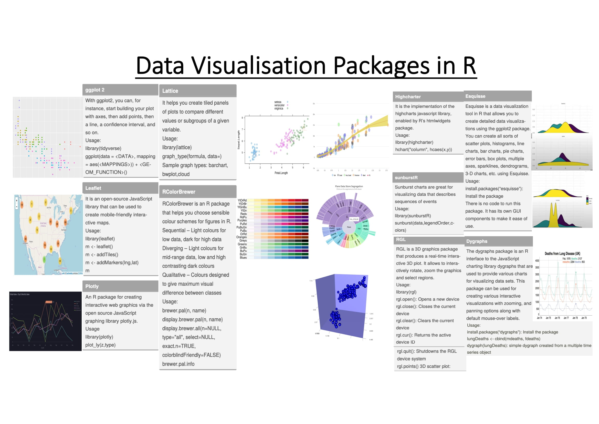

# Data Visualization Packages in R

Hari Prasad Renganathan & Karveandhan Palanisamy

Herewith we have prepared a cheat sheet to do data visualization using R.

Some common packages:

1. ggplot2
2. Leaflet
3. Plotly
4. Lattice
5. RColorBrewer
6. Highcharter
7. sunburstR
8. RGL
9. Esquisse
10. Dygraphs
