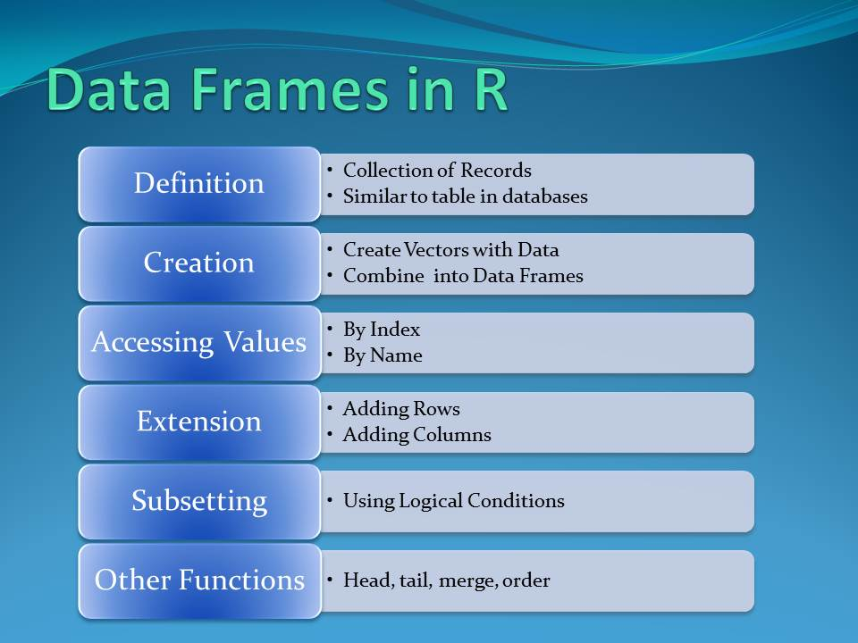

# Dataframe operations tutorial

Yunzhe Zhang


```r
library(dplyr)
```

### Tutorial for being familiar with DataFrame in R
This tutorial will introduce some basic ways to help some beginners be familiar with the dataframe in R. Since usually when we plotting the graph, we need to handle the data well and it is unavoidable to process the data stored in the dataframe. Thus, this tutorial are made for people who are not familiar with the function that help user to do the operation on the dataframe in R. 

#### Introduction
 \
The data frame is a table or a two-dimensional array-like structure in which each column contains values of one variable and each row contains one set of values from each column. There are several characteristics of a data frame \
1. The column names should be non-empty. \
2. The row names should be unique. \
3. The data stored in a data frame can be of numeric, factor or character type. \
4. Each column should contain same number of data items. \

Next, I am going to introduce several basic operations for dataframe in R.


```r
# Create a data frame.
temp <- data.frame(
   index = c (1:5), 
   names = c("Rick","Dan","Michelle","Ryan","Gary"),
   salary = c(623.3,515.2,611.0,729.0,843.25), 
   sex = c("male", "female", "male", "male", "male"),
   Date = as.Date(c("2012-01-01", "2013-09-23", "2014-11-15", "2014-05-11",
      "2015-03-27"))
)
# display the data frame.			
temp 
```

```
##   index    names salary    sex       Date
## 1     1     Rick 623.30   male 2012-01-01
## 2     2      Dan 515.20 female 2013-09-23
## 3     3 Michelle 611.00   male 2014-11-15
## 4     4     Ryan 729.00   male 2014-05-11
## 5     5     Gary 843.25   male 2015-03-27
```
As you can see, the format to create a dataframe has been in the above code. We need to explicitly states the value for each row and the column name. If we want to get the structure of the data frame, we could use the str() function

```r
str(temp)
```

```
## 'data.frame':	5 obs. of  5 variables:
##  $ index : int  1 2 3 4 5
##  $ names : chr  "Rick" "Dan" "Michelle" "Ryan" ...
##  $ salary: num  623 515 611 729 843
##  $ sex   : chr  "male" "female" "male" "male" ...
##  $ Date  : Date, format: "2012-01-01" "2013-09-23" ...
```
As shown above, all the information about the dataframe has been shown belowe like the number of observations and the column names. When we begin to process the data, we could use the str() function to help us be familiar with the dataframe for the processing later. But we coudl also use summary function to also get the information of the dataframe.

```r
summary(temp)
```

```
##      index      names               salary          sex           
##  Min.   :1   Length:5           Min.   :515.2   Length:5          
##  1st Qu.:2   Class :character   1st Qu.:611.0   Class :character  
##  Median :3   Mode  :character   Median :623.3   Mode  :character  
##  Mean   :3                      Mean   :664.4                     
##  3rd Qu.:4                      3rd Qu.:729.0                     
##  Max.   :5                      Max.   :843.2                     
##       Date           
##  Min.   :2012-01-01  
##  1st Qu.:2013-09-23  
##  Median :2014-05-11  
##  Mean   :2014-01-14  
##  3rd Qu.:2014-11-15  
##  Max.   :2015-03-27
```
We could use the following code to iterate the dataframe when you want to do some operations on the dataframe

```r
for(i in 1:nrow(temp)) {
    # row represent each row in the dataframe
    row <- temp[i,]
    # we could get specific column value by $, for example print the names for each row
    print(row$names)
}
```

```
## [1] "Rick"
## [1] "Dan"
## [1] "Michelle"
## [1] "Ryan"
## [1] "Gary"
```


However, when we deal with the dataframe, some times we want to create a empty dataframe. We could achieve this by the following code.

```r
# A empty df with no column names and set the dimension of the dataframe to be 3*3
emptydf =  data.frame(matrix(ncol = 3, nrow = 3))
# setting the column names
x <- c("name", "age", "gender")
colnames(emptydf) <- x
emptydf
```

```
##   name age gender
## 1   NA  NA     NA
## 2   NA  NA     NA
## 3   NA  NA     NA
```

If we want to append rows into the empty dataframe by the following code

```r
# append at the first row
emptydf[1,] = c("alex", 18, "male")
# append at the second row
emptydf[2,] = c("tony", 21, "male")
# append at the last row
emptydf[nrow(emptydf),] = c("Ales", 25, "female")
emptydf
```

```
##   name age gender
## 1 alex  18   male
## 2 tony  21   male
## 3 Ales  25 female
```
We could also add whole columns in the dataframe by the following code.

```r
emptydf$race <- c("White","Black","White")
emptydf
```

```
##   name age gender  race
## 1 alex  18   male White
## 2 tony  21   male Black
## 3 Ales  25 female White
```


However, sometimes we want append all the values from another dataframe to the current dataframe. Then we could use the rbind function to append the second dataframe to the first dataframe.

```r
df2 <- data.frame(var1=c("Derick", "James", "Molly"),
                  var2=c(23, 12, 6),
                  var3=c("male", "male", "female"),
                  var4=c("black", "black", "Asian"))
x <- c("name", "age", "gender", "race")
colnames(df2) <- x
df3 <- rbind(emptydf, df2)
df3
```

```
##     name age gender  race
## 1   alex  18   male White
## 2   tony  21   male Black
## 3   Ales  25 female White
## 4 Derick  23   male black
## 5  James  12   male black
## 6  Molly   6 female Asian
```
We could also extract specific colunme by following operation.

```r
name <- data.frame(df3$gender,df3$age)
print(name)
```

```
##   df3.gender df3.age
## 1       male      18
## 2       male      21
## 3     female      25
## 4       male      23
## 5       male      12
## 6     female       6
```
Besides, there is a important operation for the dataframe in R which is the index slicing. The index slicing is quite similar with python but not totally the same. The index slicing in R has been represented as[all rows, all columns]. For example, df3[1:2, ] represents we take the first two rows and all the columns and [, 1:2] represent we take all the rows but only first two columns

```r
# first case
temp1 <- df3[1:2,]
temp1
```

```
##   name age gender  race
## 1 alex  18   male White
## 2 tony  21   male Black
```

```r
# second case
temp2 <- df3[, 1:2]
temp2
```

```
##     name age
## 1   alex  18
## 2   tony  21
## 3   Ales  25
## 4 Derick  23
## 5  James  12
## 6  Molly   6
```

At the same time, we could also use the subset to do the filter some values and get the rows that you want. The subset function also supports the logical operators.

```r
# first case
temp3 <- subset(temp, names == "Dan" | salary > 750)
temp3
```

```
##   index names salary    sex       Date
## 2     2   Dan 515.20 female 2013-09-23
## 5     5  Gary 843.25   male 2015-03-27
```

```r
# second case
temp4 <- subset(temp, salary < 700 & sex == "male")
temp4
```

```
##   index    names salary  sex       Date
## 1     1     Rick  623.3 male 2012-01-01
## 3     3 Michelle  611.0 male 2014-11-15
```


Then these are all the basic operations for the dataframe, next I am going to use the dplyr pacakge to do some advanced operations on the dataframe.


#### Dplyr 
 \

Dplyr is a grammar of data manipulation, providing a consistent set of verbs that help you solve the most common data manipulation challenges:\
1. mutate() adds new variables that are functions of existing variables.\
2. select() picks variables based on their names.\
3. filter() picks cases based on their values.\
4. summarise() reduces multiple values down to a single summary.\
5. arrange() changes the ordering of the rows.\

Then, first we need to run the installation for the Dplyr package and import it

```r
#install.packages("dplyr")
```
Next, we are going to use the stats_wl.csv as the example and import it using the read.csv function. Note, the csv file must be stored with same directory. Otherwise, you need to revise the path in order to import it.

```r
df <- read.csv("resources/Rayzyz_resources/data.csv", stringsAsFactors = F)
head(df)
```

```
##   duration credit_amount     savings_status employment  property_magnitude age
## 1        6          1169 'no known savings'      '>=7'       'real estate'  67
## 2       48          5951             '<100'   '1<=X<4'       'real estate'  22
## 3       12          2096             '<100'   '4<=X<7'       'real estate'  49
## 4       42          7882             '<100'   '4<=X<7'    'life insurance'  45
## 5       24          4870             '<100'   '1<=X<4' 'no known property'  53
## 6       36          9055 'no known savings'   '1<=X<4' 'no known property'  35
##   own_telephone class
## 1                good
## 2                 bad
## 3                good
## 4          none  good
## 5                 bad
## 6                good
```
`select()`(and optionally rename) select variables in a data frame, using a concise mini-language that makes it easy to refer to variables based on their name.

```r
head(df,10) %>% select(duration, employment, age)
```

```
##    duration employment age
## 1         6      '>=7'  67
## 2        48   '1<=X<4'  22
## 3        12   '4<=X<7'  49
## 4        42   '4<=X<7'  45
## 5        24   '1<=X<4'  53
## 6        36   '1<=X<4'  35
## 7        24      '>=7'  53
## 8        36   '1<=X<4'  35
## 9        12   '4<=X<7'  61
## 10       30 unemployed  28
```
We could also select the consecutive columns by the following code

```r
head(df,10) %>% select(duration:age)
```

```
##    duration credit_amount     savings_status employment  property_magnitude age
## 1         6          1169 'no known savings'      '>=7'       'real estate'  67
## 2        48          5951             '<100'   '1<=X<4'       'real estate'  22
## 3        12          2096             '<100'   '4<=X<7'       'real estate'  49
## 4        42          7882             '<100'   '4<=X<7'    'life insurance'  45
## 5        24          4870             '<100'   '1<=X<4' 'no known property'  53
## 6        36          9055 'no known savings'   '1<=X<4' 'no known property'  35
## 7        24            NA      '500<=X<1000'      '>=7'    'life insurance'  53
## 8        36            NA             '<100'   '1<=X<4'                 car  35
## 9        12            NA           '>=1000'   '4<=X<7'       'real estate'  61
## 10       30            NA             '<100' unemployed                 car  28
```
We could also select all the other columns by specifing the column that you do not want

```r
head(df,10) %>% select(-(age))
```

```
##    duration credit_amount     savings_status employment  property_magnitude
## 1         6          1169 'no known savings'      '>=7'       'real estate'
## 2        48          5951             '<100'   '1<=X<4'       'real estate'
## 3        12          2096             '<100'   '4<=X<7'       'real estate'
## 4        42          7882             '<100'   '4<=X<7'    'life insurance'
## 5        24          4870             '<100'   '1<=X<4' 'no known property'
## 6        36          9055 'no known savings'   '1<=X<4' 'no known property'
## 7        24            NA      '500<=X<1000'      '>=7'    'life insurance'
## 8        36            NA             '<100'   '1<=X<4'                 car
## 9        12            NA           '>=1000'   '4<=X<7'       'real estate'
## 10       30            NA             '<100' unemployed                 car
##    own_telephone class
## 1                 good
## 2                  bad
## 3                 good
## 4           none  good
## 5                  bad
## 6                 good
## 7                 good
## 8                 good
## 9                 good
## 10                 bad
```

We could also use `start_with()` , `end_with()` , and `contains()` to match up some column names.

```r
# starts_with
head(df,10) %>% select(starts_with("dura"))
```

```
##    duration
## 1         6
## 2        48
## 3        12
## 4        42
## 5        24
## 6        36
## 7        24
## 8        36
## 9        12
## 10       30
```

```r
# contains
head(df,10) %>% select(contains("_"))
```

```
##    credit_amount     savings_status  property_magnitude own_telephone
## 1           1169 'no known savings'       'real estate'              
## 2           5951             '<100'       'real estate'              
## 3           2096             '<100'       'real estate'              
## 4           7882             '<100'    'life insurance'          none
## 5           4870             '<100' 'no known property'              
## 6           9055 'no known savings' 'no known property'              
## 7             NA      '500<=X<1000'    'life insurance'              
## 8             NA             '<100'                 car              
## 9             NA           '>=1000'       'real estate'              
## 10            NA             '<100'                 car
```

The `filter()` function is used to subset a data frame, retaining all rows that satisfy your conditions. To be retained, the row must produce a value of TRUE for all conditions. Note that when a condition evaluates to NA the row will be dropped, unlike base subsetting with [. \
There are many functions and operators that are useful when constructing the expressions used to filter the data: \
1. `==`,`>`,`>=` etc. \
2. `&`, `|`, `!`, xor(). \
3. `is.na()`.\
4. `between()`, `near()`. \

```r
# get rows whose duration is > 20 and class is good.
head(df,10) %>% filter(duration > 20 & class == as.character("good"))
```

```
##   duration credit_amount     savings_status employment  property_magnitude age
## 1       42          7882             '<100'   '4<=X<7'    'life insurance'  45
## 2       36          9055 'no known savings'   '1<=X<4' 'no known property'  35
## 3       24            NA      '500<=X<1000'      '>=7'    'life insurance'  53
## 4       36            NA             '<100'   '1<=X<4'                 car  35
##   own_telephone class
## 1          none  good
## 2                good
## 3                good
## 4                good
```

```r
# get rows whose duration is > 20 or class is good.
head(df,10) %>% filter(duration > 20 | class == as.character("good"))
```

```
##    duration credit_amount     savings_status employment  property_magnitude age
## 1         6          1169 'no known savings'      '>=7'       'real estate'  67
## 2        48          5951             '<100'   '1<=X<4'       'real estate'  22
## 3        12          2096             '<100'   '4<=X<7'       'real estate'  49
## 4        42          7882             '<100'   '4<=X<7'    'life insurance'  45
## 5        24          4870             '<100'   '1<=X<4' 'no known property'  53
## 6        36          9055 'no known savings'   '1<=X<4' 'no known property'  35
## 7        24            NA      '500<=X<1000'      '>=7'    'life insurance'  53
## 8        36            NA             '<100'   '1<=X<4'                 car  35
## 9        12            NA           '>=1000'   '4<=X<7'       'real estate'  61
## 10       30            NA             '<100' unemployed                 car  28
##    own_telephone class
## 1                 good
## 2                  bad
## 3                 good
## 4           none  good
## 5                  bad
## 6                 good
## 7                 good
## 8                 good
## 9                 good
## 10                 bad
```
As you see in the above code, we could add various logical operations when filtering the dataframe even including the `xor`.

```r
head(df,10) %>% filter(duration > 20 & class == as.character("good") & is.na(credit_amount) == FALSE)
```

```
##   duration credit_amount     savings_status employment  property_magnitude age
## 1       42          7882             '<100'   '4<=X<7'    'life insurance'  45
## 2       36          9055 'no known savings'   '1<=X<4' 'no known property'  35
##   own_telephone class
## 1          none  good
## 2                good
```
We could also use filter and is.na() to delete the rows whose credit_amount is NA. Thus, we could use filter to get the rows that you want based on your need.

`mutate()` adds new variables and preserves existing ones.

```r
head(df,10) %>% select(duration, class, age) %>% group_by(class) %>% mutate(por_age = age/ mean(age)) 
```

```
## # A tibble: 10 × 4
## # Groups:   class [2]
##    duration class   age por_age
##       <int> <chr> <int>   <dbl>
##  1        6 good     67   1.36 
##  2       48 bad      22   0.641
##  3       12 good     49   0.994
##  4       42 good     45   0.913
##  5       24 bad      53   1.54 
##  6       36 good     35   0.710
##  7       24 good     53   1.08 
##  8       36 good     35   0.710
##  9       12 good     61   1.24 
## 10       30 bad      28   0.816
```
We use the mutate to initialize a new column called the pro_age which is calculated by the age / mean(age)

`summarise()` creates a new data frame. It will have one (or more) rows for each combination of grouping variables; if there are no grouping variables, the output will have a single row summarising all observations in the input. It will contain one column for each grouping variable and one column for each of the summary statistics that you have specified.


```r
head(df,10) %>%
  group_by(class) %>%
  summarise(mean_age = mean(age), mean_duration = mean(duration), count = n())
```

```
## # A tibble: 2 × 4
##   class mean_age mean_duration count
##   <chr>    <dbl>         <dbl> <int>
## 1 bad       34.3            34     3
## 2 good      49.3            24     7
```
We use the `grou_by()` and `summarise` find out the mean age, mean duration and the total counts for the class good and class bad.

`arrange` orders the rows of a data frame by the values of selected columns.

```r
head(df,10) %>%
  group_by(property_magnitude) %>%
  summarise(mean_age = mean(age), mean_duration = mean(duration), count = n()) %>% arrange(mean_age)
```

```
## # A tibble: 4 × 4
##   property_magnitude  mean_age mean_duration count
##   <chr>                  <dbl>         <dbl> <int>
## 1 car                     31.5          33       2
## 2 'no known property'     44            30       2
## 3 'life insurance'        49            33       2
## 4 'real estate'           49.8          19.5     4
```
We could use the `arrange()` to sort the values based on the variable that I choose. For the code below, I sort the dataframe by the variable mean_age with asenting order. We could also choose desc order by adding the `desc()` in front of the mean_age.


#### Join two tables

 \

There are four different type of when we join the table which are left join, right join, inner join, and full join. Then we first create two dataframe which are df1 and df2.

```r
df1 <- data.frame(
   index = c (1:10), 
   State = c("GA","GA", "GA","FL","FL","FL","AL","AL","AL", "CA"), 
   Limit = c("50000", "50000", "40000", "30000", "75000","75000", "85000", "90000", "45000", "125000")
)
df1
```

```
##    index State  Limit
## 1      1    GA  50000
## 2      2    GA  50000
## 3      3    GA  40000
## 4      4    FL  30000
## 5      5    FL  75000
## 6      6    FL  75000
## 7      7    AL  85000
## 8      8    AL  90000
## 9      9    AL  45000
## 10    10    CA 125000
```

```r
df2 <- data.frame(
   index = c (1:4), 
   State = c("GA","FL", "AL", "OH"), 
   regulatory_limit = c("50000", "75000", "45000", "48000")
)
df2
```

```
##   index State regulatory_limit
## 1     1    GA            50000
## 2     2    FL            75000
## 3     3    AL            45000
## 4     4    OH            48000
```
Left Join will join the table based on the common values that df1 and df2 both have. If the values in df1 can not find in df2, then keep it but missing values for the corresponding column in df2 will be initialized to NA

```r
df1 %>% left_join(df2, by="State")
```

```
##    index.x State  Limit index.y regulatory_limit
## 1        1    GA  50000       1            50000
## 2        2    GA  50000       1            50000
## 3        3    GA  40000       1            50000
## 4        4    FL  30000       2            75000
## 5        5    FL  75000       2            75000
## 6        6    FL  75000       2            75000
## 7        7    AL  85000       3            45000
## 8        8    AL  90000       3            45000
## 9        9    AL  45000       3            45000
## 10      10    CA 125000      NA             <NA>
```

Right Join will join the table based on the common values that df1 and df2 both have. If the values in df2 can not find in df1, then keep it but missing values for the corresponding column in df1 will be initialized to NA

```r
df1 %>% right_join(df2, by="State")
```

```
##    index.x State Limit index.y regulatory_limit
## 1        1    GA 50000       1            50000
## 2        2    GA 50000       1            50000
## 3        3    GA 40000       1            50000
## 4        4    FL 30000       2            75000
## 5        5    FL 75000       2            75000
## 6        6    FL 75000       2            75000
## 7        7    AL 85000       3            45000
## 8        8    AL 90000       3            45000
## 9        9    AL 45000       3            45000
## 10      NA    OH  <NA>       4            48000
```

Inner Join will join two tables where all the values are shared by df1 and df2

```r
df1 %>% inner_join(df2, by="State")
```

```
##   index.x State Limit index.y regulatory_limit
## 1       1    GA 50000       1            50000
## 2       2    GA 50000       1            50000
## 3       3    GA 40000       1            50000
## 4       4    FL 30000       2            75000
## 5       5    FL 75000       2            75000
## 6       6    FL 75000       2            75000
## 7       7    AL 85000       3            45000
## 8       8    AL 90000       3            45000
## 9       9    AL 45000       3            45000
```

Full_join will concate all the values in df1 and df2 and leave NA for those values which can not be find in the other table.

```r
df1 %>% full_join(df2, by="State")
```

```
##    index.x State  Limit index.y regulatory_limit
## 1        1    GA  50000       1            50000
## 2        2    GA  50000       1            50000
## 3        3    GA  40000       1            50000
## 4        4    FL  30000       2            75000
## 5        5    FL  75000       2            75000
## 6        6    FL  75000       2            75000
## 7        7    AL  85000       3            45000
## 8        8    AL  90000       3            45000
## 9        9    AL  45000       3            45000
## 10      10    CA 125000      NA             <NA>
## 11      NA    OH   <NA>       4            48000
```

