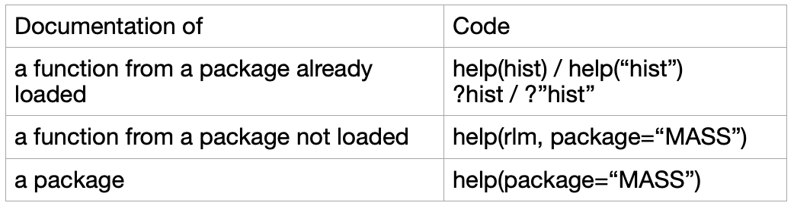
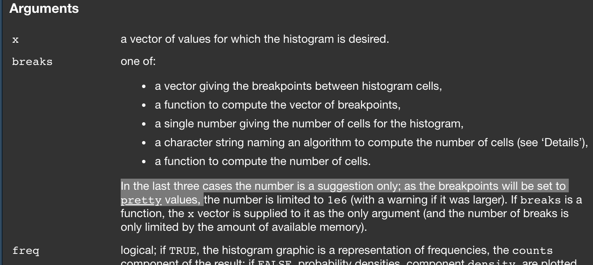
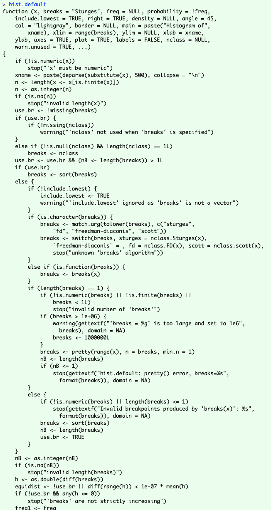
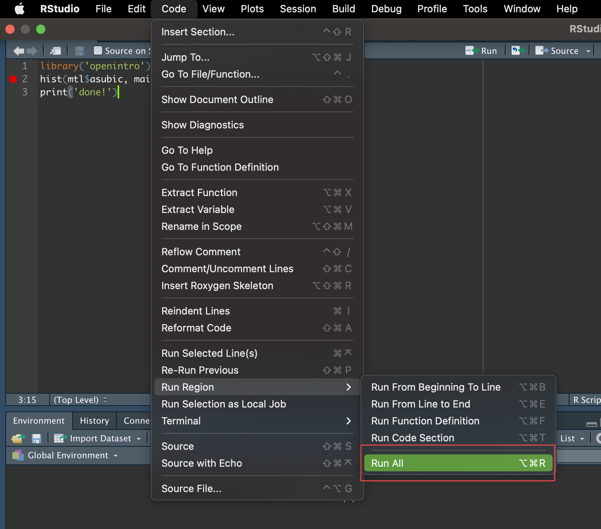
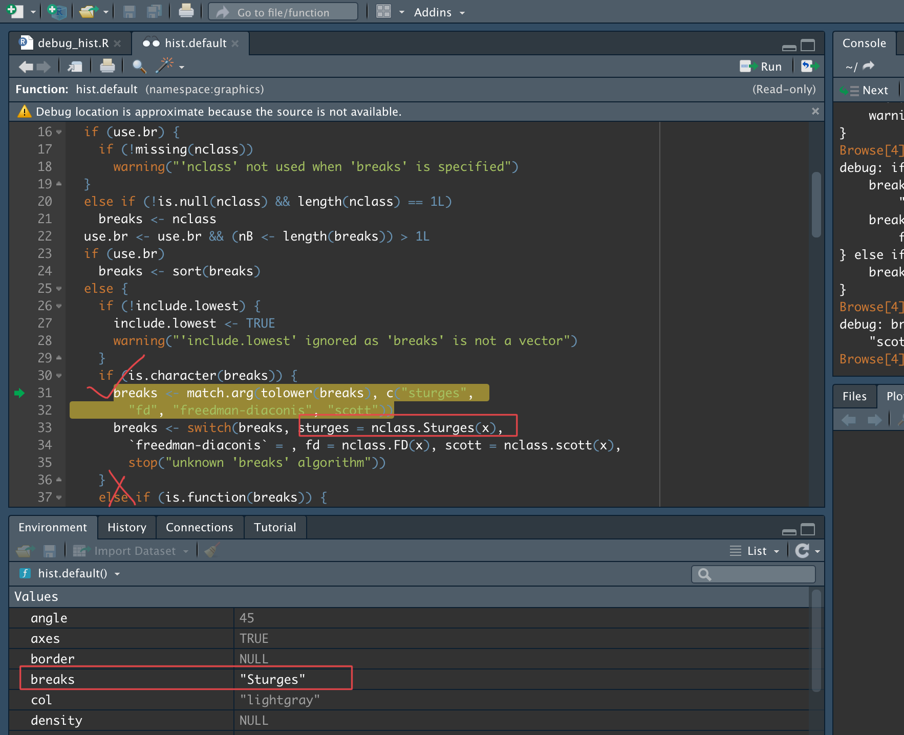
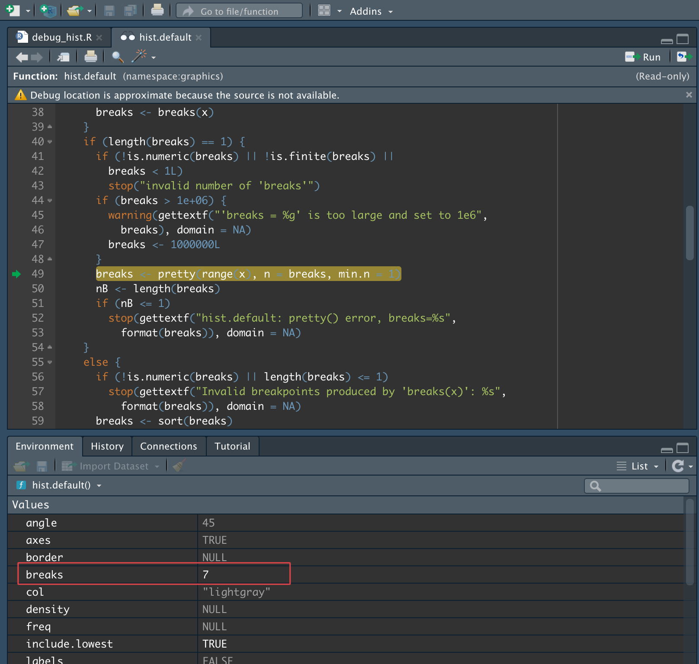
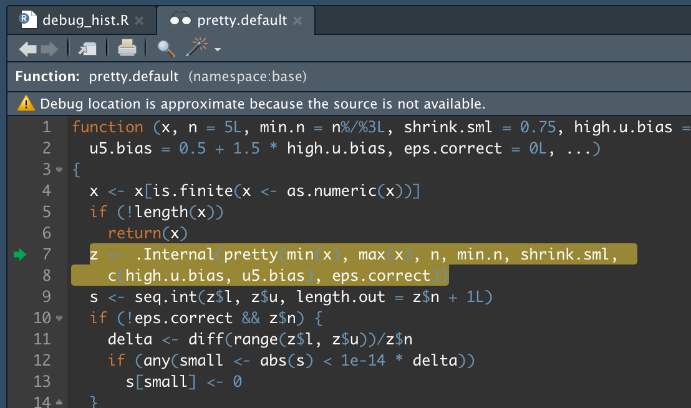

# Debugging in Rstudio

Tianxiang Li

```{r, include=FALSE}
# this prevents package loading message from appearing in the rendered version of your problem set
knitr::opts_chunk$set(warning = FALSE,
                      message = FALSE)
```

## Introduction
In the first assignment we were asked to find out how `hist()` in baseR determines the number of bins. Many students including me got confused because the return of the function is not the same as described in its documentation. I'd like to share how I solved the problem. 

The tutorial mainly consists of three parts: how to use `help()`, how to find the source code of a function using `methods()`, and how to debug in RStudio. Hopefully this can help other people like me when they encounter similar problems in the future. 

```{r}
library('openintro')
library('tidyverse')
library(dplyr)
```

## First Choice: help()
### how to use help()
When you want to find out how a new function works, trying `help()` is always the first step. It will returns the official documentation of the function. Usually a detailed documentation will answer most of your questions. Take `hist()` for example:
```{r}
help(hist)
```
This will show you the documentation of `hist()` function. Here is a summarization:

```{r echo=FALSE, fig.cap="", out.width = '60%',fig.align='center'}

```  

**Note**: The input of help() should be the name of the function, so you should use `help(hist)` instead of `help(hist())`.

There is also a function `example(hist)`, which will return an interactive result where you can run some examples of the function. 

### understand the documentation
The R documentation typically consists of several parts: *Description*, *Usage*, *Arguments*, *Details*, *Value*, *Examples* and so on. In *Usage* you can find the arguments and their default values. In *Arguments* there are explanations of these arguments. *Value* is the return value of the function. For example, `hist()` returns an object that has 6 attributes:

```{r}
x <- hist(mtl$asubic, plot=F)
str(x)
```

### not enough
However, R documentation cannot answers all the questions. In our case, the documentation of `hist()` only says that it uses *Sturges' algorithm*, and uses it as a suggestion to `pretty()`. 

```{r echo=FALSE, fig.cap="", out.width = '60%',fig.align='center'}

```  

With this description, we still do not understand how it works: how to use the result of *Sturges' algorithm* as a suggestion to `pretty()`. If we use `pretty()` directly, the results are clearly not the same as the results of `hist()`:
```{r}
pretty(mtl$asubic)
```

To totally understand how a function works, the best way is to read 


## Source code: methods()
To totally understand how a function works, the best way is to read its source code. Since it is not include in the documentation, where should we find it?

Sometimes you can just type the name of the function. It will return the source code:

```{r echo=FALSE, fig.cap="", out.width = '60%',fig.align='center'}
knitr::include_graphics("resources/debugging_in_rstudio/3.png")
```  

Unfortunately, when you try it on `hist()`, this happens:
```{r}
hist
```
This is because that it is a generic function (more specifically, it's a S3 generic function). We can use `methods()`, it will list all available methods for a S3 or S4 generic function:

```{r}
methods(hist)
```
`hist.default` is what we are looking for. Now we successfully get the source code of `hist()`.

```{r echo=FALSE, fig.cap="", out.width = '30%',fig.align='center'}

```  


However, it still doesn't solve our problem: the function is too long! It has 120 lines, including many `if-else` branches and exception handling. It will be painful to read all the contents of the function just to understand the basic usage of it. 

This is when we should use the debugging tools built in RStudio. 

## Debugging in RStudio
Debugging is a very useful tool to understand the how your code behaves when it is actually running, or to find out why the code is not running as you expected. You can set a breakpoint before the line you are interested in, then when the code is running, it will stop at the breakpoint. Then you can run the code step by step to walk through it.

Now let's see how to use debugging to find out how `hist()` works.

### set the breakpoint
Firstly we need to set a breakpoint. To do this, you must create a R script file (you can't do this in R markdown file). Then set a breakpoint by clicking on the left area of the line number. It looks like this:

```{r echo=FALSE, fig.cap="", out.width = '60%',fig.align='center'}
knitr::include_graphics("resources/debugging_in_rstudio/5.png")
```  

It means that it will stop after it runs line 1 and before it runs line 2. 

### run the script
Save the script and run it through `Code -> Run Region -> Run All`:

```{r echo=FALSE, fig.cap="", out.width = '60%',fig.align='center'}

```  

Since you have set a breakpoint in step 1, it will automatically stop at that point!

### debug
When it stops, it will go into debug mode and looks like this:

```{r echo=FALSE, fig.cap="", out.width = '80%',fig.align='center'}
knitr::include_graphics("resources/debugging_in_rstudio/7.png")
```  

As shown in the picture, line 2 is highlighted, meaning that it will execute line 2 in next step (it hasn't been executed yet).

Note that on the rightside some buttons appear in the **Console**. Button 1 means `Execute the next line of code`, button 2 means `Step into the current function call`. If you click button 1 it will execute line 2 and line 3 will be highlighted. Since we want to see the details of `hist()`, we should click button 2.

Again we find the source code of `hist()`! But this time, we know which line is being executed through the green arrow and highlight, and all the variables and their values in current step are shown in **Environment**.

```{r echo=FALSE, fig.cap="", out.width = '80%',fig.align='center'}
knitr::include_graphics("resources/debugging_in_rstudio/8.png")
```  

Since we already step into the `hist()` function, from now on we click button 1:

```{r echo=FALSE, fig.cap="", out.width = '80%',fig.align='center'}

```  

We can clearly see that the value of variable `breaks` is "Sturges" and the code goes into `if` instead of `else if`. And we can see that in the next two steps this will happen:

```{r}
breaks <- nclass.Sturges(x)
```

Now we get this:

```{r echo=FALSE, fig.cap="", out.width = '80%',fig.align='center'}

```  

The value of `breaks` is 7 and in the next step it will execute

```{r}
breaks <- pretty(range(x), n = 7, min.n = 1)
```
Finally we get the result of `breaks`:

```{r echo=FALSE, fig.cap="", out.width = '80%',fig.align='center'}
knitr::include_graphics("resources/debugging_in_rstudio/11.png")
```  

### summary
After we debug the script, we can understand how `hist()` determines breaks:
```{r}
breaks <- pretty(range(mtl$asubic), n = nclass.Sturges(mtl$asubic), min.n = 1)
breaks
```

Now you may want know how `pretty()` works. Using debugging tools introduced above, you will find this:

```{r echo=FALSE, fig.cap="", out.width = '80%',fig.align='center'}

```  

Unfortunately, `.Internal(pretty(...))` is compiled in C. It is beyond this class and the tutorial, if you want to know more, you can visit this: https://stackoverflow.com/questions/14035506/
