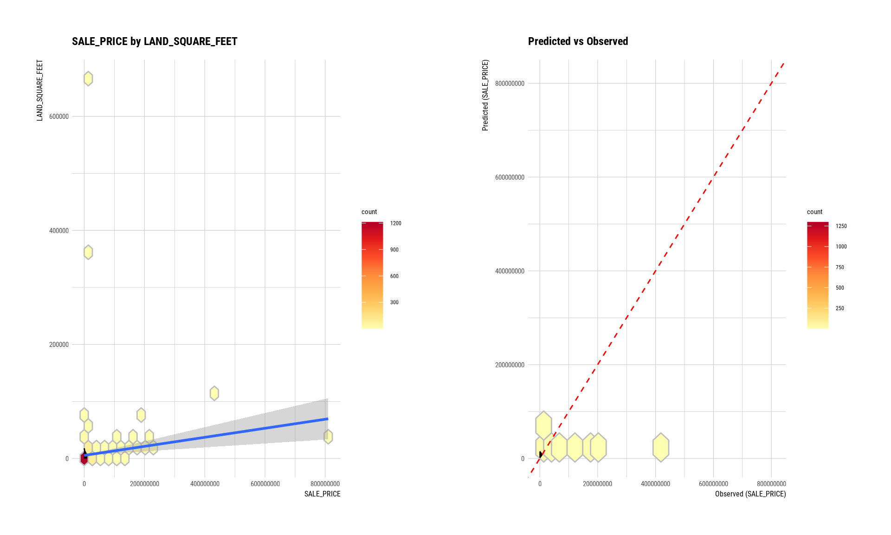
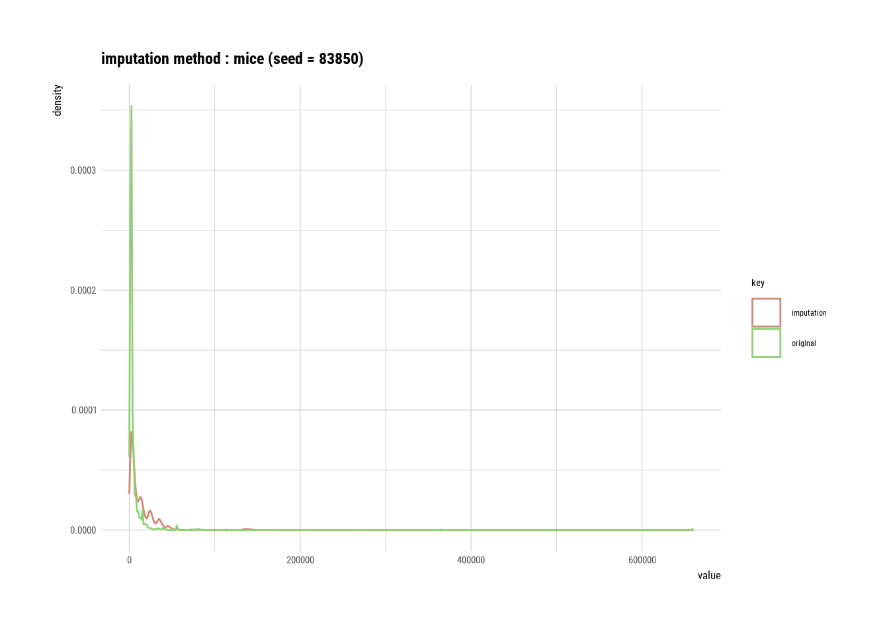
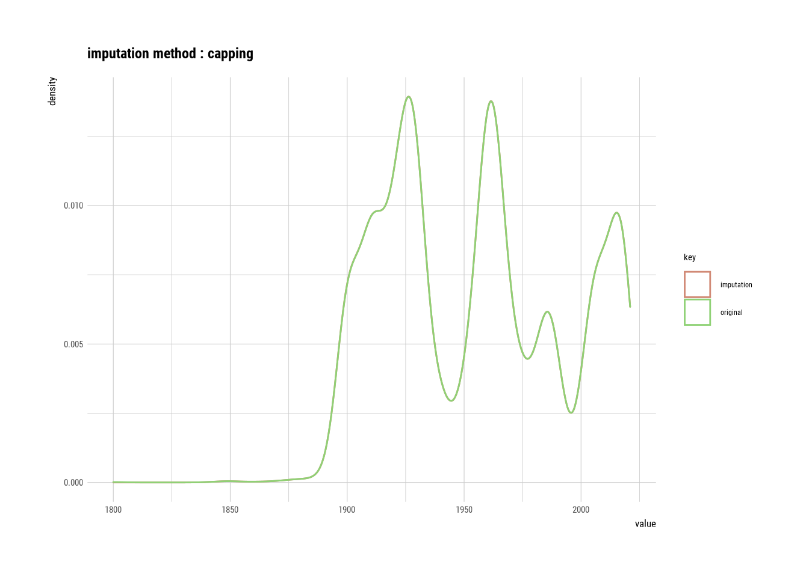
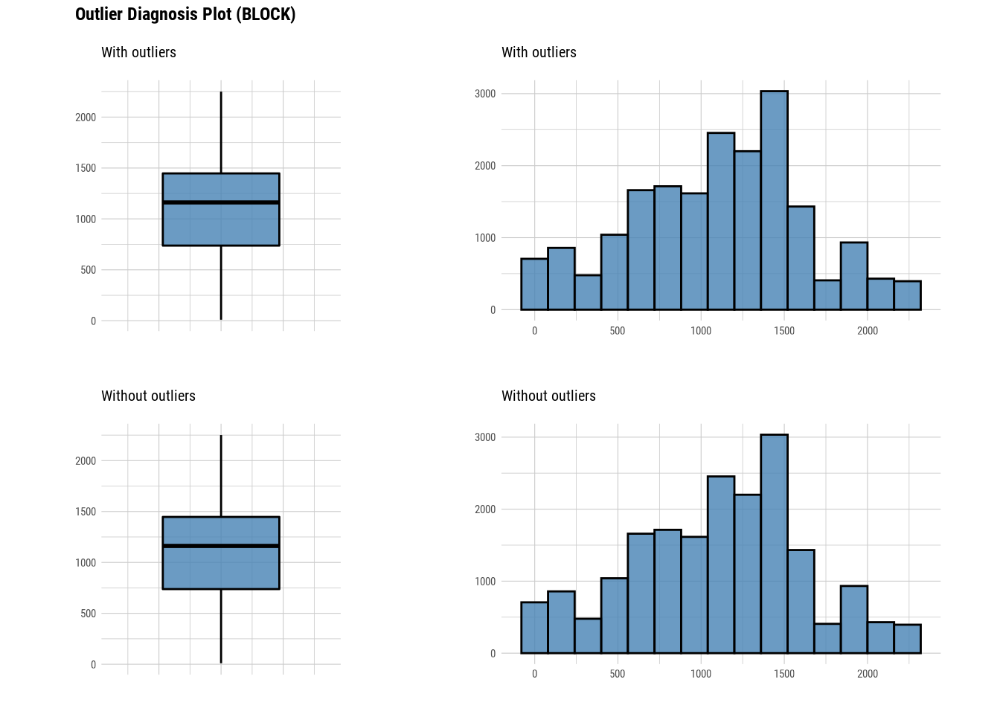
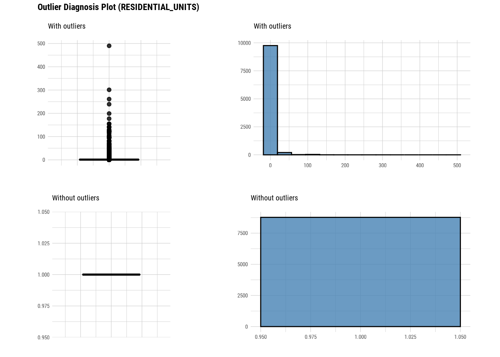
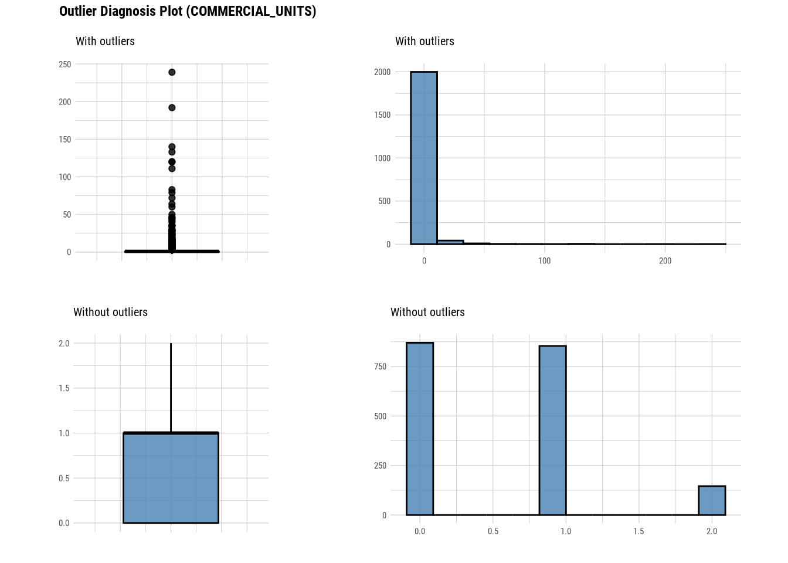
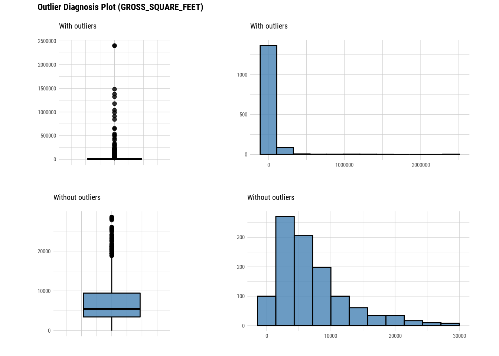
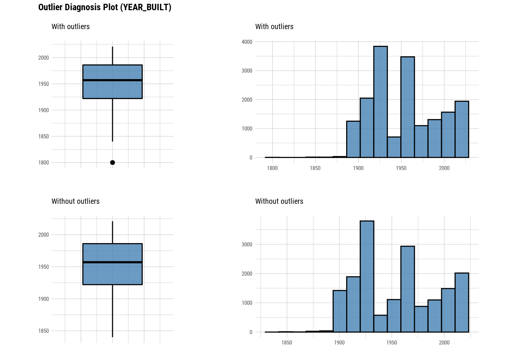
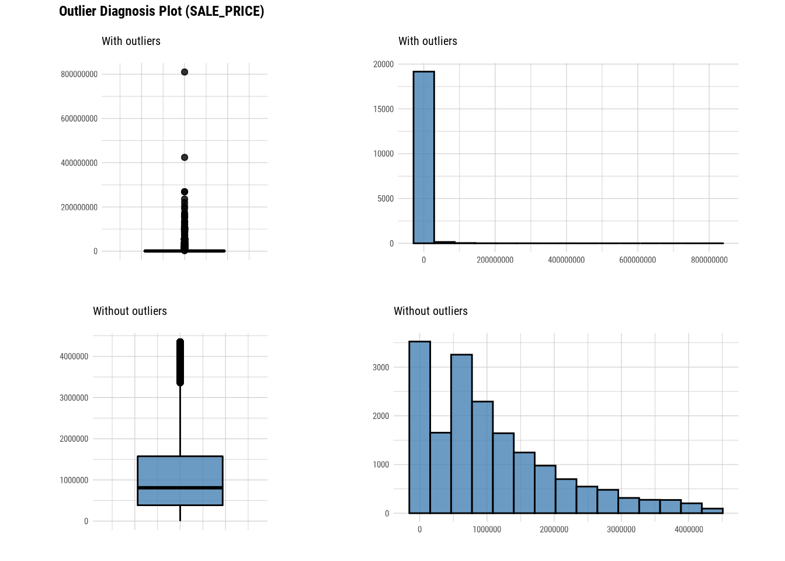

# Dlookr package

Mridul Gupta


## Introduction

In this tutorial, we are going to learn about the basics of `dlookr' package, how to use it on a dataset and why it is an important and relevant package for all he data scientist, statistician out there.

## What is dlookr?

According to Cran, dlookr is a collection of tools that support data diagnosis, exploration, and transformation. Data diagnostics provides information and visualization of missing values and outliers and unique and negative values to help us understand the distribution and quality of our data. Data exploration provides information and visualization of the descriptive statistics of univariate variables, normality tests and outliers, correlation of two variables, and relationship between target variable and predictor. Data transformation supports binning for categorizing continuous variables, imputates missing values and outliers, resolving skewness. And it creates automated reports that support these three tasks.

## Why is it important?

Well the description above is sufficient enough to convience someone of its importance but in simpler words I believe there are 3 reasons as to why I believe learning this package is worth putting your time into:

- One package has functions to help us diagnose data, explore and transform it and even reporting our findings. This makes it easier for us to remember the important functions otherwise we would also have to remember the packages which allows us to do this stuff.

- It can easily be integrated and used with dplyr & tidyverse which is something that has now become ubiquitous in the indistry.

- Instead of writing longer codes, this package generally has functions that give lot of information about data without much transformation.

## Usecase

To help us understand its use, let us use a dataset. I am using Rolling sales data for Manhattan.
https://www1.nyc.gov/site/finance/taxes/property-rolling-sales-data.page


```r
#Reading data
manhattan <- read_excel("rollingsales_manhattan.xlsx", skip = 4)
dim(manhattan)
```

```
## [1] 19354    21
```

### Data Diagnosis

#### Overall Diagnosis


```r
# Get missing and unique count for each column
diagnose(manhattan)
```

```
## # A tibble: 21 × 6
##    variables                 types     missing_count missing_p…¹ uniqu…² uniqu…³
##    <chr>                     <chr>             <int>       <dbl>   <int>   <dbl>
##  1 BOROUGH                   character             0      0            1 5.17e-5
##  2 NEIGHBORHOOD              character             0      0           39 2.02e-3
##  3 BUILDING_CLASS_CATEGORY   character             0      0           39 2.02e-3
##  4 TAX_CLASS_AT_PRESENT      character            18      0.0930       9 4.65e-4
##  5 BLOCK                     numeric               0      0         1341 6.93e-2
##  6 LOT                       numeric               0      0         1662 8.59e-2
##  7 EASEMENT                  logical           19354    100            1 5.17e-5
##  8 BUILDING_CLASS_AT_PRESENT character            18      0.0930     112 5.79e-3
##  9 ADDRESS                   character             0      0        19010 9.82e-1
## 10 APARTMENT_NUMBER          character         10204     52.7       2630 1.36e-1
## # … with 11 more rows, and abbreviated variable names ¹​missing_percent,
## #   ²​unique_count, ³​unique_rate
```

```r
# Using with dplyr and finding columns with missing data
diagnose(manhattan)
```

```
## # A tibble: 21 × 6
##    variables                 types     missing_count missing_p…¹ uniqu…² uniqu…³
##    <chr>                     <chr>             <int>       <dbl>   <int>   <dbl>
##  1 BOROUGH                   character             0      0            1 5.17e-5
##  2 NEIGHBORHOOD              character             0      0           39 2.02e-3
##  3 BUILDING_CLASS_CATEGORY   character             0      0           39 2.02e-3
##  4 TAX_CLASS_AT_PRESENT      character            18      0.0930       9 4.65e-4
##  5 BLOCK                     numeric               0      0         1341 6.93e-2
##  6 LOT                       numeric               0      0         1662 8.59e-2
##  7 EASEMENT                  logical           19354    100            1 5.17e-5
##  8 BUILDING_CLASS_AT_PRESENT character            18      0.0930     112 5.79e-3
##  9 ADDRESS                   character             0      0        19010 9.82e-1
## 10 APARTMENT_NUMBER          character         10204     52.7       2630 1.36e-1
## # … with 11 more rows, and abbreviated variable names ¹​missing_percent,
## #   ²​unique_count, ³​unique_rate
```

```r
manhattan %>%
  diagnose() %>%
  select(-unique_count, -unique_rate) %>% 
  filter(missing_count > 0) %>% 
  arrange(desc(missing_count))
```

```
## # A tibble: 10 × 4
##    variables                 types     missing_count missing_percent
##    <chr>                     <chr>             <int>           <dbl>
##  1 EASEMENT                  logical           19354        100     
##  2 LAND_SQUARE_FEET          numeric           17885         92.4   
##  3 GROSS_SQUARE_FEET         numeric           17885         92.4   
##  4 COMMERCIAL_UNITS          numeric           17292         89.3   
##  5 APARTMENT_NUMBER          character         10204         52.7   
##  6 RESIDENTIAL_UNITS         numeric            9328         48.2   
##  7 TOTAL_UNITS               numeric            8735         45.1   
##  8 YEAR_BUILT                numeric            2057         10.6   
##  9 TAX_CLASS_AT_PRESENT      character            18          0.0930
## 10 BUILDING_CLASS_AT_PRESENT character            18          0.0930
```

We easily get the columns where we have data missing.

Now lets look at different features/columns in data.

#### Numerical data diagnosis


```r
# Looking at numerical data
diagnose_numeric(manhattan)
```

```
## # A tibble: 10 × 10
##    variables          min     Q1   mean median     Q3    max  zero minus outlier
##    <chr>            <dbl>  <dbl>  <dbl>  <dbl>  <dbl>  <dbl> <int> <int>   <int>
##  1 BLOCK               10    738 1.10e3   1162 1.45e3 2.25e3     0     0       0
##  2 LOT                  1     29 7.52e2   1003 1.20e3 9.11e3     0     0     451
##  3 ZIP_CODE         10001  10013 1.00e4  10022 1.00e4 1.05e4     0     0    2601
##  4 RESIDENTIAL_UNI…     0      1 2.68e0      1 1   e0 4.9 e2   300     0    1257
##  5 COMMERCIAL_UNITS     0      0 2.09e0      1 1   e0 2.39e2   870     0     192
##  6 TOTAL_UNITS          0      1 2.93e0      1 1   e0 4.92e2    88     0    1228
##  7 LAND_SQUARE_FEET     0   1749 6.02e3   2313 4.25e3 6.59e5     8     0     191
##  8 GROSS_SQUARE_FE…     0   3756 3.35e4   6681 1.38e4 2.4 e6    83     0     230
##  9 YEAR_BUILT        1800   1922 1.95e3   1957 1.99e3 2.02e3     0     0       3
## 10 SALE_PRICE           0 430000 2.42e6 925000 2.00e6 8.10e8  3136     0    1873
```
One function directly gives quantiles,mean, zeros, negative values and outliers for all the numeric values.


```r
# Using with dplyr and finding colums with zero values
diagnose_numeric(manhattan) %>% 
  filter(zero > 0) 
```

```
## # A tibble: 6 × 10
##   variables           min     Q1   mean median     Q3    max  zero minus outlier
##   <chr>             <dbl>  <dbl>  <dbl>  <dbl>  <dbl>  <dbl> <int> <int>   <int>
## 1 RESIDENTIAL_UNITS     0      1 2.68e0      1 1   e0 4.9 e2   300     0    1257
## 2 COMMERCIAL_UNITS      0      0 2.09e0      1 1   e0 2.39e2   870     0     192
## 3 TOTAL_UNITS           0      1 2.93e0      1 1   e0 4.92e2    88     0    1228
## 4 LAND_SQUARE_FEET      0   1749 6.02e3   2313 4.25e3 6.59e5     8     0     191
## 5 GROSS_SQUARE_FEET     0   3756 3.35e4   6681 1.38e4 2.4 e6    83     0     230
## 6 SALE_PRICE            0 430000 2.42e6 925000 2.00e6 8.10e8  3136     0    1873
```
#### Categorical data diagnosis


```r
# Looking at categorical data
diagnose_category(manhattan)
```

```
## # A tibble: 83 × 6
##    variables    levels                        N  freq  ratio  rank
##    <chr>        <chr>                     <int> <int>  <dbl> <int>
##  1 BOROUGH      1                         19354 19354 100        1
##  2 NEIGHBORHOOD UPPER EAST SIDE (59-79)   19354  1999  10.3      1
##  3 NEIGHBORHOOD UPPER EAST SIDE (79-96)   19354  1886   9.74     2
##  4 NEIGHBORHOOD UPPER WEST SIDE (59-79)   19354  1746   9.02     3
##  5 NEIGHBORHOOD MIDTOWN EAST              19354  1160   5.99     4
##  6 NEIGHBORHOOD UPPER WEST SIDE (79-96)   19354  1151   5.95     5
##  7 NEIGHBORHOOD CHELSEA                   19354   912   4.71     6
##  8 NEIGHBORHOOD MIDTOWN WEST              19354   881   4.55     7
##  9 NEIGHBORHOOD GREENWICH VILLAGE-CENTRAL 19354   759   3.92     8
## 10 NEIGHBORHOOD HARLEM-CENTRAL            19354   708   3.66     9
## # … with 73 more rows
```
This directly gives us all the levels for all the categorical columns and their frequency as well.


```r
# Filtering categories with NA levels

diagnose_category(manhattan) %>% 
  filter(is.na(levels))
```

```
## # A tibble: 2 × 6
##   variables            levels     N  freq   ratio  rank
##   <chr>                <chr>  <int> <int>   <dbl> <int>
## 1 TAX_CLASS_AT_PRESENT <NA>   19354    18  0.0930     8
## 2 APARTMENT_NUMBER     <NA>   19354 10204 52.7        1
```

#### Outlier diagnosis


```r
# Diagnose outlier for each numerical column/feature

diagnose_outlier(manhattan) 
```

```
## # A tibble: 10 × 6
##    variables         outliers_cnt outliers_ratio outliers_mean with_mean witho…¹
##    <chr>                    <int>          <dbl>         <dbl>     <dbl>   <dbl>
##  1 BLOCK                        0         0              NaN      1.10e3 1.10e+3
##  2 LOT                        451         2.33          4598.     7.52e2 6.60e+2
##  3 ZIP_CODE                  2601        13.4          10103.     1.00e4 1.00e+4
##  4 RESIDENTIAL_UNITS         1257         6.49            14.4    2.68e0 1   e+0
##  5 COMMERCIAL_UNITS           192         0.992           16.5    2.09e0 6.13e-1
##  6 TOTAL_UNITS               1228         6.34            17.7    2.93e0 1   e+0
##  7 LAND_SQUARE_FEET           191         0.987        28980.     6.02e3 2.59e+3
##  8 GROSS_SQUARE_FEET          230         1.19        175727.     3.35e4 7.07e+3
##  9 YEAR_BUILT                   3         0.0155        1800      1.95e3 1.95e+3
## 10 SALE_PRICE                1873         9.68      14915667.     2.42e6 1.08e+6
## # … with abbreviated variable name ¹​without_mean
```
This tells us the number of outliers are there in each numerical column. If we look at with_mean and without_mean column it also helps us analyse the effect of outlier on data.We can even plot outliers:

Here we use diagnose_outlier(), plot_outlier(), and dplyr packages to visualize all numerical variables with an outlier ratio of 0.5% or higher.


```r
# Diagnose outlier for each numerical column/feature
manhattan %>%
  plot_outlier(diagnose_outlier(manhattan) %>% 
                 filter(outliers_ratio >= 0.5) %>% 
                 select(variables) %>% 
                 unlist())
```


### EDA

#### Univariate Analysis


```r
# Looking at the numerical data
describe(manhattan)
```

```
## # A tibble: 10 × 26
##    described_v…¹     n    na   mean     sd se_mean    IQR skewn…² kurtosis   p00
##    <chr>         <int> <int>  <dbl>  <dbl>   <dbl>  <dbl>   <dbl>    <dbl> <dbl>
##  1 BLOCK         19354     0 1.10e3 5.20e2 3.74e+0 7.09e2  -0.149   -0.464    10
##  2 LOT           19354     0 7.52e2 8.86e2 6.37e+0 1.18e3   2.77    16.2       1
##  3 ZIP_CODE      19354     0 1.00e4 3.61e1 2.60e-1 1.5 e1   4.14    25.4   10001
##  4 RESIDENTIAL_… 10026  9328 2.68e0 1.16e1 1.16e-1 0       16.6    448.        0
##  5 COMMERCIAL_U…  2062 17292 2.09e0 1.04e1 2.30e-1 1   e0  13.7    234.        0
##  6 TOTAL_UNITS   10619  8735 2.93e0 1.24e1 1.20e-1 0       15.0    361.        0
##  7 LAND_SQUARE_…  1469 17885 6.02e3 2.73e4 7.12e+2 2.50e3  20.4    467.        0
##  8 GROSS_SQUARE…  1469 17885 3.35e4 1.34e5 3.49e+3 1.00e4  11.4    164.        0
##  9 YEAR_BUILT    17297  2057 1.95e3 3.81e1 2.89e-1 6.4 e1   0.227   -1.11   1800
## 10 SALE_PRICE    19354     0 2.42e6 1.03e7 7.37e+4 1.57e6  35.7   2249.        0
## # … with 16 more variables: p01 <dbl>, p05 <dbl>, p10 <dbl>, p20 <dbl>,
## #   p25 <dbl>, p30 <dbl>, p40 <dbl>, p50 <dbl>, p60 <dbl>, p70 <dbl>,
## #   p75 <dbl>, p80 <dbl>, p90 <dbl>, p95 <dbl>, p99 <dbl>, p100 <dbl>, and
## #   abbreviated variable names ¹​described_variables, ²​skewness
```
This gives very detailed metrics regarding the distribution of numerical variables. Along with basic metrics like mean, standard deviation it also gives metrics like skewness, kurtosis, percentiles, IQR etc.


```r
# Looking at the numerical data
normality(manhattan)
```

```
## # A tibble: 10 × 4
##    vars              statistic  p_value sample
##    <chr>                 <dbl>    <dbl>  <dbl>
##  1 BLOCK                 0.983 5.13e-24   5000
##  2 LOT                   0.712 1.07e-68   5000
##  3 ZIP_CODE              0.580 1.99e-76   5000
##  4 RESIDENTIAL_UNITS     0.149 6.77e-75   5000
##  5 COMMERCIAL_UNITS      0.171 5.30e-42   5000
##  6 TOTAL_UNITS           0.159 4.63e-76   5000
##  7 LAND_SQUARE_FEET      0.482 1.86e-30   5000
##  8 GROSS_SQUARE_FEET     0.359 5.21e-33   5000
##  9 YEAR_BUILT            0.938 8.49e-40   5000
## 10 SALE_PRICE            0.239 1.74e-89   5000
```

```r
# Looking at the numerical data
plot_normality(manhattan)
```


```r
# Looking at the numerical data
manhattan %>%
  filter(NEIGHBORHOOD == "MIDTOWN EAST") %>%
  group_by(`ZIP_CODE`) %>%
  plot_normality(`SALE_PRICE`)
```


###Bivariate Analysis


```r
# Looking at the numerical data
correlate(manhattan)
```

```
## # A tibble: 90 × 3
##    var1              var2  coef_corr
##    <fct>             <fct>     <dbl>
##  1 LOT               BLOCK  -0.185  
##  2 ZIP_CODE          BLOCK   0.239  
##  3 RESIDENTIAL_UNITS BLOCK   0.0462 
##  4 COMMERCIAL_UNITS  BLOCK  -0.0808 
##  5 TOTAL_UNITS       BLOCK   0.0377 
##  6 LAND_SQUARE_FEET  BLOCK  -0.00909
##  7 GROSS_SQUARE_FEET BLOCK  -0.0860 
##  8 YEAR_BUILT        BLOCK  -0.0974 
##  9 SALE_PRICE        BLOCK  -0.0487 
## 10 BLOCK             LOT    -0.185  
## # … with 80 more rows
```

```r
# Looking at the numerical data
correlate(manhattan, `SALE_PRICE`,`YEAR_BUILT`,`LAND_SQUARE_FEET`)
```

```
## # A tibble: 27 × 3
##    var1             var2              coef_corr
##    <fct>            <fct>                 <dbl>
##  1 LAND_SQUARE_FEET BLOCK              -0.00909
##  2 YEAR_BUILT       BLOCK              -0.0974 
##  3 SALE_PRICE       BLOCK              -0.0487 
##  4 LAND_SQUARE_FEET LOT                 0.0194 
##  5 YEAR_BUILT       LOT                 0.472  
##  6 SALE_PRICE       LOT                 0.00774
##  7 LAND_SQUARE_FEET ZIP_CODE           -0.0222 
##  8 YEAR_BUILT       ZIP_CODE            0.0504 
##  9 SALE_PRICE       ZIP_CODE           -0.0249 
## 10 LAND_SQUARE_FEET RESIDENTIAL_UNITS   0.114  
## # … with 17 more rows
```

```r
# Looking at the numerical data
plot_correlate(manhattan)
```


```r
# Looking at the numerical data
plot_correlate(manhattan, `SALE_PRICE`,`YEAR_BUILT`,`LAND_SQUARE_FEET`)
```


### EDA on Target Variable


```r
# Imputing Tax class at time of sale column
num <- target_by(manhattan,`SALE_PRICE`)
num_num <- relate(num,`LAND_SQUARE_FEET`)
num_num
```

```
## 
## Call:
## lm(formula = formula_str, data = data)
## 
## Coefficients:
##      (Intercept)  LAND_SQUARE_FEET  
##        7574327.3             102.1
```


```r
# Imputing Tax class at time of sale column
summary(num_num)
```

```
## 
## Call:
## lm(formula = formula_str, data = data)
## 
## Residuals:
##       Min        1Q    Median        3Q       Max 
## -73368230  -7780279  -5859693   -894898 798878520 
## 
## Coefficients:
##                   Estimate Std. Error t value Pr(>|t|)    
## (Intercept)      7574327.3   824042.4   9.192  < 2e-16 ***
## LAND_SQUARE_FEET     102.1       29.5   3.460 0.000557 ***
## ---
## Signif. codes:  0 '***' 0.001 '**' 0.01 '*' 0.05 '.' 0.1 ' ' 1
## 
## Residual standard error: 30840000 on 1467 degrees of freedom
##   (17885 observations deleted due to missingness)
## Multiple R-squared:  0.008092,	Adjusted R-squared:  0.007416 
## F-statistic: 11.97 on 1 and 1467 DF,  p-value: 0.0005566
```


```r
# Imputing Tax class at time of sale column
plot(num_num)
```



### Data Transformation

#### Missing value Imputation


```r
# Imputing Tax class at time of sale column
land_square_feet <- imputate_na(manhattan,`LAND_SQUARE_FEET`,SALE_PRICE, method = "mice")
```

```
## 
##  iter imp variable
##   1   1  RESIDENTIAL_UNITS  COMMERCIAL_UNITS  TOTAL_UNITS  LAND_SQUARE_FEET  GROSS_SQUARE_FEET  YEAR_BUILT
##   1   2  RESIDENTIAL_UNITS  COMMERCIAL_UNITS  TOTAL_UNITS  LAND_SQUARE_FEET  GROSS_SQUARE_FEET  YEAR_BUILT
##   1   3  RESIDENTIAL_UNITS  COMMERCIAL_UNITS  TOTAL_UNITS  LAND_SQUARE_FEET  GROSS_SQUARE_FEET  YEAR_BUILT
##   1   4  RESIDENTIAL_UNITS  COMMERCIAL_UNITS  TOTAL_UNITS  LAND_SQUARE_FEET  GROSS_SQUARE_FEET  YEAR_BUILT
##   1   5  RESIDENTIAL_UNITS  COMMERCIAL_UNITS  TOTAL_UNITS  LAND_SQUARE_FEET  GROSS_SQUARE_FEET  YEAR_BUILT
##   2   1  RESIDENTIAL_UNITS  COMMERCIAL_UNITS  TOTAL_UNITS  LAND_SQUARE_FEET  GROSS_SQUARE_FEET  YEAR_BUILT
##   2   2  RESIDENTIAL_UNITS  COMMERCIAL_UNITS  TOTAL_UNITS  LAND_SQUARE_FEET  GROSS_SQUARE_FEET  YEAR_BUILT
##   2   3  RESIDENTIAL_UNITS  COMMERCIAL_UNITS  TOTAL_UNITS  LAND_SQUARE_FEET  GROSS_SQUARE_FEET  YEAR_BUILT
##   2   4  RESIDENTIAL_UNITS  COMMERCIAL_UNITS  TOTAL_UNITS  LAND_SQUARE_FEET  GROSS_SQUARE_FEET  YEAR_BUILT
##   2   5  RESIDENTIAL_UNITS  COMMERCIAL_UNITS  TOTAL_UNITS  LAND_SQUARE_FEET  GROSS_SQUARE_FEET  YEAR_BUILT
##   3   1  RESIDENTIAL_UNITS  COMMERCIAL_UNITS  TOTAL_UNITS  LAND_SQUARE_FEET  GROSS_SQUARE_FEET  YEAR_BUILT
##   3   2  RESIDENTIAL_UNITS  COMMERCIAL_UNITS  TOTAL_UNITS  LAND_SQUARE_FEET  GROSS_SQUARE_FEET  YEAR_BUILT
##   3   3  RESIDENTIAL_UNITS  COMMERCIAL_UNITS  TOTAL_UNITS  LAND_SQUARE_FEET  GROSS_SQUARE_FEET  YEAR_BUILT
##   3   4  RESIDENTIAL_UNITS  COMMERCIAL_UNITS  TOTAL_UNITS  LAND_SQUARE_FEET  GROSS_SQUARE_FEET  YEAR_BUILT
##   3   5  RESIDENTIAL_UNITS  COMMERCIAL_UNITS  TOTAL_UNITS  LAND_SQUARE_FEET  GROSS_SQUARE_FEET  YEAR_BUILT
##   4   1  RESIDENTIAL_UNITS  COMMERCIAL_UNITS  TOTAL_UNITS  LAND_SQUARE_FEET  GROSS_SQUARE_FEET  YEAR_BUILT
##   4   2  RESIDENTIAL_UNITS  COMMERCIAL_UNITS  TOTAL_UNITS  LAND_SQUARE_FEET  GROSS_SQUARE_FEET  YEAR_BUILT
##   4   3  RESIDENTIAL_UNITS  COMMERCIAL_UNITS  TOTAL_UNITS  LAND_SQUARE_FEET  GROSS_SQUARE_FEET  YEAR_BUILT
##   4   4  RESIDENTIAL_UNITS  COMMERCIAL_UNITS  TOTAL_UNITS  LAND_SQUARE_FEET  GROSS_SQUARE_FEET  YEAR_BUILT
##   4   5  RESIDENTIAL_UNITS  COMMERCIAL_UNITS  TOTAL_UNITS  LAND_SQUARE_FEET  GROSS_SQUARE_FEET  YEAR_BUILT
##   5   1  RESIDENTIAL_UNITS  COMMERCIAL_UNITS  TOTAL_UNITS  LAND_SQUARE_FEET  GROSS_SQUARE_FEET  YEAR_BUILT
##   5   2  RESIDENTIAL_UNITS  COMMERCIAL_UNITS  TOTAL_UNITS  LAND_SQUARE_FEET  GROSS_SQUARE_FEET  YEAR_BUILT
##   5   3  RESIDENTIAL_UNITS  COMMERCIAL_UNITS  TOTAL_UNITS  LAND_SQUARE_FEET  GROSS_SQUARE_FEET  YEAR_BUILT
##   5   4  RESIDENTIAL_UNITS  COMMERCIAL_UNITS  TOTAL_UNITS  LAND_SQUARE_FEET  GROSS_SQUARE_FEET  YEAR_BUILT
##   5   5  RESIDENTIAL_UNITS  COMMERCIAL_UNITS  TOTAL_UNITS  LAND_SQUARE_FEET  GROSS_SQUARE_FEET  YEAR_BUILT
```


```r
# Imputing outliers in zip code
summary(land_square_feet)
```

```
## * Impute missing values based on Multivariate Imputation by Chained Equations
##  - method : mice
##  - random seed : 83850
## 
## * Information of Imputation (before vs after)
##                     Original    Imputation 
## described_variables "value"     "value"    
## n                   " 1469"     "19354"    
## na                  "17885"     "    0"    
## mean                " 6019.764" "14560.463"
## sd                  "27286.49"  "21917.31" 
## se_mean             "711.9291"  "157.5440" 
## IQR                 " 2502.00"  "15614.75" 
## skewness            "20.442561" " 7.116475"
## kurtosis            "467.3776"  "112.3919" 
## p00                 "0"         "0"        
## p01                 "  46.36"   "1050.00"  
## p05                 "1084.6"    "1673.0"   
## p10                 "1386.8"    "1981.8"   
## p20                 "1659.4"    "2579.6"   
## p25                 "1749.00"   "3023.25"  
## p30                 "1862.0"    "3611.5"   
## p40                 "2013.00"   "5185.52"  
## p50                 "2313.0"    "7649.2"   
## p60                 " 2523.00"  "12108.28" 
## p70                 " 3679.20"  "15444.76" 
## p75                 " 4251"     "18638"    
## p80                 " 5046.00"  "23496.68" 
## p90                 "10294.0"   "33925.8"  
## p95                 "16066.0"   "40517.3"  
## p99                 " 55862.0"  "135788.9" 
## p100                "659375"    "659375"
```


```r
# Imputing outliers in zip code
plot(land_square_feet)
```


#### Outlier value Imputation


```r
# Imputing outliers in year built
year_built <- imputate_outlier(manhattan, YEAR_BUILT, method = "capping")
```


```r
# Imputing outliers in year built
summary(year_built)
```

```
## Impute outliers with capping
## 
## * Information of Imputation (before vs after)
##                     Original    Imputation 
## described_variables "value"     "value"    
## n                   "17297"     "17297"    
## na                  "2057"      "2057"     
## mean                "1954.441"  "1954.459" 
## sd                  "38.06611"  "38.01848" 
## se_mean             "0.2894363" "0.2890742"
## IQR                 "64"        "64"       
## skewness            "0.2269967" "0.2376013"
## kurtosis            "-1.109142" "-1.146603"
## p00                 "1800"      "1840"     
## p01                 "1899"      "1899"     
## p05                 "1900"      "1900"     
## p10                 "1910"      "1910"     
## p20                 "1920"      "1920"     
## p25                 "1922"      "1922"     
## p30                 "1926"      "1926"     
## p40                 "1931"      "1931"     
## p50                 "1957"      "1957"     
## p60                 "1963"      "1963"     
## p70                 "1974"      "1974"     
## p75                 "1986"      "1986"     
## p80                 "2000"      "2000"     
## p90                 "2014"      "2014"     
## p95                 "2017"      "2017"     
## p99                 "2019"      "2019"     
## p100                "2021"      "2021"
```


```r
# Imputing outliers in year built
plot(year_built)
```



```r
# Imputing outliers in zip code

plot_outlier(manhattan)
```


#### Standardization and Resolving Skewness


```r
manhattan %>% 
  mutate(SALE_PRICE_MINMAX = transform(manhattan$SALE_PRICE, method = "minmax")) %>% 
  select(SALE_PRICE_MINMAX) %>% 
  boxplot()
```


```r
find_skewness(manhattan, value = TRUE, thres = 0.1)
```

```
##             BLOCK               LOT          ZIP_CODE RESIDENTIAL_UNITS 
##            -0.149             2.775             4.143            16.631 
##  COMMERCIAL_UNITS       TOTAL_UNITS  LAND_SQUARE_FEET GROSS_SQUARE_FEET 
##            13.699            14.993            20.422            11.368 
##        YEAR_BUILT        SALE_PRICE 
##             0.227            35.721
```


```r
# Looking at the numerical data
plot_normality(manhattan)
```


```r
# Looking at the numerical data
gross_square_feet_log = transform(manhattan$GROSS_SQUARE_FEET, method = "log")
summary(gross_square_feet_log)
```

```
## * Resolving Skewness with log
## 
## * Information of Transformation (before vs after)
##               Original Transformation
## n           1469.00000    1469.000000
## na         17885.00000   17885.000000
## mean       33477.88836           -Inf
## sd        133861.41500            NaN
## se_mean     3492.56513            NaN
## IQR        10036.00000       1.300734
## skewness      11.37915            NaN
## kurtosis     163.87090            NaN
## p00            0.00000           -Inf
## p01            0.00000           -Inf
## p05            0.00000           -Inf
## p10         2435.40000       7.797866
## p20         3363.00000       8.120588
## p25         3756.00000       8.231110
## p30         4129.20000       8.325839
## p40         5100.00000       8.536996
## p50         6681.00000       8.807023
## p60         8924.00000       9.096500
## p70        11250.20000       9.328136
## p75        13792.00000       9.531844
## p80        19333.20000       9.869571
## p90        68108.00000      11.128850
## p95       130298.20000      11.777576
## p99       458473.72000      13.034214
## p100     2400000.00000      14.690979
```


```r
# Looking at the numerical data
plot(gross_square_feet_log)
```


### Reporting tools

#### Diagnosis report


```r
# NOT RUN
manhattan %>%
  diagnose_web_report(subtitle = "manhattan", output_dir = "./", 
                      output_file = "Diagn.html", theme = "blue")
```


```r
# NOT RUN
manhattan %>%
  diagnose_paged_report(subtitle = "manhattan", output_dir = "./",
                        output_file = "Diagn.pdf", theme = "blue")
```

### References

1. https://github.com/choonghyunryu/dlookr

2. https://cran.r-project.org/web/packages/dlookr/index.html
