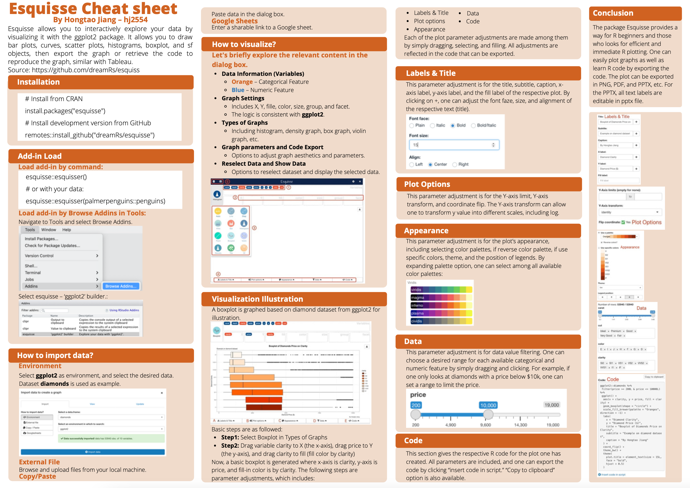

# Esquisse Cheat sheet

Hongtao Jiang - hj2554

My community contribution project is a cheat sheet of R package *`Esquisse`*. *Esquisse* allows you to interactively explore your data by visualizing it with the ggplot2 package. It allows you to draw bar plots, curves, scatter plots, histograms, boxplot, and sf objects, then export the graph or retrieve the code to reproduce the graph, similar with Tableau.

