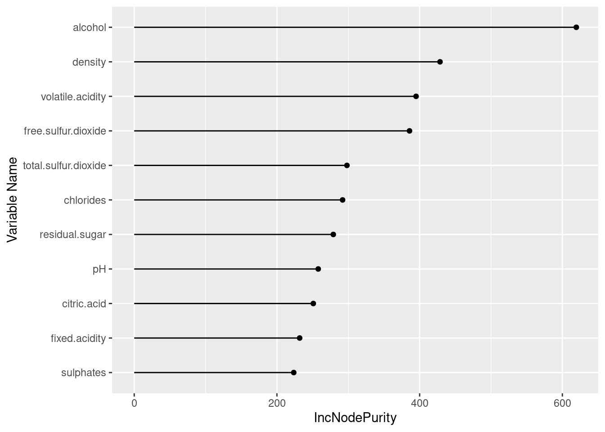

# Feature selection in r

Zehui Wu


```r
library(ggcorrplot)
library(caret)
library(randomForest)
library(gam)
```

## Introduction

Feature selection is one of the most important tasks to boost performance of machine learning models. Some of the benefits of doing feature selections include:

-   Better Accuracy: removing irrelevant features let the models make decisions only using important features. In my experience, classification models can usually get 5 to 10 percent improvement in accuracy scores after feature selection.

-   Avoid Overfitting: the models will not put weights in irrelevant features.

-   Improve running time: decreasing the dimension of the data makes the models run faster.

In this tutorial, I will introduce some of the intuitive and popular methods in R for feature selection.

## Correlation Matrix

Correlation matrix is a popular method for feature selection. By using correlation matrix, we can see the correlation for each pair of numerical variables. we not only can filter out variables with low correlation to the dependent variable, but also can remove redundant variables by identifying highly correlated independent variables.

To illustrate how to use this method, I use the Winequality regression dataset from UCI.


```r
# load the data
winequality <- read.csv("http://archive.ics.uci.edu/ml/machine-learning-databases/wine-quality/winequality-white.csv", sep = ";")
head(winequality)
```

```
##   fixed.acidity volatile.acidity citric.acid residual.sugar chlorides
## 1           7.0             0.27        0.36           20.7     0.045
## 2           6.3             0.30        0.34            1.6     0.049
## 3           8.1             0.28        0.40            6.9     0.050
## 4           7.2             0.23        0.32            8.5     0.058
## 5           7.2             0.23        0.32            8.5     0.058
## 6           8.1             0.28        0.40            6.9     0.050
##   free.sulfur.dioxide total.sulfur.dioxide density   pH sulphates alcohol
## 1                  45                  170  1.0010 3.00      0.45     8.8
## 2                  14                  132  0.9940 3.30      0.49     9.5
## 3                  30                   97  0.9951 3.26      0.44    10.1
## 4                  47                  186  0.9956 3.19      0.40     9.9
## 5                  47                  186  0.9956 3.19      0.40     9.9
## 6                  30                   97  0.9951 3.26      0.44    10.1
##   quality
## 1       6
## 2       6
## 3       6
## 4       6
## 5       6
## 6       6
```

I firstly use the cor() function to calculate correlation matrix.


```r
cor_matrix <- data.frame(cor(winequality))
cor_matrix
```

```
##                      fixed.acidity volatile.acidity  citric.acid residual.sugar
## fixed.acidity           1.00000000      -0.02269729  0.289180698     0.08902070
## volatile.acidity       -0.02269729       1.00000000 -0.149471811     0.06428606
## citric.acid             0.28918070      -0.14947181  1.000000000     0.09421162
## residual.sugar          0.08902070       0.06428606  0.094211624     1.00000000
## chlorides               0.02308564       0.07051157  0.114364448     0.08868454
## free.sulfur.dioxide    -0.04939586      -0.09701194  0.094077221     0.29909835
## total.sulfur.dioxide    0.09106976       0.08926050  0.121130798     0.40143931
## density                 0.26533101       0.02711385  0.149502571     0.83896645
## pH                     -0.42585829      -0.03191537 -0.163748211    -0.19413345
## sulphates              -0.01714299      -0.03572815  0.062330940    -0.02666437
## alcohol                -0.12088112       0.06771794 -0.075728730    -0.45063122
## quality                -0.11366283      -0.19472297 -0.009209091    -0.09757683
##                        chlorides free.sulfur.dioxide total.sulfur.dioxide
## fixed.acidity         0.02308564       -0.0493958591          0.091069756
## volatile.acidity      0.07051157       -0.0970119393          0.089260504
## citric.acid           0.11436445        0.0940772210          0.121130798
## residual.sugar        0.08868454        0.2990983537          0.401439311
## chlorides             1.00000000        0.1013923521          0.198910300
## free.sulfur.dioxide   0.10139235        1.0000000000          0.615500965
## total.sulfur.dioxide  0.19891030        0.6155009650          1.000000000
## density               0.25721132        0.2942104109          0.529881324
## pH                   -0.09043946       -0.0006177961          0.002320972
## sulphates             0.01676288        0.0592172458          0.134562367
## alcohol              -0.36018871       -0.2501039415         -0.448892102
## quality              -0.20993441        0.0081580671         -0.174737218
##                          density            pH   sulphates     alcohol
## fixed.acidity         0.26533101 -0.4258582910 -0.01714299 -0.12088112
## volatile.acidity      0.02711385 -0.0319153683 -0.03572815  0.06771794
## citric.acid           0.14950257 -0.1637482114  0.06233094 -0.07572873
## residual.sugar        0.83896645 -0.1941334540 -0.02666437 -0.45063122
## chlorides             0.25721132 -0.0904394560  0.01676288 -0.36018871
## free.sulfur.dioxide   0.29421041 -0.0006177961  0.05921725 -0.25010394
## total.sulfur.dioxide  0.52988132  0.0023209718  0.13456237 -0.44889210
## density               1.00000000 -0.0935914935  0.07449315 -0.78013762
## pH                   -0.09359149  1.0000000000  0.15595150  0.12143210
## sulphates             0.07449315  0.1559514973  1.00000000 -0.01743277
## alcohol              -0.78013762  0.1214320987 -0.01743277  1.00000000
## quality              -0.30712331  0.0994272457  0.05367788  0.43557472
##                           quality
## fixed.acidity        -0.113662831
## volatile.acidity     -0.194722969
## citric.acid          -0.009209091
## residual.sugar       -0.097576829
## chlorides            -0.209934411
## free.sulfur.dioxide   0.008158067
## total.sulfur.dioxide -0.174737218
## density              -0.307123313
## pH                    0.099427246
## sulphates             0.053677877
## alcohol               0.435574715
## quality               1.000000000
```

### heat map for correlation matrix

You can also draw a quick heat map to visualize the correlation with ggcorrplot library.

We can see free.Sulfur.dioxide and citric.acid have very small correlations with the dependent variable quality. You may consider to try removing these two features in the models.


```r
ggcorrplot(cor_matrix)
```


### function to find redundant variables

Besides from using graph to identify redundant variables, you can also use the findCorrelation function in caret library. It outputs the index of variables we need to delete. If two variables have a higher correlation than the cutoff, the function removes the variable with the largest mean absolute correlation.

In our case, the function finds out that density is highly correlated to other variables.


```r
findCorrelation(cor(winequality), cutoff=0.75)
```

```
## [1] 8
```

## Variable Importance

There are some functions in caret library to evaluate variable importance. Typically, variable importance evaluation can be separated into two categories: the ones that use model information and the ones that do not.

### calculate feature importance without models

If you don't want to use specific model to evaluate features, you can use the filterVarImp() function in Caret library.

For classification, this function uses ROC curve analysis on each predictor and use area under the curve as scores.

For regression, a linear line is fit between each pair of dependent variable and independent variables, and the absolute value of the t-statistic for the slope of the independent variable is used.

The data set Winequality is a regression task, so t-statistic of slopes are used. The two variables citric.acid and free.sulfur.dioxide have very low scores, which are consistent with our correlation analysis above.


```r
#use roc_curve area as score
roc_imp <- filterVarImp(x = winequality[,1:11], y = winequality$quality)

#sort the score in decreasing order
roc_imp <- data.frame(cbind(variable = rownames(roc_imp), score = roc_imp[,1]))
roc_imp$score <- as.double(roc_imp$score)
roc_imp[order(roc_imp$score,decreasing = TRUE),]
```

```
##                variable      score
## 11              alcohol 33.8584627
## 8               density 22.5812112
## 5             chlorides 15.0242170
## 2      volatile.acidity 13.8909397
## 7  total.sulfur.dioxide 12.4176561
## 1         fixed.acidity  8.0050275
## 9                    pH  6.9917109
## 4        residual.sugar  6.8603271
## 10            sulphates  3.7613401
## 3           citric.acid  0.6444005
## 6   free.sulfur.dioxide  0.5708506
```

### calculate feature importance with models

The advantage for using model-specific evaluation is that the feature scores are specific linked to model performance and using them to filter features may help improve performance for that specific model.

There are some models that do not have built-in importance score. For those models, we need to use the filterVarImp() function above. To check which models are available, see documentation of varImp(): <https://www.rdocumentation.org/packages/caret/versions/6.0-90/topics/varImp>

In the following example, I show that svm model does not have importance score implemented and varImp returns an error.


```r
#library(e1071)
#svmfit = svm(x= winequality[,1:11],y= winequality[,12], kernel = "linear", scale = TRUE)
#roc_imp2 <- varImp(svmfit, scale = FALSE)
```

I train a random forest regression model for the data set and use the varImp() function to calculate the feature importance based on this tree model. In the case of random forest model, varLmp() is a wrapper around the importance functions from the randomForest library.


```r
#train random forest model and calculate feature importance
rf = randomForest(x= winequality[,1:11],y= winequality[,12])
var_imp <- varImp(rf, scale = FALSE)
```

If you have too many features and want to use only 100 of them. You can choose to use the top 100 based on the feature importance scores.


```r
#sort the score in decreasing order
var_imp_df <- data.frame(cbind(variable = rownames(var_imp), score = var_imp[,1]))
var_imp_df$score <- as.double(var_imp_df$score)
var_imp_df[order(var_imp_df$score,decreasing = TRUE),]
```

```
##                variable    score
## 11              alcohol 619.5774
## 8               density 428.5766
## 2      volatile.acidity 395.0126
## 6   free.sulfur.dioxide 385.8036
## 7  total.sulfur.dioxide 298.1214
## 5             chlorides 292.0127
## 4        residual.sugar 279.0261
## 9                    pH 257.8875
## 3           citric.acid 250.9900
## 1         fixed.acidity 231.8449
## 10            sulphates 223.5628
```

We can see that the ranking here is different from the previous one and they are specifically linked to the performance of the random forest model.


```r
ggplot(var_imp_df, aes(x=reorder(variable, score), y=score)) + 
  geom_point() +
  geom_segment(aes(x=variable,xend=variable,y=0,yend=score)) +
  ylab("IncNodePurity") +
  xlab("Variable Name") +
  coord_flip()
```



## Univariate Feature Selection

Univariate tests are tests which involve only one dependent variable, including chi-sqaure test, analysis of variance, linear regressions and t-tests of means.

Univariate feature selection utilizes univariate statistical tests to each feature-outcome pair and selects features which perform the best in these tests.

The sbf() is used to do univariate feature selection with the model fitting function specified in the function argument of sbfControl() function. In the following example, I uses rfSBF, which use node purity to calculate scores.

To avoid overfitting by feature selection, sbf() function use several iterations of resampling to do feature selection. resampling methods can be boot, cv, LOOCV or LGOCV and can be specified in the method argument of sbfControl().

It will take several minutes to run.


```r
filterCtrl <- sbfControl(functions = rfSBF, method = "repeatedcv", repeats = 3)
rfWithFilter <- sbf(x= winequality[,1:11],y= winequality[,12], sbfControl = filterCtrl)
rfWithFilter
```

```
## 
## Selection By Filter
## 
## Outer resampling method: Cross-Validated (10 fold, repeated 3 times) 
## 
## Resampling performance:
## 
##    RMSE Rsquared    MAE  RMSESD RsquaredSD  MAESD
##  0.5929   0.5617 0.4254 0.02987    0.02853 0.0206
## 
## Using the training set, 11 variables were selected:
##    fixed.acidity, volatile.acidity, citric.acid, residual.sugar, chlorides...
## 
## During resampling, the top 5 selected variables (out of a possible 11):
##    alcohol (100%), chlorides (100%), citric.acid (100%), density (100%), fixed.acidity (100%)
## 
## On average, 11 variables were selected (min = 11, max = 11)
```

## Recursive Feature **elimination**

Recursive Feature elimination(RFE) is a popular method to choose a subset of features. It starts with all the features and removes feature with lowest score at each iteration. It trains with smaller and smaller subset of features and find the best set of features.

It will also take several minutes to run.


```r
filterCtrl <- rfeControl(functions=rfFuncs, method="cv", number=3)
results <- rfe(x= winequality[,1:11],y= winequality[,12], sizes=c(1:11), rfeControl=filterCtrl)
results
```

```
## 
## Recursive feature selection
## 
## Outer resampling method: Cross-Validated (3 fold) 
## 
## Resampling performance over subset size:
## 
##  Variables   RMSE Rsquared    MAE   RMSESD RsquaredSD    MAESD Selected
##          1 0.8715  0.03824 0.6674 0.008049   0.001206 0.002194         
##          2 0.7807  0.22928 0.6007 0.051466   0.108066 0.043003         
##          3 0.6857  0.40115 0.5234 0.015009   0.031381 0.009344         
##          4 0.6604  0.44687 0.4987 0.007830   0.017105 0.006722         
##          5 0.6504  0.46787 0.4885 0.010337   0.016068 0.003965         
##          6 0.6400  0.48008 0.4732 0.008266   0.009293 0.004494         
##          7 0.6357  0.48911 0.4674 0.007824   0.004995 0.002931         
##          8 0.6317  0.49697 0.4635 0.007815   0.005647 0.003683         
##          9 0.6287  0.50018 0.4595 0.008960   0.006963 0.002623         
##         10 0.6275  0.50276 0.4577 0.008974   0.007917 0.003633         
##         11 0.6251  0.50736 0.4557 0.008790   0.006558 0.003240        *
## 
## The top 5 variables (out of 11):
##    volatile.acidity, alcohol, free.sulfur.dioxide, pH, residual.sugar
```


```r
# plot the results
plot(results, type=c("g", "o"))
```


## 

## Resources:

<https://topepo.github.io/caret/variable-importance.html#model-independent-metrics>

<https://www.rdocumentation.org/packages/caret/versions/6.0-90/topics/varImp>

<https://machinelearningmastery.com/feature-selection-with-the-caret-r-package/>

<https://towardsdatascience.com/the-art-of-finding-the-best-features-for-machine-learning-a9074e2ca60d>

<https://rdrr.io/rforge/caret/man/sbfControl.html>
