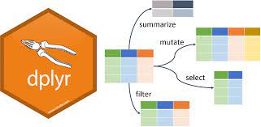

# R Dplyr vs Python Pandas

Yujia Xie
\
\

```{r, include=FALSE}
# this prevents package loading message from appearing in the rendered version of your problem set
knitr::opts_chunk$set(warning = FALSE, message = FALSE, eval=FALSE, cache=FALSE)

```


```{r, eval=FALSE}
# install.packages('reticulate')
library(reticulate)
library(tidyverse)
```

\
**Dplyr for R** and **Pandas for Python** are the two most popular libraries for working with tabular/structured data for many data scientists and business analysts. People are always arguing about which framework is better. I think they all perform well and it is crucial to choose the best practices for your needs. Your choice among those two will likely depend on the skills available in your organization, the infrastructure and code base available, and the advanced models required to be used. \
This document:

* Explores new tools that you can add to your repertoire as a data scientist.

* Helps you with the transition from one language/framework to the other.

* Creates a reference sheet to go from Dplyr to Pandas and back in case you forget the syntax.  

\  
  
### Dplyr for R Quick Overview
 

As one of the core packages of the tidyverse in the R programming language, dplyr is primarily a set of functions designed to enable dataframe manipulation in an intuitive, user-friendly way. While dplyr actually includes several dozen functions that enable various forms of data manipulation, the package features five primary verbs:  
  
* `filter()`, extract rows from a dataframe, based on conditions specified by a user;\
  
* `select()`, subset a dataframe by its columns;\
  
* `arrange()`, sort rows in a dataframe based on attributes held by particular columns;\

* `mutate()`, create new variables, by altering and/or combining values from existing columns;\

* `summarize()/summarise()`, collapse values from a dataframe into a single summary.\

These can all be used in conjunction with `group_by()` which changes the scope of each function from operating on the entire dataset to operating on it group-by-group. These six functions provide the verbs for a language of data manipulation. Together these properties make it easy to chain together multiple simple steps to achieve a complex result.\
Sources: https://r4ds.had.co.nz/transform.html#missing-values-1   
https://en.wikipedia.org/wiki/Dplyr  

\ 

### Pandas for Python Quick Overview


Pandas is a fast, powerful, flexible and easy to use open source data analysis and manipulation tool, built on top of the Python programming language. Its offers data structures and operations for manipulating numerical tables and time series. Pandas allows various data manipulation operations such as merging, reshaping, selecting as well as data cleaning, and data wrangling features.\
Pandas is an open source, BSD-licensed library providing:

* high-performance, easy-to-use data structures and data analysis tools
* Primary datastructures:\
  -_Series_: 1D array with a flexible index\
  -_Dataframe_: 2D matrix with flexible index and column names\

Sources: https://en.wikipedia.org/wiki/Pandas_(software)   
https://pandas.pydata.org/docs/reference/frame.html \
\

### Write Python in R Studio

Before we begin: \
Have your Python version of choice installed.\
Update R Studio. To be able to pass data structures between R and Python it’s best to have 1.2.1206 or later installed. \
Install/update the R reticulate package then load the library.\
\
Secondly, we point to the correct version of Python. \
You may have multiple versions of Python installed. If you’re using Mac, you will have a version of Python 2 installed by default as the OS uses. Typing `which -a python python3` into your terminal (Mac OS) and will give you a list of the paths of all the versions of Python on your machine.

In the below R chunk, we tell R to use my Python 3 interpreter, import the sys Python module and find out what version of Python that R is using.
```{r, eval=FALSE}
use_python("/usr/local/bin/python3", required = T)
sys <- import("sys")
sys$version
```


Now we are ready to write Python code by creating a Python chunk.
```{python, eval=FALSE}
# Python in a Python chunk
import pandas as pd
print("We are calling Python from R in a Python Chunk!")
```

Source: https://rpubs.com/onduuuu/python_in_r
\
\

## Dataset
We will use a 1000 random sample from Records of Yellowcab Taxi trips from January 2017.\
More info: https://www1.nyc.gov/site/tlc/about/tlc-trip-record-data.page \
\
Features:

* `pickup_datetime`: datetime of driver picked up the passenger
* `dropoff_time`: datetime of driver dropped off the passenger
* `trip_distance`: the total distance traveled by the yellowcab carrying this passenger
* `fare_amount`: the fee needs to pay by the passenger
* `tip_amount`: the tip amount given by the passenger to the driver
* `payment_type`: how does the passenger pay; either by credit card or by cash
* `day_of_week`: the day of the week when trip occured
* `is_weekend`: indicates whether trip happened during weekend
```{r echo=FALSE, warning=F, message=F}
r_df <- read_csv("resources/yujia_resources/yellowcab.csv", skip = 1) #second line is the column names
r_df
```
\
\

## The Tutorial and Reference Sheet

## Load Data 

### Dplyr
Use `readr::read_csv()`
```{r}
r_df <- readr::read_csv("resources/yujia_resources/yellowcab.csv", 
                 skip = 1) #second line is the column names
```

### Pandas
Use `pd.read_csv()`
```{python}
pd_df = pd.read_csv('resources/yujia_resources/yellowcab.csv',
                 sep=',',
                 header=1,
                 parse_dates=['pickup_datetime','dropoff_datetime'])
```

\
\

## Get Summary Info for DataFrame

### Dplyr
```{r}
r_df %>% str()
```

### Pandas
```{python}
pd_df.info()
```

\
\

## Selecting columns

It is very common that datasets have hundreds or even thousands of variables. We would like to narrow in on the variables we are really interested in.\

### Dplyr
`select()` can help us zoom in on a useful subset using operations based on the names of the variables.\
\
Select columns by column name
```{r eval=FALSE}
r_df %>% select(pickup_datetime, fare_amount, is_weekend)
```

Select all columns between `fare_amount` and `day_of_week` (inclusive)
```{r eval=FALSE}
r_df %>% select(fare_amount:day_of_week)
```

Select all columns except those from `fare_amount` to `day_of_week` (inclusive)
```{r eval=FALSE}
r_df %>% select(-(fare_amount:day_of_week))
```

There are a number of helper functions you can use within select():

* `starts_with("abc")`: matches names that begin with “abc”.

* `ends_with("xyz")`: matches names that end with “xyz”.

* `contains("ijk")`: matches names that contain “ijk”.

* `matches("(.)\\1")`: selects variables that match a regular expression. This one matches any variables that contain repeated characters. You’ll learn more about regular expressions in strings.

* `num_range("x", 1:3)`: matches x1, x2 and x3.
  

Select columns end with 'datetime'
```{r eval=FALSE}
r_df %>% select(ends_with("datetime"))
```


`select()` can be used in conjunction with the `everything()` helper. This is useful if you have a handful of variables you’d like to move to the start of the data frame.
```{r eval=FALSE}
r_df %>% select(is_weekend, trip_distance, everything())
```

Source: https://r4ds.had.co.nz/transform.html#missing-values-1  

### Pandas

Pass columns as list
```{python, eval=FALSE}
pd_df[['trip_distance', 'is_weekend']]
pd_df.loc[:, ['trip_distance', 'is_weekend']]
```

Use Filter Function
```{python, eval=FALSE}
pd_df.filter(items=['trip_distance', 'is_weekend'])
```

Select all columns between fare_amount and day_of_week (inclusive).\

* **loc** is label-based, which means that we have to specify the name of the rows and columns that we need to filter out.\
* **iloc** is integer index-based, we have to specify rows and columns by their integer index.\
* **loc** is inclusive on both sides and **iloc** is  left closed and right open.\
* Before `,` represents row; After `,` represents columns
```{python, eval=FALSE}
pd_df.loc[:, 'fare_amount':'day_of_week']
pd_df.iloc[:, 3:7]
```

Select all columns except those from `fare_amount` to `day_of_week` (inclusive)
```{python eval=FALSE}
pd_df.loc[:, ~pd_df.columns.isin(pd_df.columns[3:7])]
```

To select columns end with `datetime` in python.

* Use either regular expression with `filter()` function; More info about regular expression: https://docs.python.org/3/library/re.html
* Or use `.loc` with function `str.endswith()`
```{python eval=FALSE}
pd_df.filter(regex='datetime$',axis=1)
pd_df.loc[:, pd_df.columns.str.endswith("datetime")]
```

\
\

## Selecting Rows
Subset observations based on their values.\
Logical Operator:\

* `&` is “and”\
* `|` is “or”\
* `!` is “not”.\

### Dplyr
Mainly use `filter()` for subsetting rows.\

Only want to observe trips happened during weekends.
```{r eval=FALSE}
r_df %>% filter(is_weekend==TRUE)
```

Only want to observe trips happened during weekends and trip_distance is greater than 2 miles.
```{r eval=FALSE}
r_df %>% filter(is_weekend==TRUE & trip_distance > 2)
```

Only want to observe trips happened during weekdays and trip_distance is less than or equal to 2 miles.
```{r eval=FALSE}
r_df %>% filter(!(is_weekend==TRUE | trip_distance > 2))
r_df %>% filter(is_weekend==FALSE, trip_distance <= 2)
```

A useful short-hand for is `x %in% y`. This will select every row where `x` is one of the values in `y`
```{r eval=FALSE}
r_df %>% filter(as.Date(pickup_datetime) %in% c(as.Date('2017-01-15'), as.Date('2017-01-16')))
# same as
r_df %>% filter(as.Date(pickup_datetime)==as.Date('2017-01-15') | as.Date(pickup_datetime)==as.Date('2017-01-16'))
```

Source: https://r4ds.had.co.nz/transform.html#missing-values-1  

### Pandas

In Pandas we can either use the indexing approach
```{python, eval=FALSE}
pd_df[(pd_df.is_weekend==True) & (pd_df.trip_distance > 2)]
```

Or try out the handy query API
```{python, eval=FALSE}
pd_df.query("is_weekend==True & trip_distance > 2")
```

Show trips that have `pickup_datetime` in Jan 15th and Jan 16th
```{python, eval=FALSE}
pd_df.loc[(pd_df['pickup_datetime'] >= '2017-01-15') & (pd_df['pickup_datetime'] < '2017-01-17')]
```


`.isin()`:

* For "IN" use: something.isin(somewhere).
* For "NOT IN": ~something.isin(somewhere).

Show trips that not happened in the 3rd, 5th, and 6th of the week.
```{python, eval=FALSE}
pd_df.loc[~pd_df.day_of_week.isin([3,5,6])]
```

\
\

## Delete / Add column(s)
Sometimes we would like to vertically subset the dataframe or add new columns to the dataframe

### Dplyr

We use the the function `mutate()` to add column(s).\
Lets say we want to add a column named `total_payment` which is the sum of `fare_amount` and `tip_amount` and a new column `total_payment_per_mile` which is `total_payment` divided by `trip_distance`.
```{r eval=FALSE}
r_df <- r_df %>% mutate(total_payment = fare_amount + tip_amount,
                        total_payment_per_mile = total_payment / trip_distance)
```

We use the the function `select()` to drop column(s).\
Drop the newly added two columns`is_weekend` and `pickup_datetime`
```{r eval=FALSE}
r_df <- r_df %>% select(-c(total_payment, total_payment_per_mile))
```

### Pandas

Add column(s)
```{python, eval=FALSE}
pd_df['total_payment'] = pd_df.fare_amount + pd_df.tip_amount
pd_df['total_payment_per_mile'] = pd_df.total_payment / pd_df.trip_distance
```

Drop column(s) in Pandas use `drop()`. `axis=1` is used to indicate column-wise operations. Set `inplace=True` to overwrite the current dataframe.
```{python, eval=FALSE}
pd_df.drop(['total_payment', 'total_payment_per_mile'], axis=1, inplace=True)
```

\
\

## Rename Columns

If we want to rename two features; one from `trip_distance` to `trip_dist` and the other from `fare_amount` to `fare_amt`. In Pandas we supply a dictionary that says `{'trip_distance': 'trip_dist', 'fare_amount': 'fare_amt'}` and in Dplyr it is the exact opposite way `trip_dist=trip_distance` and `fare_amt = fare_amount`.\

### Dplyr

We use the function `rename()` in dplyr
```{r}
r_df <- r_df %>% rename(trip_dist = trip_distance, fare_amt = fare_amount)
```

### Pandas

We use the function `rename()` in pandas
```{python, eval=FALSE}
pd_df.rename(columns = {'trip_distance': 'trip_dist', 'fare_amount': 'fare_amt'}, inplace = True)
```

\
\

## Change order of columns

### Dplyr

We use the function `relocate()`, and `.before` or `.after` to place a column before or after another specified column.\
Move the column `day_of_week` after `dropoff_datetime`
```{r}
r_df <- r_df %>% relocate(day_of_week, .after = dropoff_datetime)
```

### Pandas

Use the function `reindex()` to change order of columns in pandas
```{python, eval=FALSE}
pd_df.reindex(['pickup_datetime','dropoff_datetime','day_of_week','trip_distance','fare_amount','tip_amount','payment_type', 'is_weekend'], axis=1)
```

\
\

## Change cell based on conditions

We want to change `fare_amount` based on the `trip_distance`. Let's say if `trip_distance < 2`, then `fare_amount*1.2`; if `2 <= trip_distance < 5`, then `fare_amount*1.5`; if `5 <= trip_distance < 10`, then `fare_amount*1.7`; else `fare_amount*2`

### Dplyr

We use the the function `mutate()` along with the function  `case_when`
```{r eval=FALSE}
r_df <- r_df %>% mutate(fare_amount = case_when(trip_distance < 2 ~ fare_amount*1.2,
                                                trip_distance >= 2 & trip_distance < 5 ~ fare_amount*1.5,
                                                trip_distance >= 5 & trip_distance < 10 ~ fare_amount*1.7,
                                                TRUE ~ fare_amount*2))
```

### Pandas

The way we do python requires more work.
Each `mask` represents one condition, and we change cell values based on conditions.
```{python, eval=FALSE}
mask1 = pd_df.trip_distance < 2
mask2 = (pd_df.trip_distance >= 2) & (pd_df.trip_distance < 5)
mask3 = (pd_df.trip_distance >= 5) & (pd_df.trip_distance < 10)
mask4 = pd_df.trip_distance >= 10
pd_df.fare_amount[mask1] = (pd_df.fare_amount[mask1])*1.2
pd_df.fare_amount[mask2] = (pd_df.fare_amount[mask2])*1.5
pd_df.fare_amount[mask3] = (pd_df.fare_amount[mask3])*1.7
pd_df.fare_amount[mask4] = (pd_df.fare_amount[mask4])*2
```

\
\

## Distinct values per column
Find distinct/unique values in a column. 

### Dplyr

We use the the function `distinct()`
```{r eval=FALSE}
r_df %>% select(day_of_week) %>% distinct()
```

### Pandas

We use the `unique()` method
```{python, eval=FALSE}
pd_df.day_of_week.unique()
```

\
\

## Sort by values
Sort the dataframe by certain feature. The default for both Dplyr and Pandas is in ascending order.

### Dplyr

We use the the function `arrange()`. \
Sort the dataframe by `tip_amount` in descending order.
```{r eval=FALSE}
r_df %>% arrange(desc(tip_amount))
```

### Pandas

We use the `sort_values()` method. 
```{python, eval=FALSE}
pd_df.sort_values('tip_amount', ascending=False)
```

\
\

## Count number of records per group
Finding count for number of entries for certain groups 

### Dplyr

We first use `group_by()` and then count entries using `count()` or `tally()`
```{r eval=FALSE}
r_df %>% group_by(day_of_week) %>% count()
r_df %>% group_by(day_of_week) %>% tally()
r_df %>% group_by(day_of_week) %>% summarise(count = n())
```

### Pandas

We use the `value_counts()` method
```{python, eval=FALSE}
pd_df.value_counts('day_of_week')
pd_df.day_of_week.value_counts()
```

\
\

## Summarize / Aggregate
A groupby operation involves some combination of splitting the object, applying a function, and combining the results. This can be used to group large amounts of data and compute operations on these groups. 

### Dplyr

**Aggregate over entire columns** when we want to create descriptive statistics for one or multiple columns. We use `summarise()`
```{r eval=FALSE}
r_df %>% summarise(across(everything(), mean))
r_df %>% summarise(across(everything(), min))
```

Summarize / Aggregate by group when we want to have aggregate statistics for certain groups. We use the function `group_by()` along with `summarise()` or `summarise_all()`.\
\
**Aggregate by group for all columns.**\
Find all mean and max values for every features for each day of the week. Remove NA during calculation since otherwise we may get NA as the result which is not meaningful.
```{r eval=FALSE}
r_df %>% group_by(day_of_week) %>% summarise_all(list(mean, max), na.rm=TRUE)
```

**Aggregate by group for a specific column.**\
Find mean and max values for `trip_distance` for each day of the week.\
It will be a good idea for always setting `na.rm=TRUE` if we do not know whether we have NA values in the column that we want to find mean/max/min/... In our case we do not really need `na.rm=TRUE` because there is no NA value under feature `trip_distance`.
```{r eval=FALSE}
r_df %>% group_by(day_of_week) %>% summarise(mean=mean(trip_distance), max=max(trip_distance))
```


### Pandas

Get mean and min for each column
```{python, eval=FALSE}
pd_df.agg(['mean', 'min'])
```

Aggregate by group for all columns. We use `groupby()` along with `agg()`
```{python, eval=FALSE}
pd_df.groupby(['day_of_week']).agg(['mean', 'max'])
```

Aggregate by group for specific column. We use `groupby()` along with `agg()`
```{python, eval=FALSE}
pd_df.groupby(['day_of_week']).agg({'trip_distance':['mean', 'max']})
```

\
\


## Slicing
Indexing in Python starts at 0 and in R at 1.

### Dplyr

**Slicing by row** when we know the exact row number you want to extract.\
Select 20th row to 25th row (inclusive)
```{r eval=FALSE}
r_df %>% slice(c(20:25))
```

Find the first 3 records using the function `slice_head()`
```{r eval=FALSE}
r_df %>% slice_head(n = 3)
```

Find the the last 1% of total records using the function `slice_tail()`
```{r eval=FALSE}
r_df %>% slice_tail(prop = 0.01)
```

**Slicing top and bottom records by value** \

Find the 5 records with the highest `tip_amount` using the function `slice_max()`
```{r eval=FALSE}
r_df %>% slice_max(tip_amount, n = 5)
```

Find the 1% of total records with the lowest `tip_amount` using the function `slice_min()`
```{r eval=FALSE}
r_df %>% slice_min(tip_amount, prop = 0.01)
```

**Slicing top and bottom records by value and group**\

Find the 2 records with the highest `tip_amount` per `day_of_week` using the function `slice_max()` along with `group_by()`.\
`with_ties` specify if records with equal values should be included or not.
```{r eval=FALSE}
r_df %>% group_by(day_of_week) %>% slice_max(tip_amount, n = 2)
```

Find the 1% of total records with lowest the `tip_amount` per `day_of_week` using the function `slice_min()` along with `group_by()`
```{r eval=FALSE}
r_df %>% group_by(day_of_week) %>% slice_min(tip_amount, prop = 0.01, with_ties = FALSE)
```

**Sampling-Slicing random records (per group)**\
Sampling can be done on the entire dataset or equally distributed based on a group.\

Use the function `slice_sample()` by specifying `n` for a fixed amount or `prop` for a proportion of records. By default, `replace = FALSE`\

Return 20 random samples without replacement
```{r eval=FALSE}
r_df %>% slice_sample(n = 20)
```

Return 10% of total records with replacement
```{r eval=FALSE}
r_df %>% slice_sample(prop = 0.1, replace=TRUE)
```

Return 10% of total records split by group with replacement
```{r eval=FALSE}
r_df %>% group_by(is_weekend) %>% slice_sample(prop = 0.1, replace=TRUE)
```


### Pandas

**Slicing by row** by using `.iloc`
Select 20th row to 25th row (inclusive). Note that Python index start at 0.
```{python, eval=FALSE}
pd_df.iloc[range(19, 25)]
```

Use `head()` or `tail()` to get a fixed amount of records from top or bottom of the dataframe. Unlike dplyr, we have to do some computations if we want to extract a proportion
```{python, eval=FALSE}
pd_df.head(n = 5)
pd_df.tail(n = len(pd_df)*0.01)
```

**Slicing top and bottom records by value** using `nlargest()` or `nsmallest()`.Unlike dplyr, we first sort the column and then do some computations if we want to extract a proportion
```{python, eval=FALSE}
pd_df.nlargest(5, 'tip_amount')
pd_df.sort_values('tip_amount', ascending=False).head(int(len(pd_df)*0.01))
```

**Slicing top and bottom records by value and group** using `groupby()`, `nlargest()` or `nsmallest()`, and `lambda` function.\
Find the 2 records with the highest `tip_amount` per `day_of_week`
```{python, eval=FALSE}
pd_df.groupby('day_of_week',group_keys=False).apply(lambda x: x.nlargest(2, 'tip_amount'))
```

Find the 1% of total records with lowest the `tip_amount` per `day_of_week`
```{python, eval=FALSE}
pd_df.groupby('day_of_week',group_keys=False).apply(lambda x: x.nsmallest(int(len(x) * 0.01), 'tip_amount'))
```

**Sampling-Slicing random records (per group)**

```{python, eval=FALSE}
pd_df.sample(n=20)
pd_df.sample(frac=0.1, replace=True)
pd_df.groupby('is_weekend').sample(frac=0.1, replace=True)
```

\
\

## Join two tables
Suppose we now have 2 dataframes `A` and `B`, both have common column called `key`

### Dplyr

`inner_join()`, `left_join()`, `right_join()`, `full_join()`
```{r eval=FALSE}
A %>% inner_join(B, by="key")
A %>% left_join(B, by="key")
A %>% right_join(B, by="key")
A %>% full_join(B, by="key")
```

  
### Pandas

`merge` function can perform all join operations by specifying how (outer, inner, left, right) and on which key
```{python, eval=FALSE}
pd.merge(A, B, how="inner", on="key")
pd.merge(A, B, how="left", on="key")
pd.merge(A, B, how="right", on="key")
pd.merge(A, B, how="outer", on="key")
```

\
\

## Bind Rows and Columns
Suppose we now have 2 dataframes `A` and `B`

### Dplyr

`bind_rows()` and `bind_columns()`.
Automatically filled NA if values don’t appear in one of the dataframes.
```{r eval=FALSE}
A %>% bind_rows(B)
A %>% bind_columns(B)
```


### Pandas

`concat()` method can concatenates dataframes by rows (default `axis = 0`) or by columns (`axis = 1`).
Automatically filled NA if values don’t appear in one of the dataframes.
```{python, eval=FALSE}
pd.concat([A,B], axis=1)
```

\
\


