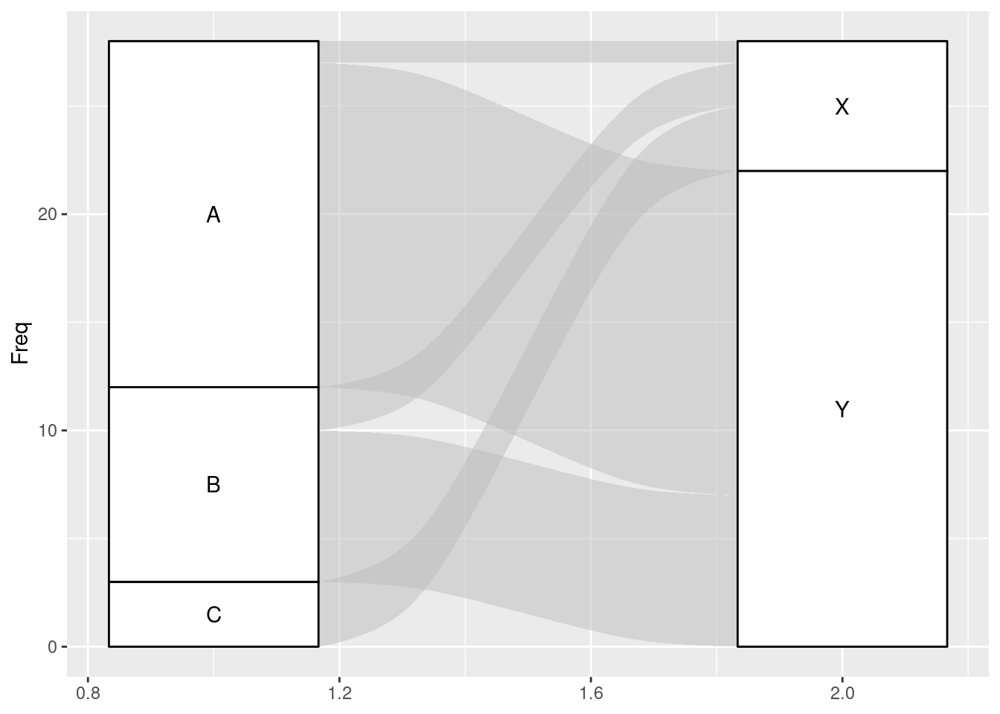
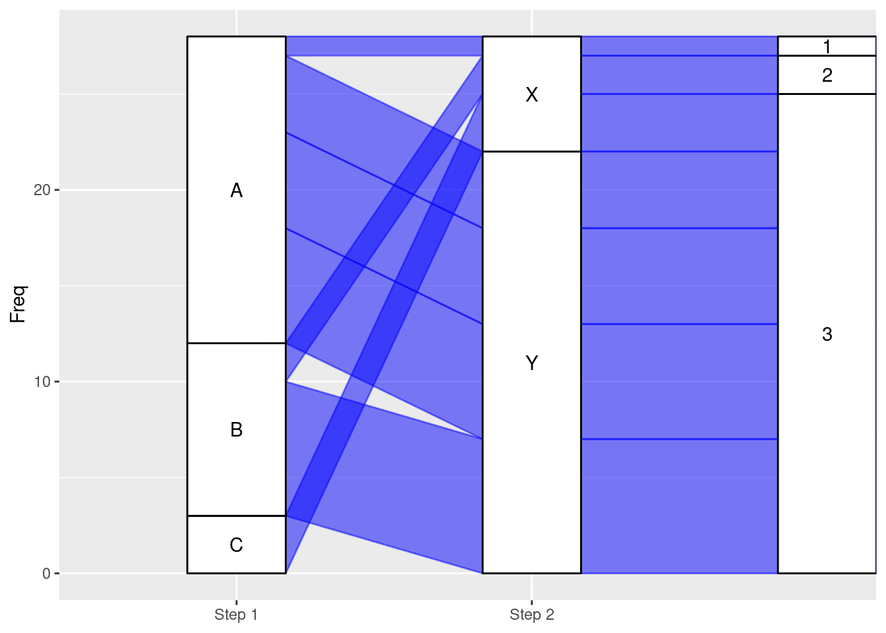
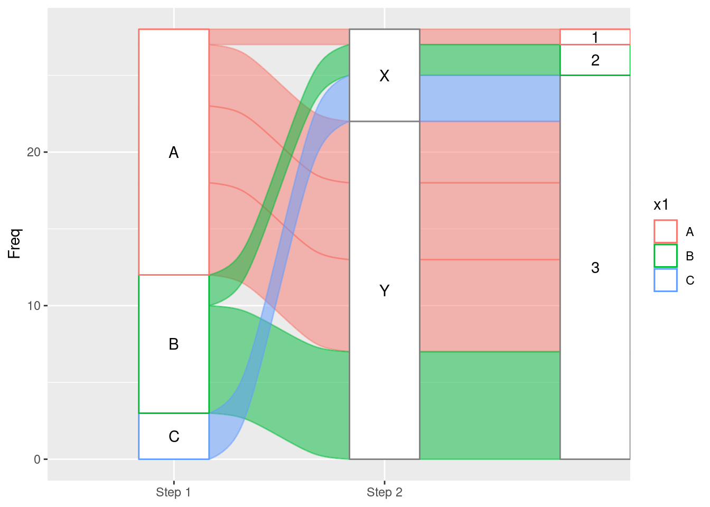

# ggalluvial Cheatsheet

Meggie Wen

##Intro to ggalluvial:

The ggalluvial package is
a ggplot2 extension for producing alluvial plots. Alluvial plots use variable-width ribbons and stacked bar plots to represent multi-dimensional or repeated-measures data with categorical or ordinal variables.

## Description:

Alluvial plots consist of multiple horizontally-distributed columns (axes) representing factor variables, vertical divisions (strata) of these axes representing these variables’ values; and splines (alluvial flows) connecting vertical subdivisions (lodes) within strata of adjacent axes representing subsets or amounts of observations that take the corresponding values of the corresponding variables.

This dataframe is originally created for illustration:


```r
library(tidyverse)
library(ggalluvial)
df <- data.frame(x1 = c("A","B","C","A","A","A","B"),
                 x2 = c("X","X","X","Y","Y","Y","Y"),
                 x3 = c("1","2","3","3","3","3","3"),
                 Freq = c(1,2,3,4,5,6,7))
```

**Basic Alluvial Plot:**

ggplot(df, aes(axis1 = x1, axis2 = x2, y = Freq)) +

geom_alluvium() +

geom_stratum() +

geom_text(stat = "stratum", aes(label = paste(after_stat(stratum))))

**Example 1:**


```r
ggplot(df, aes(axis1 = x1, axis2 = x2, y = Freq)) +
  geom_alluvium() +
  geom_stratum() +
  geom_text(stat = "stratum", aes(label = paste(after_stat(stratum))))
```



**Add color:**

• Set all lines into one color: 

    geom_alluvium(color = “blue”, fill = “blue”)
    
• Set color by categories: 

    geom_alluvium(aes(color = x1, fill = x1))
    
• Set stratum color: 

    geom_stratum(aes(fill = x1))
    
**Add label:**

scale_x_discrete(limits = c("Step 1", "Step 2”))
  
**Change curve type:**

geom_alluvium(color = “blue”, fill = “blue”), curve_type = “linear”)

**Example 2:**


```r
ggplot(df, aes(axis1 = x1, axis2 = x2, axis3 = x3, y = Freq)) +
  geom_alluvium(color = "blue", fill = "blue",curve_type = "linear") +
  geom_stratum() +
  geom_text(stat = "stratum", aes(label = paste(after_stat(stratum)))) +
  scale_x_discrete(limits = c("Step 1", "Step 2")) 
```




**Multi-variable Alluvial Plot:**

ggplot(data = df, aes(axis1 = x1, axis2 = x2, axis3 = x3, ..., y = frequency)

**Example 3:**


```r
ggplot(df, aes(axis1 = x1, axis2 = x2, axis3 = x3, y = Freq)) +
  geom_alluvium(aes(color = x1, fill = x1)) +
  geom_stratum(aes(color = x1)) +
  geom_text(stat = "stratum", aes(label = paste(after_stat(stratum)))) +
  scale_x_discrete(limits = c("Step 1", "Step 2")) 
```


