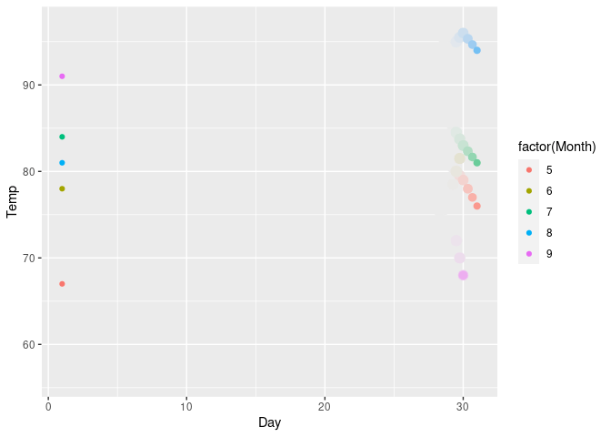
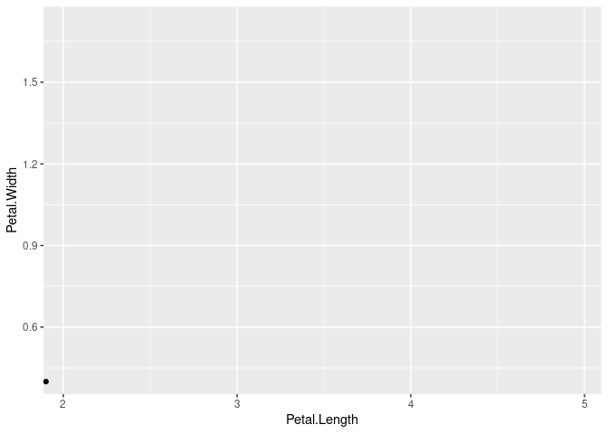

# GGanimate cheatsheet

Siyu Li


```r
library(ggplot2)
# remotes::install_github('thomasp85/gganimate')
# remotes::install_github('thomasp85/transformr')
library(gganimate)# must be installed from source
```

## PDF cheatsheet
Please click the link:
[gganimate_cheatsheet](https://github.com/lisiyu98/gganimate_cheatsheet/blob/main/gganimate_cheatsheat.pdf){target="_blank"}


## Introduction
gganimate extends the grammar of graphics as
implemented by ggplot2 to include the description of animation. It does this by providing a
range of new grammar classes that can be added
to the plot object in order to customise how it
should change with time.

## Installation
```
install.packages('devtools')
devtools::install_github('thomasp85/gganimate')
devtools::install_github('thomasp85/transformr')
```
NOTE: May also need install 'gifski' and 'av' package.

## Basic function
```
p <- ggplot()+
   geom_point()+//or other kinds of graph
   transition_states(states, transition_length,
state_length)+
   view_follow(fixed_x,fixed_y)+
   shadow_wake(wake_length,size,alpha)
   enter_fade()+
   exit_shrink()+
   ease_aes(default=’linear’)
animate(p)
anim_save(filename,path)
```
• transition_∗():
defines how the data should be spread out
and how it relates to itself across time.

• view_∗():
defines how the positional scales should
change along the animation.

• shadow_∗():
defines how data from other points in time
should be presented in given point in time.

• enter_∗()/exit_∗():
defines how new data should appear and
how old data should disappear during the
course of the animation.

• ease_aes():
defines how different aesthetics should be
eased during transitions.

• animate():
render a gganimate object.

• anim_save():
save an animation to a file.

### Transition
#### transition_states
Transition between several distinct stages of the data

```r
anim<-ggplot(iris, aes(Sepal.Width, Petal.Width)) +
geom_point() +
labs(title = "{closest_state}") +
transition_states(Species, transition_length = 3, state_length = 1)
animate(anim)
```


#### transition_filter
Transition between different filters

```r
anim<-ggplot(iris,aes(Petal.Width,Petal.Length,
colour=Species))+
geom_point()+
transition_filter(
transition_length=2,filter_length = 1,
Setosa=Species=='setosa',
Long = Petal.Length>4,
Wide = Petal.Width>2)
animate(anim)
```


#### transition_layers
Build up plot layer by layer

```r
ggplot(mtcars, aes(mpg, disp)) +
geom_point() +
geom_smooth(colour = 'grey', se = FALSE) +
geom_smooth(aes(colour = factor(gear))) +
transition_layers(layer_length = 1, transition_length = 2,
from_blank = FALSE, layer_order = c(3, 1, 2)) +
enter_fade() + enter_grow()
```


#### transition_reveal&transition_time

```r
anim<-ggplot(airquality,aes(Day,Temp,group=
Month))+geom_line()+
geom_point(aes(group=seq_along(Day)),size
=3,color='red')+
transition_reveal(Day)
animate(anim)
```


```r
anim<-ggplot(airquality,aes(Day,Temp))+
geom_point(aes(colour=factor(Month)))+
transition_time(Day)
animate(anim)
```


### Shadow
#### shadow_mark
Show original data as background

```r
anim <- ggplot(airquality,aes(Day,Temp,colour = factor(Month))) +
geom_point() +
transition_time(Day)
anim1<-anim+shadow_mark(colour='black',size = 0.75,past = TRUE, future = FALSE)
animate(anim1)
```


#### shadow_trail
A trail of evenly spaced old frames

```r
anim2 <- anim +
shadow_trail(distance=0.4,alpha = 0.3, shape = 2)
animate(anim2)
```


#### shadow_weak
Show preceding frames with gradual falloff

```r
anim3<-anim+shadow_wake(wake_length=0.1,size=2,alpha =FALSE,colour='grey92')
animate(anim3)
```



### View
#### view_follow
Let the view follow the data

```r
anim<-ggplot(iris,aes(Sepal.Length, Sepal.Width))+
geom_point()+labs(title = "closest_state")+
transition_states(Species,transition_length=4
,state_length=1)
anim1<-anim+view_follow(fixed_x=TRUE,
fixed_y=FALSE)
anim2<-anim+view_follow(fixed_x=c(4,NA),
fixed_y=c(2,NA))
```


```r
animate(anim1)
```


```r
animate(anim2)
```


#### view_step
Follow the data in steps.

NOTE: The use of view_step is relative to transition_states. If the transition doesn’t wrap, then the view shouldn’t either.

```r
anim<-ggplot(iris,aes(Petal.Length,Petal.Width))+
geom_point()+
transition_states(Species, transition_length=1)+
view_step(pause_length=2,step_length=1,
nsteps =3,pause_first=TRUE)
animate(anim)
```



### Animation
```
animate(plot, nframes, fps, height, width, duration, detail, renderer, device, ref_frame, start_pause,
end_pause, rewind,...)
anim_save(filename, animation=last_animation(), path=NULL, ...)
```

## Example

```r
ggplot(mtcars, aes(factor(cyl), mpg)) +
geom_boxplot() +
transition_states(
gear,
transition_length = 2,
state_length = 1
) +
enter_fade() +
exit_shrink() +
ease_aes('sine-in-out')
```


```r
library(gapminder)
ggplot(gapminder, aes(gdpPercap, lifeExp, size =
pop, colour = country)) +
geom_point(alpha=0.7,show.legend=FALSE)+
scale_colour_manual(values=country_colors)+
scale_size(range = c(2, 12))+scale_x_log10()+
facet_wrap(~continent) +
labs(title='Year: frame_time', x='GDP per
capita', y='life expectancy') +
transition_time(year) +
ease_aes('linear')
```


## References

[official github](https://github.com/thomasp85/gganimate/){target="_blank"}

[official introduction pdf](https://cran.r-project.org/web/packages/gganimate/gganimate.pdf){target="_blank"}
