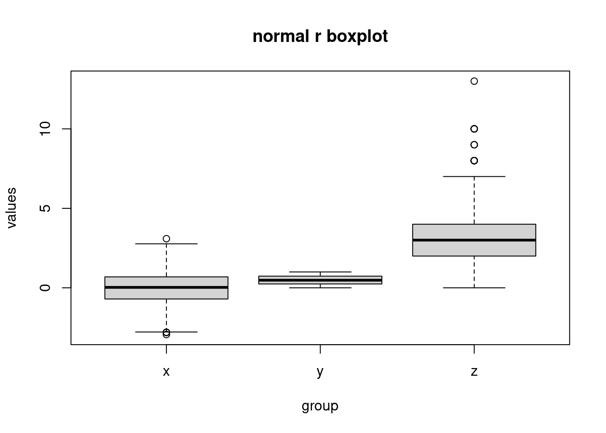
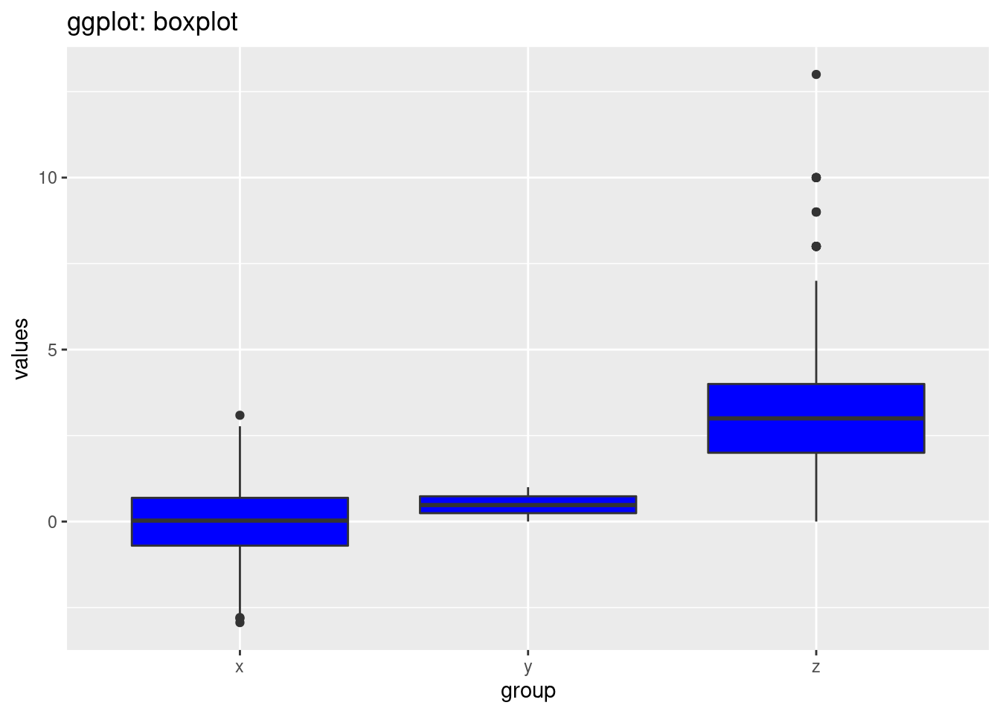
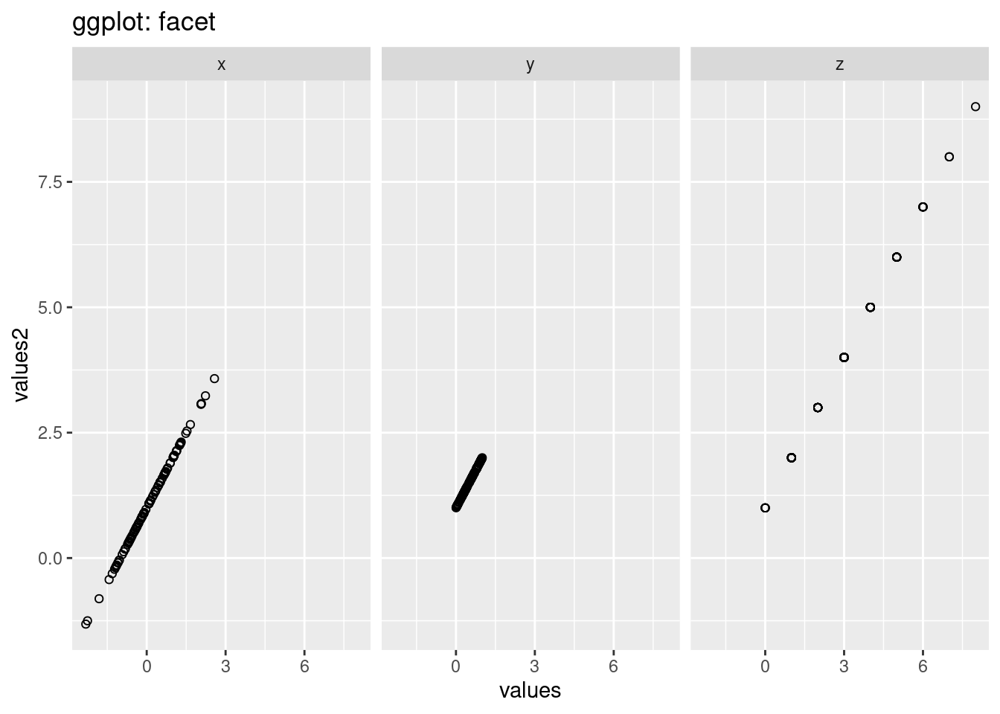

# Base r vs. ggplot2 visualization

Yiquan Li and Zezhong Fan


### Scatterplot

a) Base R


```r
# dataset
data("mtcars")
```


```r
plot(mtcars$wt,mtcars$mpg, main="Scatterplot in Base R",
   xlab="Car Weight", ylab="MPG", 
   pch=4, col = "blue", lwd=1, cex = 2)
abline(lm(mtcars$mpg~mtcars$wt), col="red")
text(mtcars$wt, mtcars$mpg, labels=rownames(mtcars), cex=0.5, font=2)
```


b) ggplot2


```r
ggplot(mtcars, aes(x=wt, y=mpg)) +
  geom_point(size=5, shape=4, color="blue", stroke=1) + 
  geom_smooth(method=lm, color="red") +
  ggtitle("Scatterplot in ggplot2") +
  xlab("Car Weight") + # for the x axis label
  geom_text(label=rownames(mtcars),cex=3)
```


From the comparison above, we can see that for dot style, dot color, dot size, dot thickness, axes labels and graph title, both ggplot2 and base r can adjust these features in a single statement or in an integrate. 

But when we try to do more fancy tasks, such as fit a best regression line on the data points, or label each data point, we see that in base r we can no longer just add these features to the original plot, but we have to write separate statement to create new graphs from the original dataset, and superimpose the plots on the original one. (In each saperate statment, we need to call the dataset 'mtcars' again) This is not only inefficient but also hard to read because we need to find the "plot()" function and be careful that all the functions after it, such as "abline()" and "text()", will also create new features on the top of the first plot. 

Instead, ggplot2 can create new features simply by adding new component on the original statement (Dataset 'mtcars' is only called once). Adding "geom_smooth()" can fit and visualize a best regression line on the data point. It also gives extra information in the blur around line which shows the 95% confidence interval on the fitted values. Adding "geom_text()" can easily label each data point. In this way, the plots are created in a more organized way, and the code is more efficient and readable.

### Line chart

#### Single line

a) Base R


```r
plot(mtcars$wt, mtcars$mpg, main="Line chart in Base R", type = "o",col="red")
```


b) ggplot2


```r
ggplot(data=mtcars, aes(x=wt, y=mpg, group=1)) +
  geom_line(colour="red", size=1.5) +
  geom_point(colour="red", size=4, shape=21, fill="white") +
  ggtitle("Line chart in ggplot2") 
```


For the two plots above, we try to use the as similar code as possible to create the line charts in base r and using ggplot2. But we can see that the resulting plots are very different. The line chart created in base r is very messy because it is created by the order of original data set. However, for line chart created using ggplot2, it automatically sorts the independent variable plots on x-axis. So, the resulting plot is much more clear and can show a much better relationship between the two variables. From this perspective, ggplot2 is cleverer than base r in terms of giving meaningful infomation.

#### Multiple line

a) Base R


```r
# data created
x <- 1:5
v <- c(7,12,28,3,41)
t <- c(14,7,6,19,3)

plot(x, v, type = "l",col = "red", ylab = "y", main = "Multiple line in Base R")
lines(x, t, type = "l", col = "blue")
```


b) ggplot2


```r
ggplot() + 
  geom_line(aes(x = x, y = v), color = "blue") +
  geom_line(aes(x = x, y = t), color = "red") +
  ylab('y') + 
  ggtitle("Multiple lines in ggplot2") 
```


For multiple-line chart, we see the same problem as in scatter plot again. That is when we want to add another line on the original plot, in base r we need to write another statement using "lines()", which makes the code harder to read and understand. In ggplot2, its very clear that whenever we add a "geom_line()", a new line will appear in our "ggplot()".

#### Line chart by groups 

a) Base R


```r
newdata <- mtcars[order(mtcars$wt),]
cyl_4=newdata[newdata$cyl==4,]
cyl_6=newdata[newdata$cyl==6,]
cyl_8=newdata[newdata$cyl==8,]
plot(cyl_4$wt, cyl_4$mpg, type = "l", col="red", xlim = c(min(mtcars$wt), max(mtcars$wt)), ylim=c(min(mtcars$mpg), max(mtcars$mpg)), main = "Line chart by groups in base r")
lines(cyl_6$wt, cyl_6$mpg, type = "l", col = "green")
lines(cyl_8$wt, cyl_8$mpg, type = "l", col = "blue")
```


b) ggplot2


```r
mtcars$cyl <- as.factor(mtcars$cyl)
ggplot(mtcars, aes(x=wt, y=mpg, col=cyl)) + geom_line() + ggtitle("Line chart by groups in ggplot2") 
```


If we want to use different color to represent different groups, and draw the lines for different groups in the same graph, using ggplot2 will be very convenient. We only need to transform the feature we want to group by into a factor. And then, one argument 'col=feature' can do all the job for us and gives perfect lines in different color. 

But in base r, we can see that to fulfill the same task, we need to write much more codes and takes much more time. We first need to order the dependent variable on x-axis. Then, we need to generate dataframes for each group, create one line chart using one dataframe, and then add the lines one by one. 

So, for some complicated tasks, ggplot2 gives very fast and easy solution whereas base r still requires more manual implementation.

### histogram

a) Base R


```r
hist(mtcars$mpg, freq=FALSE,breaks=10,border="blue", 
     col="green", density=50, right=TRUE, main="Histogram in base r") 
lines(density(mtcars$mpg), col="red")
```


b) ggplot2


```r
ggplot(data=mtcars, aes(mpg)) + 
  geom_histogram(aes(y=..density..), bins = 12, closed = "right",color="blue", fill="green",alpha=0.5) +
  geom_density(alpha=0.6, color= "red") + 
  ggtitle("Histogram in ggplot2") 
```


For histogram, both base r and ggplot2 can reach the same effect using minimum code. But when we want to add a density curve on top of the histogram, ggplot2 is again more readable.

### Bar Chart

a) Base R


```r
# dataset
data = data.frame(sex = factor(c('Male','Female'),levels = c('Male','Female')), height = c(175.26,162.56))

barplot(data$height, names.arg = data$sex, col = '#DD8888', main = 'RPlot:Mean Height between Sex in US' )
```


b) ggplot2


```r
ggplot(data = data,aes(x = sex, y = height))+
  geom_bar(colour = 'black',fill = '#AFC0CB',stat = 'identity')+
  xlab('Sex')+ylab('Mean Height in US')+
  ggtitle('GGPlot: Mean Height between Sex in US')
```


From the comparison of two graphs, we can find that in ggplot2, the background is grey and have grids to make users  visualize the scales more clearly. Besides, the title and labels are lighter that normal plots in R itself. From the perspectives of codes, we can say the coding style is different between ggplot2 and R. In ggplot2, we can see that the code is divided into different components and then the codes is linked by '+'. However, in normal R, we use the function in R and set the parameters and labels we need inside the funtion itself. 

### Boxplot

a) Base R


```r
# data set
x <- rnorm(1000)
y <- runif(1000)                                             
z <- rpois(1000, 3)

data <- data.frame(values = c(x, y, z),                     
                   group = c(rep("x", 1000),
                             rep("y", 1000),
                             rep("z", 1000)))
boxplot(values ~ group, data, main = 'normal r boxplot')  
```



b) ggplot2


```r
ggplot(data,aes(x = group, y = values))+
  geom_boxplot(fill = 'blue')+
  ggtitle('ggplot: boxplot')
```



we can also see that in the ggplot2, the background is grey and have grids to make users  visualize the scales more clearly. Another big difference is the breaks in the y scale. The default breaks are different between ggplot and normal r. The code style is also different. In ggplot2, we can see that the code is divided into different components and then the codes is linked by '+'. However, in normal R, we use the function in R and set the parameters and labels we need inside the function itself. 


### Piechart:

a) Base R


```r
# dataset
df <- data.frame(
  group = c("Male", "Female", "Child"),
  value = c(25, 25, 50))
slices = df$value

pie(slices,labels = df$group, main = 'normal r plot: piechart' )
```


b) ggplot2


```r
ggplot(df, aes(x="", y=value, fill=group))+
  geom_col()+
  coord_polar(theta = 'y')+
  ggtitle('ggplot: piechart')
```


First, the coding style is also different. In ggplot2, the plot is divided into different components including the xlab and ylab and title and the pie chart. In normal r plot, we just use function called 'pie'. One interesting thing in ggplot is we first use geom_col and then covert the bar plot into a pie chart. The looking of the graphs is also different. The default colors and the sequence of groups are also different. In ggplot, we can  find the scale around the pie chart and we can discover the percentage of each group from the pie chart. 


### Multiple Variables

a) Base R


```r
# dataset
data <- data.frame(
  sex = factor(c("Female","Female","Female","Male","Male","Male")),
  time = factor(c("Breakfast","Lunch","Dinner","Breakfast","Lunch","Dinner")),
  total_bill = c(13.53, 16.81,18.91, 16.24, 17.42,21.56))

datamat <- matrix( data$total_bill,
                   nrow = 2,
                   byrow=TRUE,
                   dimnames = list(c("Female", "Male"), c("Breakfast","Lunch", "Dinner"))
                   )
barplot(datamat,beside = TRUE, border = NA, main = 'normal r plot: multiple variables.')
```


b) ggplot2


```r
ggplot(data = data, aes(x= time, y = total_bill, fill = sex))+
  geom_bar(stat = 'identity',colour = 'black',position=position_dodge())+
  ggtitle('ggplot2: multiple variables')
```


For code part, in ggplot2, we just need to use components in ggplot packages and use function called geom bar to visualize more than 2 variables, and set parameter 'fill'. However, in normal r plot, we need to first convert our data frame into a matrix and then apply function called 'barplot'. The graph made by ggplot is more clear. The default color is not grey and black and we can see the labels in x direction and we also have legends by default. However, the graph made by normal r packages doesn't have default legends and x labels. 

### Facet

a) Base R


```r
# dataset
x <- rnorm(100)
y <- runif(100)                                             
z <- rpois(100, 3)
data <- data.frame(values = c(x, y, z),  
                   values2 = c(x+1,y+1,z+1),
                   group = c(rep("x", 100),
                             rep("y", 100),
                             rep("z", 100)))


par(mfrow=c(1,3))
groups <- unique(data$group)
groups
```

```
## [1] "x" "y" "z"
```

```r
for (i in 1:length(groups)) {
  curdata = data[data$group == groups[i],]
  plot(curdata$values,curdata$values2,
    main=groups[i])
}
```


b) ggplot2


```r
ggplot(data, aes(x=values, y=values2))+
  geom_point(shape=1)+facet_grid(. ~ group)+
  ggtitle('ggplot: facet')
```



In ggplot2, we can just use function 'facet_grid' to draw multiple graphs based on the variables, however, in normal R, we should do a for-loop to loop over different levels of the variables we want to compare and then do the plot wihich is much more complex than ggplot2. The looking of the graphs are also different. The default y-scale is different. The y-scale in gg-plot is the same however,the scales in the graph in normal r is different. Besides, there are also grid in the background in ggplot which makes us see the scale more straight-forward.
