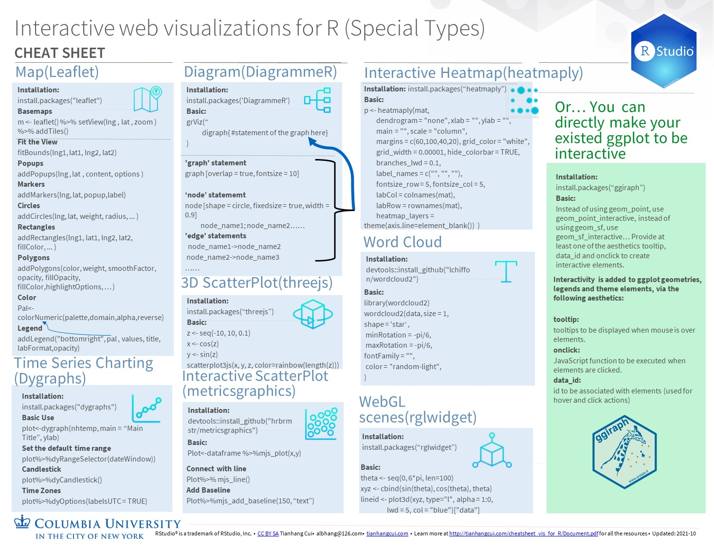

# Interactive web visualizations for R cheatsheet"

Tianhang Cui

The content is a cheatsheet for interactive web visualizations in R, in the form of PDF. It includes how to make and adjust general type of interactive web visualization with plotly, and how create special types of visualization.

There are many libraries can be used in R to make useful and nice-looking interactive visualization. However, the easiest or the best tools for different purposes are often not in the same library (example:3D scatterplot can be done in the ‘plotly’ but using ‘threejs’ would be much easier and more effective), and we have to search the internet to see which package is commonly used for different kinds of interactive visualization. There are some cheat sheets on the internet for some specific packages in very detail, but none of them contains all the commonly used packages for interactive visualization. Thus, I think it would be helpful to have a cheat sheet to include most of the commonly used packages, so that the statisticians/programmers can easily use them when there are needs to make interactive visualization based on their purposes.

It addresses the need that statisticians/programmers want to quickly check how to make an interactive visualization for their data for a given requirement. As statistics/programmers often just need the simple use to make the interactive graph (such as tooltips, mouse-click events, etc.) and most of the interactive visualization packages contains this function in default, we would only need to include the basic use and which package is used. If more functions needed, the user can also quickly find the ways to do them by checking the package document.

To check out the cheatsheet in the pdf form, click the link below:
http://tianhangcui.com/cheatsheet_vis_for_R/Cheatsheet_Interactive_web_visualizations_for_R.pdf
