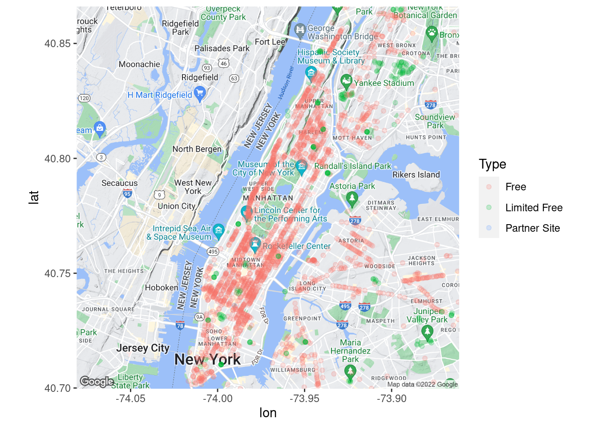
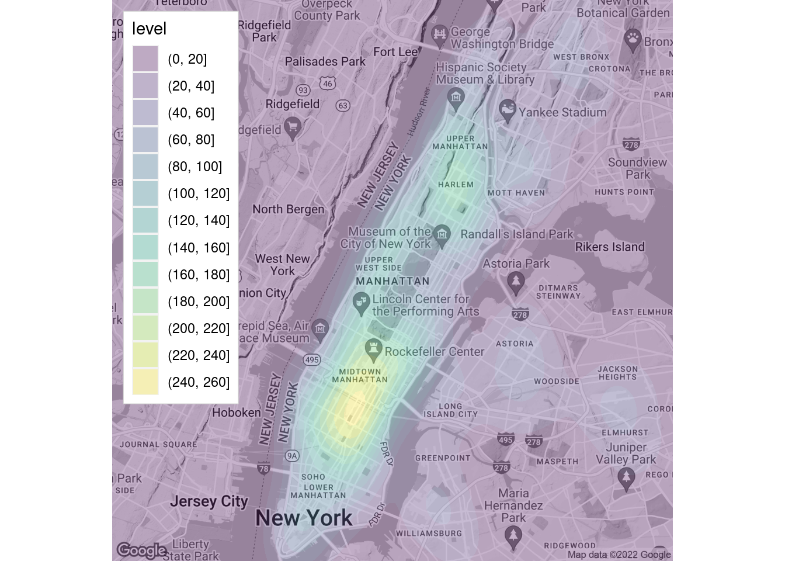
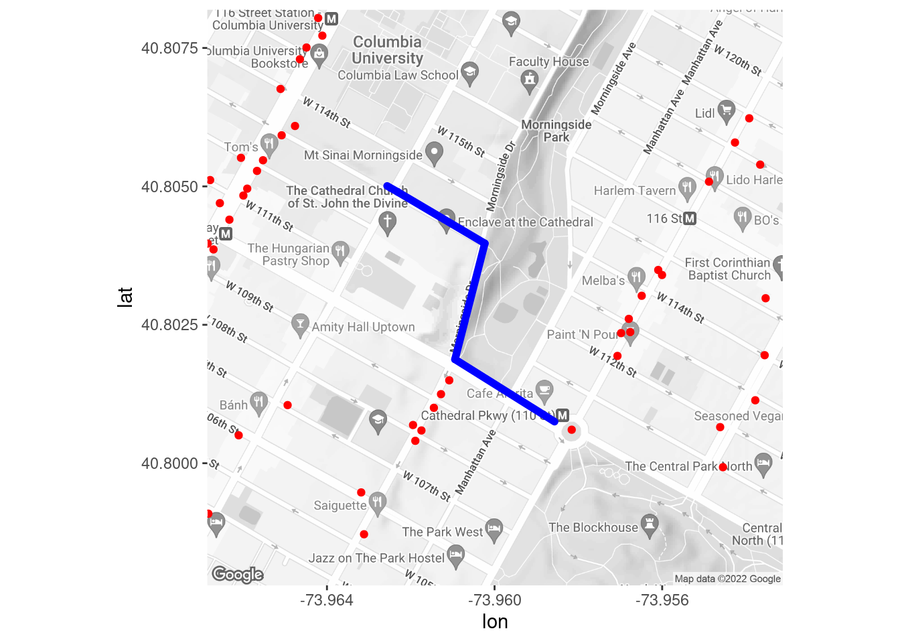

# Video introduction to maps with ggmap

Ryan Rogers


```r
# install.packages("ggmap")
library(ggmap)
# You will also need to activate an API key! Use a line like the following:
# register_google("<API KEY>")
```


## Link to Video Tutorial

https://www.youtube.com/watch?v=AKEEAaCbtog

## Getting Started

This demonstration will show you how to make static maps within the tidyverse framework using ggmap. Before we get started, make sure you have ggmap installed and ready to go, since you may not have it installed by default.

One thing that can be somewhat pesky when working with ggmap is Google maps. As of 2018, this service requires an API key to use. To access the full features of this demonstration, you will have to register a Google API key. Details on how to do this can be found in the help file for 'register_google'.

**Note: If you wish to run the code found in this file, you will need to register a Google API key!**

## Why ggmap?

ggmap is useful for our demonstration, since it will use syntax that you may be familiar with already! ggmap is designed to be quite compatible with ggplot2 (in fact, Hadley Wickham, one of the authors of ggplot2, is a co-author!). In fact, much of ggmap is, under the hood, largely comprised of ggplot2 components. ggmap, however, features the added benefit of abstracting away from many of the more involved components of setting up a ggplot2 visual with maps, and will doubtless prove easier to use than base ggplot2 alone. ggmap also has many options for customizing its resulting visuals, though we will not explore many of these options in depth.

It should be noted that ggmap is an excellent tool for *static* maps. If you are looking more dynamic maps that provide more potential for user interaction, you may find other libraries, such as leaflet, that better suit your needs.

## Dataset for Demonstration

For our demonstration, we will utilize data on public WiFi locations in New York City. The dataset can be found here:
https://data.cityofnewyork.us/City-Government/NYC-Wi-Fi-Hotspot-Locations/yjub-udmw . We will save this dataset to 'wifi_data':


```r
wifi_data <- read.csv("https://data.cityofnewyork.us/api/views/yjub-udmw/rows.csv?accessType=DOWNLOAD")
head(wifi_data)
```

```
##   OBJECTID Borough         Type          Provider                   Name
## 1    10604       4 Limited Free          SPECTRUM      Baisley Pond Park
## 2    10555       4 Limited Free          SPECTRUM           Kissena Park
## 3    12370       3         Free  Transit Wireless           Grand St (L)
## 4     9893       3         Free Downtown Brooklyn                       
## 5    10169       1         Free  Transit Wireless Lexington Av-63 St (F)
## 6    10880       4 Limited Free          SPECTRUM           Kissena Park
##                 Location Latitude Longitude         X        Y
## 1         Park Perimeter 40.67486 -73.78412 1044131.9 185219.9
## 2         Park Perimeter 40.74756 -73.81815 1034637.5 211685.2
## 3           Grand St (L) 40.71193 -73.94067 1000698.1 198655.9
## 4          125 Court St. 40.68999 -73.99200  986470.0 190656.7
## 5 Lexington Av-63 St (F) 40.76463 -73.96612  993636.6 217853.9
## 6         Park Perimeter 40.74243 -73.81151 1036481.4 209820.1
##           Location_T                Remarks     City                   SSID
## 1 Outdoor TWC Aerial 3 free 10 min sessions   Queens              GuestWiFi
## 2 Outdoor TWC Aerial 3 free 10 min sessions   Queens              GuestWiFi
## 3     Subway Station                 SN 123 Brooklyn    TransitWirelessWiFi
## 4            Outdoor                        Brooklyn Downtown Brooklyn WiFi
## 5     Subway Station                 SN 223 New York    TransitWirelessWiFi
## 6 Outdoor TWC Aerial 3 free 10 min sessions   Queens              GuestWiFi
##   SourceID  Activated BoroCode Borough.Name
## 1        0 09/09/9999        4       Queens
## 2        0 09/09/9999        4       Queens
## 3          09/09/9999        3     Brooklyn
## 4          09/09/9999        3     Brooklyn
## 5          09/09/9999        1    Manhattan
## 6        0 09/09/9999        4       Queens
##   Neighborhood.Tabulation.Area.Code..NTACODE.
## 1                                        QN02
## 2                                        QN22
## 3                                        BK90
## 4                                        BK09
## 5                                        MN40
## 6                                        QN62
##   Neighborhood.Tabulation.Area..NTA. Council.Distrcit Postcode BoroCD
## 1          Springfield Gardens North               28    11434    412
## 2                           Flushing               20    11355    407
## 3                  East Williamsburg               34    11206    301
## 4       Brooklyn Heights-Cobble Hill               33    11201    302
## 5      Upper East Side-Carnegie Hill                4    10065    108
## 6                    Queensboro Hill               20    11355    407
##   Census.Tract BCTCB2010     BIN        BBL DOITT_ID
## 1          294       294       0          0     1408
## 2          845       845       0          0     1359
## 3          495       495       0          0     1699
## 4            9         9 3388736 3002777501      298
## 5          120       120       0          0      599
## 6         1215      1215       0          0     1347
##              Location..Lat..Long.
## 1 (40.6748599999, -73.7841200005)
## 2 (40.7475599996, -73.8181499997)
## 3 (40.7119259997, -73.9406699994)
## 4 (40.6899850001, -73.9919950004)
## 5 (40.7646300002, -73.9661150001)
## 6 (40.7424300003, -73.8115100003)
```

## Creating Maps (No plotting)

Before we dive into how to overlay datapoints and other visuals over our graphs, we'll start by going over how to create maps in the first place.

### By location name

The first, and perhaps more approachable way we can plot a map is by simply specifying the name of the location we'd like to see. This works through the geocode function. Here is an example with the city of Paris, France:


```r
geocode("Paris")
```

```
## # A tibble: 1 × 2
##     lon   lat
##   <dbl> <dbl>
## 1  2.35  48.9
```

If you want to verify these coordinates, you can try for yourself! Simply plug 48.85661, 2.352222 into Google Maps, and you will see that this is indeed the location of Paris, France (or, a location roughly in the center of Paris). revgeocode and mapdist are two other useful functions to do the inverse of geocode and calculate distances, respectively.

To generate a map using a location name, we run two steps. First we use get_map(), specifying the location name. This gives a ggmap object. Second, we generate a ggplot2-compatible plot, using ggmap() and providing our ggmap object from step 1 as the input. To demonstrate our location lookup works with more abstract names, let us try finding the Parthenon, in Athens:


```r
parthenon <- get_map(location = "parthenon, athens")

parthenon_map <- ggmap(parthenon)

parthenon_map
```


Clearly the Parthenon cannot be viewed from space. Let us adjust some variables to give us a clearer view. First, we will adjust the 'zoom' parameter. By default, get_map will select this for us, but we can specify it manually. Here, it is initially set to 10, which is about right for a city. Let us try 16 instead:


```r
parthenon <- get_map(location = "parthenon, athens", zoom = 16)

parthenon_map <- ggmap(parthenon)

parthenon_map
```


That is better. The style of this map may be a little distracting, but we will show how to change this later.

### By geographic coordinates

Another way to plot a map is with geographic coordinates directly. Here, we will input the coordinates for the Grand Canyon:


```r
grand_canyon <- get_map(location = c(-112, 36.1), zoom = 9)

grand_canyon_map <- ggmap(grand_canyon)

grand_canyon_map
```


### Using shape files

Shape files are also an option for plotting maps with ggmap, but we will not cover them here.

## Quick Map Plot

In the event that you would like a quick visual plotted, given a set of latitude and longitude points that you would like to superimpose on a map, there is an easy option in the form of qmplot. Here is an example, using our sample dataset:


```r
qmplot(data=wifi_data, x = Longitude, y = Latitude, color = I('Blue'), alpha = I(0.05))
```


If you are looking for a quick visual, this may suffice in some cases.

## Plotting by Overlaying ggplot2 Visuals

In most cases, you will want more elaborate visuals, which may be easier to accomplish with ggplot2 and ordinary ggmaps. Here are some examples:

### Scatterplot

Let us start with a basic plotting. Note that 'lat' and 'lon' are the expected names of the x and y values.


```r
wifi_data_renamed <- mutate(wifi_data, lat = Latitude, lon = Longitude)

nyc <- get_map(location = "manhattan", zoom = 12)

ggmap(nyc) +
  geom_point(data = wifi_data_renamed, aes(color = Type), alpha=.2)
```



We see two issues. First, the legend could be inset at the top left. This can be modified within our ggmap. Second, our map colors may be confusing, given that parks and water are the same colors as several of our categories. Let us correct these issues:


```r
nyc <- get_map(location = "manhattan", zoom = 12, source = 'stamen', maptype = "toner")

ggmap(nyc, extent = 'device', legend = "topleft") +
  geom_point(data = wifi_data_renamed, aes(color = Type), alpha=.2)
```


We used arguments extent = 'device' and legend = "topleft" to move our legend, and source = 'stamen' and maptype = "toner" to adjust our map's appearance.

### Heatmap with Rectangular Bins

In the event of overplotting, a rectangular heatmap can be used. The below graph shows a rectangular heatmap for the area of manhattan north of central park.


```r
nyc <- get_map(location = c(-73.96, 40.8), zoom = 14, source = 'stamen', maptype = "toner")

ggmap(nyc, extent = 'device', legend = "topleft") +
  geom_bin_2d(data = wifi_data_renamed, aes(color = Type, fill = Type), bins = 40, alpha=.7)
```


### Contour Plots

One final visual of interest is the contour plot. Here is an example of one:


```r
nyc <- get_map(location = "manhattan", zoom = 12, color = 'bw')

ggmap(nyc, extent = 'device', legend = "topleft") +
  geom_density_2d_filled(data = wifi_data_renamed, alpha = 0.3)
```



### Overlaying Routes

One other neat feature of ggmap is the ability to superimpose routes. Here is a map that shows the available WiFi hotspots near a walking route from Columbia to Central Park:


```r
to_cp <- route(from = 'Columbia University', to = 'Frederick Douglass Circle', mode = 'walking')

nyc <- get_map(location = c(-73.96, 40.803), zoom = 16, color = 'bw')

ggmap(nyc) +
  geom_leg(aes(x = start_lon, y = start_lat, xend = end_lon, yend = end_lat), size = 2, color = 'blue', data=to_cp) +
  geom_point(data = wifi_data_renamed, color = 'red')
```



Looks like pickings are pretty slim!

## Recommended Reading

If you're looking for additional reading on ggmap, I would recommend https://journal.r-project.org/archive/2013-1/kahle-wickham.pdf .

## Sources

L. Ellis. Map Plots Created With R And Ggmap. Little Miss Data. April 15, 2018. URL
  https://www.littlemissdata.com/blog/maps

D. Kahle and H. Wickham. ggmap: Spatial Visualization with ggplot2. The R Journal, 5(1), 144-161. URL
  http://journal.r-project.org/archive/2013-1/kahle-wickham.pdf
  
N. Voevodin. R, Not the Best Practices. April 6, 2020. URL
  https://bookdown.org/voevodin_nv/R_Not_the_Best_Practices/maps.html
  


