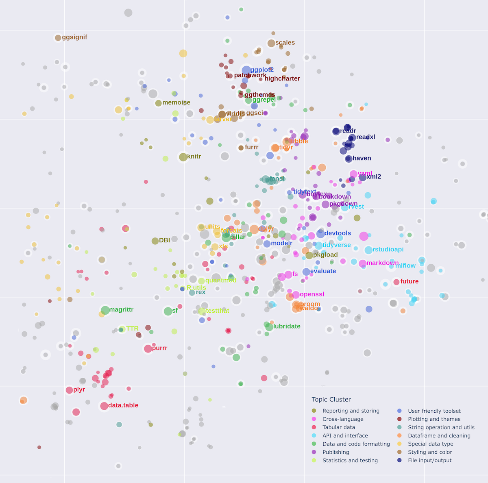
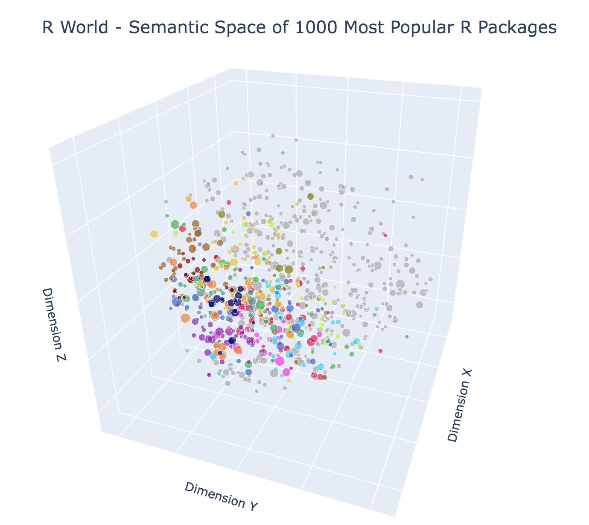

# Map of the R world

Guangyu Wu (gw2415)

As a newcomer to the R world, I created a map to help people like me navigate the rich ecosystem of R packages. Popular packages are mapped onto 2D and 3D space based on their semantic information and colored by auto-generated functionality groups.

Please visit the project page at `https://github.com/TimWGY/r_world` for high-resolution map and interactive visualization, as well as methodology documentation.

