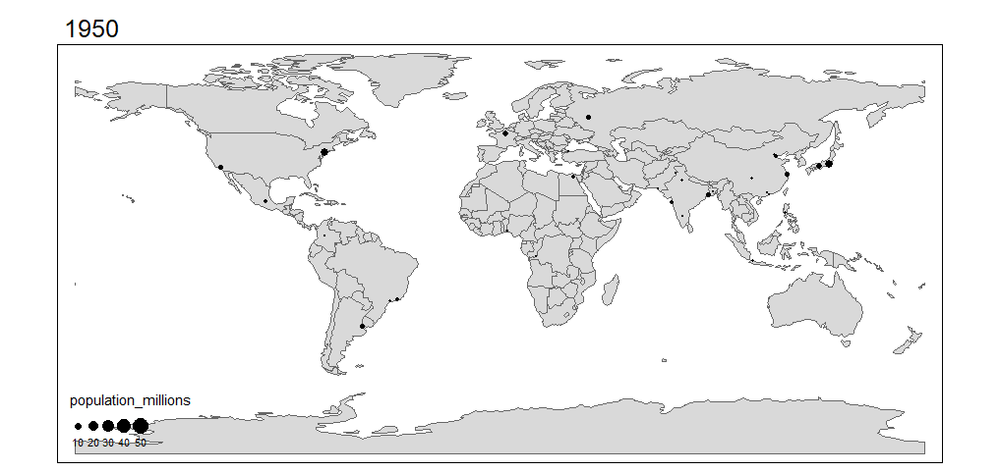

# R packages for map Visualization

Pablo Ulises Hernandez Garces

```{r message=FALSE}
# Required libraries
library(forcats) #Tools for Working with Categorical
library(ggmap) #Spatial Visualization with ggplot2

library(plotly) #Create Interactive Web Graphics via 'plotly.js'

# Packages for tmap section
library(sf) #Support for simple features, a standardized way to encode spatial vector data
library(raster) #Reading, writing, manipulating, analyzing and modeling of spatial data.
library(tidyverse)
library(spData) # contains spatial datasets 
library(USAboundaries) # US spacial datasets
library(maps) # Display of maps

library(tmap)    # for static and interactive maps
library(leaflet) # for interactive maps
```


## Introduction

There are many different R packages for dealing with spatial data, some of the most popular are `tmap`, `ggmap` and `Plotly`.

## tmap

With the `tmap` package, thematic maps can be generated with great flexibility. The syntax for creating plots is similar to that of ggplot2, but tailored to maps.^[<https://cran.r-project.org/web/packages/tmap/vignettes/tmap-getstarted.html>]


The basic building block is `tm_shape()`; which defines input data, raster and vector objects, followed by one or more layer elements such as `tm_fill()` and `tm_dots()`. This layering is demonstrated in the chunk below

```{r}
data(world)

# Add fill layer to us_states shape
tm_shape(world) + tm_fill("darkolivegreen3") +
  tm_borders() +
  tm_format("World", title="A green World")
```

The instruction `tm_fill() + tm_borders()` is equivalent to `tm_polygons()`.

A useful feature of `tmap` is its ability to store objects 
representing maps, which can be plotted later, for example by adding additional layers.

```{r}
map_world = tm_shape(world) + tm_polygons()
class(map_world)
```

We can add new shapes with `tm_shape(new_obj)`. In this case `new_obj` represents a new spatial object to be plotted on top of preceding layers. When a new shape is added in this way, all subsequent aesthetic functions refer to it, until another new shape is added. 

```{r}
data(land, metro)

pal8 <- c("#33A02C", "#B2DF8A", "#FDBF6F", "#1F78B4", "#999999", "#E31A1C", "#E6E6E6", "#A6CEE3")

map_world2=map_world+
  tm_shape(land, ylim = c(-88,88)) +
    tm_raster("cover_cls", palette = pal8, title = "Global Land Cover") +
  tm_layout(scale = .8, 
	legend.position = c("left","bottom"),
    legend.bg.color = "white", legend.bg.alpha = .2, 
    legend.frame = "gray50")


map_world3= map_world2+
    tm_shape(metro) + 
    tm_dots(col = "#E31A1C") 
    
  
```

A useful feature of `tmap` is that multiple map objects can be arranged in a single ‘metaplot’ with `tmap_arrange()`

```{r message=FALSE}
tmap_arrange(map_world, map_world2, map_world3)
```

The first plot in the previous figure demonstrates tmap’s default aesthetic settings. Gray shades are used for `tm_fill()` layers and a continuous black line is used to represent lines created with `tm_lines()`. The functions that help to change default aesthetic values are `tm_fill` and `tm_borders`, for area and lines respectively.

In `tmap` there are two main types of map aesthetics: those that change with the data and those that are constant. Unlike ggplot2, which uses the helper function aes() to represent variable aesthetics, `tmap` accepts aesthetic arguments that are either variable fields (based on column names) or constant values. 

```{r}
ma1 = tm_shape(world) + tm_fill(col = "red")
ma2 = tm_shape(world) + tm_fill(col = "red", alpha = 0.3)
ma3 = tm_shape(world) + tm_borders(col = "blue")
ma4 = tm_shape(world) + tm_borders(lwd = 3)
ma5 = tm_shape(world) + tm_borders(lty = 2)
ma6 = tm_shape(world) + tm_fill(col = "red", alpha = 0.3) +
  tm_borders(col = "blue", lwd = 3, lty = 2)
tmap_arrange(ma1, ma2, ma3, ma4, ma5, ma6)
```

Other useful tool in visualization is facet graphs. In the case of maps with `tmap`, this could be done with function `tm_facets` as follows.

```{r}
urb_1970_2030 = spData::urban_agglomerations %>% 
  filter(year %in% c(1970, 1990, 2010, 2030))

tm_shape(world) +
  tm_polygons() +
  tm_shape(urb_1970_2030) +
  tm_symbols(col = "black", border.col = "white", size = "population_millions") +
  tm_facets(by = "year", nrow = 2, free.coords = FALSE)
```

The function `tm_facets`is also useful for making animations based on maps, in combination with `tmap_animation`. To make animations we have to change the parameter `by = "year"` to `along = "year"`. Additionally, the parameter `free.coords = FALSE`maintains the map extent for each map iteration.

```{r}
map_anim = tm_shape(world) + tm_polygons() + 
  tm_shape(urban_agglomerations) + tm_dots(size = "population_millions") +
  tm_facets(along = "year", free.coords = FALSE)

```

```{r eval=FALSE}
tmap_animation(map_anim,filename = "map_anim.gif", delay = 1)
```


For more detail about `tmap`functions, including interacting mapping using `tmap`, visit: [Making maps with R](https://geocompr.robinlovelace.net/adv-map.html){target="_blank"}.


## ggmap

`ggmap` is an R package that makes it easy to retrieve raster map tiles from popular online mapping services like Google Maps and Stamen Maps and plot them using the ggplot2 framework. To use this library you need to be online. 

**Note:** Google has recently changed its API requirements, and `ggmap` users are now required to register with Google. So, in this part of the tutorial it will not be used `get_googlemap()` function. Instead, functions `get_stamenmap()`and `get_openstreetmap` can be used to our visualization purposes. These two functions use map images.


Example of a scatter plot in a map:

```{r message=FALSE}
# define helper
`%notin%` <- function(lhs, rhs) !(lhs %in% rhs)

# reduce crime to violent crimes in downtown houston
violent_crimes <- crime %>% 
  filter(
    offense %notin% c("auto theft", "theft", "burglary"),
    -95.39681 <= lon & lon <= -95.34188,
     29.73631 <= lat & lat <=  29.78400
  ) %>% 
  mutate(
    offense = fct_drop(offense),
    offense = fct_relevel(offense, c("robbery", "aggravated assault", "rape", "murder"))
  )

qmplot(lon, lat, data = violent_crimes, maptype = "toner-lite")

```

All the ggplot2 geom’s are available. For example, it is possible to make a contour plot with `geom = "density2d"`:

```{r message=FALSE}
qmplot(lon, lat, data = violent_crimes, maptype = "toner-lite", geom = "density2d", color = I("red"))
```

In fact, since ggmap’s built on top of `ggplot2`, all the usual `ggplot2` stuff (geoms, polishing, etc.) will work, and there are some unique graphing perks `ggmap` brings to the table, too.

```{r }
robberies <- violent_crimes %>% filter(offense == "robbery")

qmplot(lon, lat, data = violent_crimes, geom = "blank", 
  zoom = 14, maptype = "toner-background", darken = .7, legend = "topleft"
) +
  stat_density_2d(aes(fill = ..level..), geom = "polygon", alpha = .3, color = NA) +
  scale_fill_gradient2("Robbery\nPropensity", low = "white", mid = "yellow", high = "red", midpoint = 650)
```


Faceting works, too:

```{r}
qmplot(lon, lat, data = violent_crimes, maptype = "toner-background", color = offense) + 
  facet_wrap(~ offense)
```

More examples on how to make maps with ggmap can be found [here](https://www.littlemissdata.com/blog/maps){target="_blank"}

A useful tutorial that includes maps from Google using `ggmap` can be found [here](http://lab.rady.ucsd.edu/sawtooth/business_analytics_in_r/maps.html){target="_blank"}

Here are some [examples](https://cran.r-project.org/web/packages/ggmap/readme/README.html){target="_blank"} about how to use this package.


## Plotly

There are two main ways to creating a `plotly` object: either by transforming a `ggplot2` object (via `ggplotly()`) into a `plotly` object or by directly initializing a `plotly` object with `plot_ly()/plot_geo()/plot_mapbox()`.


`Plotly` supports two different kinds of maps:

1. **Mapbox maps** are tile-based maps. To plot on Mapbox maps with `Plotly` you may need a `Mapbox` account and a public `Mapbox` Access Token. See [Mapbox](https://plotly.com/r/mapbox-layers/){target="_blank"} Map Layers documentation for more information. 

2. **Geo maps** are outline-based maps. In this tutorial Geo outline-based maps are explored.

`Plotly` Geo maps have a built-in base map layer composed of "physical" and "cultural" (i.e. administrative border) data from the Natural Earth Dataset. Various lines and area fills can be shown or hidden, and their color and line-widths specified. 

Here is a map with all physical features enabled and styled, at a 
larger-scale 1:50m resolution:


```{r}
g <- list(
  scope = 'world',
  showland = TRUE,
  landcolor = toRGB("LightGreen"),
  showocean = TRUE,
  oceancolor = toRGB("LightBlue"),
  showlakes = TRUE,
  lakecolor = toRGB("Blue"),
  showrivers = TRUE,
  rivercolor = toRGB("Blue"),
  resolution = 50,
  showland = TRUE,
  landcolor = toRGB("#e5ecf6")
)

fig <- plot_ly(type = 'scattergeo', mode = 'markers')
fig <- fig %>% layout(geo = g)
fig
```


In addition to physical base map features, a "cultural" base map is included which is composed of country borders and selected sub-country borders such as states. Here is a map with only cultural features enabled and styled, at a 1:50m resolution, which includes only country boundaries. See below for country sub-unit cultural base map features:

```{r}
g <- list(
  scope = 'world',
  visible = F,
  showcountries = T,
  countrycolor = toRGB("Purple"),
  resolution = 50,
  showland = TRUE,
  landcolor = toRGB("#e5ecf6")
)

fig <- plot_ly(type = 'scattergeo', mode = 'markers')
fig <- fig %>% layout(geo = g)
fig
```

Geo maps are drawn according to a given map projection that flattens the Earth's roughly-spherical surface into a 2-dimensional space.

The available projections are 'equirectangular', 'mercator', 'orthographic', 'natural earth', 'kavrayskiy7', 'miller', 'robinson', 'eckert4', 'azimuthal equal area', 'azimuthal equidistant', 'conic equal area', 'conic conformal', 'conic equidistant', 'gnomonic', 'stereographic', 'mollweide', 'hammer', 'transverse mercator', 'albers usa', 'winkel tripel', 'aitoff' and 'sinusoidal'.


```{r}
g <- list(
  projection = list(
    type = 'orthographic'
  ),
  showland = TRUE,
  landcolor = toRGB("#e5ecf6")
)

fig <- plot_ly(type = 'scattergeo', mode = 'markers')
fig <- fig %>% layout(geo = g)
fig
```


A Latitude and Longitude Grid Lines can be drawn using `layout$geo$lataxis$showgrid` and `layout$geo$lonaxis$showgrid` with options similar to 2d cartesian ticks.

```{r}
g <- list(
  lonaxis = list(showgrid = T),
  lataxis = list(showgrid = T),
  showland = TRUE,
  landcolor = toRGB("#e5ecf6")
)

fig <- plot_ly(type = 'scattergeo', mode = 'markers')
fig <- fig %>% layout(geo = g)
fig
```


Scatter plots on maps highlight geographic areas and can be colored by value.

```{r}
df <- read.csv('https://raw.githubusercontent.com/plotly/datasets/master/2015_06_30_precipitation.csv')

# change default color scale title
m <- list(colorbar = list(title = "Total Inches"))

# geo styling
g <- list(
  scope = 'north america',
  showland = TRUE,
  landcolor = toRGB("grey83"),
  subunitcolor = toRGB("white"),
  countrycolor = toRGB("white"),
  showlakes = TRUE,
  lakecolor = toRGB("white"),
  showsubunits = TRUE,
  showcountries = TRUE,
  resolution = 50,
  projection = list(
    type = 'conic conformal',
    rotation = list(lon = -100)
  ),
  lonaxis = list(
    showgrid = TRUE,
    gridwidth = 0.5,
    range = c(-140, -55),
    dtick = 5
  ),
  lataxis = list(
    showgrid = TRUE,
    gridwidth = 0.5,
    range = c(20, 60),
    dtick = 5
  )
)

fig <- plot_geo(df, lat = ~Lat, lon = ~Lon, color = ~Globvalue)
fig <- fig %>% add_markers(
    text = ~paste(df$Globvalue, "inches"), hoverinfo = "text"
  )
fig <- fig %>% layout(title = 'US Precipitation 06-30-2015<br>Source: NOAA', geo = g)

fig
```


How to draw lines, great circles, and contours on maps. Lines on maps can show distance between geographic points or be contour lines (isolines, isopleths, or isarithms).

```{r}

fig <- plot_geo(lat = c(40.7127, 51.5072), lon = c(-74.0059, 0.1275))
fig <- fig %>% add_lines(color = I("blue"), size = I(2))
fig <- fig %>% layout(
    title = 'London to NYC Great Circle',
    showlegend = FALSE,
    geo = list(
      resolution = 50,
      showland = TRUE,
      showlakes = TRUE,
      landcolor = toRGB("grey80"),
      countrycolor = toRGB("grey80"),
      lakecolor = toRGB("white"),
      projection = list(type = "equirectangular"),
      coastlinewidth = 2,
      lataxis = list(
        range = c(20, 60),
        showgrid = TRUE,
        tickmode = "linear",
        dtick = 10
      ),
      lonaxis = list(
        range = c(-100, 20),
        showgrid = TRUE,
        tickmode = "linear",
        dtick = 20
      )
    )
  )

fig
```

The example below use the library simple features (`sf`) to read in the shape files before plotting the features with `Plotly`.

```{r}
nc <- sf::st_read(system.file("shape/nc.shp", package = "sf"), quiet = TRUE)

fig <- plot_ly(nc)

fig
```

More detailed examples and explanation of plotting maps with `Mapbox` and `Plotly`  can be found in chapter 4 - [(2019), Sievert, Carson. Interactive web-based data visualization with R, plotly, and shiny](https://plotly-r.com/maps.html){target="_blank"}. 

To see more general examples of maps using `plotly` visit [Plotly R Library Maps](https://plotly.com/r/maps/){target="_blank"}. Here, there are examples of Choropleth maps, Scatter plots on maps, and Mapbox maps: density, layers, lines, areas, and scatter.
