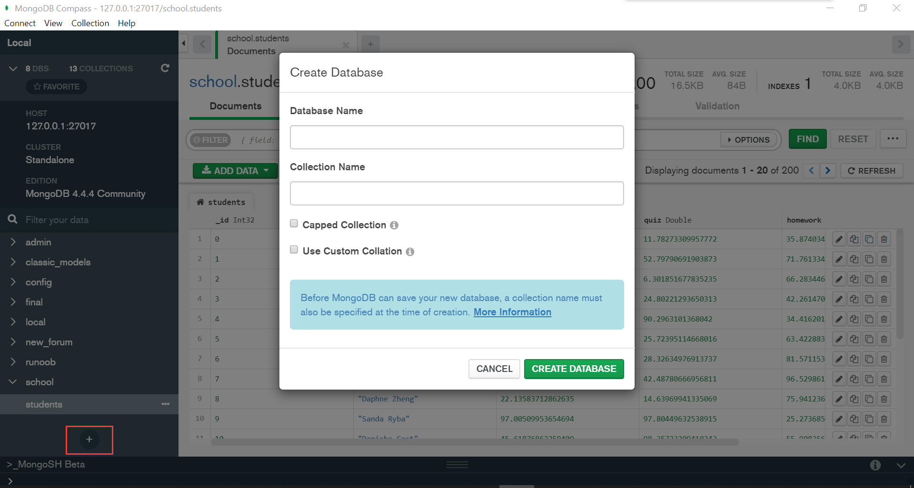

# Tutorial on Using MongoDB with R

Yiran Shu (ys3373)

```{r, include=FALSE}
knitr::opts_chunk$set(warning = FALSE, message = FALSE)
```

```{r}
library(mongolite)
library(ggplot2)
library(cowplot)
library(reshape2)
library(stats)
```

## 1. Overview

Note: to knit this Rmd file, you should first install **MongoDB Compass** and add data to the database. These 2 steps are described in part 3 and part 4.

This tutorial talks about how to use *MongoDB* database system with *R*. I will introduce how to install the *MongoDB* database system and the **mongolite** package, perform CRUD operations with the **mongolite** package and visualize the data retrieved from the *MongoDB* database. 

## 2. Introduction

*MongoDB* is a very popular NoSQL database system. Different from relational database management systems, *MongoDB* is a document database used to build highly available and scalable internet applications [1]. *MongoDB* stores data in collections (similar to tables in MySQL). A collection is composed of documents (similar to records in MySQL). A document is like JSON-format, consisting of attribute-value pairs, which are real data entities. Because *MongoDB* has a flexible schema approach, it is very approariate to store semi-structured and unstructured data. Since data is usually semi-structured and unstrcutured in practice, *MongoDB* is a very popular database management system in web applications.  

*MongoDB* CRUD operations can be learned from https://docs.mongodb.com/manual/crud/. It is very easy to learn and use. Furthermore,  *MongoDB Compass* is very powerful desktop tool for performing operations on and visualizing a *MongoDB* database. Now that *MongoDB* is very useful in databases and data analysis, I would like to introduce how to use it with *R*.

## 3. Installation

Here is the link to download *MongoDB Compass*: https://www.mongodb.com/try/download/compass

To use *MongoDb* with *R*, we need to install the **mongolite** package. It is the most recent R Mongo driver while some others have been deprecated. That is why we use this package [2].

`install.packages("mongolite")`

## 4 Add Data to the Database

I took a video on how to do this step on Youtube: https://www.youtube.com/watch?v=BEu8rcslJv8 for reference.

To insert data into the *MongoDB* database system, we need to first create a database. There is a "Create Database" button in *MongoDB Compass*. Click it to create a database and a collection. Here I created a database called **school** and a collection called **students**.



I used data from https://github.com/ozlerhakan/mongodb-json-files/blob/master/datasets/students.json. I just modified the dataset a little. I have attached the dataset file to my 
I used data from https://github.com/ozlerhakan/mongodb-json-files/blob/master/datasets/students.json. I just modified the dataset a little. I have attached the modified dataset file to my submission, which is in **resources/mongodb_and_r/dataset_editted.txt**.

To insert documents to the **students** collection, copy all text from **resources/mongodb_and_r/dataset_editted.txt** and suppose it is `content`. Then, open the "_MongoSH Beta" console and input MongoDB commands `db.students.insertMany(content)` to add documents to the collection just created. Here `content` is documents you want to insert. That is the collection I am going to use. The `insertMany` commands can insert multiple documents at a time. Refer to https://docs.mongodb.com/manual/tutorial/insert-documents/ for more information about the `insertMany` command. 

My collection looks like this after inserting the documents:


Obviously, this dataset is about the grades of each student in a class.  

## 5 Connection

We absolutely need to connect to the database to perform operations on the collection. We need a connection string, which is like a url. The connection string can be copied from *MongoDB Compass*. Then we indicate the database name and collection name to connect.


```{r}
connection_string = 'mongodb://127.0.0.1:27017/?readPreference=primary&appname=MongoDB%20Compass&ssl=false'
student_collection = mongo(collection="students", db="school", url=connection_string)
```

In order to check if the connection is successful, I output the number of documents in the **school** collection.
```{r}
student_collection$count()
```

There are 200 documents in the **school** collection in total, which indicates that the connection is successful.

## 6 Retrieve Data from MongoDB

Now we have connected to the `MongoDB` database and our collection **school**. we can use the `find` command to retrieve data from the `MongoDB` database. Refer to https://docs.mongodb.com/manual/reference/method/db.collection.find/ for more information about the `find` command.

If we want to show the first 5 students with the highest exam scores, we can use the following code
```{r}
student_collection$find(sort='{"exam" : -1}', limit=5, fields='{}')
```
If we want to show all the students whose exam score is higher than 80 and their quiz score is higher than homework score, we can use *MongoDB* `$expr (expressions)` to compare two fields in the same document [2].
```{r}
student_collection$find('{"exam":{"$gt":80}, "$expr": {"$gt": ["$quiz","$homework"]}}')
```

## 7 Other CRUD Operations with Mongolite [3]

In aaddition to retrieving data from the *MongoDB* database with the **mongolite** package, we can also use it to perform other CRUD operations.

### (1) 
For example, if we want to add a student named "Yiran", whose exam score is 93.3, quiz score is 86.1 and homework score is 90.1, we can use the `insert`command. Refer to https://docs.mongodb.com/manual/reference/insert-methods/ for more information about the `insert` command.

```{r}
student_collection$insert(c('{ "name" : "Yiran", "exam" : 93.3, "quiz" : 86.1, "homework": 90.1 }'))
```

We can now retrieve the document we just inserted.
```{r}
student_collection$find('{"name": "Yiran"}')
```

### (2)
If we want to modify an attribute of a document, we can use the `update` command with the `$set` expression. Refer to https://docs.mongodb.com/manual/reference/method/db.collection.update/ for more information.

```{r}
student_collection$update('{"name":"Yiran"}', '{"$set":{"exam": 92.4}}')
```

```{r}
student_collection$find('{"name": "Yiran"}')
```

We can see that Yiran's exam score has been modified into 92.4.

### (3)
If we want to delete a document from the database, we can use the `remove` command. Refer to https://docs.mongodb.com/v4.2/reference/method/db.collection.remove/ for more information about the `remove` command.

```{r}
student_collection$remove('{"name" : "Yiran"}')
```

```{r}
student_collection$find('{"name": "Yiran"}')
```
Now we cannot find anything about Yiran


## 8 Visualization

It is easy to convert the data obtained from APIs of the **mongolite** package to a dataframe in *R*.

```{r}
df <- as.data.frame(student_collection$find())
head(df)
```

After converting the data to a dataframe, we can use the **ggplot2** to visualize the data.

```{r}
hist1 <- ggplot(df, aes(x=exam)) + geom_histogram(color="white", fill="lightblue")
hist2 <- ggplot(df, aes(x=quiz)) + geom_histogram(color="white", fill="lightblue")
hist3 <- ggplot(df, aes(x=homework)) + geom_histogram(color="white", fill="lightblue")

plot_grid(hist1, hist2, hist3, ncol=2)
```

```{r}
melt_df <- melt(df, measure.vars=c('homework', 'exam', 'quiz'))
ggplot(melt_df) + geom_boxplot(aes(x=variable, y=value, color=variable))
```

Now I want to explore the correlations between homework and quiz, homework and exam, and quiz and exam.

```{r}
scatter1 <- ggplot(df, aes(x=homework, y=quiz)) + geom_point(color="lightblue")
scatter2 <- ggplot(df, aes(x=homework, y=exam)) + geom_point(color="lightblue")
scatter3 <- ggplot(df, aes(x=quiz, y=exam)) + geom_point(color="lightblue")

plot_grid(scatter1, scatter2, scatter3, ncol=2)
```

It looks like the 3 pairs of variables have no correlation. Next, I am going to perform chi-square tests to verify it.

```{r}
Xtest_homework_quiz <- chisq.test(table(df$homework, df$quiz), simulate.p.value=TRUE, correct=FALSE)
Xtest_homework_quiz$p.value
```

```{r}
Xtest_homework_exam <- chisq.test(table(df$homework, df$exam), simulate.p.value=TRUE, correct=FALSE)
Xtest_homework_exam$p.value
```

```{r}
Xtest_quiz_exam <- chisq.test(table(df$quiz, df$exam), simulate.p.value=TRUE, correct=FALSE)
Xtest_quiz_exam$p.value
```

All these 3 p-values are much smaller than 0.01. So all the 3 pairs of variables are independent at the 1% significance level.

## 9 References:
[1] https://www.mongodb.com/why-use-mongodb

[2] https://www.mongodb.com/languages/mongodb-and-r-example

[3] https://jeroen.github.io/mongolite/manipulate-data.html


