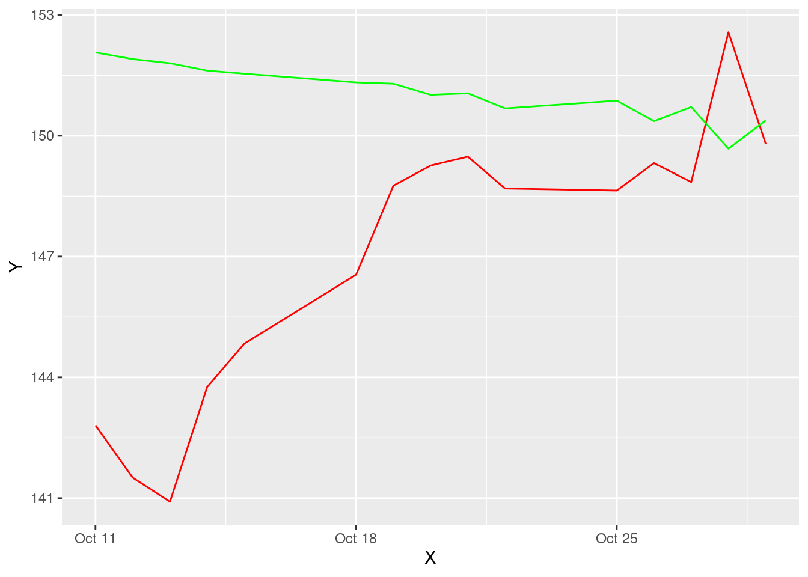

# Predictive Analytics using Data Visualization in R

Rahulraj Singh


```r
# This external GitHub installation is needed to import the makeR library
# require(devtools)
#	install_github("jbryer/makeR")
```

## Building a Trading Strategy and an optimal Fund Allocation Mechanism, powered by DataViz!

In the tutorial below, I will walk through the complete process of using Data Visualization concepts in R to build a trading strategy. Along the way I will also introduce concepts about Time Series analysis, data stationary and perform predictions. But there are obviously no prerequisites for understanding these series of R code.

### Let's get started on building our own day-trading guide.

For this tutorial, I will be taking the example of the Apple Inc. stock (ticker: AAPL) (credits for this go to Professor Kosrow Dehnad, who introduced us to AAPL in the Finance and Structuring class) 

In the below code chunk, I am gathering data for AAPL, sourcing it directly from Yahoo, for the last 8 months. (Please note: No trading algorithm can function optimally on only 6-8 months of data. If using this algorithm to build your trading strategy, kindly use at least 5 years worth of data)


```r
data <- getSymbols("AAPL", src="yahoo", from="2021-03-01", to="2021-10-31", auto.assign=FALSE)
df = data.frame(date = index(data), data, row.names=NULL)
head(df)
```

```
##         date AAPL.Open AAPL.High AAPL.Low AAPL.Close AAPL.Volume AAPL.Adjusted
## 1 2021-03-01    123.75    127.93   122.79     127.79   116307900      127.1968
## 2 2021-03-02    128.41    128.72   125.01     125.12   102260900      124.5392
## 3 2021-03-03    124.81    125.71   121.84     122.06   112966300      121.4934
## 4 2021-03-04    121.75    123.60   118.62     120.13   178155000      119.5724
## 5 2021-03-05    120.98    121.94   117.57     121.42   153766600      120.8564
## 6 2021-03-08    120.93    121.00   116.21     116.36   154376600      115.8199
```

### Plots to study the trends in the market (Exploratory Data Analysis)

In the next few sections, I will walk through some plots to study the basic trends in the market revolving around AAPL. 


```r
plot(df$AAPL.Close, main = "Closing Prices of AAPL from April 2021", ylab="Apple Close Price", x=df$date, xlab="Date")
```


1. Scatter Plot: The above visual shows us the closing prices of the stock in the last 5 months. We can clearly observe that The April-May period was a hump which resulted prices to reach their lowest in May-June. The highest closing can be seen in September post which we see a gradual drop again. 


```r
cs_chart <- df %>%
  plot_ly(x = ~df$date, type="candlestick",
          open = ~df$AAPL.Open, close = ~df$AAPL.Close, high = ~df$AAPL.High, low = ~df$AAPL.Low) %>%
    layout(title = 'Apple - Last 8 Months', plot_bgcolor = "#e5ecf6", xaxis = list(title = 'Dates'), 
         yaxis = list(title = 'Pricing Data'))
cs_chart
```

```{=html}
<div id="htmlwidget-665b5a4b7ed53734c8b0" style="width:672px;height:480px;" class="plotly html-widget"></div>
<script type="application/json" data-for="htmlwidget-665b5a4b7ed53734c8b0">{"x":{"visdat":{"4ffc104d7663":["function () ","plotlyVisDat"]},"cur_data":"4ffc104d7663","attrs":{"4ffc104d7663":{"x":{},"open":{},"close":{},"high":{},"low":{},"alpha_stroke":1,"sizes":[10,100],"spans":[1,20],"type":"candlestick"}},"layout":{"margin":{"b":40,"l":60,"t":25,"r":10},"title":"Apple - Last 8 Months","plot_bgcolor":"#e5ecf6","xaxis":{"domain":[0,1],"automargin":true,"title":"Dates"},"yaxis":{"domain":[0,1],"automargin":true,"title":"Pricing Data"},"hovermode":"closest","showlegend":false},"source":"A","config":{"modeBarButtonsToAdd":["hoverclosest","hovercompare"],"showSendToCloud":false},"data":[{"x":["2021-03-01","2021-03-02","2021-03-03","2021-03-04","2021-03-05","2021-03-08","2021-03-09","2021-03-10","2021-03-11","2021-03-12","2021-03-15","2021-03-16","2021-03-17","2021-03-18","2021-03-19","2021-03-22","2021-03-23","2021-03-24","2021-03-25","2021-03-26","2021-03-29","2021-03-30","2021-03-31","2021-04-01","2021-04-05","2021-04-06","2021-04-07","2021-04-08","2021-04-09","2021-04-12","2021-04-13","2021-04-14","2021-04-15","2021-04-16","2021-04-19","2021-04-20","2021-04-21","2021-04-22","2021-04-23","2021-04-26","2021-04-27","2021-04-28","2021-04-29","2021-04-30","2021-05-03","2021-05-04","2021-05-05","2021-05-06","2021-05-07","2021-05-10","2021-05-11","2021-05-12","2021-05-13","2021-05-14","2021-05-17","2021-05-18","2021-05-19","2021-05-20","2021-05-21","2021-05-24","2021-05-25","2021-05-26","2021-05-27","2021-05-28","2021-06-01","2021-06-02","2021-06-03","2021-06-04","2021-06-07","2021-06-08","2021-06-09","2021-06-10","2021-06-11","2021-06-14","2021-06-15","2021-06-16","2021-06-17","2021-06-18","2021-06-21","2021-06-22","2021-06-23","2021-06-24","2021-06-25","2021-06-28","2021-06-29","2021-06-30","2021-07-01","2021-07-02","2021-07-06","2021-07-07","2021-07-08","2021-07-09","2021-07-12","2021-07-13","2021-07-14","2021-07-15","2021-07-16","2021-07-19","2021-07-20","2021-07-21","2021-07-22","2021-07-23","2021-07-26","2021-07-27","2021-07-28","2021-07-29","2021-07-30","2021-08-02","2021-08-03","2021-08-04","2021-08-05","2021-08-06","2021-08-09","2021-08-10","2021-08-11","2021-08-12","2021-08-13","2021-08-16","2021-08-17","2021-08-18","2021-08-19","2021-08-20","2021-08-23","2021-08-24","2021-08-25","2021-08-26","2021-08-27","2021-08-30","2021-08-31","2021-09-01","2021-09-02","2021-09-03","2021-09-07","2021-09-08","2021-09-09","2021-09-10","2021-09-13","2021-09-14","2021-09-15","2021-09-16","2021-09-17","2021-09-20","2021-09-21","2021-09-22","2021-09-23","2021-09-24","2021-09-27","2021-09-28","2021-09-29","2021-09-30","2021-10-01","2021-10-04","2021-10-05","2021-10-06","2021-10-07","2021-10-08","2021-10-11","2021-10-12","2021-10-13","2021-10-14","2021-10-15","2021-10-18","2021-10-19","2021-10-20","2021-10-21","2021-10-22","2021-10-25","2021-10-26","2021-10-27","2021-10-28","2021-10-29"],"open":[123.75,128.410004,124.809998,121.75,120.980003,120.93,119.029999,121.690002,122.540001,120.400002,121.410004,125.699997,124.050003,122.879997,119.900002,120.330002,123.330002,122.82,119.540001,120.349998,121.650002,120.110001,121.650002,123.660004,123.870003,126.5,125.830002,128.949997,129.800003,132.520004,132.440002,134.940002,133.820007,134.300003,133.509995,135.020004,132.360001,133.039993,132.160004,134.830002,135.009995,134.309998,136.470001,131.779999,132.039993,131.190002,129.199997,127.889999,130.850006,129.410004,123.5,123.400002,124.580002,126.25,126.82,126.559998,123.160004,125.230003,127.82,126.010002,127.82,126.959999,126.440002,125.57,125.080002,124.279999,124.68,124.07,126.169998,126.599998,127.209999,127.019997,126.529999,127.82,129.940002,130.369995,129.800003,130.710007,130.300003,132.130005,133.770004,134.449997,133.460007,133.410004,134.800003,136.169998,136.600006,137.899994,140.070007,143.539993,141.580002,142.75,146.210007,144.029999,148.100006,149.240005,148.460007,143.75,143.460007,145.529999,145.940002,147.550003,148.270004,149.119995,144.809998,144.690002,144.380005,146.360001,145.809998,147.270004,146.979996,146.350006,146.199997,146.440002,146.050003,146.190002,148.970001,148.539993,150.229996,149.800003,145.029999,147.440002,148.309998,149.449997,149.809998,148.350006,147.479996,149,152.660004,152.830002,153.869995,153.759995,154.970001,156.979996,155.490005,155,150.630005,150.350006,148.559998,148.440002,148.820007,143.800003,143.929993,144.449997,146.649994,145.660004,145.470001,143.25,142.470001,143.660004,141.899994,141.759995,139.490005,139.470001,143.059998,144.029999,142.270004,143.229996,141.240005,142.110001,143.770004,143.449997,147.009995,148.699997,148.809998,149.690002,148.679993,149.330002,149.360001,149.820007,147.220001],"close":[127.790001,125.120003,122.059998,120.129997,121.419998,116.360001,121.089996,119.980003,121.959999,121.029999,123.989998,125.57,124.760002,120.529999,119.989998,123.389999,122.540001,120.089996,120.589996,121.209999,121.389999,119.900002,122.150002,123,125.900002,126.209999,127.900002,130.360001,133,131.240005,134.429993,132.029999,134.5,134.160004,134.839996,133.110001,133.5,131.940002,134.320007,134.720001,134.389999,133.580002,133.479996,131.460007,132.539993,127.849998,128.100006,129.740005,130.210007,126.849998,125.910004,122.769997,124.970001,127.449997,126.269997,124.849998,124.690002,127.309998,125.43,127.099998,126.900002,126.849998,125.279999,124.610001,124.279999,125.059998,123.540001,125.889999,125.900002,126.739998,127.129997,126.110001,127.349998,130.479996,129.639999,130.149994,131.789993,130.460007,132.300003,133.979996,133.699997,133.410004,133.110001,134.779999,136.330002,136.960007,137.270004,139.960007,142.020004,144.570007,143.240005,145.110001,144.5,145.639999,149.149994,148.479996,146.389999,142.449997,146.149994,145.399994,146.800003,148.559998,148.990005,146.770004,144.979996,145.639999,145.860001,145.520004,147.360001,146.949997,147.059998,146.139999,146.089996,145.600006,145.860001,148.889999,149.100006,151.119995,150.190002,146.360001,146.699997,148.190002,149.710007,149.619995,148.360001,147.539993,148.600006,153.119995,151.830002,152.509995,153.649994,154.300003,156.690002,155.110001,154.070007,148.970001,149.550003,148.119995,149.029999,148.789993,146.059998,142.940002,143.429993,145.850006,146.830002,146.919998,145.369995,141.910004,142.830002,141.5,142.649994,139.139999,141.110001,142,143.289993,142.899994,142.809998,141.509995,140.910004,143.759995,144.839996,146.550003,148.759995,149.259995,149.479996,148.690002,148.639999,149.320007,148.850006,152.570007,149.800003],"high":[127.93,128.720001,125.709999,123.599998,121.940002,121,122.059998,122.169998,123.209999,121.169998,124,127.220001,125.860001,123.18,121.43,123.870003,124.239998,122.900002,121.660004,121.480003,122.580002,120.400002,123.519997,124.18,126.160004,127.129997,127.919998,130.389999,133.039993,132.850006,134.660004,135,135,134.669998,135.470001,135.529999,133.75,134.149994,135.119995,135.059998,135.410004,135.020004,137.070007,133.559998,134.070007,131.490005,130.449997,129.75,131.259995,129.539993,126.269997,124.639999,126.150002,127.889999,126.93,126.989998,124.919998,127.720001,128,127.940002,128.320007,127.389999,127.639999,125.800003,125.349998,125.239998,124.849998,126.160004,126.32,128.460007,127.75,128.190002,127.440002,130.539993,130.600006,130.889999,132.550003,131.509995,132.410004,134.080002,134.320007,134.639999,133.889999,135.25,136.490005,137.410004,137.330002,140,143.149994,144.889999,144.059998,145.649994,146.320007,147.460007,149.570007,150,149.759995,144.070007,147.100006,146.130005,148.199997,148.720001,149.830002,149.210007,146.970001,146.550003,146.330002,146.949997,148.039993,147.789993,147.839996,147.110001,146.699997,147.710007,146.720001,149.050003,149.440002,151.190002,151.679993,150.720001,148,148.5,150.190002,150.860001,150.320007,149.119995,148.75,153.490005,152.800003,154.979996,154.720001,154.630005,157.259995,157.039993,156.110001,155.479996,151.419998,151.070007,149.440002,148.970001,148.820007,144.839996,144.600006,146.429993,147.080002,147.470001,145.960007,144.75,144.449997,144.380005,142.919998,142.210007,142.240005,142.149994,144.220001,144.179993,144.809998,143.25,141.399994,143.880005,144.899994,146.839996,149.169998,149.75,149.639999,150.179993,149.369995,150.839996,149.729996,153.169998,149.940002],"low":[122.790001,125.010002,121.839996,118.620003,117.57,116.209999,118.790001,119.449997,121.260002,119.160004,120.419998,124.720001,122.339996,120.32,119.68,120.260002,122.139999,120.07,119,118.919998,120.730003,118.860001,121.150002,122.489998,123.07,125.650002,125.139999,128.520004,129.470001,130.630005,131.929993,131.660004,133.639999,133.279999,133.339996,131.809998,131.300003,131.410004,132.160004,133.559998,134.110001,133.080002,132.449997,131.070007,131.830002,126.699997,127.970001,127.129997,129.479996,126.809998,122.769997,122.25,124.260002,125.849998,125.169998,124.779999,122.860001,125.099998,125.209999,125.940002,126.32,126.419998,125.080002,124.550003,123.940002,124.050003,123.129997,123.849998,124.830002,126.209999,126.519997,125.940002,126.099998,127.07,129.389999,128.460007,129.649994,130.240005,129.210007,131.619995,133.229996,132.929993,132.809998,133.350006,134.350006,135.869995,135.759995,137.75,140.070007,142.660004,140.669998,142.649994,144,143.630005,147.679993,147.089996,145.880005,141.669998,142.960007,144.630005,145.809998,146.919998,147.699997,145.550003,142.539993,144.580002,144.110001,145.25,145.179993,146.279999,146.169998,145.630005,145.520004,145.300003,145.529999,145.839996,148.270004,146.470001,149.089996,146.149994,144.5,146.779999,147.889999,149.149994,147.800003,147.509995,146.830002,148.610001,151.289993,152.339996,152.399994,153.089996,154.389999,153.979996,153.949997,148.699997,148.75,146.910004,146.369995,147.220001,145.759995,141.270004,142.779999,143.699997,145.639999,145.559998,143.820007,141.690002,142.029999,141.279999,139.110001,138.270004,139.360001,138.369995,142.720001,142.559998,141.809998,141.039993,139.199997,141.509995,143.509995,143.160004,146.550003,148.119995,147.869995,148.639999,147.619995,149.009995,148.490005,149.720001,146.410004],"type":"candlestick","line":{"color":"rgba(31,119,180,1)"},"xaxis":"x","yaxis":"y","frame":null}],"highlight":{"on":"plotly_click","persistent":false,"dynamic":false,"selectize":false,"opacityDim":0.2,"selected":{"opacity":1},"debounce":0},"shinyEvents":["plotly_hover","plotly_click","plotly_selected","plotly_relayout","plotly_brushed","plotly_brushing","plotly_clickannotation","plotly_doubleclick","plotly_deselect","plotly_afterplot","plotly_sunburstclick"],"base_url":"https://plot.ly"},"evals":[],"jsHooks":[]}</script>
```

2. Candlestick Charts: In a general financial analysis, candlestick charts are used to understand the market's sentiment. These give day traders a detailed reading of how the stock performed every day which in turn speaks about the market's sentiment with regard to the stock. In the case of Apple, we see an evenly distributed chart which tells that investors are stable about trading Apple. Except for one day on September 10, when we see a wide gap between the high and low.
These charts are created using plotly and are interactive. 


```r
ggplot(df, aes(x=date, y=AAPL.Adjusted)) + geom_point() + geom_smooth(method=lm) + xlab("Date") + ylab("Volume of Shares")
```


3. Scatter Plot: To study the amount of day trades being executed on a day-to-day basis, we read the scatter plot against adjusted close prices. This shows a regular periodic rise in the stock price from Apple.


```r
df %>%
    ggplot(aes(x = date, y = AAPL.Volume)) +
    geom_segment(aes(xend = date, yend = 0, color = AAPL.Volume)) + 
    geom_smooth(method = "loess", se = FALSE) +
    labs(title = "AAPL Volume Chart", 
         subtitle = "Charting Daily Volume", 
         y = "Volume", x = "") +
    theme_tq() +
    theme(legend.position = "none") 
```


4. Bar Charts: Study of Volume of trades in a day-trade. The data for AAPL shows that the trading is diversified and does not show us any trends or patterns of trade volumes, irrespective of price. This shows us an important trade about the company's stock, that the investor's trust is not factored or affected by the price of the stock, for this company.

There are some distinct plots that are used in the finance industry to read and understand the movement of the market. Let's walk through these charts.


```r
chartSeries(data, name='AAPL (From April 2021 to October 2021)')
```


```r
addMACD() 
```


```r
addBBands() 
```


5. The Bollinger Band: A key analysis tool for any security is the Bollinger band. It is comprised of three lines, a simple moving average (middle band), an upper and a lower band. 
The squeeze is an important indicator shown by the Bollinger band. When the bands come close, it is called a squeeze. This indicates that the moving average is constricting. It is period of low volatility and is an indication of future trading opportunities. 
In Apple's case above, we see the squeeze in June and September, those are the best periods to day-trade on Apple stocks.


```r
df$ma7 = ma(df$AAPL.Adjusted, order=7)
df$ma30 = ma(df$AAPL.Adjusted, order=30)
ggplot() +
    geom_line(data = df, aes(x = date, y = AAPL.Adjusted, color = "Daily Price")) +
    geom_line(data = df, aes(x = date, y = ma7,   color = "Weekly Moving Average"))  +
    geom_line(data = df, aes(x = date, y = ma30, color = "Monthly Moving Average"))  +
    ylab('AAPL Stock Price') +
    xlab('Time') +
    labs(color = 'Trendline')
```


6. Multi-Line Chart: The graph above is bifurcated based on the daily price, a weekly moving average and a monthly moving average. MA is a significant measure of movement in stock prices that shows a period of volatility. We observe above that in the month of September, the stock prices go strongly above the monthly moving average showing signs of high volatility. These periods could be potential trade opportunities for day traders but come with the "high risk high reward" note.


```r
returns <- function(ticker, start_year) 
  {
    symbol <- getSymbols(ticker, src = 'yahoo', auto.assign = FALSE, warnings = FALSE)
    data <- periodReturn(symbol, period = 'monthly', subset=paste(start_year, "::", sep = ""), type = 'log')
    assign(ticker, data, .GlobalEnv)
  }
re = returns('AAPL', 2015)
hist(re, main= "Return on Investment for AAPL", xlab="Rate of Return")
lines(density(re), col = "red")
```


7. Histogram: The above graph shows us how the return on investing in Apple has been for the last 6 years. This rate is important to understand the pattern of growth of the company's stock value. We see that the rate of return has gradually improved in recent years which shows positive confidence in the stock.

## Implementation of Prdictive Analytics in Stock Prices

### What is Predictive Analytics and how does it come up in Trading Strategies?

In my words, the science of assimilating the future behavior of an object is Predictive Analytics. It's application in Finance is heavy, since traders base their strategies on the study of market forecast. It is often not a concrete output and no trading strategy can ever be based only on an algorithm, but predictions help in building cognitive strategies.

Forecasting time series deals with predicting the next cycle or observation of events that would occur in a future-referenced time frame.

#### Augmented Dickey-Fuller Test for Stationarity

The Augmented Dickey-Fuller test (ADF), also known as the Ad-Fuller Test is an important testing mechanism in respect to Time Series Analysis. It tests a basic null hypothesis that a given input unit root is present in the entire time series sample. The alternative hypothesis is usually stationarity or trend stationarity of the series.

The augmented Dickey–Fuller (ADF) statistic, that is predominantly used in this test, is a negative number. The more negative it is, the stronger the rejection of the hypothesis that there is a unit root at some level of confidence.

The inspiration behind the Ad-Fuller test is that, if the time series is characterized by a unit root process, then in that case the lagged level of the series (y-1) will not yield any relevant information in predicting future changes in (y) except for those changes that were observed in the delta of (y-1). In such cases, the null hypothesis is not rejected. On the other side, if the existing process has no unit root, that states that it is stationary and therefore shows a reversion to the mean. Here, the lagged level will provide relevant information in forecasting future changes.


```r
print(adf.test(df$AAPL.Close))
```

```
## 
## 	Augmented Dickey-Fuller Test
## 
## data:  df$AAPL.Close
## Dickey-Fuller = -1.952, Lag order = 5, p-value = 0.5963
## alternative hypothesis: stationary
```

#### Seasonality in Time Series Data

Seasonality in time series data is the presence of variations that occur at specific intervals of time that is less than a year. These intervals can be hourly, monthly, weekly, or quarterly. Various considerations such as weather or climatic changes can cause seasonality.
Patterns causing Seasonality are always cyclic and occur in periodic patterns.


```r
df$ma7 = ma(df$AAPL.Adjusted, order=7)
price_ma = ts(na.omit(df$ma7), frequency=30)
decomp = stl(price_ma, s.window="periodic", robust = TRUE)
plot(decomp)
```


As we can see, there does not seem to be any apparent periodicity in the Apple stock price trades in our 8 months time period.

#### Autocorrelation and Partial Correlation

Autocorrelation: The correlation between the series and its lags is called autocorrelation. Like correlation that measures the magnitude to which a linear relationship is associated between two variables, autocorrelation does the same between lagged values of a time series. If the series is considerably autocorrelated, it means that the impact of lags on forecasting the time series is high. In more general terms, a correlation factor of 1 (Lag = 1) conveys the correlation between values that are one period apart from each other. Likewise, lag ‘k’ autocorrelation shows the association amongst values that are ‘k’ time periods separately from each other.

Partial Autocorrelation: The purpose of partial autocorrelation is also like autocorrelation as it conveys the information about the relationship between a variable and its lag. But partial autocorrelation only delivers details about the pure association between the lag and disregards correlations that occur from intermediate lags.


```r
par(mar=c(5,6,7,8))
df = data.frame(date = index(data), data, row.names=NULL)
series = df$AAPL.Close
Acf(
  series,
  lag.max = NULL,
  type = c("correlation", "covariance", "partial"),
  plot = TRUE,
  na.action = na.contiguous,
  demean = TRUE,
  main = "ACF Series Plot"
)
```


While reading data from the ACF plot for Apple, we see a gradual decay in the lags. This decay is an indication of significant closing values at each time interval confirming that our hypothesis from the Augmented Dickey Fuller test was correct.


```r
par(mar=c(5,6,7,8))
df = data.frame(date = index(data), data, row.names=NULL)
series = df$AAPL.Close
Pacf(
  series,
  lag.max = NULL,
  plot = TRUE,
  na.action = na.contiguous,
  demean = TRUE,
  main = "PACF Series Plot"
)
```


While reading the PACF plot for Apple, we notice that the lag order is high at the start but then moves in geometric progression throughout the timeline. The periodic changing movements in the lag of the PACF plot confirm that this is the seasonal component of data and any changing prices can be used to build the ARIMA model. Had this been a flat line across all time frames, this data would not have yielded any results in the ARIMA forecast.

## ARIMA - Autoregresive Integrating Moving Average

A general term in the statistics and economics world, auto regressive integrated moving average (ARIMA) is used to describe a moving average construct. These have found great interest in building Time Series forecasting models.

ARIMA models are applied to instances where the input data shows evidence of non-stationarity in the sense of mean, but there is no significant variance observed.

We can break the definition of ARIMA as follows, the AR part of ARIMA stands for an evolving variable that is regressed on its self-lag (old values). The MA part shows the regression error that is a linear combination of error terms that have occurred at various times in the past. The remaining “I” (integrated) indicated that the data got replaced with differences between current and previous values. These individual processes may have to be performed multiple times. The purpose of each of these features is to make the model fit the data as well as possible.


```r
modelfit <- auto.arima(df$AAPL.Close, stepwise = TRUE, lambda = NULL)
modelfit
```

```
## Series: df$AAPL.Close 
## ARIMA(3,1,1) with drift 
## 
## Coefficients:
##           ar1    ar2      ar3     ma1   drift
##       -0.4559  6e-04  -0.1774  0.3877  0.1373
## s.e.   0.3188  9e-02   0.0890  0.3208  0.1201
## 
## sigma^2 estimated as 3.481:  log likelihood=-344.79
## AIC=701.58   AICc=702.09   BIC=720.39
```

Now that our model is ready, we will forecast the prices for the next 60 days.


```r
price_forecast <- forecast(modelfit, h=60)
plot(price_forecast)
```


The above prediction can be read as follows: 
1. The blue line represents the mean of our prediction. 
2. The darker shaded region around the blue line represents an 80% confidence interval.
3. The light shaded outer portion represents a 95% confidence interval.


## Comparing predictions with Actual Stock Prices

To conclude the predictive analytics tutorial, let us match out our generated predictions to the real stock closing prices from October 10 to October 31, 2021. 


```r
data2 <- getSymbols("AAPL", src="yahoo", from="2021-10-10", to="2021-10-31", auto.assign=FALSE)
df2 = data.frame(date = index(data2), data2, row.names=NULL)
present <- as.vector(df2$AAPL.Close)
meanvalues <- as.vector(price_forecast$mean)

x  <- df2$date
y1 <- present
y2 <- meanvalues[15:1]
df_new <- data.frame(x,y1,y2)

g <- ggplot(df_new, aes(x))
g <- g + geom_line(aes(y=y1), colour="red")
g <- g + geom_line(aes(y=y2), colour="green")
g <- g + ylab("Y") + xlab("X")
g
```



On matching we see that the mean of our predictions is extremely close to the actual value as we are moving forward in time. This should definitely instill some confidence within us about the way we structured this analysis and predictions. One important thing to note is that our prediction is for the next 30 days based on data from the last 8 months. Therefore, the previoud entries are not going to match. But as we converge towards the end of the graph, if the numbers start coming into the same pattern of movement, that is a positive sign. 

## Building a Portfolio of Stocks

### How to decide what percentage of your portfolio should be invested where?

In managing finances, it is common knowledge that diversification yields better results. The idea is to not put all your eggs in one basket. So then how do you decide which baskets to choose and how to allocate funds?

### Sharpe Ratio

An important construct in deciding the best outcome of trading more than one stock is calculating the sharpe ratio. It tells you which pair and what percentage of fund allocation to which stock will yield the best outcome.

In the function below we will complete a few prerequisite steps to calculate the Sharpe Ratio:
1. Bring data for 3 stocks, historical data for the last 6 years.
2. Calculate their respective monthly return rates to summarize which stock gave what returns.
3. Merge their return into one data frame to further divide portions of the portfolio.


```r
returns <- function(ticker, start_year) {
  symbol <- getSymbols(ticker, src = 'yahoo', auto.assign = FALSE, warnings = FALSE)
  data <- periodReturn(symbol, period = 'monthly', subset=paste(start_year, "::", sep = ""), type = 'log')
  colnames(data) <- as.character(ticker)
  assign(ticker, data, .GlobalEnv)
}

returns('AAPL', 2015)
returns('PFE', 2015)
returns('TSLA', 2015)

merged_returns <- merge.xts(AAPL, PFE, TSLA)
```

For this tutorial, I took data for Apple, Pfizer and Tesla. These stocks have been in the news for various reasons through the last few months, so let's see how would our investment look should we want to invest in these stocks.


```r
dygraph(merged_returns, main = "Apple v/s Pfizer v/s Tesla") %>%
  dyAxis("y", label = "Return Percentage") %>%
  dyOptions(colors = RColorBrewer::brewer.pal(3, "Set2"))
```

```{=html}
<div id="htmlwidget-a3cdeae2e8d91f7fcdf1" style="width:672px;height:480px;" class="dygraphs html-widget"></div>
<script type="application/json" data-for="htmlwidget-a3cdeae2e8d91f7fcdf1">{"x":{"attrs":{"axes":{"x":{"pixelsPerLabel":60,"drawAxis":true},"y":{"drawAxis":true}},"title":"Apple v/s Pfizer v/s Tesla","labels":["month","AAPL","PFE","TSLA"],"legend":"auto","retainDateWindow":false,"ylabel":"Return Percentage","stackedGraph":false,"fillGraph":false,"fillAlpha":0.15,"stepPlot":false,"drawPoints":false,"pointSize":1,"drawGapEdgePoints":false,"connectSeparatedPoints":false,"strokeWidth":1,"strokeBorderColor":"white","colors":["#66C2A5","#FC8D62","#8DA0CB"],"colorValue":0.5,"colorSaturation":1,"includeZero":false,"drawAxesAtZero":false,"logscale":false,"axisTickSize":3,"axisLineColor":"black","axisLineWidth":0.3,"axisLabelColor":"black","axisLabelFontSize":14,"axisLabelWidth":60,"drawGrid":true,"gridLineWidth":0.3,"rightGap":5,"digitsAfterDecimal":2,"labelsKMB":false,"labelsKMG2":false,"labelsUTC":false,"maxNumberWidth":6,"animatedZooms":false,"mobileDisableYTouch":true,"disableZoom":false},"scale":"monthly","annotations":[],"shadings":[],"events":[],"format":"date","data":[["2015-01-30T00:00:00.000Z","2015-02-27T00:00:00.000Z","2015-03-31T00:00:00.000Z","2015-04-30T00:00:00.000Z","2015-05-29T00:00:00.000Z","2015-06-30T00:00:00.000Z","2015-07-31T00:00:00.000Z","2015-08-31T00:00:00.000Z","2015-09-30T00:00:00.000Z","2015-10-30T00:00:00.000Z","2015-11-30T00:00:00.000Z","2015-12-31T00:00:00.000Z","2016-01-29T00:00:00.000Z","2016-02-29T00:00:00.000Z","2016-03-31T00:00:00.000Z","2016-04-29T00:00:00.000Z","2016-05-31T00:00:00.000Z","2016-06-30T00:00:00.000Z","2016-07-29T00:00:00.000Z","2016-08-31T00:00:00.000Z","2016-09-30T00:00:00.000Z","2016-10-31T00:00:00.000Z","2016-11-30T00:00:00.000Z","2016-12-30T00:00:00.000Z","2017-01-31T00:00:00.000Z","2017-02-28T00:00:00.000Z","2017-03-31T00:00:00.000Z","2017-04-28T00:00:00.000Z","2017-05-31T00:00:00.000Z","2017-06-30T00:00:00.000Z","2017-07-31T00:00:00.000Z","2017-08-31T00:00:00.000Z","2017-09-29T00:00:00.000Z","2017-10-31T00:00:00.000Z","2017-11-30T00:00:00.000Z","2017-12-29T00:00:00.000Z","2018-01-31T00:00:00.000Z","2018-02-28T00:00:00.000Z","2018-03-29T00:00:00.000Z","2018-04-30T00:00:00.000Z","2018-05-31T00:00:00.000Z","2018-06-29T00:00:00.000Z","2018-07-31T00:00:00.000Z","2018-08-31T00:00:00.000Z","2018-09-28T00:00:00.000Z","2018-10-31T00:00:00.000Z","2018-11-30T00:00:00.000Z","2018-12-31T00:00:00.000Z","2019-01-31T00:00:00.000Z","2019-02-28T00:00:00.000Z","2019-03-29T00:00:00.000Z","2019-04-30T00:00:00.000Z","2019-05-31T00:00:00.000Z","2019-06-28T00:00:00.000Z","2019-07-31T00:00:00.000Z","2019-08-30T00:00:00.000Z","2019-09-30T00:00:00.000Z","2019-10-31T00:00:00.000Z","2019-11-29T00:00:00.000Z","2019-12-31T00:00:00.000Z","2020-01-31T00:00:00.000Z","2020-02-28T00:00:00.000Z","2020-03-31T00:00:00.000Z","2020-04-30T00:00:00.000Z","2020-05-29T00:00:00.000Z","2020-06-30T00:00:00.000Z","2020-07-31T00:00:00.000Z","2020-08-31T00:00:00.000Z","2020-09-30T00:00:00.000Z","2020-10-30T00:00:00.000Z","2020-11-30T00:00:00.000Z","2020-12-31T00:00:00.000Z","2021-01-29T00:00:00.000Z","2021-02-26T00:00:00.000Z","2021-03-31T00:00:00.000Z","2021-04-30T00:00:00.000Z","2021-05-28T00:00:00.000Z","2021-06-30T00:00:00.000Z","2021-07-30T00:00:00.000Z","2021-08-31T00:00:00.000Z","2021-09-30T00:00:00.000Z","2021-10-29T00:00:00.000Z","2021-11-18T00:00:00.000Z"],[0.0596116343279716,0.092077078004962,-0.0318743253182995,0.00576970909024331,0.0401729625302495,-0.0379381463714493,-0.0334809851104871,-0.073005147206613,-0.0220577391952946,0.0801124088473767,-0.0100925665748833,-0.11679028686991,-0.0782235546145406,-0.00669993744745158,0.119746072335825,-0.150731148377264,0.0632442552491222,-0.0435963850151077,0.0862352739469805,0.0179739516156013,0.063448188486615,0.0043249636360279,-0.0269587338799093,0.0468407979349729,0.0466416703749666,0.121229027489899,0.0475414648276651,-6.96947557928728e-05,0.0614883064380683,-0.0589158295778093,0.0321803481154933,0.0977338731140646,-0.0621349340200442,0.0924038321775694,0.016486723866344,-0.0153633370645446,-0.0106934070962346,0.0618921523094421,-0.0598038605785821,-0.0151336303493947,0.122893199460155,-0.00946292355731468,0.0275989393012256,0.179172339058854,-0.00833760908469295,-0.0309516562566834,-0.203395575901227,-0.124088546761042,0.0536867748193957,0.039523316498291,0.0926026339297458,0.0549009092229651,-0.136475828157579,0.12267696900333,0.0736169953098649,-0.0203904263995426,0.0704226367598792,0.104976445841553,0.0716959897492217,0.0942040048200566,0.0526018729024898,-0.124200878351541,-0.0723142327149281,0.144423906334433,0.0789634754180514,0.137486526991723,0.152834075659007,0.194233439725652,-0.108171479643587,-0.0618882377344557,0.0894809359402029,0.108471997488703,-0.00551669621431395,-0.0845618822696872,0.00731279693999119,0.0734528620065042,-0.0535138081037507,0.0945000955234294,0.0629583009087326,0.0401142226547472,-0.0704617699834312,0.0570013740265288,0.0524707867621852],[0.00320514248035131,0.0937088542921933,0.0136017969931637,-0.0250304631648279,0.0238800055240341,-0.0357390354319581,0.0727437036206969,-0.112596846993419,-0.0254610994416489,0.0739261098117948,-0.0315389135889898,-0.0150656310066282,-0.0570490401437995,-0.0272624102239207,-0.00101156286260275,0.0985560552007519,0.0590587352607887,0.0145904780553294,0.0466104115572159,-0.0583231187362017,-0.0270877527329891,-0.0658975846386494,0.0134693168185788,0.0105231339224302,-0.0233619114881238,0.0726211739425328,0.00263424561050995,-0.00851320922023371,-0.0381599365002923,0.028383528488487,-0.0128840213310622,0.0226604293428673,0.0511458913182027,-0.0180898504540516,0.0336544163534995,-0.00110382078200782,0.022386968525876,-0.0199052353625556,-0.0228422304558499,0.0310704440061161,-0.0187487888914815,0.0096940441497176,0.0958612914555061,0.0390472690334638,0.0596040937046957,-0.0231848288354211,0.071034490216556,-0.0574256825562887,-0.0278763467468142,0.02097976718644,-0.0205087686852556,-0.0447836064159074,0.0221608821319954,0.0424392604860189,-0.109163844835676,-0.0885104560140651,0.0106324357250347,0.0657033166425872,0.00390168288499974,0.0169888265083275,-0.0507829534760681,-0.10822891360812,-0.0236159938250069,0.161476715575614,-0.0044415397412767,-0.1551986602002,0.162763493665435,-0.0180940827123348,-0.0292677746352209,-0.0338075616309228,0.129334280142574,-0.0399414102579422,-0.0250322233529221,-0.0694904046791075,0.0786405583815553,0.0646593218728864,0.00206766674678859,0.0110413241356488,0.0891159258535733,0.0733902354319429,-0.0687293786529954,0.0168304606785276,0.161569645094055],[-0.0883651711980203,-0.00127787897666726,-0.0743500345024967,0.180226795866453,0.103899617137152,0.0673008507151787,-0.00789659985517795,-0.066366228325764,-0.00265348123367864,-0.182659729910067,0.106828441667093,0.0414715064918105,-0.227360515389606,0.00381072140155963,0.179948012508606,0.0467217998508498,-0.0755979566022905,-0.0502964485637888,0.100785316095675,-0.102058054238293,-0.0383664015152157,-0.0313645528359116,-0.0430412818686127,0.120665136108858,0.164624967579826,-0.00773037377679247,0.10727873146882,0.12091620654751,0.0822959712743525,0.0586544228221302,-0.11145989523835,0.0955434185786588,-0.0424740884330892,-0.0284574008142573,-0.0708625811268923,0.0080619591765528,0.129254554823017,-0.032266877159799,-0.253920410205453,0.0992546076360568,-0.0316982111622676,0.186043260377775,-0.140021464326795,0.0117374306140638,-0.130439066206022,0.242170484529243,0.0382716675335131,-0.0517619788728162,-0.0806288031395048,0.0410330809659405,-0.133656478597845,-0.159123860198297,-0.253945274762528,0.188012106327819,0.0780923857434954,-0.068516946031121,0.0654494796577671,0.268061285328612,0.0465921504001933,0.237359790145031,0.441578291584525,0.026424369437642,-0.24278154281371,0.400209607901726,0.0657304040021331,0.257108681647368,0.281420672064987,0.554719288863979,-0.149762203003956,-0.100371801702565,0.380308452716021,0.217730779027994,0.117343700950134,-0.161038225580463,-0.0112697902538093,0.0602925621006274,-0.12637238783181,0.0835480005921785,0.0109738461247707,0.0682241840132158,0.0526325945351016,0.362230253806701,-0.0159432931822088]],"fixedtz":false,"tzone":"UTC"},"evals":[],"jsHooks":[]}</script>
```

The interactive line chart above shows us the individual return rates of the three stocks. It is evident that Tesla is the most volatile stock of the three. It is grown the largest, but at times has also shed losses in large numbers. At this moment, it looks like investing in TSLA could yield high results but comes with very high risk-ratio as well.


```r
percAlloc <- c(.25, .25, .50)
portfolio_returns <- Return.portfolio(merged_returns, weights = percAlloc)
dygraph(portfolio_returns, main = "Portfolio Monthly Return") %>%
  dyAxis("y", label = "Return Percentage")
```

```{=html}
<div id="htmlwidget-b77f8c578384a23ea936" style="width:672px;height:480px;" class="dygraphs html-widget"></div>
<script type="application/json" data-for="htmlwidget-b77f8c578384a23ea936">{"x":{"attrs":{"axes":{"x":{"pixelsPerLabel":60},"y":[]},"title":"Portfolio Monthly Return","labels":["month","portfolio.returns"],"legend":"auto","retainDateWindow":false,"ylabel":"Return Percentage"},"scale":"monthly","annotations":[],"shadings":[],"events":[],"format":"date","data":[["2015-01-30T00:00:00.000Z","2015-02-27T00:00:00.000Z","2015-03-31T00:00:00.000Z","2015-04-30T00:00:00.000Z","2015-05-29T00:00:00.000Z","2015-06-30T00:00:00.000Z","2015-07-31T00:00:00.000Z","2015-08-31T00:00:00.000Z","2015-09-30T00:00:00.000Z","2015-10-30T00:00:00.000Z","2015-11-30T00:00:00.000Z","2015-12-31T00:00:00.000Z","2016-01-29T00:00:00.000Z","2016-02-29T00:00:00.000Z","2016-03-31T00:00:00.000Z","2016-04-29T00:00:00.000Z","2016-05-31T00:00:00.000Z","2016-06-30T00:00:00.000Z","2016-07-29T00:00:00.000Z","2016-08-31T00:00:00.000Z","2016-09-30T00:00:00.000Z","2016-10-31T00:00:00.000Z","2016-11-30T00:00:00.000Z","2016-12-30T00:00:00.000Z","2017-01-31T00:00:00.000Z","2017-02-28T00:00:00.000Z","2017-03-31T00:00:00.000Z","2017-04-28T00:00:00.000Z","2017-05-31T00:00:00.000Z","2017-06-30T00:00:00.000Z","2017-07-31T00:00:00.000Z","2017-08-31T00:00:00.000Z","2017-09-29T00:00:00.000Z","2017-10-31T00:00:00.000Z","2017-11-30T00:00:00.000Z","2017-12-29T00:00:00.000Z","2018-01-31T00:00:00.000Z","2018-02-28T00:00:00.000Z","2018-03-29T00:00:00.000Z","2018-04-30T00:00:00.000Z","2018-05-31T00:00:00.000Z","2018-06-29T00:00:00.000Z","2018-07-31T00:00:00.000Z","2018-08-31T00:00:00.000Z","2018-09-28T00:00:00.000Z","2018-10-31T00:00:00.000Z","2018-11-30T00:00:00.000Z","2018-12-31T00:00:00.000Z","2019-01-31T00:00:00.000Z","2019-02-28T00:00:00.000Z","2019-03-29T00:00:00.000Z","2019-04-30T00:00:00.000Z","2019-05-31T00:00:00.000Z","2019-06-28T00:00:00.000Z","2019-07-31T00:00:00.000Z","2019-08-30T00:00:00.000Z","2019-09-30T00:00:00.000Z","2019-10-31T00:00:00.000Z","2019-11-29T00:00:00.000Z","2019-12-31T00:00:00.000Z","2020-01-31T00:00:00.000Z","2020-02-28T00:00:00.000Z","2020-03-31T00:00:00.000Z","2020-04-30T00:00:00.000Z","2020-05-29T00:00:00.000Z","2020-06-30T00:00:00.000Z","2020-07-31T00:00:00.000Z","2020-08-31T00:00:00.000Z","2020-09-30T00:00:00.000Z","2020-10-30T00:00:00.000Z","2020-11-30T00:00:00.000Z","2020-12-31T00:00:00.000Z","2021-01-29T00:00:00.000Z","2021-02-26T00:00:00.000Z","2021-03-31T00:00:00.000Z","2021-04-30T00:00:00.000Z","2021-05-28T00:00:00.000Z","2021-06-30T00:00:00.000Z","2021-07-30T00:00:00.000Z","2021-08-31T00:00:00.000Z","2021-09-30T00:00:00.000Z","2021-10-29T00:00:00.000Z","2021-11-18T00:00:00.000Z"],[-0.0284783913969293,0.0486981524627939,-0.038609642892243,0.0720799695772349,0.0661484303168667,0.0142137858274072,0.00475867636597638,-0.0795854282226486,-0.0128541227886669,-0.0585900016913495,0.0370573485609054,-0.0142532779822324,-0.149069621605327,-0.00763029967295137,0.114571903356864,0.0092992986077336,-0.00946340285096914,-0.0300120916415726,0.0811167393712589,-0.0619119256555212,-0.00987667391087332,-0.0318483392234332,-0.0228794426489799,0.0686088685107868,0.0815865697556286,0.0456223715377024,0.0641524886777041,0.0568576698412544,0.0499638289695439,0.0215788149346432,-0.0563881530705779,0.0804060591287232,-0.0286506908576214,0.0052099420530769,-0.0236667793661625,-0.000912720836612646,0.0643333278438656,-0.00421836599253766,-0.148321095733258,0.046127238960417,0.0175659620379902,0.0801794853481814,-0.037518321951487,0.0725279963646548,-0.0410474410320013,0.0709360572282101,-0.0338152544420316,-0.0730640504769883,-0.0313926386165618,0.0350577651148081,-0.0389245838616346,-0.0586559846828651,-0.133752318133067,0.116094548925601,0.0182003871675764,-0.0556709907215012,0.0530027519554157,0.151658109571794,0.0462800564156829,0.131620403722566,0.194339080215403,-0.0456721572718842,-0.157512022208718,0.272095971998668,0.0586685891166099,0.158578683438815,0.229290965776711,0.392735292898421,-0.130835518994637,-0.0852997640616745,0.283752023775746,0.17443123825232,0.0831803800003297,-0.141450575450213,-0.00212269228061357,0.0632665961082781,-0.103007044046921,0.0806858777678305,0.0277358872948106,0.0621798447765682,0.0163232855936624,0.276892540345125,0.00502525122565856]]},"evals":[],"jsHooks":[]}</script>
```

For starting the calculation of Sharpe Ratio, I have split my portfolio as follows:
1. Apple - 25%
2. Pfizer - 25%
3. Tesla - 50%

This division is instinctive and does not come from any sort of calculation. You are free to experiment these based on how much risk you would like to add to your portfolio. Modification of these values will result in changes to the Sharpe Ratio.


```r
dollar_growth <- Return.portfolio(merged_returns, weights = percAlloc, wealth.index = TRUE)
dygraph(dollar_growth, main = "Growth of $1 Invested in Portfolio") %>%
  dyAxis("y", label = "Dollor Return on 1$ investment")
```

```{=html}
<div id="htmlwidget-73a228f49d5e40e7718d" style="width:672px;height:480px;" class="dygraphs html-widget"></div>
<script type="application/json" data-for="htmlwidget-73a228f49d5e40e7718d">{"x":{"attrs":{"axes":{"x":{"pixelsPerLabel":60},"y":[]},"title":"Growth of $1 Invested in Portfolio","labels":["month","portfolio.wealthindex"],"legend":"auto","retainDateWindow":false,"ylabel":"Dollor Return on 1$ investment"},"scale":"monthly","annotations":[],"shadings":[],"events":[],"format":"date","data":[["2015-01-30T00:00:00.000Z","2015-02-27T00:00:00.000Z","2015-03-31T00:00:00.000Z","2015-04-30T00:00:00.000Z","2015-05-29T00:00:00.000Z","2015-06-30T00:00:00.000Z","2015-07-31T00:00:00.000Z","2015-08-31T00:00:00.000Z","2015-09-30T00:00:00.000Z","2015-10-30T00:00:00.000Z","2015-11-30T00:00:00.000Z","2015-12-31T00:00:00.000Z","2016-01-29T00:00:00.000Z","2016-02-29T00:00:00.000Z","2016-03-31T00:00:00.000Z","2016-04-29T00:00:00.000Z","2016-05-31T00:00:00.000Z","2016-06-30T00:00:00.000Z","2016-07-29T00:00:00.000Z","2016-08-31T00:00:00.000Z","2016-09-30T00:00:00.000Z","2016-10-31T00:00:00.000Z","2016-11-30T00:00:00.000Z","2016-12-30T00:00:00.000Z","2017-01-31T00:00:00.000Z","2017-02-28T00:00:00.000Z","2017-03-31T00:00:00.000Z","2017-04-28T00:00:00.000Z","2017-05-31T00:00:00.000Z","2017-06-30T00:00:00.000Z","2017-07-31T00:00:00.000Z","2017-08-31T00:00:00.000Z","2017-09-29T00:00:00.000Z","2017-10-31T00:00:00.000Z","2017-11-30T00:00:00.000Z","2017-12-29T00:00:00.000Z","2018-01-31T00:00:00.000Z","2018-02-28T00:00:00.000Z","2018-03-29T00:00:00.000Z","2018-04-30T00:00:00.000Z","2018-05-31T00:00:00.000Z","2018-06-29T00:00:00.000Z","2018-07-31T00:00:00.000Z","2018-08-31T00:00:00.000Z","2018-09-28T00:00:00.000Z","2018-10-31T00:00:00.000Z","2018-11-30T00:00:00.000Z","2018-12-31T00:00:00.000Z","2019-01-31T00:00:00.000Z","2019-02-28T00:00:00.000Z","2019-03-29T00:00:00.000Z","2019-04-30T00:00:00.000Z","2019-05-31T00:00:00.000Z","2019-06-28T00:00:00.000Z","2019-07-31T00:00:00.000Z","2019-08-30T00:00:00.000Z","2019-09-30T00:00:00.000Z","2019-10-31T00:00:00.000Z","2019-11-29T00:00:00.000Z","2019-12-31T00:00:00.000Z","2020-01-31T00:00:00.000Z","2020-02-28T00:00:00.000Z","2020-03-31T00:00:00.000Z","2020-04-30T00:00:00.000Z","2020-05-29T00:00:00.000Z","2020-06-30T00:00:00.000Z","2020-07-31T00:00:00.000Z","2020-08-31T00:00:00.000Z","2020-09-30T00:00:00.000Z","2020-10-30T00:00:00.000Z","2020-11-30T00:00:00.000Z","2020-12-31T00:00:00.000Z","2021-01-29T00:00:00.000Z","2021-02-26T00:00:00.000Z","2021-03-31T00:00:00.000Z","2021-04-30T00:00:00.000Z","2021-05-28T00:00:00.000Z","2021-06-30T00:00:00.000Z","2021-07-30T00:00:00.000Z","2021-08-31T00:00:00.000Z","2021-09-30T00:00:00.000Z","2021-10-29T00:00:00.000Z","2021-11-18T00:00:00.000Z"],[0.971521608603071,1.01883291601972,0.979496140965338,1.05009819300714,1.11956054015314,1.13547373389169,1.14087708591335,1.05007989448153,1.03658203857995,0.97584869518633,1.01201106042655,0.997586585461201,0.848876730647949,0.84239954680771,0.938914866272429,0.947646115981136,0.938678159025451,0.910506464094836,0.984363779638663,0.923419922495687,0.914299605038393,0.885180681065279,0.864928240438861,0.924269988358397,0.999678006236634,1.04528568765523,1.1123433658975,1.17558861774581,1.2343255263814,1.26096080848429,1.18985755739948,1.2855293145145,1.24869801153594,1.25520365581783,1.22549702783599,1.22437849116348,1.30314683404048,1.29764968375248,1.10518086078039,1.15615980244009,1.1764688616396,1.27079752949403,1.22311933864732,1.31182973359427,1.25798247996053,1.3472187971511,1.30166225073634,1.20655753434455,1.16868050969879,1.20965183650206,1.16256664214875,1.09437515099407,0.947999937641386,1.05805756278336,1.0773146200716,1.01733944785346,1.07126123826249,1.23372669251492,1.29082363344605,1.46072236121484,1.74459780134341,1.66491825618427,1.40267361484047,1.78433545546738,1.88901989915039,2.18857818774738,2.69039939409382,3.747014188147,3.25677164216052,2.97896978948147,3.82425849601365,4.49132864087027,4.86491906392422,4.17677346281342,4.16790745802604,4.43159677578965,3.97511109150769,4.29584641915063,4.41499553126801,4.6895192680915,4.76606763040154,6.08575620404009,6.1163386578635]]},"evals":[],"jsHooks":[]}</script>
```

Now, for the purpose of this analysis, imagine I invested one dollar in this portfolio based on the allocations I have mentioned above. The dygraph above shows what would be the return on investment of 1 dollar on this portfolio. We can observe the superior rise post 2020 that goes upto a 6-fold increase on the overall returns. 

### Portfolio Sharpe Ratio

Finally, let's calculate the Sharpe Ratio of this Portfolio


```r
sharpe_ratio <- round(SharpeRatio(portfolio_returns, Rf = .0003), 4)
sharpe_ratio
```

```
##                               portfolio.returns
## StdDev Sharpe (Rf=0%, p=95%):            0.2624
## VaR Sharpe (Rf=0%, p=95%):               0.2505
## ES Sharpe (Rf=0%, p=95%):                0.1962
```

### Improving the Sharpe Ratio

Could this score have been better?

We see a 0.26 score on the Sharpe Ratio's variance which is considered very good. But, the ideal portfolio allocation would have this score maximized. To maximize this score there are multiple ways. Either we can export all this data to Excel and run a What-If analysis to find what percentage allocation would maximize the sharpe ratio. Or in this code, we could manually change the percentage allocation in the 'percAlloc' variable created above. The higher the score, the better the portfolio. 


## Conclusion, Summary and Learnings

Data Visualization can co-exist between being easy and complicated. But, it is a very important tool for any data analytics project life cycle. This project was aimed at creating a stock price predictor on R, by simply studying stock price data and building predictions on ARIMA. Another important take away from this project is the importance of data visualization in the art of storytelling. Crunching numbers and bringing out predictions does not deliver the message that these visualizations do. 

I hope this way helpful. 
P.S. Please do not consider this investment advice! 


## References

1. https://www.analyticsvidhya.com/blog/2020/11/stock-market-price-trend-prediction-using-time-series-forecasting/
2. https://www.kdnuggets.com/2020/01/stock-market-forecasting-time-series-analysis.html
3. https://towardsdatascience.com/time-series-forecasting-predicting-stock-prices-using-an-arima-model-2e3b3080bd70
4. https://rpubs.com/kapage/523169

