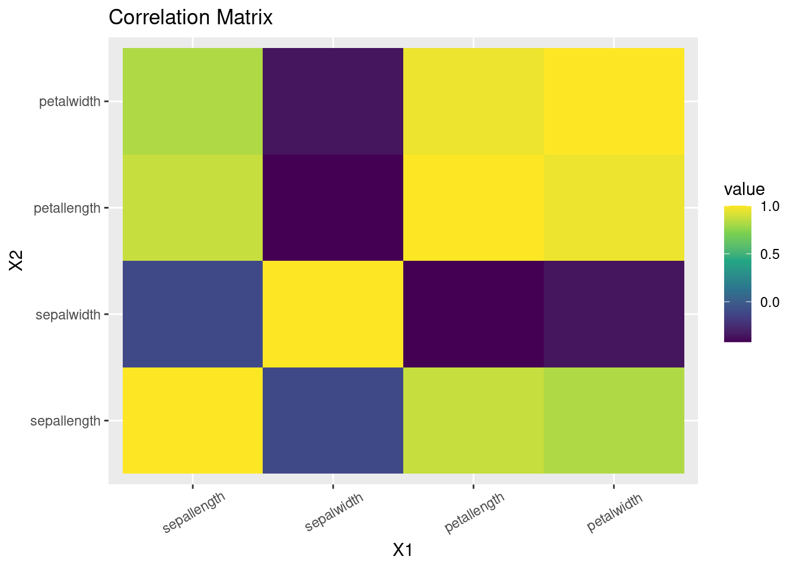
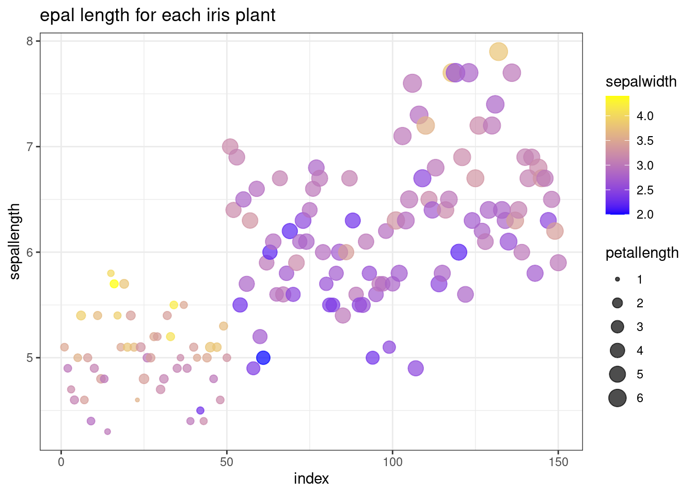
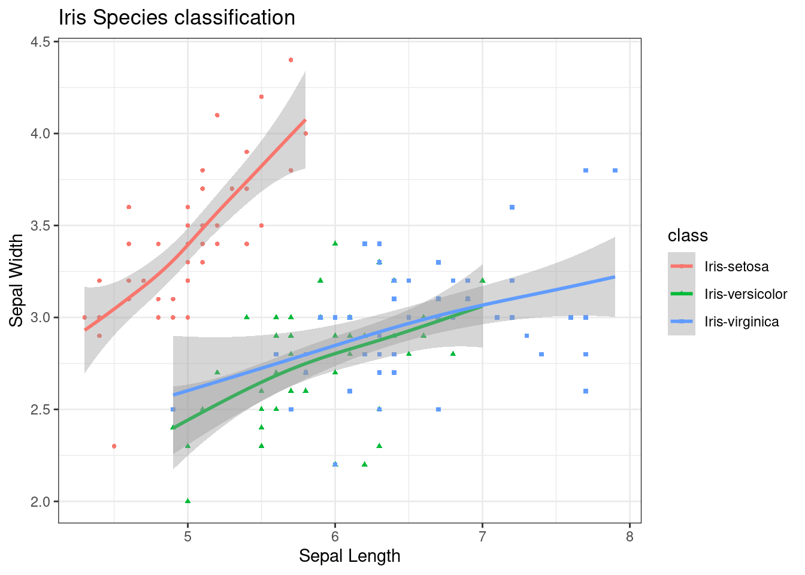
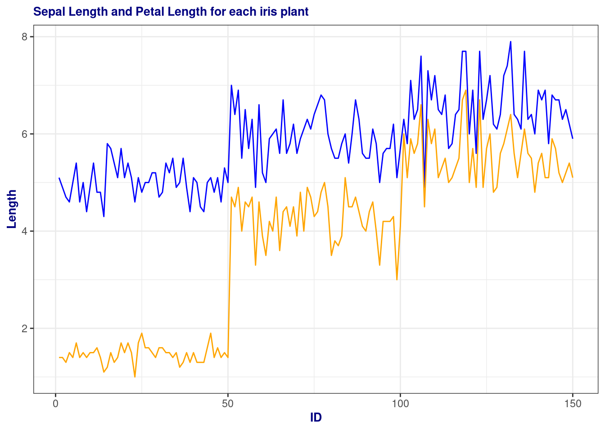
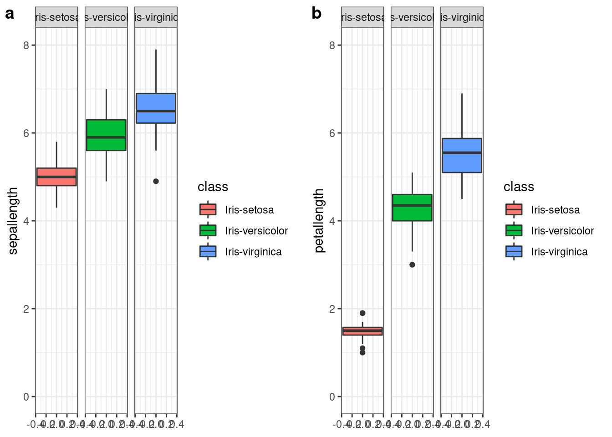

# Data Visualization in Python vs R

Xingyu Wei


## Description:

We will show how to plot graphs in Python and compare data visualization between Python ('Matplotlib.pyplot' & 'Seaborn') and R ('ggplot2'), illustrated by an example. We use the same data set and the same types of graphs to show the code and output differences between Python and R.

## Python part:

Link: https://github.com/xxxxy9/5702CC

## R part:


```r
# install.packages("jsonlite", repos="https://cran.rstudio.com/")
library("jsonlite") # must be installed from source
library(ggplot2) # For visualization
```

### Data:<br />
Source: https://datahub.io/machine-learning/iris#data 

```r
# Clean the environment
rm(list=ls())

json_file <- 'https://datahub.io/machine-learning/iris/datapackage.json'
json_data <- fromJSON(paste(readLines(json_file), collapse=""))

for(i in 1:length(json_data$resources$datahub$type)){
  if(json_data$resources$datahub$type[i]=='derived/csv'){
    path_to_file = json_data$resources$path[i]
    df <- read.csv(url(path_to_file))
  }
}

df['index']<-1:150
```

### The same five graphs as Python Part, Section 1.4

1. Heatmap<br />
Source: http://www.sthda.com/english/wiki/ggplot2-quick-correlation-matrix-heatmap-r-software-and-data-visualization

```r
#create correlation matrix
library(reshape)
cormatrix <- round(cor(df[1:4]),2)
melted_cormat <- melt(cormatrix)

#plot heatmap
ggplot(data = melted_cormat, aes(x=X1, y=X2, fill=value)) + 
  geom_tile()+
   scale_fill_viridis_c(alpha = 1) +
  theme(axis.text.x = element_text(angle=30, vjust=0.6))+ggtitle("Correlation Matrix")
```



2. Scatterpot including 3 variables
use color and size of each scatter point to represent other two variables

```r
ggplot(df, aes(x=index, y=sepallength, color=sepalwidth)) + geom_point(aes(size = petallength), alpha=0.7) + ggtitle("epal length for each iris plant ")+ scale_color_gradient(low="blue", high="yellow")+ theme_bw()
```



3. Regression graph with multiple regression lines 

```r
theme_set(theme_bw())
g <- ggplot(data=df, aes(x=sepallength, y=sepalwidth, color=class)) + 
  geom_point(aes(shape=class), size=1) + xlab("Sepal Length") + ylab("Sepal Width") + 
  ggtitle("Iris Species classification")

# generalised additive model
g + geom_smooth(method="gam", formula= y~s(x, bs="cs"))
```



4. Multiple plots sharing axes

```r
p <-ggplot(df, aes(x=index)) +    
    geom_line(aes(y = sepallength), color = "blue") +
    geom_line(aes(y = petallength), color = "orange") + 
    xlab("ID") + ylab("Length")+
    ggtitle('Sepal Length and Petal Length for each iris plant')

p + theme(
plot.title = element_text(color="navy", size=10, face="bold"),
axis.title.x = element_text(color="navy", size=10, face="bold"),
axis.title.y = element_text(color="navy", size=10, face="bold")
,legend.title = element_blank()) 
```



5. Boxplot <br />
Source: https://www.r-graph-gallery.com/265-grouped-boxplot-with-ggplot2.html

```r
p1<- ggplot(df, aes( y=sepallength, fill=class))+ 
    geom_boxplot() +
    facet_wrap(~class)+
    ylim(c(0,8))
p2<- ggplot(df, aes( y=petallength, fill=class))+ 
    geom_boxplot() +
    facet_wrap(~class)+
    ylim(c(0,8))
library(ggpubr)
ggarrange(p1, p2, widths = c(4,4), labels = c('a', 'b'))
```



