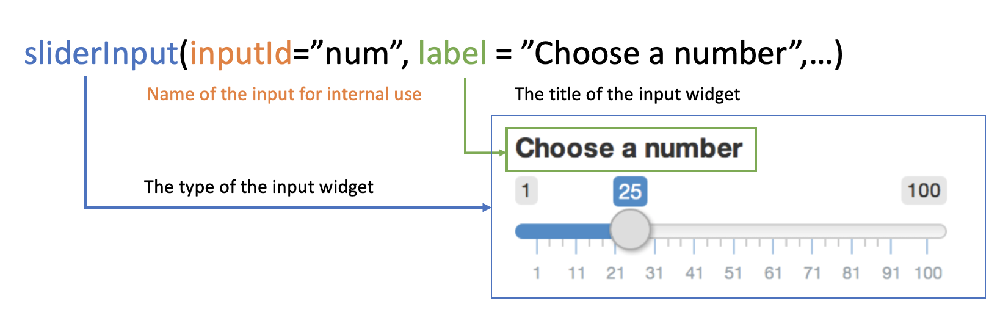
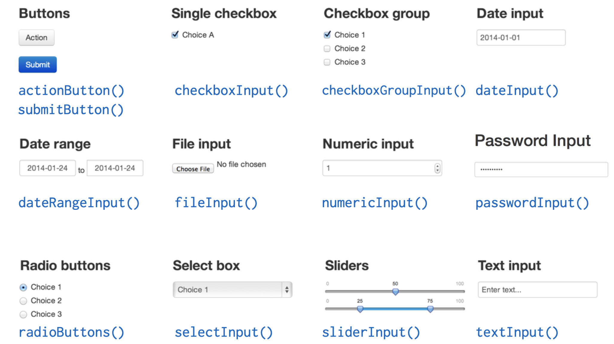
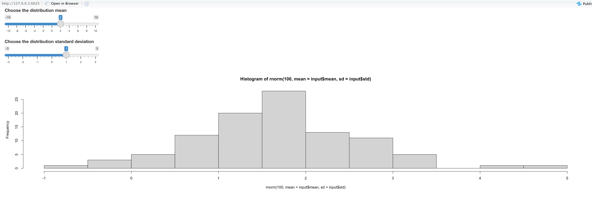
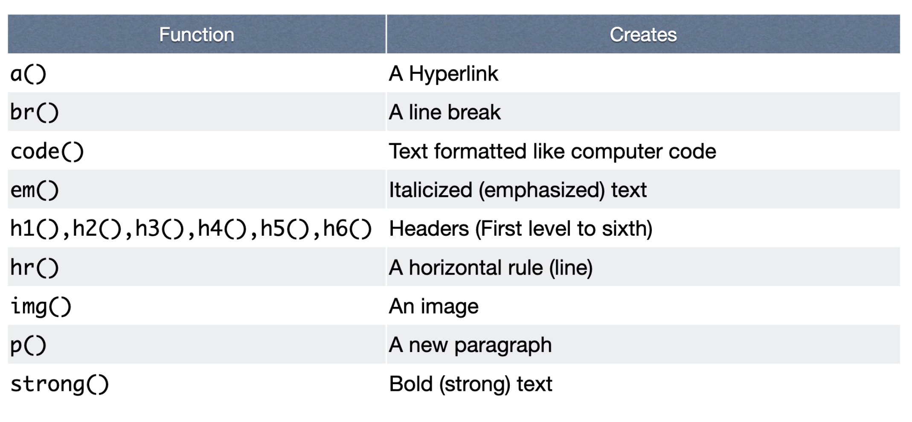

# R shiny tutorial

Hanqin Zhou


## What is shiny?

Shiny is an R package that makes it easy to build interactive web apps straight from R. You can host standalone apps on a webpage or embed them in R Markdown documents or build dashboards. You can also extend your Shiny apps with CSS themes, html widgets, and JavaScript actions. It is useful in data visualization because it allows users to interact with the data and help the analyzer to tell their story. This tutorial will help you to understand how shiny works, how to start your own shiny app and how to embed it with the visualization plots we learned in class! Sounds excited? Let's begin.

## The architecture of a shiny app

A shiny app is basically a web page which is maintained by a server running R script. Hence it has two parts. Part one is a UI theme which defines the styles and the interactions and part two is a Server which defines how displayed data changes when an action is triggered. To use it you must have the R package **shiny** installed and loaded in your code.


## A simple shiny App

The following is very simple shiny app template


```r
ui <- fluidPage("Hi, it is a shiny app!") # start a shiny page

server<- function(input,output){}

shinyApp(ui = ui, server = server)
```

To get it rendered you just run the code above and you will get:


Showing that this webpage is now running at your localhost. And you can visit this URL in a browser. And get something like this:


To terminate the server just stop running the code.

That's indicates your environment is set up! Then let's go further in to the inputs and outputs and see what we can play with shiny.

### Inputs

Input is the variable the app developer ask users to put in.



Shiny supports many ways of input, the following is a quick snapshot of them and you can also discover more yourself on the .



### Outputs

The outputs component mainly tells the webpage render to add a space in the ui for an R object. "hist" here only indicates the name of the plot that should be displayed in the space, it doesn't mean it must be a histogram. After we assign space and name to an output we should define its render function in the server part.


There are various types of out put in shiny:


### Server

The server function is where the plot and the table displayed defined.

There are **3** rules to the server function.

1.  Save object to display to output\$
2.  Build object to display with render\*(), eg. `renderPlot()`
3.  Access input values with input\$

Here is an example:


```r
ui <- fluidPage(
  sliderInput(inputId = "mean",label = "Choose the distribution mean", value = 2, min = -10,max = 10),
  sliderInput(inputId = "std",label = "Choose the distribution standard deviation", value = 1, min = -3, max = 3),
  plotOutput("hist")
) 

server<- function(input,output){
  output$hist <- renderPlot({
    hist(rnorm(100,mean = input$mean, sd = input$std))
  })
}

shinyApp(ui = ui, server = server)
```

What you will get:



Try to move the slider and you will get the different histograms according to your choice.

### Reactivity

The value shiny took with input is called **reactive value**. A reactive can't be used outside a reactive function in the sever function!

Render\*() functions are basic reactive functions. There are also other reactive functions as well. The most commonly used is `reactive` . In the reactive function one can do basic data.frame transformation and other data processing procedures based on the input values. And the result can be called inside the render functions. For example:


```r
ui <- fluidPage(
  sliderInput(inputId = "num",label = "Choose sample number", value = 20, min = 100,max = 0),
  plotOutput("hist")
) 

server<- function(input,output){
  data <- reactive({
    rnorm(input$num)
  })
  output$hist <- renderPlot({
    hist(rnorm(data()))
  })
}

shinyApp(ui = ui, server = server)
```

In this example server parse the input values to a list of values, and use this list instead of input arguments for the following functions.

Reactive function are widely used. In most case, we can't decide which data to use for visualization if you only have the input variables.

## Use it in EDAV

So far actually we have learned all we should know to make an interactive report with R shiny.

Take the the parallel coordinates plot mentioned in Problem Set 2 as an example. We can create a dynamic plot to give us parallel coordinates plot for each year for New York City and Non-New York City using shiny a app.

Here is the example


```r
df<-read_csv("https://data.ny.gov/api/views/ca8h-8gjq/rows.csv")
year_c = c(df$Year)
Region_c = c(df$Region)
ui <- fluidPage(
    selectInput("year", "Year:",year_c,selected = "2020"),
    selectInput("region", "Region:",Region_c,selected = "New York City"),
    plotOutput("cord"),

) 

server<- function(input,output){
  t <- reactive({
    df %>% filter(Year == input$year, Region == input$region)
  }) 
  output$cord <- renderPlot({ggparcoord(t(),columns = c(5:14), scale = "globalminmax",showPoints = TRUE) +geom_vline(xintercept = 1:10, color = "darkgray")+
  ylab('Count') +
  xlab('Categories') +
theme(legend.position = "right",axis.text.x = element_text(angle = 60, hjust = 1, vjust = 1)) })

}

shinyApp(ui = ui, server = server)
```

The result:


You can select another Region


It will result in another plot


## Fancier layout?

In a plain shiny app, it only add things from top to the bottom based on their written sequence. Which is not neat. Shiny also provide interface for developer who are more familiar with html and css to customize the appearance.

There are two ways.

First you can use an HTML function like:


```r
fluidPage(
  HTML("<h1>My shiny App</h1>")
)
```

Second you can use a **tag** function.

Shiny provide each tag inn HTML with a tag function which behaviors the same as they are in HTML. Here is the list:



To use them, you should assign them with a `tags$`


```r
fluidPage(
  tags$h1("My shiny app"),
  tags$p(style = "font-family:Impact", "See other apps here")
  tags$a("shiny shoucase", href = "https://shiny.rstudio.com/gallery/#user-showcase")
)
```

## Share your app

After building your shiny app, how to share it with others? Since we know that shiny needs a server to running R maintain the webpage. It can't be spread in the form of a static document. R shiny provide a few ways to share your work

1.  Use **shinyapps.io**

     is a maintained by Rstudio, which is free. It's is secure and scalable.

2.  Use a **shiny server**

     can be more customized, users can build their our server tailor for their own need base on Linux. They can also monitor the usage and the performance of it.
