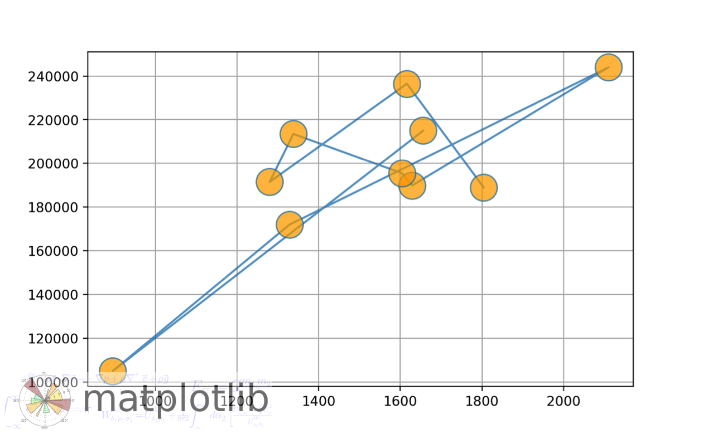
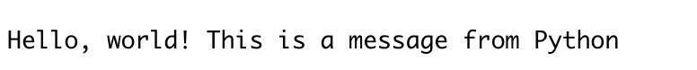
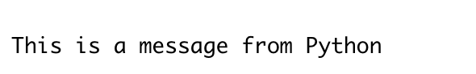

# Integrate R with Python

Weiwei Jiang

## 1.Introduction 

**Python** and **R** are important tools in Data Science. Sometimes you may be more familiar with a problem solution in one tool rather than the other. Sometimes you may have already developed a well-defined pipeline model or data analytic procedure in one of *Python* or *R*. It's tedious and time-consuming to rewrite the code in another form. Thus, it will bring lots of benefits if we can combine *Python* and *R*. This documents will foucs on how to run python code in R environment. There are  packages enable you to run R scripts in Python environment. rpy2 is one of the packages that are still keeping updating and the official documents will be a good start tutorial, as I put the link in Reference.

## 2. Runing Python code in R scripts

If you are searching a way to call *Python* from *R*, there exists an convenient CRAN package called "reticulate". This package enables you to easily transform between *R* and *Python* data type,using library from *Python*, source *Python* scripts and switch between different versions of *Python*.

### 2.1 Installation  

"reticualte" is included in CRAN, so you can simply install and use the package as follows.
```{r}
#install.packages("reticulate")#
library(reticulate)
```

### 2.2 Python version 
The default python version is the version declared in `PATH`. And this package is compatible with all version of *Python* >= 2.7.  You can either change the default python version or call functions to change python version when you need. 

The way to change default python version is to change the default python version in the `Rproj` or simply run this scripts `Sys.setenv(RETICULATE_PYTHON = PATH)`. The `PATH` value is the specific path that you want to use.

There are three function in *reticulate* to help you to change python versions.

1. `use_python()` : specify the path of certain version of *Python*
2. `use_virtualenv()`: specify the direction containing a *Python* virtualenv.
3. `use_condaenv()` specify the name of a Conda Env.

Example:
```{r}
reticulate::use_python( "~/anaconda3/bin/python")
```

There also exists a function called `py_config()` to show the current *Python* version and other *Python* version discovered from this system.

```{r}
py_config()
```

### 2.3 Data Transformation Between R and Python

One important thing you need to bear in mind is the data type consistence when you calling another programming language in current programming environment. Luckily, the *reticluate* package automatically convert the python data types to their equivalent R data types when you calling *Python* in *R*. You can convert Between *Python* and *R* data by calling `py_to_r` or `r_to_py`. Here is a simple example. 

```{r}
library(reticulate)
np <- import("numpy", convert=FALSE)
pd <- import("pandas",convert = FALSE)
(x <- np$arange(1, 5)$reshape(2L, 2L))

(y <- py_to_r(x))

(UCB <- data.frame(UCBAdmissions))
UCB_py <- r_to_py(UCB)
(pd$DataFrame(UCB_py))
```
The default data transformation format is listed below:

```{r table-simple, echo=FALSE, message=FALSE, warnings=FALSE, results='asis'}
require(pander)
panderOptions('table.split.table', Inf)
set.caption("Type Coversion")
my.data <- " # Type conversions
  R      | Python         
 Single-element vector     | Scalar
  Multi-element vector     | List     
  NamedList  | Dict
  Matraix/Array | Numpy ndarray
  Data Frame    | Pandas DataFrame "
df <- read.delim(textConnection(my.data),header=FALSE,sep="|",strip.white=TRUE,stringsAsFactors=FALSE)
names(df) <- unname(as.list(df[1,])) # put headers on
df <- df[-1,] # remove first row
row.names(df)<-NULL
pander(df, style = 'rmarkdown')
```

One important thing you need to bear in mind is that Arrays in R and Python are stored in different order. Arrays are stored in Column-major order in R while Row-major order in Python. So the representation of a n-dimension array might look differently between R forms and Python forms but they are the same data. Python tend to show data by the first dimension while R tend to use the last dimension. Here is the example.

```{r}
(x <- np$arange(1, 9)$reshape(2L, 2L,2L))

(y <- py_to_r(x))
```

### 2.4 Running python in R 
There are several ways you can do to call Python in R. 

1. Running in R Markdown cells and refers to the data by using `py$`
2. Source exists Python scripts 
3. Executing python code with functions.
4. Create an interaction Python console in R by Calling `repl_python()` function.

#### 2.4.1 Running in R Markdown cells
The reticulate packages includes a Python engine for R Markdown. Thus, you can simply write your python code in R Markdown.
```{python}
import numpy as np
import matplotlib.pyplot as plt
import pandas as pd 

fig, (ax1) = plt.subplots(1, 1)
# make a little extra space between the subplots

dt = 0.01
t = np.arange(0, 30, dt)

# Fixing random state for reproducibility
np.random.seed(19680801)


nse1 = np.random.randn(len(t))                 # white noise 1
nse2 = np.random.randn(len(t))                 # white noise 2
rp = np.exp(-t / 0.05)

cnse1 = np.convolve(nse1, rp, mode='same') * dt   # colored noise 1
cnse2 = np.convolve(nse2, rp, mode='same') * dt   # colored noise 2

# two signals with a coherent part and a random part
s1 = 0.01 * np.sin(2 * np.pi * 10 * t) + cnse1
s2 = 0.01 * np.sin(2 * np.pi * 10 * t) + cnse2

df = pd.DataFrame({ "t":t,
                    "s1":s1,
                    "s2":s2})
ax1.plot(t, s1, t, s2)
ax1.set_xlim(0, 5)
ax1.set_xlabel('time')
ax1.set_ylabel('s1 and s2')
ax1.grid(True)
plt.show()
```
```{r}
library(reticulate)
library(ggplot2)
ggplot(py$df,aes(x=t)) + geom_line(aes(y=s1),color="dark blue") +
                         geom_line(aes(y=s2),color = "dark orange") + 
                         xlim(0,5) +
                         labs(title ="Drawing with data From Python Enviroment",
                              y = "s1 and s2")
```

you can also easily reach the variable in r by using `r.` when you running in python environment. Here is an example. But one thing you should be extreme careful is that `r` is an interface object in python. If you assign any other value to the name `r` then you will lose this interface object in your python environment. So pay attention to your variable name in Python environment. 
```{r}
data(ames,package = "openintro" )
ames
```

```{python}
print(r.ames.head())
```
#### 2.4.2 Source exists Python scripts 
You can simply source an exist Python script and using Python code in R cells. Here is an example.
This is the content of plot Script
```
import numpy as np
import matplotlib.cbook as cbook
import matplotlib.image as image
import matplotlib.pyplot as plt
def plot_with_image(x,y):
    with cbook.get_sample_data('logo2.png') as file:
        im = image.imread(file)

    fig, ax = plt.subplots()

    ax.plot(x,y, '-o', ms=20, alpha=0.7, mfc='orange')
    ax.grid()
    fig.figimage(im, 10, 10, zorder=3, alpha=.5)

    plt.show()
```
Then you use the `source_python()` function to source this script and then you can use the defined Python function in R cells.
```{r,message=TRUE, warning=FALSE}
source_python("resources/r_with_python/plot.py")
plot_with_image(ames[1:10,]$area, ames[1:10,]$price)
```


### 2.4.3 Executing python code with functions.
There are two functions called `py_run_file` and `py_run_string()`. These two functions can help you to execute python in R scripts. Here is an example

```{r}
py_run_string("print('Hello, world! This is a message from Python')")
``` 
 
```{r}
#  Content of Hello.py : print('This is a message from Python')
py_run_file("resources/r_with_python/Hello.py")
```


Or you can simply import the Python package in R and use them in the format of R. Here is a simple example.
```{r}
np <- import("numpy", convert = TRUE)
np1 <- np$array(c(1:10))
np1
```
### 2.4.4 Executing python code with functions.
Create an interaction Python console in R by Calling `repl_python()` function. If you wish to write your python code in the console, you can call the `repl_python()` function. The the console of RStudio will change to Python engine. You can reach your python variable simply by adding the prefix `py$`.


## 3. Reference 
[https://rstudio.github.io/reticulate/](https://rstudio.github.io/reticulate/)

[https://anderfernandez.com/en/blog/how-to-use-python-in-r/](https://anderfernandez.com/en/blog/how-to-use-python-in-r/)

[https://rpy2.github.io/doc/v3.4.x/html/introduction.html#getting-started](https://rpy2.github.io/doc/v3.4.x/html/introduction.html#getting-started)
