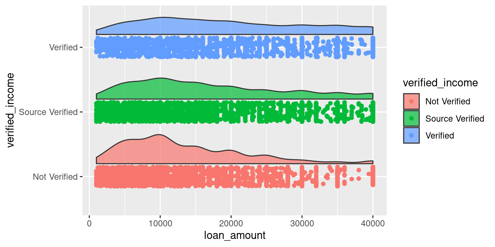
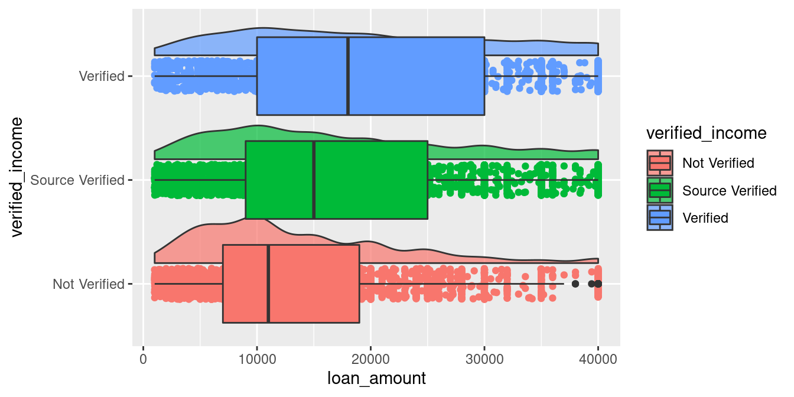
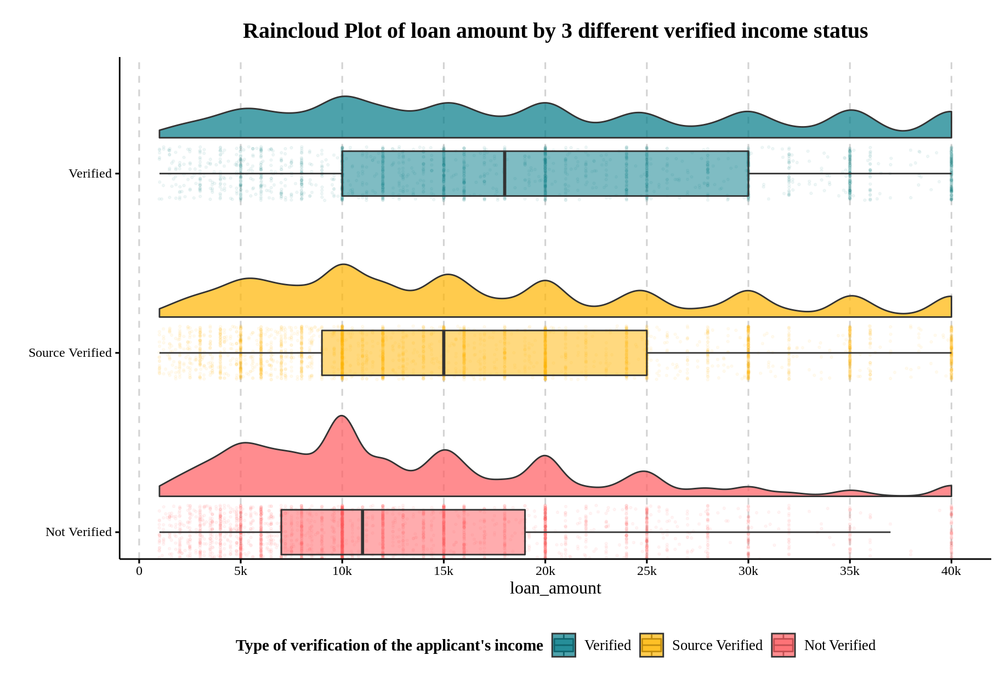
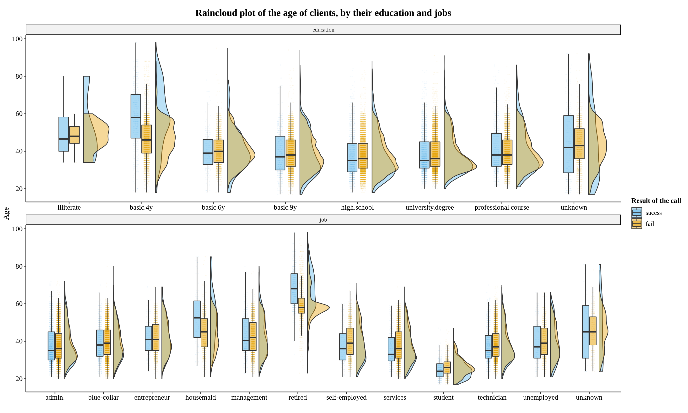
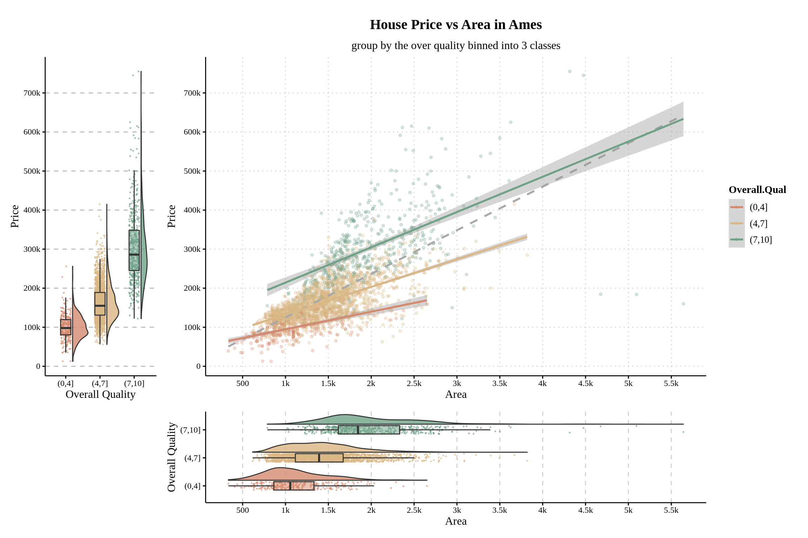

# Raincloud plot 101: density plot or boxplot？Why not do both!

Jace Yang


## Introduction

Remember every time when you analyze a dataset, you are torn between whether density or boxplot is the right one to go? For my EDAV 2021F fellow, you must have thought about that for a while in the Q5 of our HW1, the one we are asked to compare which the following one is better.


```r
loans_full_schema %<>%
  mutate(loan_purpose = reorder(loan_purpose, loan_amount, FUN = median)) 
JACE_COLOR <- c("#FF5A5F", "#FFB400", "#007A87", 
                 "#8CE071", "#7B0051", "#00D1C1", "#FFAA91", "#B4A76C", 
                 "#9CA299", "#565A5C", "#00A04B", "#E54C20")

loans_full_schema %>%

ggplot() +
  aes(y = loan_purpose,
      x = loan_amount,
      fill = loan_purpose) +
  geom_boxplot(alpha = 0.75) +
  theme_jace +
  only_x +
  scale_fill_manual(values = JACE_COLOR) +
  labs(title = "HW1 (5)b. Create horizontal boxplots of loan_amount, one for each level of loan_purpose",
       subtitle = "Use loans_full_schema data from in openintro package") +
  scale_x_continuous(breaks = breaks_width(5000), labels = axis_unit_scaler) -> p1

loans_full_schema %>%

ggplot() +
  aes(x = loan_amount, 
      y = loan_purpose, 
      fill = loan_purpose) +
  geom_density_ridges2(scale = 2) +
  scale_fill_viridis_d(alpha = 0.9) +
  theme_jace +
  only_x +
  labs(title = "HW1 (5)c. Create ridgeline plots for the same data as in b).",
       subtitle = "Use loans_full_schema data from in openintro package") +
  scale_x_continuous(breaks = breaks_width(5000), limits = c(0, NA))  -> p2

p1 / p2
```


The guidance solution below suggests that we should choose ridgeline plots because density reveals more information.

--- 

<mark> The high loan amounts of $40,000 are easier to see using the boxplots in part b. However, the ridgelines in part c allow us to see the distributions of the data</mark>, which gives us some interesting insight. For instance small business loans are essentially uniformly distributed from $10,000 to $40,000, with a bump at $40,000. Renewable energy loans are tri-modal, with modes at $10,000, $27,500, and $40,000. These modes and bumps are lost in the boxplots, as you cannot tell how many outliers there are at a specific loan amount. This goes along with the insight from part a, where we could see the majority of loans were multiples of $5,000.

--- 

However, as mentioned in the highlighted sentence, boxplots are also useful for determining the variable’s actual maximum:

  
  ```r
  max(loans_full_schema$loan_amount)
  ```
  
  ```
  ## [1] 40000
  ```

Aside from that, I believe boxplots have its own set of useful features in this case as well.

- It clearly displays the median ranking as well as the differences between them. Even when I rank the density plots in the Ridgeline plots, it is very difficult to identify which groups have bigger loan amounts on median or they are the same.

- While the Ridgeline plot allows us to compare the distribution of a few variables, it is unnecessarily detailed due to the fact that this category variable contains more than 10 examples. A box plot offers a lot of information at a glance by interquatile range.

However, there is a way to combine boxplot and ridgeline(density) plots together, using the raincloud plot:


```r
loans_full_schema %>%
  
ggplot() +
  aes(x = loan_purpose,
      y = loan_amount,
      fill = loan_purpose) +
  geom_point(aes(color = loan_purpose),
             position = position_jitter(w = .15),
             size = 0.5,
             alpha = 0.15) +
  geom_boxplot(width = .24,
               outlier.shape = NA,
               alpha = 0.5) +
  geom_flat_violin(position = position_nudge(x = .2),
                   trim = TRUE, 
                   alpha = 0.7, 
                   scale = "width")  +
  coord_flip() +
  scale_x_discrete(expand = c(0,0)) +
  scale_y_continuous(breaks = breaks_width(5000), label = axis_unit_scaler) +
  scale_fill_manual(values = rev(JACE_COLOR)) +
  scale_color_manual(values = rev(JACE_COLOR)) +
  labs(x = "",
       title = "Raincloud Plot of loan amount for 11 different loan purpose") +
  theme_jace +
  theme(legend.position = "none") +
  only_x
```


Now, you can not only see the density shape from the ridges, statistics from the boxplots, but also a scatter plot that informs us that loan amounts are predominantly multiples of $5,000, such as $35,000 and $40,000, which is the conclusion we are expected to get in 5. a)!

Without further ado, lets break it down and see how it is created!

## Components of raincloud plot.

In this section, I will use the variable `verified_income` with less cardinality to demonstrate one way to generate raincloud plot:


```r
loans_full_schema %>%
  select(verified_income, loan_amount)
```

```
## # A tibble: 10,000 × 2
##    verified_income loan_amount
##    <fct>                 <int>
##  1 Verified              28000
##  2 Not Verified           5000
##  3 Source Verified        2000
##  4 Not Verified          21600
##  5 Verified              23000
##  6 Not Verified           5000
##  7 Source Verified       24000
##  8 Source Verified       20000
##  9 Source Verified       20000
## 10 Not Verified           6400
## # … with 9,990 more rows
```

**Essentially, raincloud plot is just a halved `violin` +  jittered `point` + `boxplot` visulization combo.**

### Tailoring out the cloud: halved violin

Remind that violin plot is cool but wasting half the space. Because it is symmetric and both half are saying the same thing! So, the first thing we we’d like to do is to cut it half! The simplest way I know is using [geom_flat_violin](https://rdrr.io/github/samhforbes/PupillometryR/man/geom_flat_violin.html) from the `PupillometryR` pacakge.


```r
ggplot(loans_full_schema) +
  aes(x = verified_income,
      y = loan_amount,
      fill = verified_income) +
  geom_flat_violin(alpha = 0.7)
```


> Note that geom_flat_violin automatically enable `trim = TRUE` so it allows us to see the real min and max by default!

Sometimes a vertical raincloud plot is better in case you are visualizing high-cardinality variable and hope to keep it wide yet short in your paper (I will show you in the next section!). But for now, lets make it look more like a “cloud” first by flipping it!


```r
ggplot(loans_full_schema) +
  aes(x = verified_income,
      y = loan_amount,
      fill = verified_income) +
  geom_flat_violin(alpha = 0.7) +
  coord_flip() # New code added here
```


Now we have the clustered density curve! I looks like the ‘Not Documented’ Status has a larger density skewmess to the left, indicating that applicants without a verified income are more likely to be approved for a smaller loan amount. But it’s hard to read more information from it!

### Making it rain: jittered points

Then, creates some "rain".


```r
ggplot(loans_full_schema) +
  aes(x = verified_income,
      y = loan_amount,
      fill = verified_income) +
  geom_flat_violin(alpha = 0.7) +
  geom_point(aes(color = verified_income)) + # New code added here
  coord_flip() 
```


This doesn't looks right! Lets move the cloud a little bit higher.


```r
ggplot(loans_full_schema) +
  aes(x = verified_income,
      y = loan_amount,
      fill = verified_income) +
  geom_flat_violin(position = position_nudge(x = .2), # New code added here
                   alpha = 0.7) +
  geom_point(aes(color = verified_income)) +
  coord_flip() 
```


, and make the rain falls:


```r
ggplot(loans_full_schema) +
  aes(x = verified_income,
      y = loan_amount,
      fill = verified_income) +
  geom_flat_violin(position = position_nudge(x = .2),
                   alpha = 0.7) +
  geom_point(aes(color = verified_income),
             position = position_jitter(w = .15)) + # New code added here
  coord_flip() 
```



Now we have the density as well as the raw data that generated the density curve, which allows us to notice the weird parallel dots. But to better understand the median, quartiles, and outliers of our data, lets add some boxplots above the points!

### Adding the box to "collect" the rain: boxplot


```r
ggplot(loans_full_schema) +
  aes(x = verified_income,
      y = loan_amount,
      fill = verified_income) +
  geom_flat_violin(position = position_nudge(x = .2),
                   alpha = 0.7) +
  geom_point(aes(color = verified_income),
             position = position_jitter(w = .15)) +
  geom_boxplot() + # New code added here
  coord_flip() 
```



Oops, the box is too large! Remember that we already move the density curves higher, thus the only thing left to do now is to make the boxplots smaller. It will remain aligned with the center of the points.


```r
ggplot(loans_full_schema) +
  aes(x = verified_income,
      y = loan_amount,
      fill = verified_income) +
  geom_flat_violin(position = position_nudge(x = .2),
                   alpha = 0.7) +
  geom_point(aes(color = verified_income),
             position = position_jitter(w = .15)) +
  geom_boxplot(width = .25) + # New code added here
  coord_flip() 
```


Awesome! Then let's apply some magic to it!

### Adjustment

There are several parameters we can tune to make rain cloud plot looks good!

- `geom_point`:

    - `size`: the larger the data,  the smaller the size of a point should be.

    - `alpha`: the larger the data, the lighter one data point should set.
    
        - If there is so many data, pass in `data = . %>% sample_frac(0.33)` to only include 33% to generate those dots (`.` is refered to the data you pipe into ggplot()). But only do this sampling inside `geom_point`!
    
- `geom_boxplot`

    -  outlier.shape: I generally turn it off by passing `NA`, because by raincloud scatter we can distinguish outliers from points that lay outside the boxplot lines.
    
        - For example, in the last plot above, boxplot shows 3 high outliers at `Not Verified` class, but `geom_point` has already plotted and jittered them to indicate that there are many outlieres at `loan_amount = 40,000`!
    
    - `width`: the width of boxplot I generally pass in 0.25 and it looks good.

    - `alpha`: To see the dots below box plot, you have to make it a transparent by setting this or passing in a transparent color to fill scaler.
    
        - For example, `alpha("blue", 0.5)` gives you "#0000FF80", a "80" transparant effect added to blue color).
    
- `geom_flat_violin`

    - `scale`: default as `area`,which results in a discernible difference in density between the minority and majority groups. If you already know their difference and simply want to check in-group distribution only, pass in `scale = "width"`.

    - `alpha`: I personally like to make it a little transparent out of aesthetic considerations.
    
    - `adjust`: A multiplicate bandwidth adjustment. For example, `adjust = 0.5` means use half of the default bandwidth.
    
- `scaler`:
    
    - To change the colors, do in both to fill and color aesthetics! You can pick some colors and put them in `scale_color_manual(values = YOUR_COLORS)` and `scale_color_manual(values = YOUR_COLORS)`.

    - `scale_y_continuous`: you can create more breaks by utilizing `scales` pacakage. For example,
    
        - `breaks = breaks_width(5000)`: breaks every 5000.
        
        - `breaks = pretty_breaks(10)`: breaks them into about 10 axis.

- `theme`:

    - The grid lines in x axis (after flip it becomes y) are now useless! Because x axis contains only differnt categories, and keeping its grid lines will yield unnecessary lines under boxplots.
    
- More tips about scale and theme at the final “Additional Tips” section!


    
Now lets apply some of these techniques and get a cool chart:


```r
loans_full_schema %>%
  ggplot() +
  aes(x = verified_income,
      y = loan_amount,
      fill = verified_income) +
  geom_point(aes(color = verified_income),
             position = position_jitter(w = .15),
             size = 0.5,
             alpha = 0.05) +
  geom_boxplot(width = .25,
               outlier.shape = NA,
               alpha = 0.5) +
  geom_flat_violin(position = position_nudge(x = .2),
                   alpha = 0.7,
                   adjust = 0.5)  +
  coord_flip() +
  scale_x_discrete(expand = c(0,0)) +
  scale_y_continuous(breaks = breaks_width(5000), labels = axis_unit_scaler) +
  scale_fill_manual(values = JACE_COLOR) +
  scale_color_manual(values = JACE_COLOR) +
  guides(fill = guide_legend(title = "Type of verification of the applicant's income",
                             direction = "horizontal",
                             reverse = T),
         color = guide_legend(title = "Type of verification of the applicant's income",
                              direction = "horizontal",
                              reverse = T)) +
  labs(x = "",
       title = "Raincloud Plot of loan amount by 3 different verified income status") +
  theme_jace +
  only_x +
  theme(legend.position = "bottom") -> p
p
```



Looks good right? Now we get the full picture of this dataset by:

- **Observing the boxplots**: The median of the loan amount is: Verified > Source Verified > Not Verified, with a roughly 3.5k~4k incremental difference.

- **Observing the jitter**: The heaping effect occurs in all income verification statuses, and the loan amount appears in numbers of 1000, notably in the multiples of 5,000.

- **Observing the density**: For applicants without verified income, the loan amount distribution is unimodal around 10,000.

Isn’t the data itself is talking in this graph? I know the code is a little bit complicated, but I hope this code and the code in the 1.introduction should begin to make sense to you!


## More Examples

In this section, I organized codes from some of my previous work to provide you more examples! You can select one as a template to create your own! Typically, you can use raincloud plot if you have:

- 1 categorical variable, and 1 numerical variable (We already did that!)

- 2 categorical variable that 1 is the sub-group splitted from the other, and 1 numerical variable.

- 2 Categorical X + Numerical Y

- 1 categorical X + 1 numerical X + 1 numerical Y

Let’s check them out!

### Grouped Categorical X + Numerical Y

1. Data preparation

The [Kaggle Walmart sales dataset](https://www.kaggle.com/c/m5-forecasting-accuracy/data) provides us with 30,000+ “time serieses” of unit sales data from 2011 to 2015, organized hierarchically by store, category, and state.

In the following code, we clean it into the monthly total unit sales grouped by 10 stores in 3 states, and store it into a RData file for you to easily reproduce the plot!


```r
# This chunk is not evaled! It just shows my preprocessing steps from a data you can download from https://www.kaggle.com/c/m5-forecasting-accuracy/data
read_csv("resources/raincloud_plot_tutorial/sales_train_evaluation.csv", col_types = cols())  %>%

  # Calculate monthly mean sales by every store
  group_by(state_id, store_id) %>% 
  summarise_at(vars(starts_with("d_")), sum) %>% 
  pivot_longer(starts_with("d_"), names_to = "dates", values_to = "sales") %>%
  mutate(dates = as.integer(str_remove(dates, "d_")),
         dates = date("2011-01-29") + dates - 1,
         store_id = str_remove(store_id, "_validation|_evaluation"),
         month = month(dates),
         year = year(dates)) %>% 
  
  # Adjust it
  group_by(month, year, state_id, store_id) %>% 
  summarise(sales = sum(sales),
            dates = min(dates)) %>% 
  ungroup() %>% 
  filter(str_detect(as.character(dates), "..-..-01"),
         dates != max(dates)) %>% 
  transmute(state_id,
            store_id,
            year,
            month,
            sales) -> walmart_monthly_sales
save(walmart_monthly_sales, file = "resources/raincloud_plot_tutorial/walmart_monthly_sales.RData")
```


```r
load(file = "resources/raincloud_plot_tutorial/walmart_monthly_sales.RData")
walmart_monthly_sales
```

```
## # A tibble: 630 × 5
##    state_id store_id  year month  sales
##    <chr>    <chr>    <int> <int>  <dbl>
##  1 CA       CA_1      2012     1 106579
##  2 CA       CA_2      2012     1  77786
##  3 CA       CA_3      2012     1 160276
##  4 CA       CA_4      2012     1  58738
##  5 TX       TX_1      2012     1  77448
##  6 TX       TX_2      2012     1 107283
##  7 TX       TX_3      2012     1  80685
##  8 WI       WI_1      2012     1  51901
##  9 WI       WI_2      2012     1  57600
## 10 WI       WI_3      2012     1 115079
## # … with 620 more rows
```

- There are 63 months from Jan 2012 to Apr 2016, multiplying by 63 stores give us 630 rows.

2. Original version

This is exactly how we created raincloud plot:


```r
JACE_COLOR_2 = c("#FF5A5F", "#FFB400", "#007A87", 
                 "#8CE071", "#7B0051", "#00D1C1", "#FFAA91", "#B4A76C", 
                 "#9CA299", "#565A5C", "#00A04B", "#E54C20")

ggplot(walmart_monthly_sales) +
  aes(x = store_id, 
      y = sales, 
      fill = store_id) +
  geom_flat_violin(position = position_nudge(x = .2), 
                   alpha = .4) +
  geom_point(aes(color = store_id), 
             position = position_jitter(w = .15), 
             size = 1,
             alpha = 0.4,
             show.legend = F) +
  geom_boxplot(width = .25, 
               outlier.shape = NA,
               alpha = 0.5) +
  scale_fill_manual(values = JACE_COLOR_2) +
  scale_color_manual(values = JACE_COLOR_2)  +
  scale_y_continuous(labels = axis_unit_scaler, breaks = breaks_width(25e3)) +
  labs(x = "Store ID",
       y = "Monthly Sales",
       fill = "Store ID: ",
       title = "Raincloud plot of Walmart monthly sales from 10 stores in 3 states") +
  guides(fill = guide_legend(nrow=1,
                             byrow=TRUE))+
  theme_jace +
  theme(legend.position = "bottom",
        legend.margin = margin(-5, 0, 0, 0))
```


It looks okay, but note that the color we filled in to the boxplot and density curve is redundant since the store_id is already mapped to the x axis! This is exactly the case that if you find the legend unnecessary, probably the aesthetic it represents as well.

3. Better prectice

A better way is to map the fill to the “parent” group of `store_id`, the `state_id`!


```r
walmart_monthly_sales %>%

ggplot() +
 aes(x = store_id, 
     y = sales, 
     fill = state_id) + # Code changed here
  geom_flat_violin(position = position_nudge(x = .2), 
                   alpha = .4) +
  geom_point(aes(color = state_id), 
             position = position_jitter(w = .15), 
             size = 1,
             alpha = 0.4,
             show.legend = F) +
  geom_boxplot(width = .25, 
               outlier.shape = NA,
               alpha = 0.5) +
  scale_fill_manual(values = JACE_COLOR_2) +
  scale_color_manual(values = JACE_COLOR_2)  +
  scale_y_continuous(labels = axis_unit_scaler, breaks = breaks_width(25e3)) +
  labs(x = "Store id",
       y = "Monthly Sales",
       fill = "State Name: ",
       title = "Raincloud plot of Walmart monthly sales from 10 stores in 3 states") +
  guides(fill = guide_legend(nrow=1,
                             byrow=TRUE))+
  theme_jace +
  theme(legend.position = "bottom",
        legend.margin = margin(-5, 0, 0, 0))
```


- The color contains the state information now!

### Categorical X1 + Numerical X2 + Numerical Y

The [UCI Bank Marketing dataset](https://archive.ics.uci.edu/ml/datasets/bank+marketing) provides us with population characteristics of the object of a marketing campaign from a Portuguese financial institution, as well as whether it was successful as its binary target label.


```r
# This chunk is not evaled! It just shows my preprocessing steps from `bank-additional-full.csv` that I downloaded from https://archive.ics.uci.edu/ml/machine-learning-databases/00222/
read_delim("resources/raincloud_plot_tutorial/bank-additional-full.csv", ";", 
           escape_double = FALSE, 
           trim_ws = TRUE) %>%
  mutate(education = factor(education, 
                            levels = c("illiterate", "basic.4y", "basic.6y",
                                       "basic.9y", "high.school", "university.degree", 
                                       "professional.course", "unknown")) %>% 
                       fct_relevel("unknown", after = Inf),
         job = factor(job) %>% fct_relevel("unknown", after = Inf)) %>%
  rename(result = y) %>%
  arrange(education) %>% 
  select(job, education, age, result) -> bank
save(bank, file = "resources/raincloud_plot_tutorial/bank.RData")
```


```r
load(file = "resources/raincloud_plot_tutorial/bank.RData")
bank %>%
  
  pivot_longer(job:education,
               names_to = "variable",
               values_to = "class") %>%
  mutate(class = factor(class, levels = unique(c(levels(bank$education), levels(bank$job)))) %>%
           fct_relevel("unknown", after = Inf),
         result = factor(result, levels = c("yes", "no")) %>%
           fct_recode(sucess = "yes", fail = "no")) %>%
  
ggplot() +
  aes(x = class,
      y = age,
      fill = result) + #
  geom_flat_violin(position = position_nudge(x = .2), 
                   alpha = .4) +
  geom_point(aes(color = result), 
             position = position_jitterdodge(jitter.width = .15, # to sepreate jitter into their group.
                                             dodge.width = .3), 
             size = .3, 
             alpha = .03,
             show.legend = F) +
  geom_boxplot(width = .3, 
               outlier.shape = NA,
               alpha = .5) +
  facet_wrap(~variable, ncol = 1, scale = "free_x") +
  labs(x = "", 
       y = "Age",
       title = "Raincloud plot of the age of clients, by their education and jobs") +
  guides(fill = guide_legend(title="Result of the call")) +
  scale_fill_manual(values = c("#56B4E9", "#E69F00"), na.value = "#5f5f5f") +
  scale_color_manual(values = c("#56B4E9", "#E69F00"), na.value = "#5f5f5f") +
  scale_y_continuous(breaks = breaks_width(20)) +
  theme_pubr(base_size = 11, x.text.angle = 0) +
  theme(legend.position = "right") +
  text_theme
```



Lots of interesting information in this graph, for example:

- For education: `basic.4y` seems to be the group that salesmen can earn more clients among elder people

- For Job: younger students are more easily to become new client!

- ···

### Grouped Numerical X + Grouped Numerical Y

Raincloud plots can also be utilized as two additional scatter plot subplots, one to the left of the y axis and one to the bottom of the x axis!

> I have this idea seeing some folks add box plot and density curve around the axes, like the "Add marginal plots" section from the [ggpubr tutorial](http://www.sthda.com/english/articles/24-ggpubr-publication-ready-plots/78-perfect-scatter-plots-with-correlation-and-marginal-histograms/).

Let use the `ames` in the `openintro` package used in the homework 2! First I divide the 1~10 `overall quality` variable into 3 groups:


```r
ames %>% 
  transmute(price,
            Overall.Qual = cut(Overall.Qual, breaks = c(0, 4, 7, 10)),
            area) -> ames_cutted
head(ames_cutted)
```

```
## # A tibble: 6 × 3
##    price Overall.Qual  area
##    <int> <fct>        <int>
## 1 215000 (4,7]         1656
## 2 105000 (4,7]          896
## 3 172000 (4,7]         1329
## 4 244000 (4,7]         2110
## 5 189900 (4,7]         1629
## 6 195500 (4,7]         1604
```

Then we generate 3 subplots are organize them by `patchwork` package.


```r
COLOR_TEMP = c("#d5896f","#dab785","#70a288")
ames_cutted %>%
ggplot() +
  aes(y = price, 
      x = area) +
  geom_point(aes(color = Overall.Qual),
             size = .9,
             alpha = 0.25,
             stroke = 0.7) +
  geom_smooth(linetype = "dashed",
              se = F,
              color = 'darkgray',
              formula = 'y ~ x',
              method = "lm") +
  geom_smooth(aes(color = Overall.Qual),
              formula = 'y ~ x',
              method = "lm") +
  
  scale_y_continuous(labels = axis_unit_scaler_1, breaks = pretty_breaks(10)) +
  scale_x_continuous(labels = axis_unit_scaler_1, breaks = pretty_breaks(10)) +
  scale_fill_manual(values = COLOR_TEMP) +
  scale_color_manual(values = COLOR_TEMP) +
  labs(x = "Area",
       y = 'Price',
       title = 'Scatter plot for the area and price of housing') +
  theme_jace +
  get_lightxy(0.6) -> p_scatter

ames_cutted %>%
 
ggplot() +
  aes(y = price, 
      x = Overall.Qual,
      fill = Overall.Qual) + #
  geom_flat_violin(position = position_nudge(x = .2), 
                   alpha = .8) +
  geom_point(aes(color = Overall.Qual), 
             position = position_jitter(width = .15),
             size = .3, 
             alpha = .5,
             show.legend = F) +
  
  geom_boxplot(width = .3, 
               outlier.shape = NA,
               alpha = .5) +
  labs(x = "Overall Quality", y = "Price") +
  scale_fill_manual(values = COLOR_TEMP, guide=FALSE) +
  scale_color_manual(values = COLOR_TEMP) +
  scale_y_continuous(labels = axis_unit_scaler_1, breaks = pretty_breaks(10)) +
  theme_jace -> p_price

ames_cutted %>%
 
ggplot() +
  aes(y = area, 
      x = Overall.Qual,
      fill = Overall.Qual) + #
  geom_flat_violin(position = position_nudge(x = .2), 
                   alpha = .8) +
  geom_point(aes(color = Overall.Qual), 
             position = position_jitter(width = .15),
             size = .3, 
             alpha = .5,
             show.legend = F) +
  geom_boxplot(width = .3, 
               outlier.shape = NA,
               alpha = .5) +
  coord_flip() +
  labs(x = "Overall Quality", y = "Area", fill = NULL) +
  scale_fill_manual(values = COLOR_TEMP, guide=FALSE) +
  scale_color_manual(values = COLOR_TEMP) +
  scale_y_continuous(labels = axis_unit_scaler_1, breaks = pretty_breaks(10)) +
  theme_jace +
  only_x -> p_area


layout = "11333333333
          11333333333
          11333333333
          11333333333
          11333333333
          11333333333
          11333333333
          ##222222222
          ##222222222"
      
p_price + p_area + p_scatter + 
  plot_layout(design = layout) + 
  labs(title = "House Price vs Area in Ames",
       subtitle = "group by the over quality binned into 3 classes")
```



We can observe that the regression line is not as steep as the dashed line in the original figure after splitting houses into three categories. Lower quality houses not only have both house price and area distributed in a lower range (up to 3k in size and 270k in price), but they also have the slowest rate of house price growth along with area, implying the lowest average price per square meter.

## Additional Tips
Besides the adjustment mentioned inthe 2.4, these tips can also help you create a neat raincloud plot!

### Use a theme without grid
I customized a theme without grid base on `theme_clean()`! So to reproduce my cold, you can run this or simply remove the `+theme_jace`.


```r
# Create my own theme: theme_jace
FONT = "Times New Roman"
theme_bw() -> themebw_help
theme(
  text = element_text(family = FONT,
                      color = "black"),
  plot.title = element_text(face="bold",
                            hjust = 0.5,
                            family = FONT,
                            colour = "black",
                            margin = margin(t = 10, r = 0, b = 10, l = 0),
                            size = 15),
  axis.text = element_text(family = FONT,
                           color = "black"),
  plot.subtitle = element_text(family = FONT,
                               hjust = 0.5,
                               size = 12),
  axis.title = element_text(size = 12),
  legend.title = element_text(size = 11,
                              face = "bold",
                              color = "black",
                              family = FONT),
  legend.text = element_text(size = 10,
                             color = "black",
                             family = FONT)) -> text_theme

theme(
  panel.background = themebw_help$panel.background,
  strip.background = element_rect(fill = alpha("lightgray", 0.5), inherit.blank = T, colour = NA),
  panel.border = themebw_help$panel.border,
  legend.background = themebw_help$legend.background,
  plot.background = element_rect(color = "white"),
  panel.grid.major.y = element_line(linetype = "dashed", color = "gray")) -> background_theme

theme(
  panel.background = element_rect(fill = "transparent", colour = NA), # bg of the panel
  plot.background = element_rect(fill = "transparent", color = NA), # bg of the plot
  panel.grid.major = element_blank(), # get rid of major grid
  panel.grid.minor = element_blank(), # get rid of minor grid
  panel.border = element_blank(),
  legend.background = element_rect(fill = "transparent"), # get rid of legend bg
  legend.box.background = element_rect(fill = "transparent") # get rid of legend panel bg
) -> empty_theme

theme_legend = theme(
  legend.box.margin = margin(6, 6, 6, 6),
  legend.background = element_rect(color = NA),
  legend.box.background = element_blank()
)

theme_clean() + text_theme + background_theme + empty_theme + theme_legend  -> theme_jace
```


### Adjust the axis

To quickly read the value from boxplots’ statsitics, density curves’ modality, or the dots concentrated from the raincloud, I often do this:

- 1. Disable minor lines that can not be labeled, and only keep x's major lines:


  ```r
  only_x = theme(
    panel.grid.major.x = element_line(linetype = "dashed", color = "lightgray"),
    panel.grid.major.y = element_blank(),
    panel.grid.minor = element_blank()
  )
  ```
  
  Then I add simply `+ only_x` to the plot!


- 2. Add more `breaks` in `scale_y_continuous` to add the amount of labeled ticks. `scales` pacakage allowds you to:

    - `breaks = breaks_width(5000)`: breaks every 5000.
    
    - `breaks = pretty_breaks(10)`: breaks them into about 10 ticks.
    
- 3. For axes with large values, I will turn of the scitific notation by `options(scipen = 999)`. Then I shorten the ticks by plugging this function:


```r
axis_unit_scaler <- function(n, digits = 1){
  addUnits_leq_0 <- function(n){
    labels <- ifelse(n < 1000, n,  # less than thousands
                       ifelse(n < 1e6, paste0(round(n/1e3, digits = digits), 'k'),  # in thousands
                              ifelse(n < 1e9, paste0(round(n/1e6, digits = digits), 'M'),  # in millions
                                     ifelse(n < 1e12, paste0(round(n/1e9, digits = digits), 'B'), # in billions
                                            ifelse(n < 1e15, paste0(round(n/1e12, digits = digits), 'T'), # in trillions
                                                   'too big!'
                                            )))))}
  
  labels <- ifelse(n < 0, 
                   paste0("-", addUnits_leq_0(-n)),  # less than thousands
                   ifelse(n >= 0, addUnits_leq_0(n),  
                          "NA"))
  return(labels)
}
cat("12,345 now bocomes", axis_unit_scaler(12345),
    "6,666,666 now becomes", axis_unit_scaler(6666666))
```

```
## 12,345 now bocomes 12.3k 6,666,666 now becomes 6.7M
```

, and put it into `scale_y_continuous` like `p + scale_y_continuous(labels = axis_unit_scaler, breaks = pretty_breaks(10))`


## Reference

Thank you for taking the time to read this lengthy tutorial! Hope you enjoy this. Now, if you

- want to know who are the geniuses that invented raincloud plot: [Raincloud plots: a multi-platform tool for robust data visualization](https://peerj.com/preprints/27137/)

    - Their official tutorial in R, matlab, and python: [Github](https://github.com/RainCloudPlots/RainCloudPlots). (This is where I learned this fantastic technique in the first place!)

- want to know other ways to create it in R: [ggdist](https://www.business-science.io/r/2021/07/22/ggdist-raincloud-plots.html)

- want to know how to create rain cloud plot in **python**: [Making it Rain with Raincloud Plots](https://towardsdatascience.com/making-it-rain-with-raincloud-plots-496c39a2756f)

- know a better way to do it (or intended to build one): please email me at jy3174@columbia.edu!
