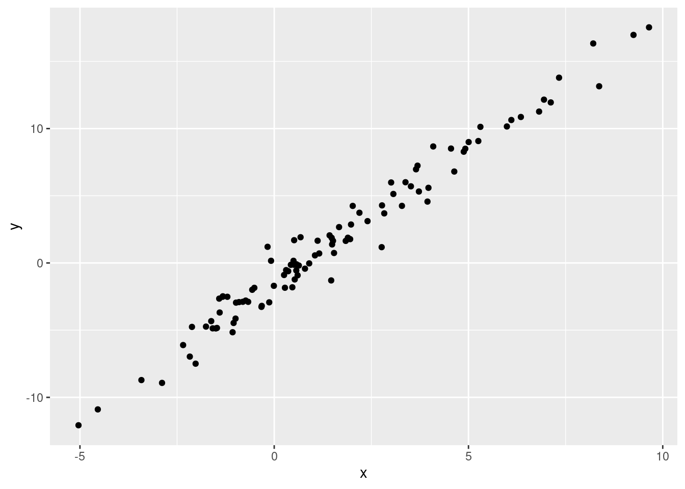
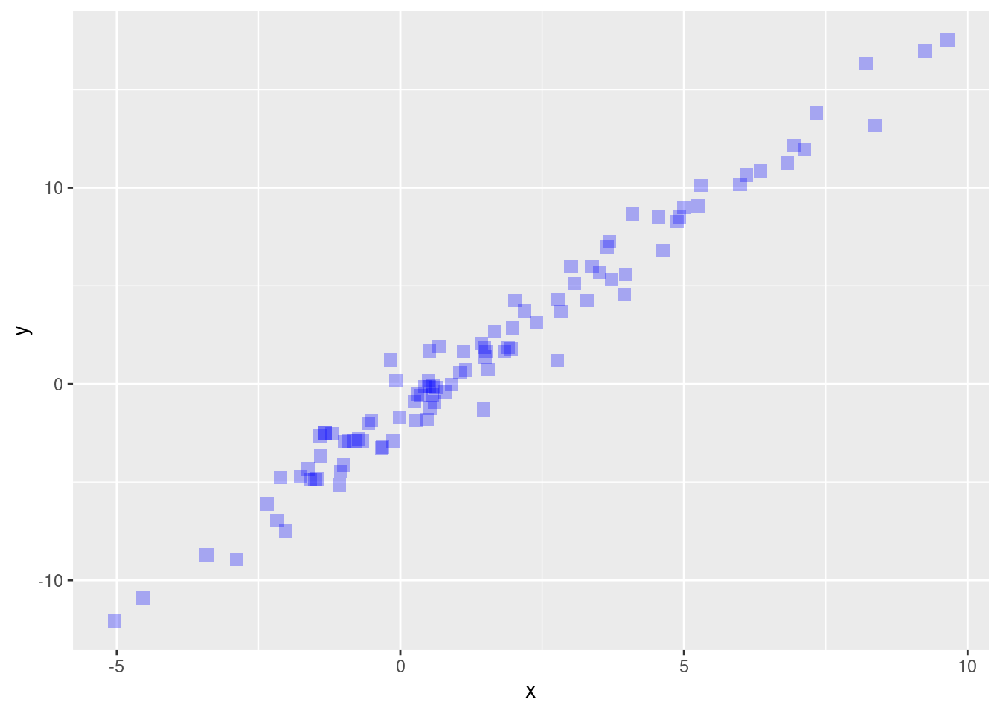
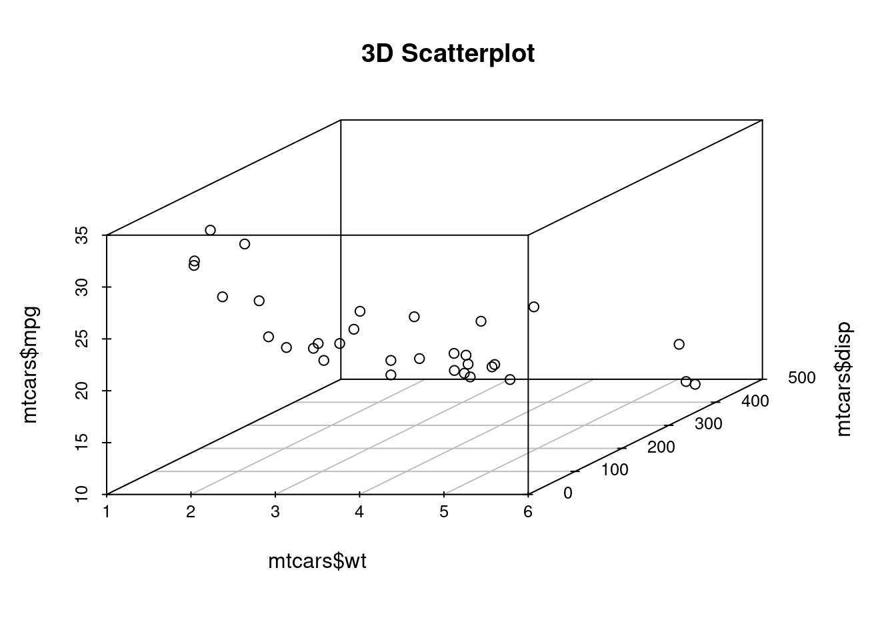
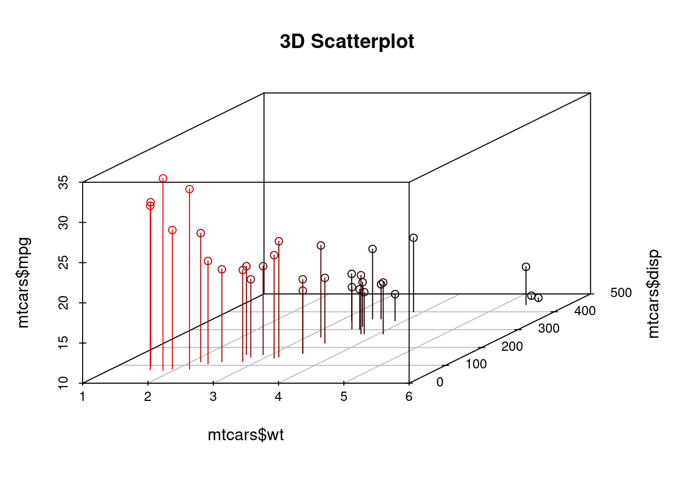
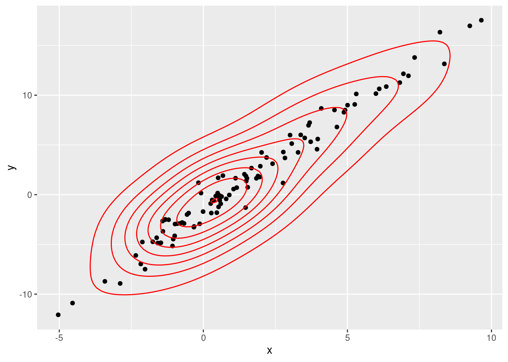
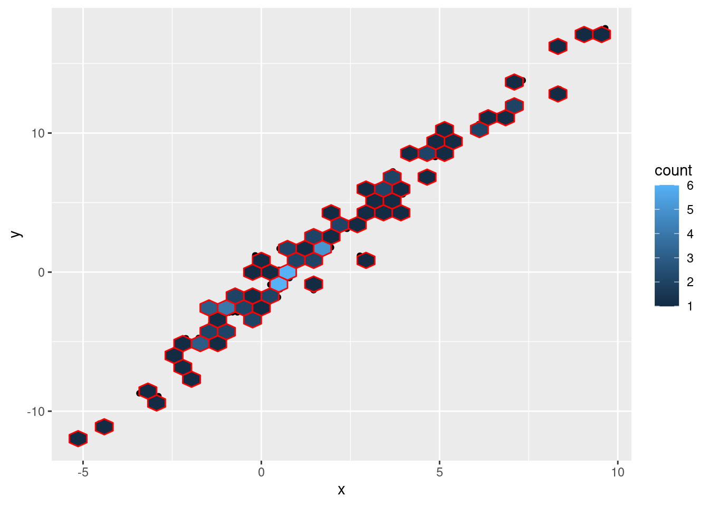
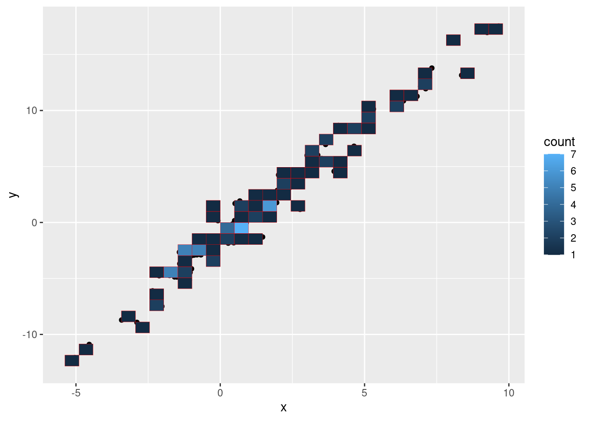
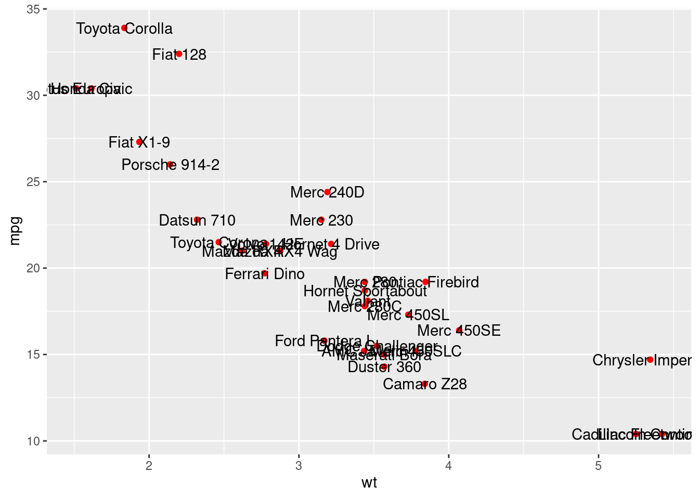
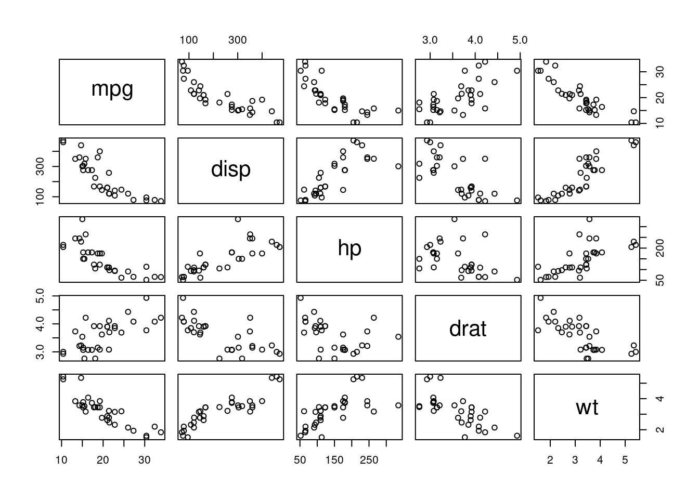

# Scatterplots cheatsheet

Shangzhi Liu

Check the link to see the scatterplots cheatsheet pdf file:

https://github.com/ShangzhiLiu2021/cc21fall2/blob/scatterplots_cheatsheet/resources/scatterplots_cheatsheet/scatterplots.pdf


```r
# package used
library(ggplot2)
library(scatterplot3d)
library(car) #use data mtcars in package car

# Sample scatterplot 1:
set.seed(1234)
x <- rnorm(100,mean = 2, sd = 3)
y <- -1.5 + 2*x + rnorm(100)
df <- data.frame(x = x, y = y)
ggplot(data = df, aes(x = x, y = y)) + geom_point()
```



```r
# Sample scatterplot 2:
ggplot(data = df, aes(x = x, y = y)) + geom_point(size = 3, alpha = 0.3, shape = 15, color = "blue", stroke = 0.3)
```



```r
# 3D scatterplot:
scatterplot3d(mtcars$wt, mtcars$disp, mtcars$mpg, main="3D Scatterplot")
```



```r
# 3D scatterplot example:
scatterplot3d(mtcars$wt, mtcars$disp, mtcars$mpg, highlight.3d=TRUE, type="h", main="3D Scatterplot")
```



```r
# Density contour lines, Hexagonal and Square heatmap 
ggplot(data = df, aes(x = x, y = y)) + geom_point() + geom_density2d(color = "red")
```



```r
ggplot(data = df, aes(x = x, y = y)) + geom_point() + geom_hex(color = "red", bins = 30)
```



```r
ggplot(data = df, aes(x = x, y = y)) + geom_point() + geom_bin_2d(color = "red", bins = 30)
```



```r
# text
ggplot(mtcars, aes(wt, mpg)) + geom_point(color = 'red') + geom_text(aes(wt, mpg, label = rownames(mtcars)))
```



```r
ggplot(mtcars, aes(wt, mpg)) + geom_point(color = 'red') + annotate("text", x = 3.840, y = 13.3, label = "Camaro Z28") + annotate("text", x = 1.935, y = 27.3, label = "Fiat X1-9")
```


```r
#matrix
pairs(~mpg+disp+hp+drat+wt,data=mtcars)
```



