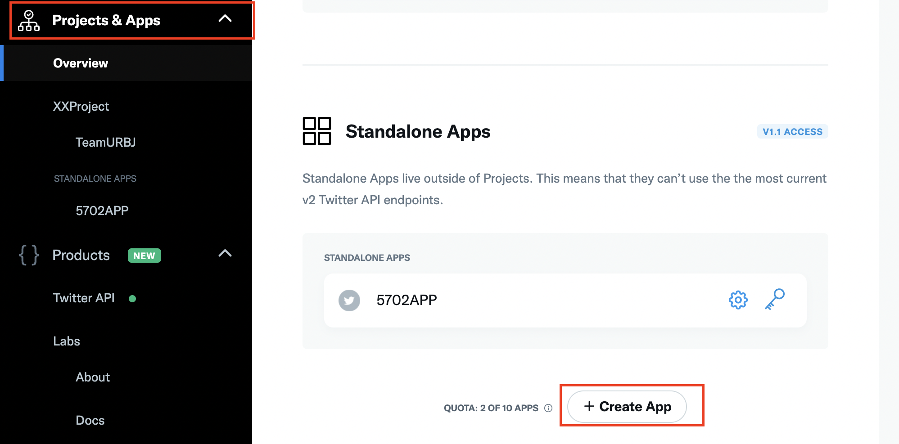
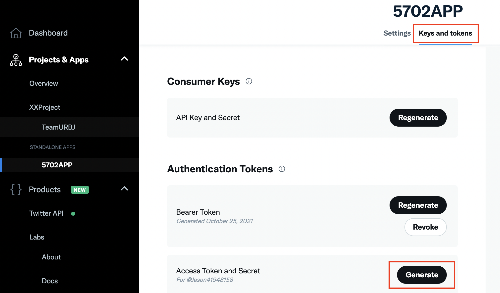
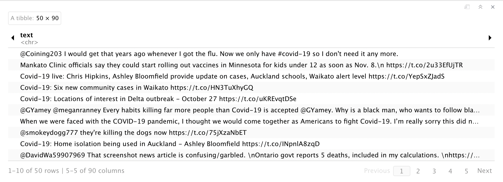
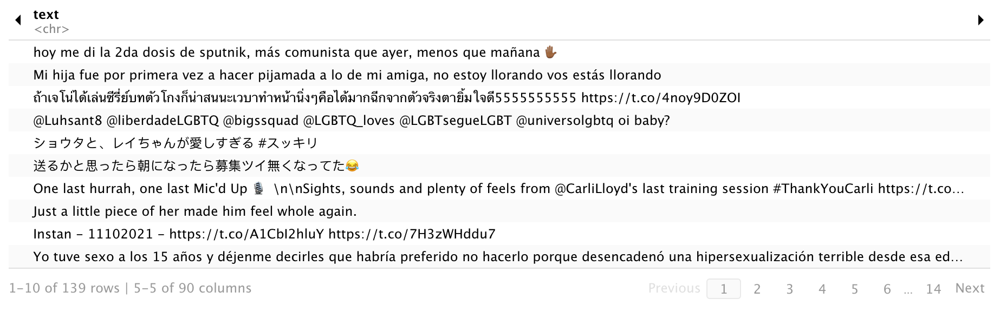

# Scrape Twitter data using R

Senqi Zhang

```{r, include=FALSE, cache=FALSE}
knitr::opts_chunk$set(eval=FALSE) # chapter can't render without working API keys
```

```{r, message=FALSE}
# install.packages("twitteR")
# install.packages("rtweet")
library(dplyr)
library(twitteR) #Note there is only one big capital R at the end
library(rtweet)
```

Social media is an emerging field of study for researchers. During the pandemic, lots of studies carried out analysis using Twitter data. In this tutorial, I want to introduce the basics of scraping Twitter data using R. I will introduce two libraries `rtweet` and `twitteR`. Note that these two libraries do not complement each other. `rtweet` actually contains all functionality in `twitteR` and more. It is updated and maintained more recently, and I would always suggest using `rtweet` for collecting Twitter data. However, for this tutorial, I will still introduce `twitteR`.

## Preparation


### Apply for developer account
To start, we need a Twitter account (and a valid phone number associated).

In order to gain access to Twitter data, we will have to apply for a developer account.

You can apply using https://developer.twitter.com/en.

The applying process requires you to fill in some academic and project information. It's a relative easy process and we will not dive deep into that. 

<br>

### Set up the App and generate tokens

After your application goes through, you need to set up your "App". Select **Project & Apps** and choose **Create App**



<br>

After successfully creating an App, click on **Keys and tokens**, then **Generate**. One page will pop up and contains all the information you need, including **API key**, **API secret**, **Access Token**, and **Access Token Secret**. You will need to keep a record of them.



<br>

### Libraries

We will use the following two libraries: `twitteR` and `rtweet`.

<br>

## twitteR

### Connection

We will first introduce the library `TwitterR`. Note that these keys are revoked after I finished the tutorial, so do not try to use them.

```{r}
API_key = "viQ7dbfTQrjCXq7MGc33C5KId" 
API_secret = "K6Xa9ZqBzjofXc8YpISMR1rfsv0PuwWHBXgTLYeziar3zIUg3Y"
Access_token = "1238492669338419200-8PM1QodMzH89YW99rClzdNEaw1VdMK"
Access_secret = "oWAZqJiw2V0LE8rI6OPV7htKWD9UTeU9o2cTiCMbUZ5Cq"
```

To start, we need to establish the connection. You will need to enter "1" in the console to authorize the connection.
```{r}
setup_twitter_oauth(API_key,API_secret,Access_token,Access_secret)
```

<br>

### Search 

We will first introduce `searchTwitter`, this is the basic function to find tweets using multiple criteria. For example we set the keyword to be **"Covid-19"** and return three tweets.

```{r}
searchTwitter("Covid-19", n=3)
```

Notice that the returned result is texts that contain a Twitter username followed by the content, and not all the contents are in English . You might as well observe that the some of texts do not seem to be complete and we will discuss about this later.

<br>
We can also limit our scope in English and give a time restriction.
```{r}
searchTwitter("Covid-19", n=3, lang="en", since="2021-11-01", until="2021-11-02" )
```

<br>
We can convert the returned tweets into a data frame using function `twListToDF`. Moreover, notice that all of the example tweets have RT at the beginning. This implies those results are actually retweets and we filter out those retweets using function `strip_retweets`

```{r}
covid_raw <- searchTwitter("Covid-19", n=500, lang="en", since="2021-11-01", until="2021-11-02" )
covid_df <- covid_raw %>% 
  strip_retweets() %>%
  twListToDF()

covid_df <- covid_df %>%
  select(text,favoriteCount,created,truncated,longitude,latitude)

knitr::kable(covid_df[1:3,], format="markdown")
```

For the purpose of tidiness, we only present several noteworthy features. In fact, for a single collected tweet, there are far more features than what `twitteR` presents. One of the most important feature is `extended tweet`, which contains the complete content of a tweet. Unfortunately, we are unable to retrieve that information using `tweetR`. Incomplete text can be meaningless to carry out any analysis. To solve this problem, I will introduce the other library `rtweet`.

<br>

## rtweet

### Connection

To establish connection, use a function like `search_tweets("Covid-19")`in the console. Then, if you have signed into your Twitter develop account, a page will pop-up, asking you to authorize API usage. Agree and the connection will be established.

<br>

### Search

The search function for `rtweet` resembles that of `twitteR`, with some changes. We can specify multiple keywords using a blank space. The result will return tweets that contain any of the three words. We can filter out retweets by setting `include_rts` to FALSE. 

```{r}
covid_df2 <- search_tweets("Covid-19 vaccine flu",n=50, include_rts=FALSE, lang="en")
```


You can observe that the returning data frame actually has 90 features compared to 16 features from `twitteR` data frame. The text feature did not seem to be complete because some parts did not show up due to the display length. We can write our data frame into a csv file and observe that the text feature is complete.

```{r}
#write_as_csv(covid_df2, "covid_df", na ="NA")
```

<br>

### Streaming

The search function has limitations. For `search_tweets`, it only returns results from the past 6-9 days. We resort to the streaming function to collect real-time tweets. 

You can stream random sample without specifying any keywords. The `timeout` parameter defines the time period searching. If you want to stream indefinitely, set `timeout = FALSE`. The function will return 1% of tweets posted during the time.
```{r}
rand_tweet <- stream_tweets("", timeout= 3)
```


You can not specify language and the results display multiple languages.

<br>

You can also specify keywords and write the data into a json file. For data collection purpose, this is recommended method. You can set`timeout=FALSE` to collect for a continuous period. The collected data will be in "covid.json".
```{r}
#covid_tweet <- stream_tweets("Covid-19", timeout=3, file_name = "covid.json", langangue="en")
```

<br>

### Other functions

You can use `get_timeline` to retreive tweets posted by target users.

```{r} 
potus_tweet <- get_timeline("@POTUS",n=5) #Collecting tweets posted by the president.
```

<br>

You can use the following to find certain groups of users. For example, `get_friends` returns the ids of those who Elon Musk follows. I then use `lookup_users` to find out one specific user. (Which is the Creator of Dogecoin)

```{r}
em_favorite <- get_favorites("@elonmusk",n=5)
em_friends <- get_friends("@elonmusk",n=5)
em_follower <- get_followers("@elonmusk",n=5)
friend <- lookup_users(30699048)
```

<br>

You can use the built in `ts_plot` to plot a time series showing tweets posted at each time stamp. We set the interval to be 5 minutes.
```{r}
covid_df3 <- search_tweets("Covid-19",n=1000, include_rts=FALSE, lang="en")
ts_plot(covid_df3,by = "5 minutes")
```

<br>

There are other functions that allow you to manipulate your own Twitter status, like posting tweets, following a certain Twitter users, etc.. I will leave those for the readers to find out. Refer at https://www.rdocumentation.org/packages/rtweet/versions/0.7.0 for a full list of functions to use.

<br>

## Wrap up

### API limitations

Both the libraries are actually built up based on the Twitter API, and Twitter standard API poses some fundamental restrictions.
For example, `search` generally allows you to search back only seven days. For this reason, I suggest always using streaming method if you want to collect a large amount of data. For other limits, you can refer to: https://developer.twitter.com/en/docs/twitter-api/early-access.

<br> 

### Python equivalent library

You can also refer to the `Tweepy` library in Python, which has the same functionality in collecting tweets, at https://docs.tweepy.org/en/stable/.

<br>

## Reference

https://www.rdocumentation.org/packages/rtweet/versions/0.7.0

https://www.rdocumentation.org/packages/twitteR/versions/1.1.9

