# Introduction to exploratory spatial data analysis and visualization using QGIS

Yao Xiao

## Concepts and definitions
This tutorial covers some of the fundamental knowledge of geospatial data analysis, which is a way of using analytical methods and tools to visualize, examine and interact with data involving the location and the environment. This is unique and important because it is able to identify spatial characteristics, processes, dependence in the data that may otherwise be ignored in traditional exploratory data analysis. The subject aims at addressing interesting questions that may be useful for research or policy. Here are some examples.

* Where does an event in question happen? And what is its extent/severity?
* What is the spatial relationship of different places? Are they connected, intersected, disjoint?

* Are there associations/differences between places that are nearby/faraway?

This tutorial also introduces several QGIS skills. QGIS is a powerful tool for its advantages of being a free and open-source software that is made available in multiple languages, operating systems and versions. The link to the installer downloads is https://qgis.org/en/site/forusers/download.html

We will begin with learning about the two main types of geographical data: vector and raster data. Raster data is made up of pixels and grid cells. It is often represented as the "surface". Satellite imagery can be an example of raster data. For our purposes, we will just focus on vector (shapefile) data that include points, lines and polygons.

1. **Point**: data that represent a feature and specify the coordinates of the feature. Examples include schools, city halls, bike sharing stations, etc…

2. **Line**: data that represent a linear feature and connects points. Examples include rivers, streets, trails, etc…

3. **Polygon**: data that represent areas that delineate boundaries. Examples include neighborhoods, cities, states, etc…

Another key concept is the awareness of the "distortions of the reality" introduced during the process of mapmaking. As we try to represent the Earth’s surface on a two-dimensional space, which is the map, we must understand the underlying processes of this conversion and adjust some setups so data are correctly represented on the map. Often times, the shape of the earth is approximated as a spheroid, the **datum** specifies a system that defines the position of the spheroid relative to the center of the Earth and provides a frame of reference for locations on the surface of the Earth. How coordinates from the **datum** are represented also depends on the **projection**, which uses mathematical calculations to systematically arrange/transform a set of coordinates to formulate a flat, 2-d map. **Datum** and **projection** are important because they determine both the degree and way of distortion of the real Earth's surface and affect the visual representation and measurement accuracy of the data. 

Sometimes we are interested in learning about the **central tendency** and **distribution** of a particular feature. For example, given we are able to visualize the number of bike shares in different county on the map, we may wonder where is the central location of these event points or how spread out are them. Here, we need to apply **centrographic analysis**, which is the descriptive statistics that summarizes the point patterns. I will introduce two statistics: **mean center** and **standard deviational ellipse**. For the point data, the **mean center** computes the mean of the coordinates of longitude and latitude of these points. The **standard deviational ellipse** computes the directional average distance of points from the mean center along two axes, one that goes through the maximum dispersion of the spatial distribution and another that is perpendicular to it.

## Data setup and preparation
Next, I will cover an example with step-by-step instructions and explore how to use QGIS to answer some of the aforementioned research questions. We will have to download the following files:

1. **ZCTA_2010Census_DP1.zip**: The shapefile data of 2010 Census Demographic Profile for the US zipcode tabulation area from US census website. 
Link: https://www2.census.gov/geo/tiger/TIGER2010DP1/

2. **nyu_2451_34509.zip**: The shapefile data of the New York City zipcode tabulation areas. On the dropdown menu, select "EPSG:4326 Shapefile", and click "Downloads"  "Original Shapefile". 
Link: https://geo.nyu.edu/catalog/nyu_2451_34509

3. **NYPD Complaint Data Current (Year To Date).zip**: The shapefile data of New York City felony, misdemeanor, and violation crimes reported to the New York City Police Department. Select "Export" and click "Shapefile". Also download the data dictionary NYPD_Complaint_YTD_DataDictionary.xlsx in the attachment section on the same page.
Link: https://data.cityofnewyork.us/Public-Safety/NYPD-Complaint-Data-Current-Year-To-Date-/5uac-w243

We will use these datasets to understand:
* Is there a spatial relationship between homeownership and other demographic characteristics at the zipcode level in NYC? 
* Is there a spatial relationship between different crimes in NYC?
* Can we compare the distributions and central spatial locations of these features on a map?

## Homeownership in Relation to Other Demographic Characteristics

First, we need to import the datasets. After we open QGIS, we select "Layer" – "Add Layer" – "Add Vector Layer". A window will pop up and ask you the path of the datasets. We import **ZCTA_2010Census_DP1.zip** and **nyu_2451_34509.zip** into the software. 

Note when we import **nyu_2451_34509.zip**, you have to select the layer to be imported. We will use the shapefile with ".shp" at the end. Click OK.

Second, we recall that the datasets use a particular datum and Coordinate Reference System or CRS. We set the CRS of both layers to be "EPSG:4326".

Third, since we are interested in the features of the NYC. We want to limit the datasets to only include areas of NYC. We do so by joining the zipcode in two datasets. So the layer of the New York City shapefile **nyu_2451_34509** contains all of the demographic characteristics in **ZCTA_2010Census_DP1** we are interested in. We select "Toolbox" (the gear icon) on the menu, type in "Join" and click "Join attributes by field value".  We specify the input layers to join by "zcta" and "ZCTA5CE10". Click "Run".

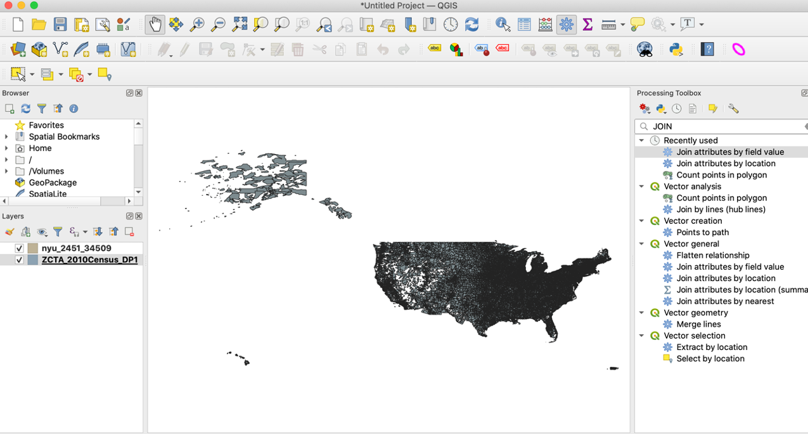

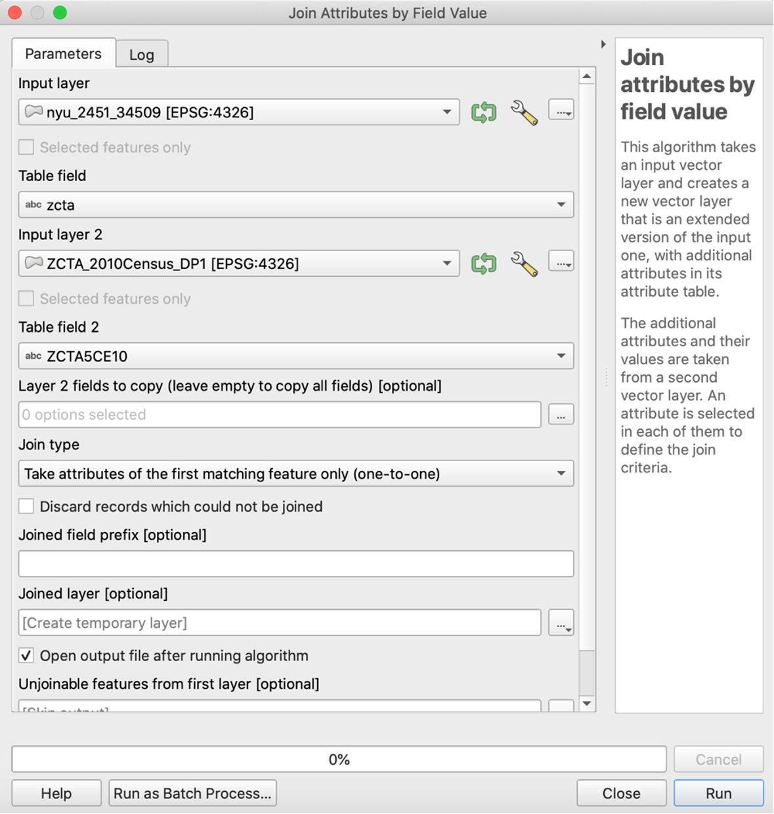

We want to find the proportion of housing units that are owned vs. rented in each New York postcode area. We take a look at "DP_TableDescriptions.xls" that is inside the **ZCTA_2010Census_DP1.zip** to understand the meaning of different feature names. We find the number of owner-occupied housing units is coded "DP0210002" and the total number of housing units is coded "DP0210001".  We use this ratio to calculate the proportion of homeownership.

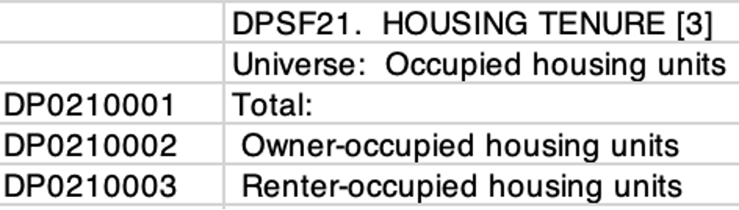

We right click the joined layer and go to "Open Attribute Table" – "Open field Calculator", enter the expression, chose the output type to be decimal number and click "OK".

Then, we right click the joined layer and go to "Properties".  We select the symbology feature and click "Graduated" from the dropdown menu. We choose the value "ho prop" that is created from the field calculator, and click classify and OK.

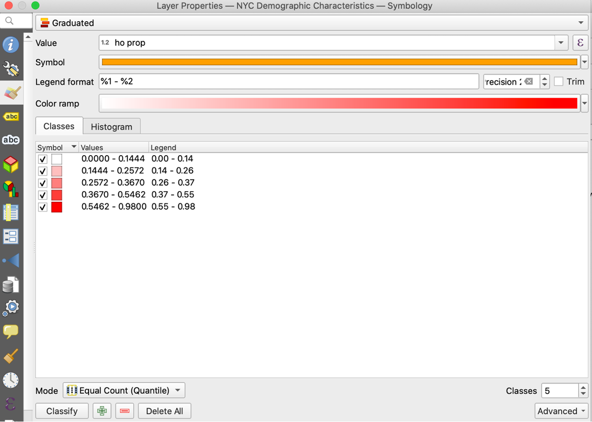
We just finished creating a choropleth map for the ratio of owner-occupied housing units to total housing units! We can add the legend and the title to make the map prettier. From "Projects", we choose "New Print Output" and name our map. From there, you can use add map, legend and label in the "Add Item" functionality to complete the visualization. My final product look as follows. 

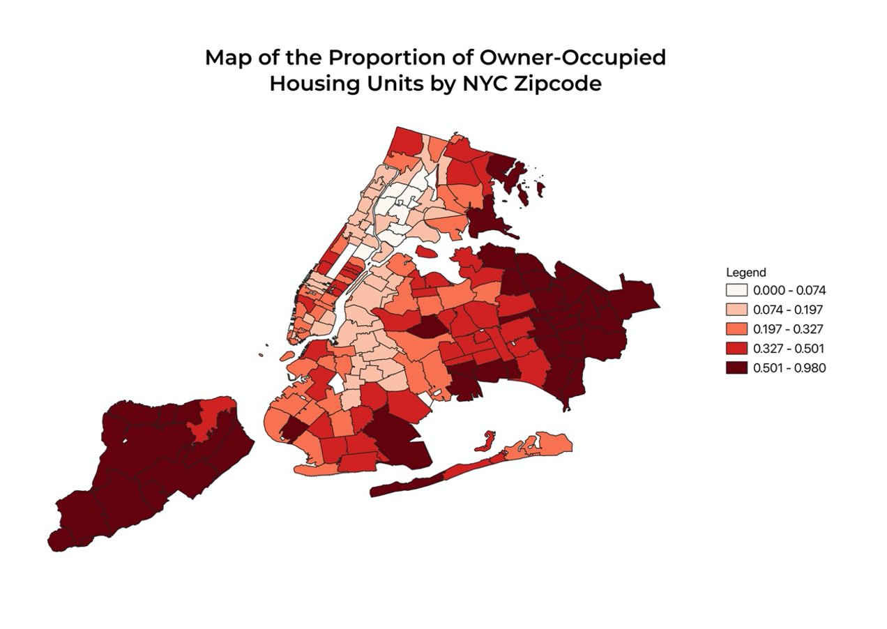
Using the techniques just learned, you can also create maps for other demographic variables. 

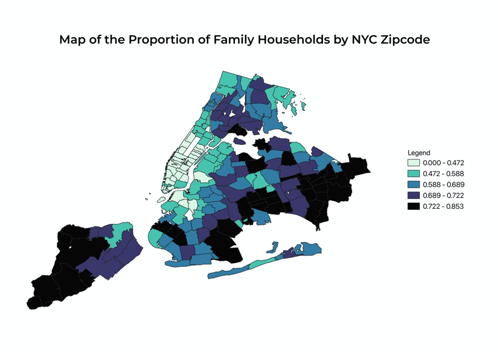
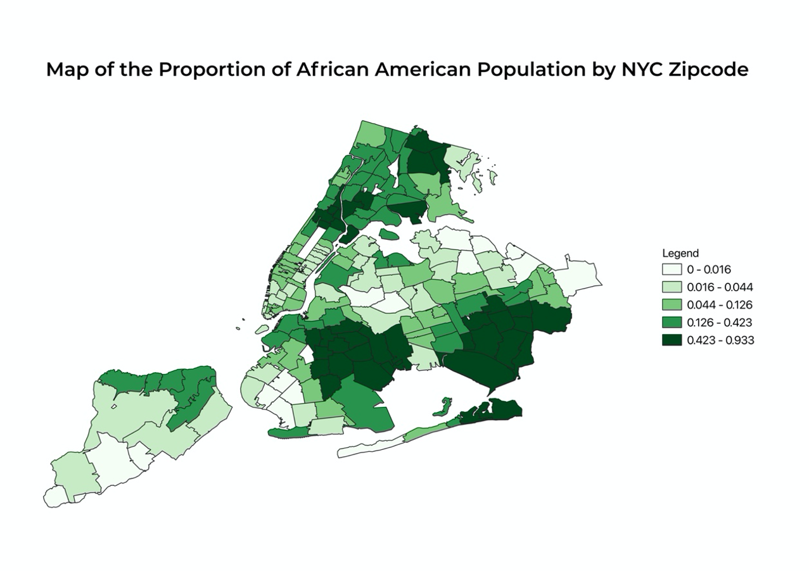

Mapping out the density of owner-occupied housing units shows a very clear pattern of clustering: some places have significantly higher percentages of owner-occupied housing units than others. The most noticeable parts that can be observed from the map are Staten Island, Long Island, a majority of Queens, the southern region of Brooklyn, and the northern region of Bronx. These are areas on the map that are shaded in red and crimson, representing a higher ratio of the number of owner-occupied housing units to total housing units. I also want to know if African American or Black population, who are socioeconomically disadvantaged on average due to the presence of explicit and structural racism, have lower rates of homeownership than other races as well. And we can easily find such a pattern from the following map. For nearly all of the regions that have a higher percentage of owner-occupied housing units mentioned above, the concentration of African American or Black population is lower. Also, I want to investigate whether neighborhoods that have more families on average have higher rates of ownership because the need for stable housing of families may be stronger than individuals who live alone. And we surely find this conjecture plausible. Staten Island, eastern Queens, and southern Brooklyn have higher concentrations of both family households and owner-occupied housing units. 

## Spatial Pattern of Different Crimes

To answer the second question, we need to load the crime dataset to QGIS. For our purposes, we want to filter the datasets so that only felony crimes in NY are included. After the dataset is loaded, open the attribute table and select "Advanced Filter (Expression)" on the dropdown menu. From the data dictonary, we observe that "law_cat_cd" categorizes different crime incidents so we enter the following expression so only felony data are selected. We then right click the layer and export the file that contains the selected data using "Save Selected Features As…"

Import the selected data as a new layer and filter the rows again by specific crimes we are interested to make comparisons. 

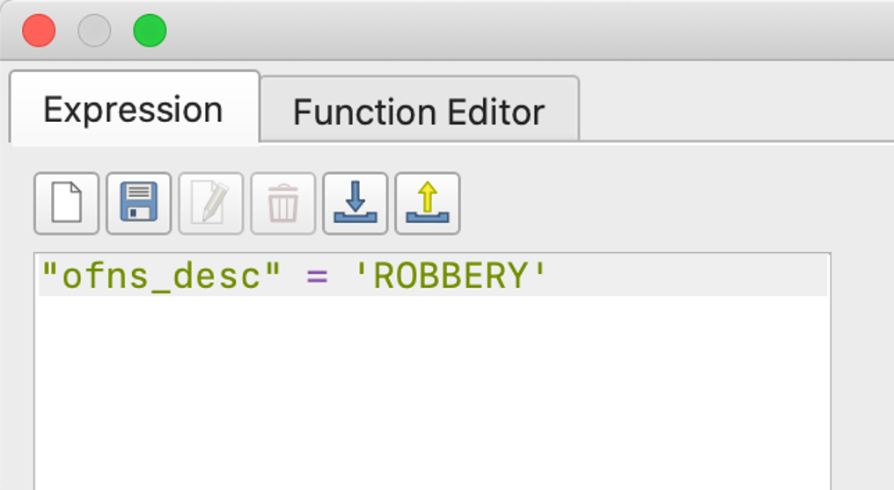
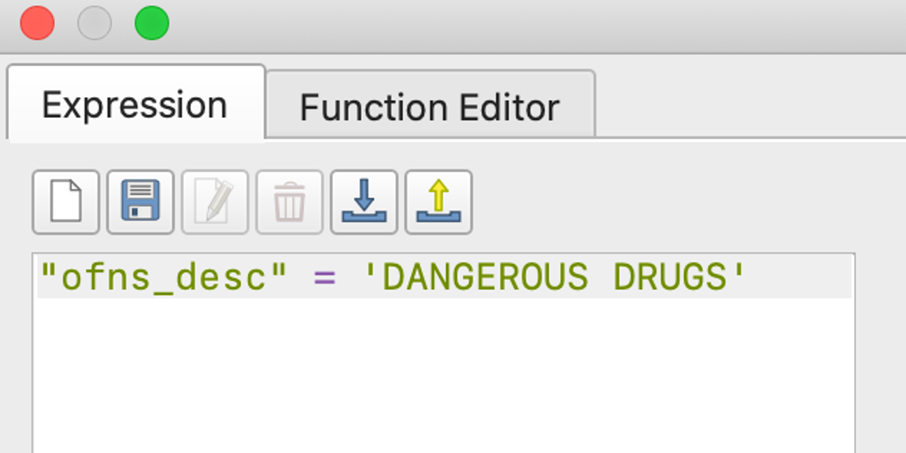

As we still see too many points on the map, we may want to find a better way of summarizing the density of the crime incidents. We will use the "Count Points in Polygon" functionality. After running, a new layer is generated with an added column "NUMPOINTS ROBBERY" at the rightmost corner of the attribute table.

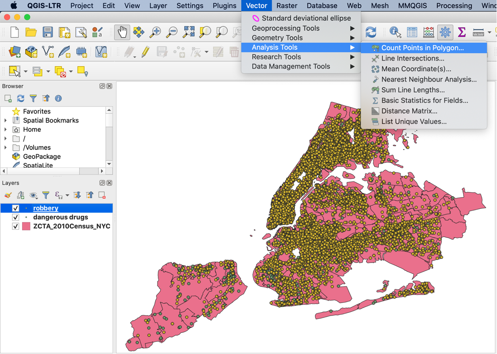

We then can use the "NUMPOINTS ROBBERY" attribute to make a similar choropleth map. 

Next, we want to compute the mean center of the points. We can visualize the center by selecting "Mean Coordinate(s)"

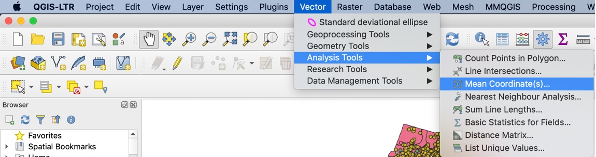
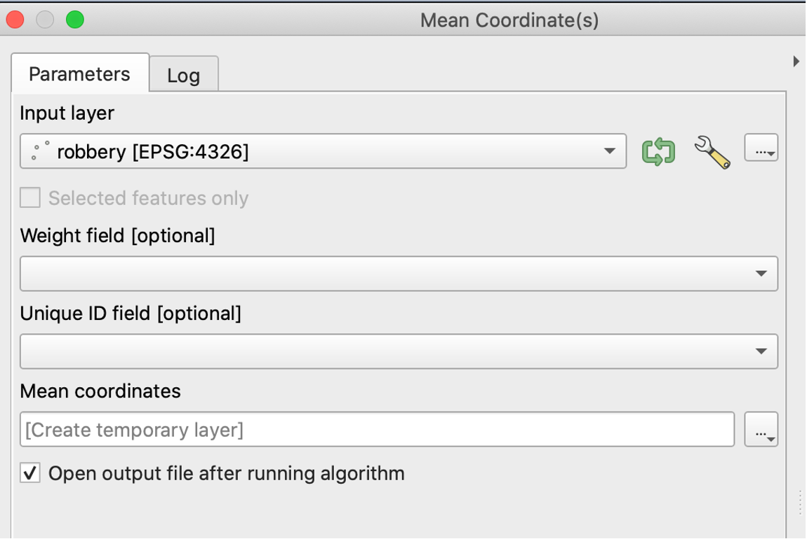
To visualize the standard deviational ellipse, we have to install an extra plugin. Go to "Plugins" – "Manage and Install Plugins" and search for "Standard Deviational Ellipse".  Then we go to "Vector" – "Standard Deviational Ellipse" and choose the right layer.

After completing these steps, we can create a map that shows the mean centers and standard deviational ellipses for three different felony crimes. 

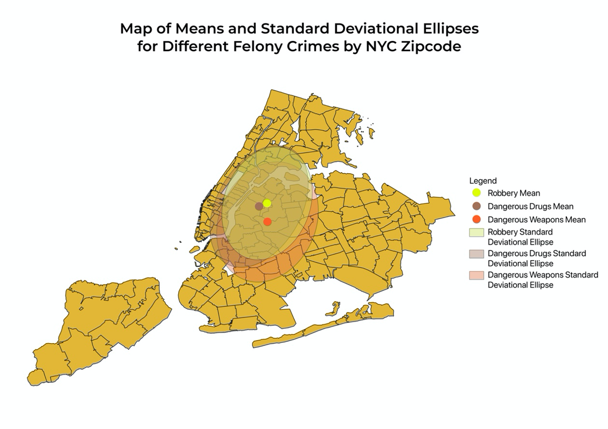

From this map, we can compare and contrast the similarities and differences of the central tendency and overall spread of the spatial distributions. We notice that the mean centers of crimes related to robbery, dangerous weapons, and dangerous drugs are close to one another and lie in the region of Long Island City. These may be due to the high counts of felony crimes in northern Brooklyn and the Bronx so the means gravitate toward the center of these two regions. The mean center for dangerous weapon crimes is to the south of the other two, suggesting that a higher proportion of incidents related to dangerous weapons occurred somewhere south to the Long Island City, such as in Brooklyn. Comparing the standard deviational ellipses allows us to gain insights into how spread out the crimes are. The standard deviational ellipse for robberies is the smallest and suggests that robberies are more concentrated around the mean center. The standard deviational ellipse for dangerous weapons and that for dangerous drugs also display different shapes. The standard deviational ellipse for dangerous drugs is elongated in the vertical direction while that for dangerous weapons is elongated in the horizontal direction. 

