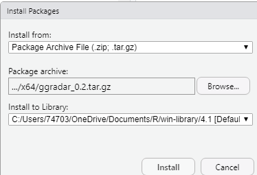

# Tutorial of radar chart

Pengyu Zou and Nuanyu Shou

```{r, include=FALSE}
knitr::opts_chunk$set(echo = TRUE)
library(dplyr)
library(scales)
library(tibble)
library(plotly)

# remotes::install_github("ricardo-bion/ggradar")
#library(ggradar) # must be installed from source

# install.packages("fmsb")
library(fmsb) # must be installed from source
options(stringsAsFactors = F)
```

## Overview
Radar chart is a useful chart to display multivariate observations with an arbitrary number of variables. It consists of a sequence of equi-angular spokes, called radii, with each spoke representing one of the variables. The data length of a spoke is proportional to the magnitude of the variable for the data point relative to the maximum magnitude of the variable across all data points. Radar charts are widely used in sports to chart players' strengths and weaknesses.

In this document, we will introduce how to draw a radar charts using package ``ggradar`` and ``fmsb``. For each method, we will give instructions about installation, simple example and parameter usage tutorial. Besides, we explore how to use ``plotly`` to make the radar chart more readable and interactive.


## Radar chart using ggradar


### Installation


#### Install by devtools
&nbsp;

##### ``ggradar`` is a github package and requires devtools to install it. Run following script to install ``ggradar``.

```{}
devtools::install_github("ricardo-bion/ggradar",dependencies = TRUE,force = T")
```
&nbsp;

#### Unzip package in the R directory
&nbsp;

##### Step1: Download the package from github.


\
&nbsp;

##### Step2: Move the zip file ``ggradar-master.zip`` to the R directory ../R/bin/x64 and unzip it.


\
&nbsp;

##### Step3: Open terminal(Mac) or Command(Windows) in this directory and run the following script.


```{}
Rcmd build ggradar-master
```


\
&nbsp;

##### This will create a ``ggradar_0.2.tar.gz`` file in this directory.

\
&nbsp;

##### Step4:Install ggradar in RStudio

Open the RStudio, Tools -> Install Package and choose install from ``Package Archive File(.zip; .tar.gz)``.


\
&nbsp;

##### Browse and choose the ``ggradar_0.2.tar.gz`` file and click ``Install``.


\
&nbsp;

##### There will be installation information in the Console, showing that we are done.


\
&nbsp;

##### Now, we can check in the ``Packages`` tab that if ``ggradar`` has been installed.


### Simple Example

``ggradar`` takes the first string column as group name and the rest numeric columns as different axes to plot. We take the columns from 6 to 10 in the ``mtcars`` dataset, and the first column as Group name.

```{r data}
#load data
mtcars_radar <- mtcars %>% 
  as_tibble(rownames = "group") %>% 
  mutate_at(vars(-group), rescale) %>% 
  tail(2) %>% 
  select(1,6:10)

#check data type with std() function
str(mtcars_radar)
```

```{r p}
ggradar(mtcars_radar)
```

We can find that there are three circle lines in this radar chart, which stand for three bar values. Here are 0%, 50% and 100%. In addition, there are five axes corresponding to the five columns in the data. Each axis is connected with the inner layer with a solid line.


### Parameters Usage

#### Change text size
``axis.label.size`` is for the axis text.
```{r}
ggradar(mtcars_radar,axis.label.size = 10)
```

``grid.label.size`` is for the text of three grids.

```{r}
ggradar(mtcars_radar,grid.label.size = 10)
```

#### Set the bar value for each grid
``values.radar`` is for setting the value for each grid. It only takes three values. If provide more than three, only the first three will be taken.
```{r}
ggradar(mtcars_radar,             
            # "125%" will be ignore.
            values.radar = c("33%","66%","100%","125%")
        )
```

#### Set the split ratio for each grid
Three grids will split data by ratio according to ``grid.max``, ``grid.mid`` and ``grid.min``. This should be correspond to ``values.radar``.

```{r}
ggradar(mtcars_radar,
            values.radar = c("0%","55%","100%"),
            grid.max = 1,
            grid.mid = 0.6,
            grid.min = 0
        )
```

#### Legend  
If you want to get rid of the legend you can set ``plot.legend = FALSE`` or ``legend.position = "none``.

```{r}
ggradar(mtcars_radar,
                plot.legend = FALSE)
```

```{r}
ggradar(mtcars_radar,
                legend.position = "none")
```

#### Background and styles of grid lines.  
Use ``background.circle.colour`` to set the background color of the chart. ``gridline.max.colour``, ``gridline.min.colour`` and ``gridline.max.colour`` are for the colors of three grid lines. ``gridline.min.linetype`` can set style of grid line to solid or longdash.

```{r}
ggradar(mtcars_radar, 
             background.circle.colour = 'yellow',
             gridline.min.colour = 'red',
             gridline.mid.colour = 'blue',
             gridline.max.colour = 'green',
             gridline.min.linetype = 'solid')
```

#### Set the colors of axes. 
``group.colours`` take a ``c()`` of colors for each group.
```{r}
ggradar(mtcars_radar,
                  group.colours = c('red','blue'))
```

#### Set the size of point
``group.point.size`` only take one value or values of the data size.

```{r}
ggradar(mtcars_radar,
              group.point.size = 8
        )
```

```{r}
ggradar(mtcars_radar,
              group.point.size = c(rep(2,6),rep(12, 6))
        )
```

#### Set the width of line

``group.line.width`` only take one value or values of the data size.

```{r}
ggradar(mtcars_radar,
              group.line.width = 3
        )
```

```{r}
ggradar(mtcars_radar,
              group.line.width = c(rep(1,6),rep(3,6))
        )
```

## Radar chart using fmsb

### Installation

We can install fmsb package using command below:

```{}
install.packages("fmsb")
```
&nbsp;


### Simple Example

By default, data frame must include maximum values as row 1 and minimum values as row 2 for each variables to create axis, and actual data should be given as row 3 and lower rows. So we should first modify the data and use ``fmsb::radarchart`` to draw the plot:

```{r}
df_maxmin <- data.frame(
    drat = c(1, 0),
    wt = c(1, 0),
    qsec = c(1, 0),
    vs = c(1, 0),
    am = c(1, 0))

mtcars_radar <- mtcars_radar[,c('drat','wt','qsec','vs','am')]
mtcars_radar <- rbind(df_maxmin, mtcars_radar)
fmsb::radarchart(mtcars_radar)
```


### Parameters Usage


#### Change the axistype
We can change different ``axistype``


a) 0 -- no axis label(Default) 


b) 1 -- center axis label only 


c) 2 -- around-the-chart label only


d) 3 -- both center and around-the-chart (peripheral) labels


e) 4 -- *.** format of axistype1


f) 5 -- *.** format of axistype3

```{r}
par(mar = c(1, 2, 2, 1),mfrow = c(2, 2))
radarchart(mtcars_radar, axistype = 1)
radarchart(mtcars_radar, axistype = 2)
radarchart(mtcars_radar, axistype = 3)
radarchart(mtcars_radar, axistype = 4)
```

#### Change axis segments

We can modify ``seg`` to change the number of segments for each axis. 
In the plot below, we can see we set the ``seg`` = 1 and then segments becomes less.

```{r}
par(mar = c(1, 1, 2, 1),mfrow = c(1,2))
radarchart(mtcars_radar, axistype = 2)
radarchart(mtcars_radar, axistype = 2, seg = 1)
```

#### Set Points Symbol

We can modify ``pty`` to change point symbol. If you don't plot data points, it should be 32. And the default value is 16. Besides, there are some other symbol you can try.


```{r}
par(mar = c(1, 2, 2, 1),mfrow = c(2,2))
radarchart(mtcars_radar, axistype = 2) # default
radarchart(mtcars_radar, axistype = 2, pty = 32) # no points
radarchart(mtcars_radar, axistype = 2, pty = 24) # triangle
radarchart(mtcars_radar, axistype = 2, pty = 18) # square
```


#### Modify Lines' Apperance (color/type/width)
a) ``pcol`` : A vector of color codes for plot data
b) ``plty`` : A vector of line types for plot data
c) ``plwd`` : A vector of line widths for plot data

```{r}
par(mar = c(1, 2, 2, 1),mfrow = c(2,2))
radarchart(mtcars_radar, axistype = 2)
radarchart(mtcars_radar, axistype = 2,  pcol = c('#7FBF3F', '#FFB602'), )
radarchart(mtcars_radar, axistype = 2, plty = c(1,1))
radarchart(mtcars_radar, axistype = 2, plwd = c(0.3,5))
```


#### Modify the axislines (color/type/width)

We can change axislines appearance using these parameters:

a) ``cglcol``:Line color for radar grids
b) ``cglty``:Line type for radar grids
c) ``cglwd``:Line width for radar grids


```{r}
par(mar = c(1, 2, 2, 1),mfrow = c(2,2))
radarchart(mtcars_radar, axistype = 2, cglcol = '#000000') 
radarchart(mtcars_radar, axistype = 2, cglty = 1, cglcol = '#7FBF3F')
radarchart(mtcars_radar, axistype = 2, cglty = 1, cglcol = '#000000')
radarchart(mtcars_radar, axistype = 2, cglty = 1, cglwd = 3, cglcol = '#000000')

```


#### Filling Polygons

We can add filling polygons appearance using these parameters:

a) ``pfcol``: A vector of color codes for filling polygons
b) ``pdensity``: A vector of filling density of polygons
c) ``pangle``: A vector of the angles of lines used as filling polygons

```{r}
par(mar = c(1, 2, 2, 1),mfrow = c(2,2))
radarchart(mtcars_radar, axistype = 2,  pfcol = c('#FFFF00','#7FBF3F'))
radarchart(mtcars_radar, axistype = 2,  pfcol = c('#FFFF00','#7FBF3F'), pdensity= c(25,50))
radarchart(mtcars_radar, axistype = 2,  pfcol = c('#FFFF00','#7FBF3F'), pdensity= c(10,10), pangle = c(0,0), plty = c(1,6))
radarchart(mtcars_radar, axistype = 2,  pfcol = c(NA,'#99999980'), cglty=1)

```


# Interactive Radar 
We can use ``plotly`` to draw interactive radar plot. Here is a example:
we should define the type and add multible trace on it. In the plot we get, we can zoom in and out, see the detailed value and information when we move the mouse to the corresponding position.

```{r}
mtcars_theta = c('drat','wt','qsec','vs','am','drat')


p <- plot_ly(
  type = 'scatterpolar',
  fill = 'toself'
) %>%
  add_trace(
    r = c(0.359447,0.5259524,0.0119047, 0, 1, 0.359447),
    theta = mtcars_theta,
    name = 'Maserati Bora'
  ) %>%
  add_trace(
    r = c(0.6221198, 0.3239581, 0.4880952, 1, 1, 0.6221198),
    theta = mtcars_theta,
    name = 'Volvo 142E'
  ) %>%
  layout(
    polar = list(
      radialaxis = list(
        visible = TRUE,
        range = c(0,1)
      )
    )
  )
 
p
```

