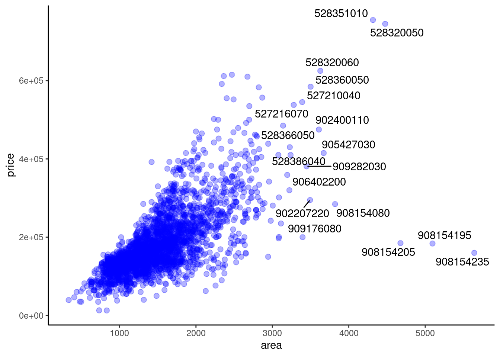
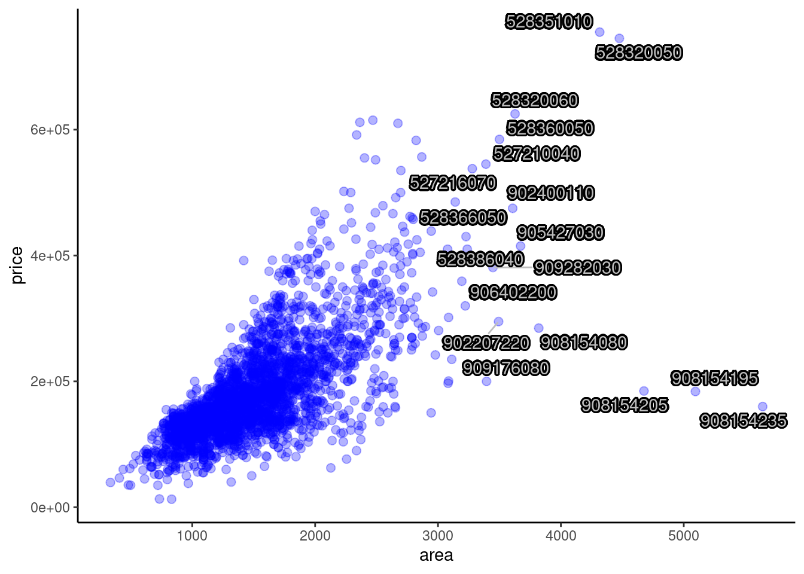
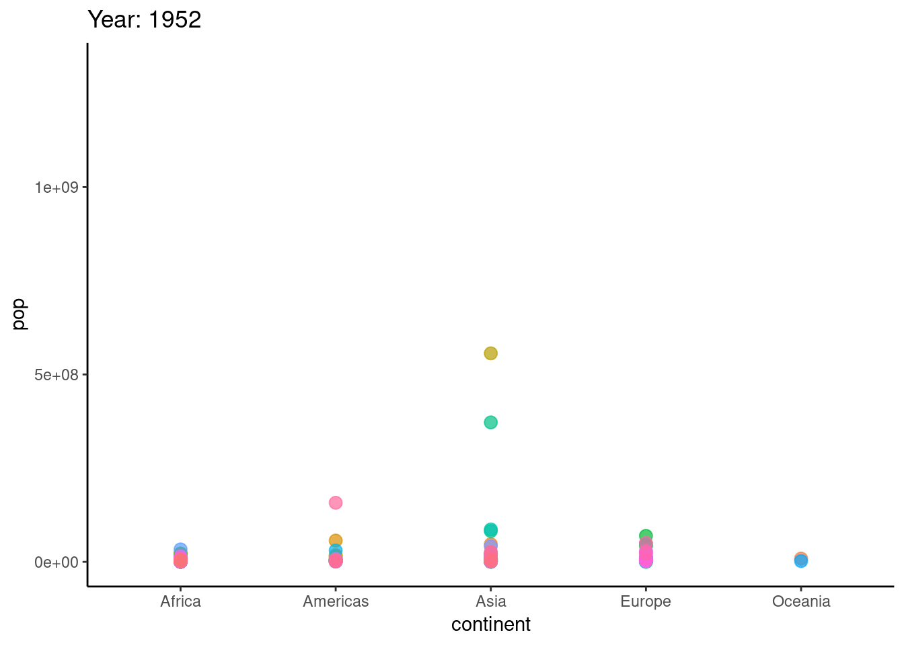
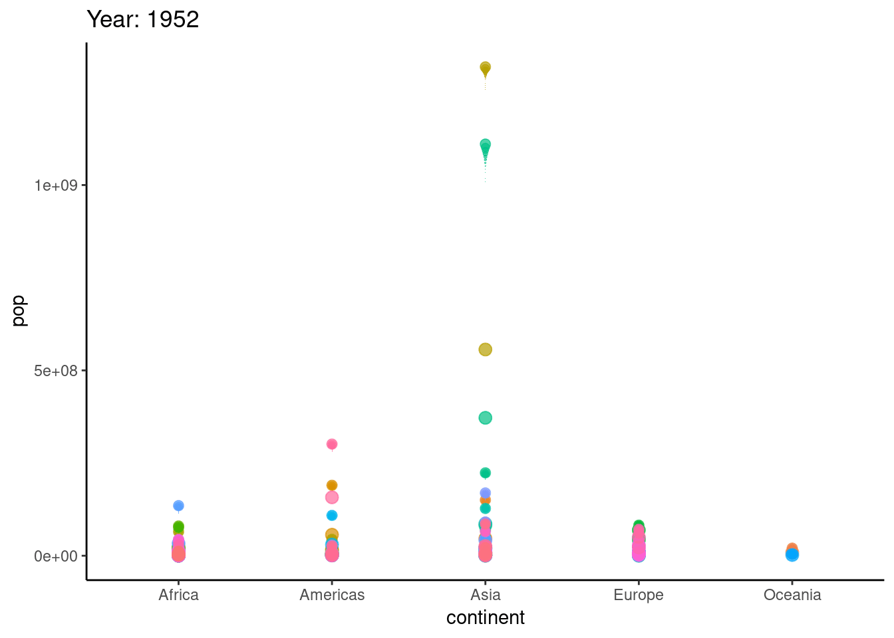

# Tutorial of three ggplot2 based packages

Xiaorui Qin


```r
library(ggplot2)
library(ggrepel)
library(devtools)
# remotes::install_github("dgrtwo/gganimate", force = TRUE)
library(gganimate) # must be installed from source
library(ggpubr)
```


```r
library(gapminder)
library(openintro)
library(tidyverse)
```

The package ggplot2, founded by Hadley Wickham in 2005 and updated significantly in April 2012, is one of the most powerful graphics frameworks in R. Based on graphics grammar, ggplot2 has the underlying grammar, which helps us compose graphs by combining independent components.

In order to simplify some operations of ggplot2, some packages emerge as the times require, e.g., some official extension mechanism and some ggplot2 based packages.

However, many of these tools are not well documented and people have to spend much time searching for information when they want to use them. In my community contribution, I work for the tutorial of three ggplot2 based packages, i.e., ggrepel, gganimate, and ggpubr, to integrate information and give some examples that will help researchers use the three packages easier.

Note that in my tutorial, most examples I give are from our Problem Set 1-3, which we are more familiar to understand easier.

## ggrepel

### Overview

First, I will introduce ggrepel, an extension of ggplot2. The main function of ggrepel is to repel overlapping text labels away from each other and away from the data points that they label. If the label overlaps other labels, ggrepel will repel the overlapping labels from each other. If the label overlaps data points, ggrepel will repel the overlapping labels from data points.

In this section, I will give some examples from our Problem Set 2 to continuously optimize the label distribution to make plots clearer and more beautiful.

### Installation & Loading

We could install ggrepel from CRAN directly and load it as we mentioned at the top of this tutorial.

### Usage and Contribution

Recall "3. House sizes and prices" in our Problem Set 2, we want to draw a scatterplot for price vs. area in 3.a. If we want to show PIDs (Parcel identification number - can be used with city web site for parcel review) as labels of some data points in the scatterplot, e.g., data points whose area is larger than 3200, we could implement this function as follows:


```r
ggplot(data = ames, aes(x = area, y = price)) +
  geom_point(color = "blue", alpha = 0.3, size = 2.2) +
  geom_text(aes(x = area, y = price, label = ifelse(area > 3200, PID, "")))+
  theme_classic()
```


However, we noticed that many text labels for PIDs are overlapping other labels and data points themselves, which make the plot not clear and not beautiful. We could not even distinguish these labels and data points. To solve this problem, we could use "geom_text_repel" in ggrepel to repel overlapping text labels from each other and data points as follows:


```r
ggplot(data = ames, aes(x = area, y = price)) +
  geom_point(color = "blue", alpha = 0.3, size = 2.2) +
  geom_text_repel(aes(x = area, y = price, label = ifelse(area > 3200, PID, "")))+
  theme_classic()
```



In the above plot, we could see that all of the text labels are repelled from each other and data points. The whole plot is very clear and it is easy to distinguish these labels. In addition, some little line segments are added to help us match labels and the corresponding data points.


```r
ggplot(data = ames, aes(x = area, y = price)) + 
  geom_point(color = "blue", alpha = 0.3, size = 2.2)+
  geom_label_repel(aes(x = area, y = price,
                       label = ifelse(area > 3200, PID, "")), fontface = "bold",
                   color = "red") +
  theme_classic()
```


Based on this, we could also try more to make the plot more and more clear and beautiful. For example, we try using "geom_label_repel" (which is based on geom_label) in ggrepel. This operation places the labels in a small box and makes the labels more clear.


```r
ggplot(data = ames, aes(x = area, y = price)) +
  geom_point(color = "blue", alpha = 0.3, size = 2.2) +
  geom_text_repel(aes(x = area, y = price, label = ifelse(area > 3200, PID, "")),
                  color = "grey",
                  bg.color = "black",
                  bg.r = 0.15)+
  theme_classic()
```



We could also place shadows (or glow) underneath each text label to enhance the readability of the text as shown in the plot above.


```r
ggplot(data = ames, aes(x = area, y = price)) +
  geom_point(color = "blue", alpha = 0.3, size = 2.2) +
  geom_text_repel(aes(x = area, y = price, label = ifelse(area > 3200, PID, "")),
                  box.padding = 0.5,
                  segment.curvature = -0.1,
                  segment.ncp = 4,
                  segment.angle = 25) +
  theme_classic()
```


In this plot, we add curved line segments to indicate and match the text labels with the corresponding data points clearly. We could design the curvature and angle of line segments.


```r
ggplot(data = ames, aes(x = area, y = price)) +
  geom_point(color = "blue", alpha = 0.3, size = 2.2) +
  geom_text_repel(aes(x = area, y = price, label = ifelse(area > 3200, PID, "")),
                  box.padding = 0.5,
                  segment.curvature = -0.1,
                  segment.ncp = 4,
                  segment.angle = 25,
                  arrow = arrow(length = unit(0.02, "npc"))) +
  theme_classic()
```


In this plot, we add arrows to our curved line segments to indicate and match the text labels with the corresponding data points better. We could design the length of our arrows.


```r
ggplot(data = ames, aes(x = area, y = price)) +
  geom_point(color = "blue", alpha = 0.3, size = 2.2) +
  geom_text_repel(aes(x = area, y = price, label = ifelse(area > 3200, PID, "")),
                  box.padding = 0.5,
                  segment.linetype = 6,
                  segment.curvature = -0.1,
                  segment.ncp = 4,
                  segment.angle = 25,
                  arrow = arrow(length = unit(0.02, "npc"))) +
  theme_classic()
```


Finally, we use different line types of the segment lines, i.e., dotted lines, to make the plot more beautiful. We could conclude that until now, the modified plot with ggrepel is very clear and beautiful. It is easy for us to distinguish labels and get the information quickly.

## gganimate

### Overview

Second, I will introduce gganimate, an extension of ggplot2. The main function of gganimate is to draw animation. On the basis of ggplot2, it adds an aesthetic mapping frame.

In this section, I will give some examples from the dataset "gapminder" to draw and optimize the animation for data that changes over time. (I did not discover a proper dataset in our Problem Sets, so I use this proper one.)

### Installation & Loading

To use this package, we need to install ImageMagick first. Then we could install and load the package as we mentioned at the top of our tutorial. Note that this requires the installation of a package from source (is a GitHub installation).

### Usage and Contribution

We use the dataset named "gapminder" as an example. This dataset includes data on GDP growth per capita, life expectancy and population growth of major countries in the world from 1952 to 2007. We want to show the population change of countries in different continents during 1952-2007. Thus we show the static plot at first. We put "pop" for population on the y-axis while "continent" on the x-axis. Different counties are in different colors.


```r
ggplot(data = gapminder, aes(x = continent, y = pop, colour = country)) +
  geom_point(alpha = 0.7, size = 3, show.legend = FALSE) +
  theme_classic()
```


Then we try changing this static plot to animation. Since we focus on the change of population over time, we choose "year" as the transition time. In the following animation, we could easily discover the population change during 1952-2007 of countries in five continents.


```r
ggplot(data = gapminder, aes(x = continent, y = pop, colour = country)) +
  geom_point(alpha = 0.7, size = 3, show.legend = FALSE) +
  transition_time(year) +
  labs(title = "Year: {frame_time}") +
  theme_classic()
```



To optimize the animation, we could add "little tails" for our data points to reflect the direction of changing in the following animation with "shadow_wake(wake_length = 0.1, alpha = FALSE)".
 

```r
ggplot(data = gapminder, aes(x = continent, y = pop, colour = country)) +
  geom_point(alpha = 0.7, size = 3, show.legend = FALSE) +
  transition_time(year) +
  labs(title = "Year: {frame_time}") +
  shadow_wake(wake_length = 0.15, alpha = FALSE) +
  theme_classic()
```



## ggpubr

### Overview

Finally, I will introduce ggpubr. ggpubr is actually a package developed based on ggplot2. The purpose is to simplify the operations of ggplot2 and draw a diagram that meets the requirements.

In this section, I will give some examples from "1. Fast Food" in our Problem Set 1 to draw histograms, density plots, box plots, and violin plots with ggpubr.

### Installation & Loading

We could install ggpubr from CRAN directly and load it as we mentioned at the top of this tutorial.

### Usage and Contribution

Recall "1. Fast Food" in our Problem Set 1, we want to analyze whether crispy items have more calories than grilled items in 1.c. We are asked to create a new variable, cooktype that is “Crispy” if the item name contains “Crispy” and “Grilled” if it contains “Grilled”. and plot overlapping density curves of calories, one curve for Crispy and one curve for Grilled, on a single set of axes. Each curve should be a different color. Here, we will borrow this problem to study tools in ggpubr.

First, we create the cooktype, i.e., Grilled and Crispy, and show the corresponding overlapping histogram. We also add mean lines to show mean values for each cooktype.


```r
processed_data <- filter(fastfood, xor(str_detect(fastfood$item, "Grilled"), str_detect(fastfood$item, "Crispy")))
filtered_data <- processed_data %>% mutate(cooktype = case_when(
  str_detect(processed_data$item, "Grilled") ~ "Grilled",
  str_detect(processed_data$item, "Crispy") ~ "Crispy"
))
gghistogram(data = filtered_data,
            x = "calories",
            add = "mean",
            color = "cooktype",
            fill = "cooktype",
            bins = 30)
```


Second, we show the corresponding overlapping density plot, which is similar to 1.c in Problem Set 1. We also add mean lines to show mean values for each cooktype.


```r
ggdensity(data = filtered_data,
          x = "calories",
          add = "mean", 
          color = "cooktype")
```


Based on the same data, we show a box plot here. This plot helps us observe the distribution and the whole situation of different cooktypes clearly.


```r
ggboxplot(data = filtered_data,
          x = "cooktype", 
          y = "calories",
          color = "cooktype",  
          add = "jitter", shape = "cooktype")
```


Finally, we draw a violin plot based on the same data. The violin plot is much clearly than the box plot to show the distribution and the whole situation of different cooktypes clearly.


```r
ggviolin(data = filtered_data,
         x = "cooktype", 
         y = "calories",
         fill = "cooktype",
         add = "boxplot", 
         add.params = list(fill = "grey")) +
  stat_compare_means(label.y = 50)
```


## Conlusion

In my community contribution, I write the tutorial of three ggplot2 based packages, i.e., ggrepel, gganimate, and ggpubr, which are not well documented before.

With this tutorial, people could use the three tools easily and capture the information quickly from my examples. I try to use examples in our problem sets, which we are more familiar with and could understand easily. This is my own evaluation of the project.

I will also discuss what I learned from this project and what I might do differently next time. In this project, I not only learned and memorized the specific usage and functions of the three packages, but also strengthened my understanding of ggplot2 and related packages by writing examples by myself. In the process of selecting examples, I also deeply analyzed "what kind of datasets are most suitable for this package" and "what kind of datasets can this package mainly helps". This process strengthens my understanding of Data Analysis and Visualization. For example, in the ggrepl example, I chose a scatterplot to optimize. When I was working on Problem Set 2, I found that text labels would overlap when we draw scatterplots. But at that time, since we were only asked to show certain labels, we avoided this problem. However, I still went to search how to solve this problem and found that we can use ggrepl package. Therefore, I learned several other ggplot2 based packages and found that they are very practical and can easily help solve many little problems in ggplot2. In the example of gganimate, I chose a dataset that changes over time, since I think it is most necessary to animate the plot when we study this type of data, so that we can see the change of data over time more clearly and directly.

In the future, I want to learn more ggplot2 based packages, such as ggiraph, ggstance, ggalt, ggforce, ggpmisc, ggthemes, etc. These packages can also be regarded as "skills" to help me solve some tricky problems during Data Analysis and Visualization. At the same time, learning these packages will also help me to strengthen my understanding and abilities to use ggplot2.

## Sources

https://ggplot2-book.org/introduction.html

https://ggrepel.slowkow.com/articles/examples.html

https://mran.microsoft.com/snapshot/2017-08-20/web/packages/ggrepel/vignettes/ggrepel.html

https://cran.r-project.org/web/packages/ggrepel/vignettes/ggrepel.html

https://zhuanlan.zhihu.com/p/33391501

https://zhuanlan.zhihu.com/p/95665626

https://zhuanlan.zhihu.com/p/36543477

https://zhuanlan.zhihu.com/p/102653888
